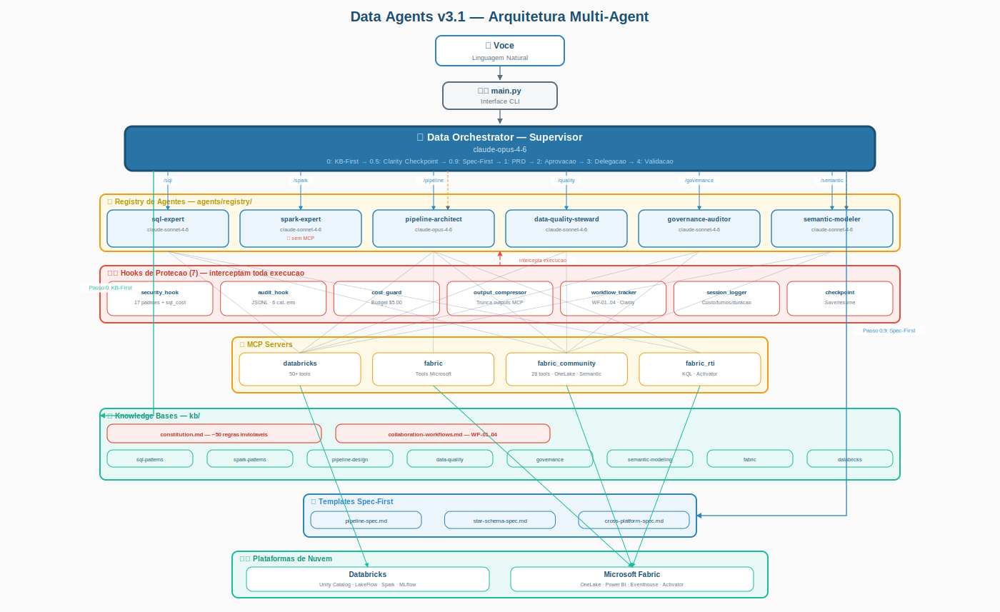

# Manual e Relatorio Tecnico: Projeto Data Agents v3.2

---

Repositorio: [github.com/ThomazRossito/data-agents](https://github.com/ThomazRossito/data-agents)

---

## Autor

> ## **Thomaz Antonio Rossito Neto**
>
> Specialist Data & AI Solutions Architect | Center of Excellence CoE @CI&T

## Contatos

> **LinkedIn:** [thomaz-antonio-rossito-neto](https://www.linkedin.com/in/thomaz-antonio-rossito-neto/)

> **GitHub:** [ThomazRossito](https://github.com/ThomazRossito/)

### Certificações Databricks

    

### Certificações Microsoft

<a href="https://www.credly.com/badges/052e5133-0c67-4ab7-bb3a-c99efa7b4406/public_url" target="_blank"></a> <a href="https://learn.microsoft.com/pt-br/users/thomazantoniorossitoneto/credentials/certification/fabric-data-engineer-associate" target="_blank"></a>

---

## Sumario

1. [O que e este projeto?](#1-o-que-e-este-projeto)
2. [Conceitos Fundamentais (Glossario)](#2-conceitos-fundamentais-glossario)
3. [Arquitetura Geral do Sistema](#3-arquitetura-geral-do-sistema)
4. [Os Agentes: A Equipe Virtual](#4-os-agentes-a-equipe-virtual)
5. [O Metodo BMAD, KB-First e Constituicao](#5-o-metodo-bmad-kb-first-e-constituicao)
6. [Estrutura de Arquivos e Pastas](#6-estrutura-de-arquivos-e-pastas)
7. [Analise Detalhada de Cada Componente](#7-analise-detalhada-de-cada-componente)
8. [Seguranca e Controle de Custos (Hooks)](#8-seguranca-e-controle-de-custos-hooks)
9. [O Hub de Conhecimento (KBs, Skills e Constituicao)](#9-o-hub-de-conhecimento-kbs-skills-e-constituicao)
10. [Workflows Colaborativos e Spec-First](#10-workflows-colaborativos-e-spec-first)
11. [Conexoes com a Nuvem (MCP Servers)](#11-conexoes-com-a-nuvem-mcp-servers)
12. [Comandos Disponiveis (Slash Commands)](#12-comandos-disponiveis-slash-commands)
13. [Configuracao e Credenciais](#13-configuracao-e-credenciais)
14. [Checkpoint de Sessao (Recuperacao Automatica)](#14-checkpoint-de-sessao-recuperacao-automatica)
15. [Deploy com MLflow (Model Serving)](#15-deploy-com-mlflow-model-serving)
16. [Qualidade de Codigo e Testes](#16-qualidade-de-codigo-e-testes)
17. [Deploy e CI/CD (Publicacao Automatica)](#17-deploy-e-cicd-publicacao-automatica)
18. [Dashboard de Monitoramento](#18-dashboard-de-monitoramento)
19. [Como Comecar a Usar](#19-como-comecar-a-usar)
20. [Historico de Melhorias (v3.0 e v3.1)](#20-historico-de-melhorias-v30-e-v31)
21. [Metricas do Projeto](#21-metricas-do-projeto)
22. [Conclusao](#22-conclusao)

## 1. O que e este projeto?

O **Data Agents** e um sistema avancado de multiplos agentes de Inteligencia Artificial projetado para atuar como uma equipe completa e autonoma nas areas de Engenharia de Dados, Qualidade de Dados, Governanca e Analise Corporativa.

Se voce ja usou o ChatGPT ou o Claude para pedir ajuda com codigo, imagine dar um passo alem: em vez de apenas responder perguntas, esta IA possui acesso direto ao seu ambiente na nuvem (Databricks e Microsoft Fabric) para executar as tarefas por voce, de ponta a ponta.

O diferencial do Data Agents e que a IA opera sob uma **Constituicao** — um documento central com regras inviolaveis — e uma **camada declarativa de governanca e conhecimento**. Isso significa que a IA e rigorosamente obrigada a ler as regras de negocio da sua empresa (Knowledge Bases) e os manuais tecnicos oficiais (Skills) antes de planejar ou executar qualquer acao. O resultado e um codigo nao apenas funcional, mas seguro, auditavel e perfeitamente alinhado com a arquitetura corporativa moderna.

Na versao 3.1, o sistema tambem conta com **Workflows Colaborativos** (cadeias automaticas de agentes), **Checkpoint de Sessao** (recuperacao automatica quando o orcamento estoura), um **Dashboard de Monitoramento** com 9 paginas e filtro de datas, e integracao com **MLflow** para deploy de modelos em producao.

## 2. Conceitos Fundamentais (Glossario)

Para garantir que este manual seja compreensivel mesmo para quem nao e especialista em Inteligencia Artificial, segue o glossario com os termos essenciais.

| **Termo Tecnico**                            | **O que significa na pratica**                                                                                                                                                    |
| -------------------------------------------------- | --------------------------------------------------------------------------------------------------------------------------------------------------------------------------------------- |
| **Agente de IA**                             | Um programa inteligente que nao apenas conversa, mas toma decisoes, planeja passos, usa ferramentas e executa tarefas de forma autonoma.                                                |
| **LLM (Large Language Model)**               | O cerebro por tras da IA. Neste projeto, utilizamos a familia de modelos Claude (da Anthropic), conhecida por excelencia em raciocinio logico e programacao.                            |
| **MCP (Model Context Protocol)**             | Protocolo de codigo aberto que permite que a IA se conecte de forma segura a sistemas externos (bancos de dados, nuvens) para realizar acoes reais. Funciona como uma tomada universal. |
| **Databricks**                               | Plataforma de dados em nuvem especializada em processar volumes massivos de informacoes usando Apache Spark.                                                                            |
| **Microsoft Fabric**                         | Plataforma de dados unificada da Microsoft que junta armazenamento (OneLake), engenharia (Data Factory), analise em tempo real (RTI) e visualizacao (Power BI).                         |
| **Apache Spark / PySpark**                   | Tecnologia para processamento de Big Data que distribui trabalho entre dezenas de computadores. PySpark e a versao usando Python.                                                       |
| **Arquitetura Medallion**                    | Padrao da industria para organizar dados em tres camadas: Bronze (dados brutos), Silver (dados limpos) e Gold (dados prontos para relatorios).                                          |
| **Knowledge Base (KB)**                      | Arquivos que contem as regras de negocio e padroes arquiteturais da empresa. A IA le isso para saber o que deve ser feito.                                                              |
| **Skills**                                   | Manuais operacionais detalhados. Enquanto a KB diz o que fazer, a Skill ensina como usar uma tecnologia especifica.                                                                     |
| **Constituicao**                             | Documento de autoridade maxima do sistema (kb/constitution.md). Contem aproximadamente 50 regras inviolaveis que prevalecem sobre qualquer instrucao do usuario.                        |
| **Clarity Checkpoint**                       | Etapa de validacao onde o Supervisor pontua a clareza da requisicao em 5 dimensoes antes de prosseguir. Minimo 3/5 para continuar.                                                      |
| **Workflow Colaborativo**                    | Cadeia automatica de agentes que trabalham em sequencia, passando contexto entre si (ex: SQL Expert gera schema, Spark Expert transforma, Quality valida).                              |
| **Checkpoint de Sessao**                     | Ponto de salvamento automatico do estado da sessao. Permite retomar o trabalho apos um estouro de orcamento ou reset, sem perder o progresso.                                           |
| **Hook**                                     | Gancho de seguranca que monitora tudo que a IA tenta fazer. Se tentar algo perigoso, o Hook intercepta e bloqueia.                                                                      |
| **PRD (Product Requirements Document)**      | Documento de arquitetura criado pelo Supervisor antes de delegar, detalhando exatamente o que sera construido.                                                                          |
| **Registry de Agentes**                      | Pasta (agents/registry/) onde agentes sao definidos em arquivos Markdown. Nao e necessario programar em Python para criar um novo agente.                                               |
| **BMAD (Build, Measure, Approve, Delegate)** | Metodo estruturado de orquestracao que define os passos do Supervisor desde a analise ate a delegacao.                                                                                  |
| **MLflow**                                   | Plataforma open-source para gerenciamento do ciclo de vida de modelos de ML. Usado aqui para deploy do agente como endpoint de Model Serving no Databricks.                             |

## 3. Arquitetura Geral do Sistema

<p align="center">
  
</p>

A arquitetura do Data Agents v3.1 e hierarquica, segura e extensivel. O fluxo de trabalho funciona de maneira semelhante a uma equipe humana em uma empresa.

### 3.1 O Fluxo de Trabalho

1. **A Interface (O Terminal):** Voce digita um pedido no terminal (ex: /plan Crie um pipeline de vendas no Databricks). O arquivo main.py recebe esse pedido e identifica o modo BMAD apropriado.
2. **O Gerente (Supervisor):** O pedido vai para o Data Orchestrator (Supervisor). Ele le a Constituicao e as regras da empresa (KBs), executa o Clarity Checkpoint para validar se a requisicao esta clara, desenha o plano arquitetural (PRD) e decide qual especialista acionar.
3. **A Equipe (Especialistas):** O Supervisor aciona os agentes especialistas. Eles recebem a tarefa, leem os manuais tecnicos (Skills) e comecam a trabalhar. Em tarefas complexas, podem trabalhar em cadeia via Workflows Colaborativos.
4. **A Ponte (MCP Servers):** Para fazer o trabalho real na nuvem, os especialistas enviam comandos atraves dos servidores MCP, que traduzem a intencao da IA em acoes concretas no Databricks ou Fabric.
5. **Os Guardioes (Hooks):** O tempo todo, 7 Hooks de seguranca e auditoria observam silenciosamente, registram cada acao e bloqueiam comandos que violem as regras.

### 3.2 Modos de Execucao (BMAD)

O sistema oferece tres modos de velocidade para diferentes necessidades:

- **BMAD Full (/plan):** Fluxo completo com KB-First, Clarity Checkpoint, Spec-First, PRD e aprovacao. Ideal para pipelines inteiros. Usa thinking avancado do modelo.
- **BMAD Express (/sql, /spark, /quality, etc.):** Pula planejamento, vai direto ao especialista. Rapido e economico. Thinking desabilitado.
- **Internal (/health, /status, /review):** Diagnosticos e comandos internos do sistema.

### 3.3 Componentes Principais

| **Componente** | **Arquivo(s)**            | **Responsabilidade**                                |
| -------------------- | ------------------------------- | --------------------------------------------------------- |
| Entrada Principal    | main.py                         | Banner, loop interativo, sessao, idle timeout, checkpoint |
| Supervisor           | agents/supervisor.py + prompts/ | Orquestracao, PRD, delegacao, Clarity Checkpoint          |
| Motor de Agentes     | agents/loader.py                | Carrega agentes de Markdown, KB injection, model routing  |
| Comandos             | commands/parser.py              | Roteamento de slash commands para modos BMAD              |
| Configuracao         | config/settings.py              | Pydantic BaseSettings com validacao de credenciais        |
| Hooks                | hooks/                          | Auditoria, seguranca, custo, compressao, workflows        |
| MCP Servers          | mcp_servers/                    | Conexoes com Databricks, Fabric e Fabric RTI              |
| Knowledge Base       | kb/                             | Constituicao, regras de negocio, padroes arquiteturais    |
| Skills               | skills/                         | Manuais operacionais (27 Databricks + 5 Fabric)           |
| Monitoramento        | monitoring/app.py               | Dashboard Streamlit com 9 paginas                         |
| Testes               | tests/                          | 11 modulos de teste, cobertura 80%                        |
| MLflow               | agents/mlflow_wrapper.py        | Deploy como Databricks Model Serving                      |

## 4. Os Agentes: A Equipe Virtual

O projeto conta com **6 agentes especialistas** divididos em dois niveis de atuacao (Tiers), mais o Supervisor. Todos sao definidos em arquivos Markdown na pasta agents/registry/, tornando facil adicionar novos membros a equipe sem programar em Python.

### 4.1 O Supervisor (Data Orchestrator)

- **Onde vive:** agents/supervisor.py + agents/prompts/supervisor_prompt.py
- **Modelo de IA:** claude-opus-4-6 (o mais avancado, focado em raciocinio complexo)
- **O que faz:** E o gerente do projeto. Ele nao escreve codigo — seu trabalho e ler a Constituicao e as KBs, executar o Clarity Checkpoint, criar PRDs, delegar tarefas e validar os resultados contra as regras constitucionais.
- **Recursos:** Executa o Clarity Checkpoint (Passo 0.5), suporta Workflows Colaborativos (WF-01 a WF-04), faz Validacao Constitucional no Passo 4 e possui thinking avancado em modo Full.

### 4.2 Tier 1 — Engenharia de Dados (O Core)

#### SQL Expert (/sql)

- **Modelo:** claude-sonnet-4-6
- **Analogia:** O Analista de Dados e DBA.
- **O que faz:** Escreve e otimiza consultas SQL (Spark SQL, T-SQL, KQL). Descobre estrutura de tabelas, explora Unity Catalog e gera codigo para criar tabelas.
- **Seguranca:** Permissao de leitura e escrita de arquivos (pode gravar .sql), mas acesso read-only a nuvem.
- **MCP Servers:** Databricks, Fabric Community, Fabric RTI.

#### Spark Expert (/spark)

- **Modelo:** claude-sonnet-4-6
- **Analogia:** O Desenvolvedor Back-end de Big Data.
- **O que faz:** Mestre em Python e Apache Spark. Escreve codigo PySpark para transformar dados, pipelines SDP e Delta Lake.
- **Seguranca:** Possui acesso completo a Databricks e Fabric para leitura e escrita.
- **Tools extras:** Read, Write, Edit, Bash, Glob, Grep (acesso ao filesystem local).

#### Pipeline Architect (/pipeline e /fabric)

- **Modelo:** claude-sonnet-4-6
- **Analogia:** O Engenheiro Cloud e DevOps.
- **O que faz:** Orquestra execucao na nuvem: cria Jobs no Databricks, monta Pipelines no Data Factory, move arquivos entre plataformas.
- **Seguranca:** Unico agente de engenharia com permissoes de execucao e escrita completas. Fortemente monitorado pelos Hooks.

### 4.3 Tier 2 — Qualidade, Governanca e Analise

#### Data Quality Steward (/quality)

- **Modelo:** claude-sonnet-4-6
- **Analogia:** O Engenheiro de Qualidade (QA).
- **O que faz:** Analisa tabelas para encontrar anomalias (data profiling), escreve regras de validacao (expectations) e configura alertas em tempo real no Fabric Activator.

#### Governance Auditor (/governance)

- **Modelo:** claude-sonnet-4-6
- **Analogia:** O Auditor de Compliance e Seguranca.
- **O que faz:** Rastreia linhagem de dados, audita acessos, varre bancos procurando informacoes sensiveis (CPFs, e-mails) e garante conformidade LGPD/GDPR.

#### Semantic Modeler (/semantic)

- **Modelo:** claude-sonnet-4-6
- **Analogia:** O Especialista de BI.
- **O que faz:** Constroi modelos semanticos DAX (Power BI), otimiza tabelas Gold para Direct Lake e configura Metric Views no Databricks.
- **Roteamento inteligente:** O comando /fabric redireciona automaticamente para o Semantic Modeler quando a requisicao menciona semantic model, DAX, Power BI ou Direct Lake.

| **Agente**     | **Tier** | **Modelo** | **MCP Servers**   | **Acesso**                  |
| -------------------- | -------------- | ---------------- | ----------------------- | --------------------------------- |
| SQL Expert           | T1             | sonnet-4-6       | Databricks, Fabric, RTI | Read-only na nuvem, write em .sql |
| Spark Expert         | T1             | sonnet-4-6       | Databricks, Fabric      | Read/Write + filesystem local     |
| Pipeline Architect   | T1             | sonnet-4-6       | Databricks, Fabric      | Execucao completa                 |
| Data Quality Steward | T2             | sonnet-4-6       | Databricks, Fabric      | Read/Write completo               |
| Governance Auditor   | T2             | sonnet-4-6       | Databricks, Fabric      | Read/Write completo               |
| Semantic Modeler     | T2             | sonnet-4-6       | Databricks, Fabric      | Read-only + execute_sql           |

## 5. O Metodo BMAD, KB-First e Constituicao

### 5.1 A Constituicao

O documento kb/constitution.md e a fonte de autoridade maxima do sistema, contendo aproximadamente 50 regras inviolaveis divididas em 8 secoes:

| **Secao**                 | **Conteudo**                                                                                                   |
| ------------------------------- | -------------------------------------------------------------------------------------------------------------------- |
| Principios Fundamentais (P1-P5) | KB-First obrigatorio, Spec-First para tarefas complexas, delegacao especializada, auditoria total, menor privilegio. |
| Regras do Supervisor (S1-S7)    | Nunca gerar codigo, sempre consultar KB, sempre validar contra a Constituicao.                                       |
| Clarity Checkpoint              | 5 dimensoes de avaliacao com pontuacao minima 3/5.                                                                   |
| Regras de Arquitetura           | Medallion (Bronze/Silver/Gold) e Star Schema (SS1-SS5).                                                              |
| Regras de Plataforma            | Databricks (DB1-DB5) e Fabric (FB1-FB5).                                                                             |
| Seguranca (SEC1-SEC6)           | Sem credenciais hardcoded, PII protegido, menor privilegio.                                                          |
| Qualidade (QA1-QA6)             | Expectations obrigatorios, profiling antes de promover.                                                              |
| Modelagem Semantica (SM1-SM6)   | Direct Lake, DAX, Metric Views.                                                                                      |

Se houver conflito entre uma instrucao do usuario e a Constituicao, **a Constituicao prevalece**.

### 5.2 A Filosofia KB-First

A regra de ouro: **a IA nunca adivinha, ela le o manual.** Antes de comecar a trabalhar, a IA e forcada a ler as Knowledge Bases (kb/) da empresa. Cada agente declara seus dominios em kb_domains no frontmatter YAML, e o loader injeta automaticamente os indices das KBs relevantes no prompt do agente (quando INJECT_KB_INDEX=true).

### 5.3 O Clarity Checkpoint (Passo 0.5)

Antes de planejar tarefas complexas, o Supervisor pontua a clareza da requisicao em 5 dimensoes:

| **Dimensao** | **O que avalia**                             |
| ------------------ | -------------------------------------------------- |
| Objetivo           | O resultado esperado e compreensivel?              |
| Escopo             | As tabelas, schemas e plataformas estao definidos? |
| Plataforma         | E Databricks, Fabric ou ambos?                     |
| Criticidade        | E exploracao, desenvolvimento ou producao?         |
| Dependencias       | As dependencias estao documentadas?                |

**Pontuacao minima: 3/5.** Se menor que 3, o Supervisor pede esclarecimentos antes de prosseguir.

### 5.4 Os Passos do Protocolo BMAD

| **Passo** | **Nome**      | **Descricao**                                             |
| --------------- | ------------------- | --------------------------------------------------------------- |
| 0               | KB-First            | Le Knowledge Bases relevantes ao tipo de tarefa.                |
| 0.5             | Clarity Checkpoint  | Valida clareza (5 dimensoes, minimo 3/5).                       |
| 0.9             | Spec-First          | Seleciona template de spec para tarefas complexas (3+ agentes). |
| 1               | Planejamento        | Cria PRD em output/ com a arquitetura da solucao.               |
| 2               | Aprovacao           | Mostra resumo e aguarda confirmacao do usuario.                 |
| 3               | Delegacao           | Aciona agentes (com suporte a Workflows Colaborativos).         |
| 4               | Sintese e Validacao | Verifica aderencia a kb/constitution.md.                        |

## 6. Estrutura de Arquivos e Pastas

O projeto segue uma organizacao modular e declarativa. Abaixo esta a estrutura completa:

| **Pasta / Arquivo**           | **Descricao**                                                                                            |
| ----------------------------------- | -------------------------------------------------------------------------------------------------------------- |
| agents/registry/                    | Agentes definidos em Markdown (6 agentes + template)                                                           |
| agents/loader.py                    | Motor que transforma .md em agentes vivos                                                                      |
| agents/supervisor.py                | Factory do ClaudeAgentOptions para o Supervisor                                                                |
| agents/prompts/supervisor_prompt.py | System prompt completo do Supervisor (223 linhas)                                                              |
| agents/mlflow_wrapper.py            | Wrapper PyFunc para Databricks Model Serving                                                                   |
| commands/parser.py                  | Slash commands com roteamento BMAD (10 comandos)                                                               |
| config/settings.py                  | Configuracoes via Pydantic BaseSettings                                                                        |
| config/exceptions.py                | Hierarquia de erros personalizados                                                                             |
| config/logging_config.py            | Logging estruturado JSONL + console Rich                                                                       |
| config/mcp_servers.py               | Registry central de conexoes MCP                                                                               |
| hooks/audit_hook.py                 | Log JSONL com categorizacao de erros (6 categorias)                                                            |
| hooks/checkpoint.py                 | Checkpoint de sessao (save/load/resume)                                                                        |
| hooks/cost_guard_hook.py            | Classificacao HIGH/MEDIUM/LOW de custos                                                                        |
| hooks/output_compressor_hook.py     | Trunca outputs MCP (economia de tokens)                                                                        |
| hooks/security_hook.py              | Bloqueia comandos destrutivos e SQL custoso                                                                    |
| hooks/session_logger.py             | Metricas de custo/turnos/duracao por sessao                                                                    |
| hooks/workflow_tracker.py           | Rastreia delegacoes, workflows e Clarity Checkpoint                                                            |
| kb/constitution.md                  | Documento de autoridade maxima (aproximadamente 50 regras)                                                     |
| kb/collaboration-workflows.md       | Workflows Colaborativos (WF-01 a WF-04)                                                                        |
| kb/ (8 subdominios)                 | data-quality, databricks, fabric, governance, pipeline-design, semantic-modeling, spark-patterns, sql-patterns |
| templates/                          | 3 templates Spec-First (pipeline, star-schema, cross-platform)                                                 |
| skills/databricks/                  | 27 modulos operacionais Databricks                                                                             |
| skills/fabric/                      | 5 modulos operacionais Fabric                                                                                  |
| mcp_servers/databricks/             | 50+ tools para Unity Catalog, SQL, Jobs, LakeFlow                                                              |
| mcp_servers/databricks_genie/      | MCP customizado: 9 tools para Genie Conversation API + Space Management                                        |
| mcp_servers/fabric/                 | 28 tools Community + servidor oficial                                                                          |
| mcp_servers/fabric_sql/             | MCP customizado: 8 tools para SQL Analytics Endpoint (bronze/silver/gold)                                      |
| mcp_servers/fabric_rti/             | Tools para KQL, Eventstreams, Activator                                                                        |
| monitoring/app.py                   | Dashboard Streamlit (9 paginas)                                                                                |
| tests/                              | 11 modulos de teste (cobertura 80%)                                                                            |
| logs/                               | 5 arquivos JSONL (audit, app, sessions, workflows, compression) + checkpoint.json                              |
| main.py                             | Entrada principal com loop interativo e gestao de sessao                                                       |
| pyproject.toml                      | Dependencias, metadata e configuracao de ferramentas                                                           |
| Makefile                            | 15 targets de automacao de desenvolvimento                                                                     |

## 7. Analise Detalhada de Cada Componente

### 7.1 O Arquivo Principal (main.py)

Quando voce digita python main.py no terminal, este arquivo exibe o banner com Rich, verifica credenciais, inicia o loop interativo e gerencia o ciclo de vida da sessao.

O main.py gerencia um **estado de sessao** (_session_state) que rastreia o ultimo prompt, custo acumulado e turns. Esse estado e usado para salvar checkpoints automaticos quando o budget estoura, o usuario reseta a sessao ou ocorre idle timeout.

Na inicializacao, ele verifica se existe um checkpoint anterior e oferece a opcao de retomar. Tambem suporta execucao em modo single-query via argumentos de linha de comando.

O sistema de **feedback em tempo real** utiliza Rich para exibir um spinner animado mostrando qual ferramenta esta sendo executada, com mais de 40 labels amigaveis mapeados para nomes de tools.

### 7.2 O Motor de Agentes (loader.py e registry/)

O loader.py le todos os arquivos Markdown em agents/registry/, extrai o frontmatter YAML e transforma cada arquivo em um agente vivo com ClaudeAgentOptions.

Para criar um agente novo, basta copiar _template.md, personalizar os campos YAML e o prompt Markdown, e salvar na pasta registry/. Nao e necessario escrever Python.

Capacidades avancadas do loader:

- **Lazy-loading de KBs por dominio:** O campo kb_domains no YAML define quais Knowledge Bases o agente precisa. O loader carrega apenas as relevantes.
- **Model Routing por Tier:** O TIER_MODEL_MAP permite substituir globalmente o modelo de cada Tier (ex: T1 usa opus, T2 usa haiku).
- **Filtragem de MCP servers:** Remove automaticamente servidores MCP cujas credenciais nao estao configuradas.
- **Resolucao de aliases de tools:** Alias como databricks_readonly sao expandidos para a lista completa de tools de leitura.
- **Injecao de KB index:** Quando INJECT_KB_INDEX=true, o loader injeta o conteudo dos arquivos index.md de cada KB declarada no prompt do agente.

### 7.3 O Supervisor (supervisor.py e supervisor_prompt.py)

O supervisor.py e uma factory que monta o ClaudeAgentOptions do Supervisor. Ele carrega dinamicamente os agentes disponiveis, configura hooks, detecta plataformas MCP e monta o prompt do sistema.

O supervisor_prompt.py contem o system prompt completo do Supervisor (223 linhas), dividido em secoes: identidade, equipe de agentes, protocolo BMAD (7 passos), regras inviolaveis (S1-S7), tabela de roteamento de KB (14 linhas), suporte a workflows (WF-01 a WF-04), validacao Star Schema (SS1-SS5) e formato de resposta.

O **thinking avancado** e habilitado apenas no modo BMAD Full (/plan), permitindo raciocinio mais profundo para tarefas complexas de planejamento.

### 7.4 O Configurador (settings.py)

Painel de controle central via Pydantic BaseSettings, com todas as variaveis carregadas do .env:

| **Variavel**   | **Padrao** | **Descricao**                                     |
| -------------------- | ---------------- | ------------------------------------------------------- |
| default_model        | claude-opus-4-6  | Modelo padrao para o Supervisor                         |
| max_budget_usd       | 5.00             | Limite de custo por sessao em dolares                   |
| max_turns            | 50               | Limite de turns por sessao                              |
| console_log_level    | WARNING          | Nivel de log no terminal (esconde logs operacionais)    |
| log_level            | INFO             | Nivel de log para o arquivo JSONL                       |
| tier_model_map       | {}               | Override de modelo por tier (ex: {T1: claude-opus-4-6}) |
| inject_kb_index      | true             | Injecao automatica de KBs nos prompts dos agentes       |
| idle_timeout_minutes | 30               | Reset automatico por inatividade (0 desabilita)         |

O settings.py tambem inclui **validadores** que checam formato de API keys, limites de budget e ranges de max_turns, alem de **deteccao automatica de plataformas** (validate_platform_credentials e get_available_platforms).

### 7.5 O Parser de Comandos (parser.py)

O parser.py implementa o sistema de roteamento BMAD com 10 slash commands. Cada comando e mapeado para um agente e um modo BMAD especifico:

| **Comando** | **Agente**     | **Modo BMAD**   |
| ----------------- | -------------------- | --------------------- |
| /plan             | Supervisor           | Full (thinking ativo) |
| /sql              | sql-expert           | Express               |
| /spark            | spark-expert         | Express               |
| /pipeline         | pipeline-architect   | Express               |
| /fabric           | Auto-roteado         | Express               |
| /quality          | data-quality-steward | Express               |
| /governance       | governance-auditor   | Express               |
| /semantic         | semantic-modeler     | Express               |
| /health           | Sistema              | Internal              |
| /status           | Sistema              | Internal              |

O comando **/fabric** possui roteamento inteligente: se o prompt mencionar semantic model, DAX, Power BI ou Direct Lake, ele redireciona para o semantic-modeler em vez do pipeline-architect.

### 7.6 O Sistema de Excecoes (exceptions.py)

O projeto define uma hierarquia de excecoes personalizadas para tratamento estruturado de erros:

- **DataAgentsError:** Classe base para todos os erros do sistema.
- **MCPConnectionError / MCPToolExecutionError:** Erros de conexao e execucao MCP.
- **AuthenticationError:** Falha de autenticacao com plataformas.
- **BudgetExceededError / MaxTurnsExceededError:** Limites de sessao atingidos.
- **SecurityViolationError:** Tentativa de operacao bloqueada pelo security hook.
- **SkillNotFoundError / ConfigurationError:** Erros de configuracao.

### 7.7 O Sistema de Logging (logging_config.py)

O logging e configurado com **saida dual**: console formatado com Rich (ou plain text) e arquivo JSONL estruturado. O arquivo JSONL usa rotating file handler com maximo de 10MB por arquivo e ate 5 backups. Loggers ruidosos (httpx, httpcore, asyncio, urllib3) sao silenciados automaticamente.

Os niveis de log sao configurados separadamente para console e arquivo, permitindo esconder logs operacionais do terminal (console=WARNING) enquanto mantem detalhes completos no arquivo (file=INFO ou DEBUG).

## 8. Seguranca e Controle de Custos (Hooks)

O Data Agents possui **7 Hooks** especializados, organizados em camadas. Hooks sao filtros invisiveis pelos quais todo comando da IA precisa passar.

### 8.1 Hooks PreToolUse (Executam ANTES da ferramenta)

#### O Seguranca (security_hook.py — block_destructive_commands)

Intercepta comandos Bash. Se a IA tentar rodar DROP TABLE, DELETE FROM, rm -rf ou qualquer dos 17 padroes destrutivos, o Hook bloqueia e forca outra abordagem. Tambem detecta 11 padroes de evasao, incluindo Base64, eval e variaveis de shell disfarcadas.

#### O Fiscal de Queries (security_hook.py — check_sql_cost)

Intercepta **todas** as ferramentas. Se encontrar um SELECT * sem WHERE e sem LIMIT/TOP, bloqueia para evitar full table scans acidentais. Detecta SQL embutido em comandos Bash (spark-sql, beeline, databricks query).

### 8.2 Hooks PostToolUse (Executam DEPOIS da ferramenta)

#### O Gravador (audit_hook.py)

Registra cada tool call em logs/audit.jsonl com timestamp, ferramenta, classificacao (read/write/execute) e chaves de input. Inclui **categorizacao automatica de erros** em 6 categorias: auth, timeout, rate_limit, mcp_connection, not_found e validation. Tambem faz deteccao automatica de plataforma MCP.

#### O Rastreador de Workflows (workflow_tracker.py)

Rastreia delegacoes de agentes, workflows colaborativos (WF-01 a WF-04), Clarity Checkpoint (score e resultado pass/fail) e specs gerados. Grava eventos em logs/workflows.jsonl com deteccao via regex de referencias a workflows, agentes e Clarity.

#### O Vigilante de Custos (cost_guard_hook.py)

Classifica cada ferramenta em LOW, MEDIUM ou HIGH. Se a IA fizer mais de 5 operacoes HIGH na mesma sessao, dispara alerta. Contadores sao resetados no idle timeout e no comando limpar.

#### O Compressor de Output (output_compressor_hook.py)

Filtra e trunca outputs MCP antes de chegarem ao modelo, economizando tokens:

| **Tipo de Ferramenta** | **Limite** | **Exemplo**    |
| ---------------------------- | ---------------- | -------------------- |
| SQL/KQL                      | Max. 50 linhas   | Resultado de SELECT  |
| Listagens                    | Max. 30 itens    | Lista de tabelas     |
| Leitura de arquivos          | Max. 80 linhas   | Conteudo de notebook |
| Bash                         | Max. 60 linhas   | Saida de comando     |
| Qualquer outra               | Max. 8.000 chars | Fallback generico    |

Registrado como **ultimo** PostToolUse para que audit e cost_guard vejam o output original. Preserva schema e estrutura enquanto remove dados excedentes.

#### O Logger de Sessao (session_logger.py)

Registra resultados de cada sessao em logs/sessions.jsonl com preview do prompt, tipo de sessao, custo, numero de turns e duracao.

### 8.3 Resumo Completo dos Hooks

| **Hook**             | **Tipo**    | **Protecao**                        |
| -------------------------- | ----------------- | ----------------------------------------- |
| block_destructive_commands | PreToolUse (Bash) | 17 padroes destrutivos + 11 de evasao     |
| check_sql_cost             | PreToolUse (All)  | Bloqueia SELECT * sem WHERE/LIMIT         |
| audit_hook                 | PostToolUse       | Log JSONL com 6 categorias de erro        |
| workflow_tracker           | PostToolUse       | Delegacoes, workflows, Clarity Checkpoint |
| cost_guard_hook            | PostToolUse       | Custo HIGH/MEDIUM/LOW com alertas         |
| output_compressor_hook     | PostToolUse       | Trunca outputs por tipo de ferramenta     |
| session_logger             | PostToolUse       | Metricas de sessao                        |
| checkpoint                 | Budget/Reset/Idle | Salva estado para recuperacao automatica  |

## 9. O Hub de Conhecimento (KBs, Skills e Constituicao)

O conhecimento do sistema e organizado em 3 camadas hierarquicas.

### 9.1 Camada 1: A Constituicao

Documento de **autoridade maxima** (kb/constitution.md). Contem aproximadamente 50 regras inviolaveis que cobrem Medallion, Star Schema, seguranca, qualidade e plataformas. Se houver conflito com qualquer outra fonte, a Constituicao prevalece. O Supervisor a carrega no inicio de sessoes complexas.

### 9.2 Camada 2: Knowledge Bases

Regras de negocio e padroes arquiteturais, organizadas em 8 dominios:

| **Dominio** | **Conteudo**                                          |
| ----------------- | ----------------------------------------------------------- |
| sql-patterns      | DDL, otimizacao, conversao de dialetos, Star Schema         |
| spark-patterns    | Delta Lake, SDP/LakeFlow, streaming, performance            |
| pipeline-design   | Medallion, orquestracao, cross-platform, Star Schema design |
| data-quality      | Expectations, profiling, drift detection, SLAs, alertas     |
| governance        | Auditoria, linhagem, PII, compliance, controle de acesso    |
| semantic-modeling | DAX, Direct Lake, Metric Views, reporting                   |
| databricks        | Unity Catalog, compute, bundles, AI/ML, jobs                |
| fabric            | RTI, Eventhouse, Data Factory, Direct Lake                  |

Cada agente declara seus dominios em kb_domains e recebe apenas as KBs relevantes via lazy-loading.

### 9.3 Camada 3: Skills Operacionais

Manuais detalhados lidos pelos especialistas durante a execucao. O projeto inclui **27 modulos Databricks** e **5 modulos Fabric**, cobrindo desde Unity Catalog e Delta Lake ate Data Factory e Direct Lake.

A separacao (Constituicao para regras absolutas, KBs para o Gerente, Skills para os Operarios) reduz a sobrecarga da IA e garante que o codigo final respeite a arquitetura da empresa e a sintaxe da ferramenta ao mesmo tempo.

## 10. Workflows Colaborativos e Spec-First

### 10.1 Workflows Colaborativos

Para tarefas que envolvem multiplos agentes, o sistema oferece 4 workflows pre-definidos em kb/collaboration-workflows.md:

| **Workflow**         | **Sequencia**                                 | **Quando usar**           |
| -------------------------- | --------------------------------------------------- | ------------------------------- |
| WF-01: Pipeline End-to-End | spark -\> quality -\> semantic -\> governance       | Pipeline completo Bronze-Gold   |
| WF-02: Star Schema         | sql -\> spark -\> quality -\> semantic              | Modelagem dimensional Gold      |
| WF-03: Cross-Platform      | pipeline -\> sql -\> spark -\> quality + governance | Migracao Databricks\<-\> Fabric |
| WF-04: Governance Audit    | governance -\> quality -\> relatorio                | Auditoria completa              |

Cada etapa recebe o contexto da etapa anterior via formato de handoff padronizado. Se um agente falhar, o workflow pausa e propoe correcao. Todos os eventos sao rastreados pelo workflow_tracker e gravados em logs/workflows.jsonl.

### 10.2 Templates Spec-First

Para tarefas complexas (3+ agentes, 2+ plataformas), o Supervisor preenche um template de spec antes de delegar:

- **pipeline-spec.md:** Template para ETL/ELT com secoes Bronze/Silver/Gold e regras constitucionais embutidas.
- **star-schema-spec.md:** Template para Star Schema com DAG, otimizacao e validacao contra SS1-SS5.
- **cross-platform-spec.md:** Template para migracoes Fabric \<-\> Databricks com mapeamento de dialetos.

O Passo 0.9 do protocolo BMAD seleciona automaticamente o template adequado com base no tipo de tarefa.

## 11. Conexoes com a Nuvem (MCP Servers)

O MCP (Model Context Protocol) permite que a IA interaja com o mundo real. O Data Agents possui 6 conexoes:

| **Servidor**          | **Plataforma**      | **Tools** | **Capacidades**                                                      |
| --------------------- | ------------------- | --------- | -------------------------------------------------------------------- |
| Databricks            | Databricks          | 50+       | Unity Catalog, SQL, Pipelines SDP, Jobs, LakeFlow, Clusters, Volumes |
| Databricks Genie ⭐   | Databricks          | 9         | Genie Conversation API, Space Management, Export/Import/Migracao     |
| Fabric Community      | Microsoft Fabric    | 28        | Lakehouses, Jobs, Linhagem, Compute, Shortcuts                       |
| Fabric SQL ⭐         | Microsoft Fabric    | 8         | SQL Analytics Endpoint via TDS — ve todos os schemas (bronze/silver/gold) |
| Fabric Official       | Microsoft Fabric    | Variavel  | OneLake, operacoes de arquivo (opcional)                             |
| Fabric RTI            | Eventhouse / Kusto  | 15+       | KQL, Eventstreams, Activator, triggers                               |

> ⭐ = MCP customizado desenvolvido neste projeto para resolver limitacoes dos servidores oficiais.

O arquivo mcp_servers.py detecta automaticamente quais plataformas tem credenciais validas e desliga as demais. Todas as credenciais sao gerenciadas via .env + pydantic-settings — nenhum export manual no shell e necessario.

### 11.1 Databricks (oficial)

Usa o pacote **databricks-mcp-server** (ai-dev-kit) com ferramentas separadas em readonly e full-access. Expoe Unity Catalog, SQL Warehouses, Jobs, LakeFlow, Clusters e Volumes.

### 11.2 Databricks Genie (customizado)

O servidor **databricks-genie-mcp** resolve o gap do databricks-mcp-server oficial que nao expoe as tools da Genie API (`ask_genie`, `get_genie`, `create_or_update_genie`, `migrate_genie`, `delete_genie`).

**Problema resolvido:** O Genie Space e uma interface de linguagem natural para SQL no Databricks. Sem este MCP, o agente tentava usar `execute_sql` (que falha com warehouse parado) e nunca chegava ao Genie mesmo com o Space configurado.

**Como funciona:**

```
Usuario: /databricks retorne o total de vendas por produto
    ↓
Agente: genie_ask("total de vendas por produto", space="retail-sales")
    ↓
databricks-genie-mcp → Databricks REST API → Genie Space
    ↓
Genie gera SQL automaticamente → executa no warehouse → retorna dados
    ↓
Agente apresenta resultado (mesmo SQL que o Genie Space mostraria no UI)
```

**Tools disponiveis:**

| Tool | Descricao |
| ---- | --------- |
| `genie_diagnostics` | Verifica conectividade e lista spaces no registry |
| `genie_list_spaces` | Lista todos os Genie Spaces do workspace |
| `genie_ask` | Faz uma pergunta em linguagem natural (inicia nova conversa) |
| `genie_followup` | Envia follow-up com contexto da conversa anterior |
| `genie_get` | Retorna detalhes de um Space especifico |
| `genie_create_or_update` | Cria ou atualiza um Genie Space |
| `genie_delete` | Exclui um Genie Space |
| `genie_export` | Exporta configuracao completa para backup/migracao |
| `genie_import` | Importa/clona um Space exportado |

**Sem dependencias extras:** usa apenas `urllib` da stdlib Python + `DATABRICKS_HOST` e `DATABRICKS_TOKEN` que ja existem no .env.

### 11.3 Fabric Community (oficial)

Usa o pacote **microsoft-fabric-mcp** como servidor primario, com o servidor oficial disponivel como opcao adicional.

### 11.4 Fabric SQL Analytics Endpoint (customizado)

O servidor **fabric-sql-mcp** resolve a limitacao da REST API do Fabric que so enxerga o schema `dbo`. Conecta diretamente ao SQL Analytics Endpoint via TDS (porta 1433) usando pyodbc + Azure AD Bearer Token, permitindo que o agente acesse os schemas `bronze`, `silver` e `gold` da arquitetura Medallion.

Requer ODBC Driver 18 for SQL Server instalado no sistema (instrucoes na secao 13).

### 11.5 Fabric RTI (oficial)

Suporta Real-Time Intelligence com KQL, Eventstreams e Activator.

## 12. Comandos Disponiveis (Slash Commands)

| **Comando** | **O que faz**                     | **Modo** | **Quem executa**                 |
| ----------------- | --------------------------------------- | -------------- | -------------------------------------- |
| /plan             | Fluxo completo com PRD e aprovacao      | Full           | Supervisor + Equipe                    |
| /sql              | Tarefa SQL direto ao especialista       | Express        | SQL Expert                             |
| /spark            | Codigo PySpark/Spark                    | Express        | Spark Expert                           |
| /pipeline         | Pipelines e infraestrutura              | Express        | Pipeline Architect                     |
| /fabric           | Foco em Microsoft Fabric (auto-roteado) | Express        | Pipeline Architect ou Semantic Modeler |
| /quality          | Validacao e profiling                   | Express        | Data Quality Steward                   |
| /governance       | Auditoria e compliance                  | Express        | Governance Auditor                     |
| /semantic         | DAX, Direct Lake, metricas              | Express        | Semantic Modeler                       |
| /health           | Verifica conectividade MCP              | Internal       | Sistema                                |
| /status           | Lista PRDs em output/                   | Internal       | Sistema                                |
| /review           | Revisita PRD existente                  | Internal       | Sistema                                |
| /help             | Mostra lista de comandos                | Internal       | Sistema                                |

### 12.1 Controle de Sessao

| **Comando** | **Funcao**                                    |
| ----------------- | --------------------------------------------------- |
| continuar         | Retoma sessao anterior a partir do checkpoint salvo |
| limpar            | Reseta sessao atual (salva checkpoint antes)        |
| sair              | Encerra o Data Agents                               |

## 13. Configuracao e Credenciais

Crie um arquivo .env na raiz do projeto (use .env.example como base). **Nunca envie o .env para o GitHub** — o .gitignore ja protege contra isso.

### 13.1 Credenciais Obrigatorias

- **ANTHROPIC_API_KEY:** Chave da API da Anthropic (obrigatoria).

### 13.2 Databricks (opcional)

- **DATABRICKS_HOST:** URL do Databricks (ex: `https://adb-123456.azuredatabricks.net`)
- **DATABRICKS_TOKEN:** Personal Access Token (gerado em User Settings → Access Tokens)
- **DATABRICKS_SQL_WAREHOUSE_ID:** ID do SQL Warehouse (em SQL Warehouses → clique no warehouse → copie o ID)

### 13.2.1 Databricks Genie — MCP Customizado (opcional)

Habilita o agente a conversar diretamente com Genie Spaces via linguagem natural. Reutiliza as credenciais Databricks acima — sem configuracao extra de autenticacao.

**Como encontrar o Space ID:**
1. Acesse o Databricks workspace
2. Vá em AI/BI → Genie
3. Abra o Space desejado
4. Copie o ID alfanumérico da URL (ex: `01f117197b5319fb972e10a45735b28c`)

**Configuracao recomendada (registry com nomes amigaveis):**

```bash
# Mapeie nomes amigaveis para space_ids reais
DATABRICKS_GENIE_SPACES={"retail-sales": "01f117197b5319fb972e10a45735b28c", "hr-analytics": "01abc123def456789abcdef012345678"}
DATABRICKS_GENIE_DEFAULT_SPACE=retail-sales
```

Com isso o agente pode usar:
- `genie_ask("qual o total de vendas?")` → usa retail-sales (default)
- `genie_ask("headcount por departamento", space="hr-analytics")` → usa hr-analytics
- `genie_ask("...", space="01f117197b...")` → space_id direto (sem registry)

**Instalacao (uma vez):**

```bash
# Nenhuma dependencia adicional — o servidor usa apenas urllib (stdlib Python)
# Apos configurar o .env, instale o entry point:
pip install -e .

# Teste o servidor:
databricks-genie-mcp --help

# Ou via diagnostico integrado:
# No data-agents: genie_diagnostics()
```

**Configuracao alternativa (space_id direto, sem registry):**

```bash
# Use se tiver apenas um Genie Space
DATABRICKS_GENIE_DEFAULT_SPACE=01f117197b5319fb972e10a45735b28c
```

### 13.3 Microsoft Fabric (opcional)

- **AZURE_TENANT_ID:** ID do tenant Azure
- **FABRIC_WORKSPACE_ID:** ID do Workspace
- **AZURE_CLIENT_ID e AZURE_CLIENT_SECRET:** Service Principal

### 13.4 Fabric RTI (opcional)

- **KUSTO_SERVICE_URI:** URL do Eventhouse
- **KUSTO_SERVICE_DEFAULT_DB:** Database padrao

### 13.5 Configuracoes do Sistema

| **Variavel**   | **Padrao** | **Descricao**                   |
| -------------------- | ---------------- | ------------------------------------- |
| MAX_BUDGET_USD       | 5.0              | Limite de custo por sessao em dolares |
| MAX_TURNS            | 50               | Limite de turns por sessao            |
| LOG_LEVEL            | INFO             | Nivel de log para o arquivo JSONL     |
| CONSOLE_LOG_LEVEL    | WARNING          | Nivel de log no terminal              |
| TIER_MODEL_MAP       | {}               | Override de modelo por tier           |
| INJECT_KB_INDEX      | true             | Injecao automatica de KBs             |
| IDLE_TIMEOUT_MINUTES | 30               | Reset automatico por inatividade      |

## 14. Checkpoint de Sessao (Recuperacao Automatica)

Um dos maiores problemas ao trabalhar com agentes de IA e a perda de contexto quando o orcamento estoura no meio de uma tarefa complexa. O sistema de Checkpoint resolve isso.

### 14.1 Como funciona

O sistema mantem um **estado de sessao** que rastreia o ultimo prompt enviado (limitado a 500 caracteres), custo acumulado e numero de turns. Quando ocorre uma interrupcao, esse estado e salvo automaticamente em logs/checkpoint.json junto com a lista de arquivos gerados em output/.

### 14.2 Quando o checkpoint e salvo

- **Budget excedido (BudgetExceededError):** O orcamento da sessao estourou. O checkpoint e salvo e o terminal exibe uma mensagem orientando o usuario a digitar continuar na proxima sessao.
- **Reset pelo usuario (limpar):** O usuario reseta a sessao. O progresso e salvo antes da limpeza.
- **Idle timeout:** A sessao ficou inativa alem do limite configurado (padrao: 30 minutos).

### 14.3 Como retomar

Na proxima sessao, o sistema detecta o checkpoint e exibe um painel com detalhes (custo, ultimo prompt, arquivos gerados). Digite **continuar** para retomar. O sistema monta automaticamente um prompt de contexto com todo o estado anterior e injeta no Supervisor, que le os arquivos de output/ e identifica o que foi feito e o que falta.

Se preferir comecar do zero, basta digitar qualquer outro comando — o checkpoint e descartado.

## 15. Deploy com MLflow (Model Serving)

O arquivo agents/mlflow_wrapper.py implementa um wrapper **PyFunc** que permite fazer deploy do Data Agents como um endpoint de **Databricks Model Serving**.

### 15.1 Como funciona

- O wrapper recebe mensagens no formato OpenAI Messages (compativel com AI Gateway).
- Executa queries via asyncio.run() (compativel com Python 3.12+).
- Loga metricas no MLflow (custo, turns, duracao).
- Retorna respostas estruturadas compativeis com APIs de chat.

### 15.2 Metricas Logadas

- **agent_cost_usd:** Custo da sessao em dolares.
- **agent_turns:** Numero de turns executados.
- **agent_duration_seconds:** Duracao total da execucao.

O wrapper permite que o Data Agents seja consumido como uma API REST, integravel com aplicacoes web, chatbots ou outros sistemas corporativos.

## 16. Qualidade de Codigo e Testes

O projeto mantem uma bateria de testes automatizados na pasta tests/ com cobertura minima de **80%**.

### 16.1 Como rodar

- **make lint:** Executa ruff check + ruff format para verificar estilo e formatacao.
- **make test:** Executa pytest com cobertura de codigo.
- **make type-check:** Executa mypy para verificacao de tipos.
- **make security:** Executa bandit para detectar vulnerabilidades.

### 16.2 O que os testes verificam

| **Modulo de Teste** | **O que verifica**                                                |
| ------------------------- | ----------------------------------------------------------------------- |
| test_agents.py            | Parser YAML, resolucao de tools, Model Routing por Tier, injecao de KBs |
| test_hooks.py             | Bloqueio de comandos destrutivos, check_sql_cost, cost_guard            |
| test_output_compressor.py | Truncamento por tipo de ferramenta                                      |
| test_commands.py          | Slash commands e roteamento BMAD                                        |
| test_mlflow_wrapper.py    | Servimento de modelos via PyFunc                                        |
| test_logging_config.py    | JSONLFormatter, setup_logging, rotating handler                         |
| test_supervisor.py        | build_supervisor_options, hooks configurados                            |
| test_settings.py          | Validacao de credenciais, defaults, limites                             |
| test_mcp_configs.py       | Configs de Databricks e Fabric                                          |
| test_exceptions.py        | Hierarquia de excecoes personalizadas                                   |

## 17. Deploy e CI/CD (Publicacao Automatica)

### 17.1 CI (Integracao Continua)

Dispara em push/PR para main/develop. Tres pipelines em paralelo:

- **Code Quality:** ruff check + ruff format + mypy (verificacao de tipos).
- **Tests:** pytest com cobertura minima 80%.
- **Security:** bandit para detectar vulnerabilidades.

### 17.2 CD (Deploy Continuo)

Dispara em tags de versao. Deploy automatico via **Databricks Asset Bundles** (Databricks CLI v2, versao Go) para staging e production. Tambem sincroniza Skills para o workspace Databricks.

- \*\*Tags v\* (ex: v3.1.0):\*\* Deploy para producao.
- \*\*Tags \*-rc (ex: v3.1.0-rc1):\*\* Deploy para staging.

### 17.3 Pre-commit Hooks

O projeto usa pre-commit hooks locais que rodam automaticamente antes de cada commit: ruff (lint + format), trailing-whitespace, end-of-file-fixer, YAML/TOML/JSON validation, verificacao de tamanho de arquivo (max 500KB) e bandit (seguranca). Se o commit falhar, os hooks corrigem os arquivos automaticamente — basta fazer stage novamente e commitar.

## 18. Dashboard de Monitoramento

### 18.1 Instalacao e Inicio

Para iniciar o dashboard, instale as dependencias de monitoramento e execute:

pip install -e \".\[monitoring\]\" && streamlit run monitoring/app.py

O dashboard abre em http://localhost:8501.

### 18.2 As 9 Paginas do Dashboard

| **Pagina** | **O que mostra**                                                                                                 |
| ---------------- | ---------------------------------------------------------------------------------------------------------------------- |
| Overview         | KPIs gerais, atividade por data, top ferramentas, custo acumulado                                                      |
| Agentes          | Cards dos 6 agentes + KPIs de performance (delegacoes, erros, taxa de erro) + erros por categoria                      |
| Workflows        | Delegacoes por agente, workflows triggered (WF-01 a WF-04), Clarity Checkpoint (pass rate, score medio), specs gerados |
| Execucoes        | Volume por ferramenta, chamadas MCP por plataforma, historico                                                          |
| MCP Servers      | Status real baseado em chamadas do audit.jsonl                                                                         |
| Logs             | Viewer ao vivo do app.jsonl e audit.jsonl com filtros                                                                  |
| Configuracoes    | Modelo, budget, max_turns, mapa de arquivos do projeto                                                                 |
| Custo & Tokens   | Custo por sessao, por data, por tipo, economia do Output Compressor                                                    |
| Sobre            | Autor, versao, licenca, arquitetura documentada                                                                        |

### 18.3 Funcionalidades Especiais

- **Filtro Global de Datas:** Seletor de periodo na sidebar que filtra todos os dados de todas as paginas.
- **Auto-refresh:** Atualizacao automatica a cada 5, 10, 30 ou 60 segundos.
- **Fuso Horario:** Todos os timestamps convertidos para Sao Paulo (UTC-3).
- **Cache de 5 segundos:** Leitura de logs otimizada com cache de curta duracao.

### 18.4 Fontes de Dados

O dashboard le 5 arquivos de log:

- **logs/audit.jsonl:** Todas as tool calls (gerado pelo audit_hook.py).
- **logs/app.jsonl:** Eventos internos (gerado pelo logging_config.py).
- **logs/sessions.jsonl:** Custo/turnos por sessao (gerado pelo session_logger.py).
- **logs/workflows.jsonl:** Delegacoes e workflows (gerado pelo workflow_tracker.py).
- **logs/compression.jsonl:** Metricas do compressor (gerado pelo output_compressor_hook.py).

## 19. Como Comecar a Usar

#### Passo 1: Instale o Python 3.11+

O projeto requer Python 3.11 ou superior. Verifique sua versao com python \--version.

#### Passo 2: Baixe o Projeto

git clone https://github.com/ThomazRossito/data-agents.git && cd data-agents

#### Passo 3: Instale as Dependencias

pip install -e \".\[dev\]\"

Para incluir o dashboard de monitoramento: pip install -e \".\[dev,monitoring\]\"

#### Passo 4: Configure suas Credenciais

cp .env.example .env

Edite o .env com suas chaves. A ANTHROPIC_API_KEY e obrigatoria. Credenciais de Databricks, Fabric e Fabric RTI sao opcionais — o sistema detecta automaticamente quais plataformas estao disponiveis.

#### Passo 5: Inicie o Sistema

python main.py

Voce vera o banner do Data Agents e o prompt. Digite /help para ver os comandos ou escreva sua solicitacao em linguagem natural.

#### Comandos uteis apos iniciar

- **/health:** Verifica se as conexoes com a nuvem estao funcionando.
- **/plan Crie um pipeline de vendas:** Fluxo completo com planejamento e aprovacao.
- **/sql Liste os catalogos do Databricks:** Consulta rapida direto ao especialista.
- **continuar:** Retoma sessao anterior (se houver checkpoint).
- **limpar:** Reseta a sessao (salva checkpoint antes).

## 20. Historico de Melhorias (v3.0, v3.1 e v3.2)

### 20.1 Melhorias da v3.0

| **Melhoria**        | **Descricao**                                              |
| ------------------------- | ---------------------------------------------------------------- |
| Filtragem de outputs MCP  | Hook output_compressor_hook.py que trunca por tipo de ferramenta |
| Model Routing por Tier    | tier_model_map no loader.py permite override global de modelos   |
| Lazy-loading de KB/Skills | Agentes recebem apenas KBs dos dominios declarados               |
| check_sql_cost ativo      | Bloqueia SELECT * sem WHERE/LIMIT em todas as tools              |
| Reset automatico por idle | asyncio.wait_for com timeout configuravel                        |
| reset_session_counters    | Contadores resetados em idle timeout e limpar                    |

### 20.2 Melhorias da v3.1

| **Melhoria**        | **Descricao**                                                      |
| ------------------------- | ------------------------------------------------------------------------ |
| Constituicao centralizada | kb/constitution.md com aproximadamente 50 regras inviolaveis em 8 secoes |
| Clarity Checkpoint        | Passo 0.5 com scoring de 5 dimensoes (minimo 3/5)                        |
| Spec-First Templates      | 3 templates em templates/ com regras constitucionais embutidas           |
| Workflows Colaborativos   | 4 workflows pre-definidos (WF-01 a WF-04) com handoff automatico         |
| Checkpoint de Sessao      | Save/resume automatico em budget exceeded, limpar e idle timeout         |
| Workflow Tracker Hook     | Rastreia delegacoes, workflows e Clarity Checkpoint                      |
| Categorizacao de Erros    | 6 categorias automaticas no audit_hook                                   |
| Dashboard Workflows       | Nova pagina com KPIs de delegacoes e clarity pass rate                   |
| Dashboard Custo & Tokens  | Pagina dedicada com economia do compressor                               |
| Filtro Global de Datas    | Seletor de periodo na sidebar do dashboard                               |
| Console Log Level         | Separacao de nivel console vs arquivo                                    |
| MLflow Integration        | Wrapper PyFunc para Databricks Model Serving                             |
| SQL Expert com Write      | Agora pode gravar arquivos .sql diretamente                              |
| Fabric auto-routing       | Comando /fabric redireciona inteligentemente para semantic-modeler       |

### 20.3 Melhorias da v3.2

| **Melhoria**                  | **Descricao**                                                                                         |
| ----------------------------- | ----------------------------------------------------------------------------------------------------- |
| MCP Databricks Genie          | Novo servidor customizado com 9 tools: Conversation API, Space Management, Export/Import/Migracao     |
| MCP Fabric SQL                | Novo servidor customizado com 8 tools: acesso ao SQL Analytics Endpoint via TDS (bronze/silver/gold)  |
| Registry de Genie Spaces      | JSON registry com nomes amigaveis para space_ids (DATABRICKS_GENIE_SPACES)                            |
| Registry de Fabric Lakehouses | JSON registry multi-lakehouse (FABRIC_SQL_LAKEHOUSES) — sem hardcode                                 |
| Isolamento de plataforma      | Regra critica nos agentes: nunca retornar dados Databricks quando solicitado Fabric e vice-versa       |
| fabric_sql_all / readonly     | Novos aliases no MCP_TOOL_SETS para expansao em frontmatter dos agentes                               |
| databricks_genie_all / readonly | Novos aliases no MCP_TOOL_SETS para agentes com diferentes niveis de acesso ao Genie               |
| Agentes atualizados           | sql-expert, semantic-modeler e pipeline-architect agora declaram mcp__databricks_genie__* e mcp__fabric_sql__* |

## 21. Metricas do Projeto

Um resumo numerico do ecossistema Data Agents v3.2:

| **Metrica**                | **Valor**                                                       |
| -------------------------------- | --------------------------------------------------------------------- |
| Linhas de codigo Python (core)   | Aproximadamente 4.500                                                 |
| Agentes especialistas            | 6 (3 Tier 1 + 3 Tier 2)                                               |
| Slash commands                   | 10 (Express, Full, Internal)                                          |
| Hooks de seguranca               | 7 (audit, cost, security, compression, workflow, session, checkpoint) |
| Tipos de log                     | 5 (audit, app, sessions, workflows, compression)                      |
| Dominios de Knowledge Base       | 8 principais + subdominios                                            |
| Tools MCP total                  | 50+ Databricks + 9 Databricks Genie + 28 Fabric + 8 Fabric SQL + 15+ Fabric RTI |
| Modulos de Skills                | 27 Databricks + 5 Fabric = 32 total                                   |
| Modulos de teste                 | 11 (cobertura 80%)                                                    |
| Workflows pre-definidos          | 4 (WF-01 a WF-04)                                                     |
| Templates Spec-First             | 3 (pipeline, star-schema, cross-platform)                             |
| CI/CD workflows                  | 2 (ci.yml + cd.yml)                                                   |
| Pre-commit hooks                 | 6 categorias                                                          |
| Makefile targets                 | 15                                                                    |
| Variaveis de configuracao (.env) | 20+                                                                   |
| Paginas do Dashboard             | 9                                                                     |

## 22. Conclusao

O projeto **Data Agents v3.2** e uma plataforma de automacao corporativa completa para equipes de dados. Com a Constituicao como fonte de verdade, Clarity Checkpoint para validacao de requisicoes, Workflows Colaborativos para cadeias de agentes e Checkpoint de Sessao para resiliencia, o sistema cobre todo o ciclo de vida de dados — da ingestao na Bronze ate o modelo semantico para Power BI.

O ecossistema conta com 6 agentes especialistas, 7 hooks de protecao, 6 servidores MCP (incluindo 2 customizados), 8 dominios de Knowledge Base, 32 modulos de Skills, 4 workflows pre-definidos, integracao com MLflow para deploy em producao e um dashboard de monitoramento com 9 paginas. Tudo isso definido declarativamente em Markdown e YAML, sem necessidade de programacao Python para estender.

A arquitetura foi projetada para ser extensivel: se a sua empresa precisar de um novo especialista amanha, basta criar um arquivo .md na pasta registry/. Se precisar de um novo workflow, adicione-o ao kb/collaboration-workflows.md. Se precisar de novas regras, estenda a Constituicao. A fundacao ja esta construida.
