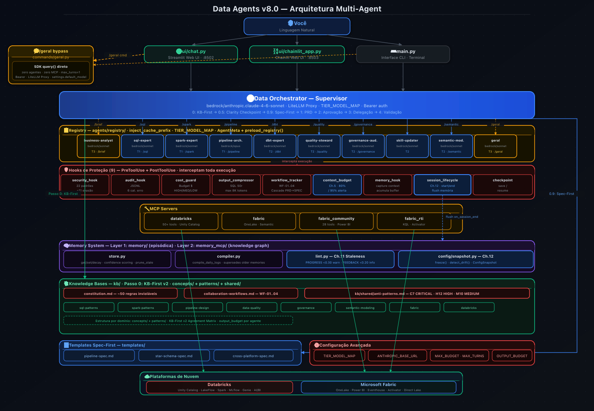

# Manual e Relatorio Tecnico: Projeto Data Agents v7.0

---

Repositorio: [github.com/ThomazRossito/data-agents](https://github.com/ThomazRossito/data-agents)

---

## Autor

> ## **Thomaz Antonio Rossito Neto**
>
> Specialist Data & AI Solutions Architect | Center of Excellence CoE @CI&T

## Contatos

> **LinkedIn:** [thomaz-antonio-rossito-neto](https://www.linkedin.com/in/thomaz-antonio-rossito-neto/)

> **GitHub:** [ThomazRossito](https://github.com/ThomazRossito/)

### Certificacoes Databricks

    

### Certificacoes Microsoft

<a href="https://www.credly.com/badges/052e5133-0c67-4ab7-bb3a-c99efa7b4406/public_url" target="_blank"></a> <a href="https://learn.microsoft.com/pt-br/users/thomazantoniorossitoneto/credentials/certification/fabric-data-engineer-associate" target="_blank"></a>

---

## Sumario

- [Prefacio](#prefacio)
- [1. O que e este projeto?](#1-o-que-e-este-projeto)
- [2. Conceitos Fundamentais (Glossario)](#2-conceitos-fundamentais-glossario)
- [3. Arquitetura Geral do Sistema](#3-arquitetura-geral-do-sistema)
- [4. Os Agentes: A Equipe Virtual](#4-os-agentes-a-equipe-virtual)
- [5. O Metodo BMAD, KB-First e Constituicao](#5-o-metodo-bmad-kb-first-e-constituicao)
- [6. Estrutura de Arquivos e Pastas](#6-estrutura-de-arquivos-e-pastas)
- [7. Analise Detalhada de Cada Componente](#7-analise-detalhada-de-cada-componente)
- [8. Seguranca e Controle de Custos (Hooks)](#8-seguranca-e-controle-de-custos-hooks)
- [9. O Hub de Conhecimento (KBs, Skills e Constituicao)](#9-o-hub-de-conhecimento-kbs-skills-e-constituicao)
- [10. Workflows Colaborativos e Spec-First](#10-workflows-colaborativos-e-spec-first)
- [11. Conexoes com a Nuvem (MCP Servers)](#11-conexoes-com-a-nuvem-mcp-servers)
- [12. Sistema de Memoria Persistente](#12-sistema-de-memoria-persistente)
- [13. Ciclo de Vida da Sessao e Config Snapshot](#13-ciclo-de-vida-da-sessao-e-config-snapshot)
- [14. O Comando /geral — Bypass Inteligente](#14-o-comando-geral--bypass-inteligente)
- [15. Comandos Disponiveis (Slash Commands)](#15-comandos-disponiveis-slash-commands)
- [16. Configuracao e Credenciais](#16-configuracao-e-credenciais)
- [17. Checkpoint de Sessao (Recuperacao Automatica)](#17-checkpoint-de-sessao-recuperacao-automatica)
- [18. Deploy com MLflow (Model Serving)](#18-deploy-com-mlflow-model-serving)
- [19. Qualidade de Codigo e Testes](#19-qualidade-de-codigo-e-testes)
- [20. Deploy e CI/CD (Publicacao Automatica)](#20-deploy-e-cicd-publicacao-automatica)
- [21. Interfaces do Usuario (Terminal e Web UI)](#21-interfaces-do-usuario-terminal-e-web-ui)
- [22. Dashboard de Monitoramento](#22-dashboard-de-monitoramento)
- [23. Por Que Esta Arquitetura? (Decisoes de Design)](#23-por-que-esta-arquitetura-decisoes-de-design)
- [24. Como Comecar a Usar](#24-como-comecar-a-usar)
- [25. Historico de Melhorias](#25-historico-de-melhorias)
- [26. Metricas do Projeto](#26-metricas-do-projeto)
- [27. Conclusao](#27-conclusao)

---

## Prefacio

Este documento nao e apenas um manual tecnico. E o registro completo de uma jornada de engenharia — da ideia inicial de "e se eu pudesse ter uma equipe de IA especializada no meu ambiente de dados?" ate um sistema de producao com dez agentes autonomos, nove camadas de seguranca, memoria persistente entre sessoes e integracao direta com Databricks e Microsoft Fabric.

O projeto Data Agents nasceu de uma frustracao real: ferramentas de IA generativas sao excelentes para responder perguntas, mas sua utilidade cai drasticamente quando precisamos que elas ajam — que executem um pipeline, criem uma tabela Delta, auditorizem um lakehouse, ou gerem um modelo semantico DAX. A distancia entre "escrever o codigo" e "executar o codigo no lugar certo" era o problema a resolver.

A solucao foi construir um sistema que nao apenas conversa, mas age: uma plataforma de multiplos agentes especializados, cada um com o conjunto certo de ferramentas, o conhecimento correto (via Knowledge Bases e Skills), e um conjunto de restricoes inviolaveis (a Constituicao) que garante que o comportamento seja sempre seguro, auditavel e alinhado com as melhores praticas de engenharia de dados.

A versao 7.0 e a versao mais completa do projeto. Ela expande o ecossistema com 10 agentes especialistas, 13 MCP servers, sistema de refresh automatico de Skills, 7 tipos de memoria com decay configuravel, e melhorias de seguranca, UX e roteamento de agentes.

Este manual foi escrito pensando em quatro perfis de leitores simultaneamente:

- **O iniciante** que nunca ouviu falar em agentes de IA e quer entender o que e isso e por que importa.
- **O tecnico** que quer entender cada arquivo, cada classe, cada decisao de implementacao.
- **O executivo** que quer saber o valor de negocio, o que o sistema faz de concreto e quanto custa operar.
- **O arquiteto** que quer entender por que as decisoes foram tomadas, quais alternativas foram consideradas e como o sistema pode ser estendido.

Cada secao foi escrita para que todos os quatro perfis encontrem o que precisam. Textos introdutorios com analogias do mundo real preparam o terreno para os detalhes tecnicos que vem logo em seguida. Decisoes de design sao explicadas com o contexto de por que aquela foi a melhor opcao, nao apenas o que foi escolhido.

Se voce esta lendo este documento pela primeira vez, recomendo comecar do inicio e seguir o fluxo natural. Se voce e um colaborador ou esta debugando um componente especifico, o sumario detalhado permite ir diretamente ao que precisa.

Bom aprendizado.

---

## 1. O que e este projeto?

### 1.1 A Ideia Central

Imagine que voce tem uma equipe completa de especialistas de dados disponiveis 24 horas por dia, 7 dias por semana. Ha um DBA que escreve e otimiza qualquer consulta SQL. Ha um engenheiro de Big Data que produz pipelines PySpark robustos. Ha um arquiteto cloud que cria e gerencia jobs no Databricks. Ha um auditor que verifica conformidade com LGPD. Ha um especialista de BI que constroi modelos semanticos DAX para Power BI. Ha um gerente que coordena tudo isso, garante que o trabalho siga os padroes da empresa, e valida cada entrega antes de liberar.

Agora imagine que toda essa equipe tem acesso direto ao seu ambiente de dados na nuvem — pode criar tabelas, executar queries, lancar pipelines, configurar alertas em tempo real — sem que voce precise sair do seu terminal ou do seu navegador.

Isso e o **Data Agents**.

O projeto e um sistema avancado de multiplos agentes de Inteligencia Artificial projetado para atuar como uma equipe completa e autonoma nas areas de Engenharia de Dados, Qualidade de Dados, Governanca e Analise Corporativa. Ele se conecta diretamente ao Databricks e ao Microsoft Fabric, executa tarefas reais no seu ambiente, e faz isso de acordo com as regras de arquitetura e seguranca definidas pela sua organizacao.

### 1.2 O Diferencial: Governanca Antes da Acao

A maioria das ferramentas de IA funciona assim: voce pede algo, a IA tenta fazer. Se der errado, voce corrige. Isso funciona para tarefas simples. Mas em ambientes corporativos de dados, um erro pode significar um pipeline quebrado, dados corrompidos, ou uma violacao de LGPD.

O Data Agents foi projetado com uma filosofia diferente: **a IA nunca adivinha, ela le o manual antes de agir**.

Antes de escrever uma unica linha de codigo ou executar uma unica query, o sistema e forcado a:

1. Ler a **Constituicao** — um documento com aproximadamente 50 regras inviolaveis que definem o que e permitido e o que e proibido.
2. Ler as **Knowledge Bases** relevantes — documentos com os padroes arquiteturais da sua empresa (Medallion, Star Schema, regras de qualidade).
3. Ler as **Skills** tecnicas — manuais operacionais que ensinam como usar corretamente cada tecnologia.
4. Validar a clareza do pedido via **Clarity Checkpoint** antes de comecar a planejar.

Somente apos esse processo de contextualizacao o sistema comeca a trabalhar. O resultado e codigo nao apenas funcional, mas seguro, auditavel e alinhado com a arquitetura corporativa.

### 1.3 O que o Sistema Faz de Concreto

Para tornar o conceito tangivel, aqui estao exemplos reais de tarefas que o Data Agents pode executar do inicio ao fim:

**Engenharia de Dados:**
- Criar um pipeline Bronze → Silver → Gold no Databricks com Delta Live Tables, incluindo testes de qualidade em cada camada, a partir de uma descricao em linguagem natural.
- Escrever e otimizar queries SQL complexas no Unity Catalog, com analise de plano de execucao e sugestoes de indexacao.
- Migrar um pipeline de Databricks para Microsoft Fabric, mapeando os dialetos SQL e adaptando a logica de orquestracao.

**Qualidade e Governanca:**
- Executar um data profiling completo em uma tabela Silver, identificando anomalias, valores nulos acima do threshold e distribuicoes suspeitas.
- Varrer um lakehouse inteiro procurando colunas com dados PII (CPFs, e-mails, telefones) e gerar um relatorio de exposicao de risco.
- Configurar alertas em tempo real no Fabric Activator para monitorar metricas criticas de qualidade.

**Analise e BI:**
- Criar um Genie Space no Databricks para uma tabela Gold especifica, configurado para responder perguntas de negocio em linguagem natural.
- Construir um modelo semantico DAX no Microsoft Fabric Direct Lake, com hierarquias, medidas calculadas e otimizacoes de performance.
- Publicar um AI/BI Dashboard no Databricks com visualizacoes automaticamente configuradas.

**Planejamento e Documentacao:**
- Receber um transcript de reuniao e transformar automaticamente em um backlog P0/P1/P2 estruturado, com cada item mapeado ao agente responsavel.
- Gerar um PRD (Product Requirements Document) completo para um novo pipeline antes de comecar o desenvolvimento.

### 1.4 O Valor de Negocio

Para gestores e executivos, o Data Agents representa uma mudanca fundamental na relacao entre equipes de dados e suas ferramentas. O tempo que engenheiros gastam em tarefas repetitivas — escrever DDLs de tabelas Delta, configurar jobs basicos, fazer data profiling inicial, documentar pipelines — pode ser delegado ao sistema. Isso libera a equipe para o que realmente agrega valor: decisoes de arquitetura, analise de negocio, resolucao de problemas complexos.

A camada de governanca embutida (Constituicao + Hooks de seguranca) significa que a autonomia dos agentes nunca compromete a seguranca. O sistema nunca executa um `DROP TABLE` sem permissao explicita, nunca faz um `SELECT *` sem `WHERE` que poderia varrer terabytes de dados desnecessariamente, e nunca escreve credenciais em codigo. Essa protecao e automatica — nao depende de revisao humana em cada passo.

O modelo de custo e controlado: cada sessao tem um limite de budget em dolares (padrao: $5.00) e um limite de turns (padrao: 50). Quando o limite e atingido, o sistema salva um checkpoint e para graciosamente. O custo de cada operacao e rastreado e visivel em tempo real no Dashboard de Monitoramento.

### 1.5 Versao 7.0: O que Ha de Novo

A versao 7.0 e a versao mais completa do projeto, acumulando os avancos das versoes anteriores:

**v5.0 — Memoria Persistente:** 4 tipos de memoria armazenados como Markdown, decay temporal, retrieval semantico, hooks de captura e ciclo de vida da sessao.

**v6.0 — Ecossistema Expandido:** 6 novos MCP servers externos (context7, tavily, github, firecrawl, postgres, memory_mcp), agente dbt Expert, Web UI Chainlit com dois modos de operacao, feedback em tempo real com cl.Step().

**v7.0 — Qualidade e Autonomia:**

**Skill Updater e Refresh Automatico:** Novo agente que mantém as Skills atualizadas automaticamente. `make refresh-skills` invoca o agente para buscar documentacao atualizada via context7/tavily/firecrawl. Skills desatualizadas geram codigo desatualizado — agora o sistema cuida disso.

**7 Tipos de Memoria com Decay Configuravel:** Tres novos tipos de dominio de dados: `data_asset` (schemas, tabelas), `platform_decision` (escolhas de tecnologia), `pipeline_status` (estado de execucao). Cada tipo tem decay configuravel individualmente via `.env`.

**Roteamento Preciso de Agentes:** Todos os 10 agentes agora tem triggers "Invoque quando:" no description, garantindo que o Supervisor direcione cada tarefa ao especialista correto sem ambiguidade.

**Seguranca Git:** 5 novos padroes destrutivos: git force-push, reset --hard, branch -D (force delete, case-sensitive para nao bloquear -d seguro).

**Melhorias de UX:** Budget resetado automaticamente em novo chat, indicador visual de processamento no Chainlit, checkpoint com instrucao de retomada direta.

### 1.6 Versao 8.0: A Grande Reestruturacao do Conhecimento

A versao 8.0 representa o maior salto na organizacao interna do conhecimento desde a criacao do sistema. As principais mudancas sao:

**KB Modular (concepts/ + patterns/):** Todos os 8 dominios de Knowledge Base foram reestruturados. Os arquivos monoliticos foram divididos em dois tipos claros: `concepts/` para definicoes e teoria (<=150 linhas), e `patterns/` para padroes de implementacao com codigo (<=200 linhas). Isso elimina confusao entre "o que e X" e "como implementar X", e permite que os agentes leiam apenas o arquivo relevante para sua tarefa.

**Biblioteca de Anti-Padroes Centralizada (`kb/shared/anti-patterns.md`):** Substitui definicoes espalhadas por multiplos arquivos. Catalogo unificado com 7 anti-padroes CRITICOS (C), 12 de severidade ALTA (H) e 10 de severidade MEDIA (M), incluindo: SELECT * sem WHERE, DROP sem backup, PII sem mascaramento, Python UDFs em producao, Direct Lake com DAX volatil sem cache, e snapshots dbt sem `unique_key`.

**Protocolo KB-First v2 com Agreement Matrix:** Todos os agentes agora calculam uma pontuacao de confianca explicita antes de responder. A Agreement Matrix cruza informacao da KB com confirmacao do MCP: KB + MCP = ALTA (0.95), KB sem MCP = MEDIA (0.75), MCP sem KB = 0.85. Cada resposta tecnica inclui um bloco de proveniencia obrigatorio.

**Cascade Tracking PRD->SPEC:** O `workflow_tracker.py` agora detecta modificacoes em PRDs (`output/*/prd/*.md`) e automaticamente emite eventos `spec_needs_review` para todos os SPECs no mesmo contexto, garantindo que nunca haja PRD modificado sem revisao dos SPECs dependentes.

**`output_budget` por Agente:** Todos os 10 agentes declaram no frontmatter um orcamento de linhas de saida (`output_budget`). Tier 1: 150-400 linhas; Tier 2: 80-250 linhas; Tier 3: 30-100 linhas. Isso controla verbosidade sem modificar o runtime.

**Chainlit Tool Result Display:** O `ui/chainlit_app.py` agora exibe o conteudo real retornado por cada tool call nos steps expansiveis. Anteriormente mostrava apenas "Concluido em X.Xs". A implementacao captura `UserMessage` com `ToolResultBlock` do SDK e fecha o step com o output real (truncado em 3.000 chars se necessario).

---

## 2. Conceitos Fundamentais (Glossario)

Para garantir que este manual seja compreensivel mesmo para quem nao e especialista em Inteligencia Artificial ou Engenharia de Dados, esta secao apresenta os termos essenciais. Cada definicao e acompanhada de uma analogia do mundo real para facilitar o entendimento.

### 2.1 Conceitos de Inteligencia Artificial

**Agente de IA**

Um agente de IA e um programa inteligente que nao apenas conversa, mas toma decisoes, planeja passos, usa ferramentas e executa tarefas de forma autonoma. A diferenca entre um chatbot comum e um agente e que o chatbot responde perguntas — o agente age no mundo.

*Analogia:* Um chatbot e como um assistente que responde e-mails. Um agente de IA e como um assistente que, alem de responder e-mails, tambem agenda reunioes, reserva salas, atualiza documentos no Google Drive e envia notificacoes — tudo autonomamente, seguindo as instrucoes que voce definiu.

**LLM (Large Language Model)**

O cerebro por tras de cada agente. E o modelo de linguagem que entende e gera texto, raciocina sobre problemas e decide qual acao tomar. Neste projeto, utilizamos a familia de modelos Claude (da Anthropic), conhecida por excelencia em raciocinio logico, programacao e seguimento preciso de instrucoes complexas.

Os modelos Claude usados neste projeto sao o `claude-opus-4-6` (o mais avancado, para tarefas de planejamento e raciocinio complexo) e o `claude-sonnet-4-6` (balanco ideal entre capacidade e custo, para tarefas de engenharia).

**MCP (Model Context Protocol)**

Protocolo de codigo aberto criado pela Anthropic que permite que agentes de IA se conectem de forma segura a sistemas externos — bancos de dados, APIs, plataformas de nuvem — para realizar acoes reais. Funciona como uma tomada universal: qualquer sistema que implemente o protocolo MCP pode ser "plugado" a qualquer agente que suporte MCP.

*Analogia:* O MCP e como o padrao USB. Voce nao precisa saber como o pendrive funciona por dentro — basta que o fabricante implemente o padrao USB e ele vai funcionar no seu computador. Da mesma forma, o Databricks e o Microsoft Fabric implementaram servidores MCP que os agentes podem usar sem precisar de integracao customizada.

**Thinking Avancado**

Capacidade do modelo Claude de "pensar em voz alta" antes de responder — executar uma cadeia de raciocinio interna mais profunda antes de chegar a conclusao. E habilitado apenas no modo BMAD Full (comando `/plan` e `/brief`) porque aumenta o custo e o tempo de resposta, mas produz planos de arquitetura significativamente melhores para tarefas complexas.

### 2.2 Conceitos de Engenharia de Dados

**Databricks**

Plataforma de dados em nuvem especializada em processar volumes massivos de informacoes usando Apache Spark. E o ambiente principal de engenharia de dados do projeto, com suporte a Unity Catalog (governanca centralizada de dados), Delta Live Tables (pipelines declarativos), Genie (analise em linguagem natural), Model Serving (deploy de modelos ML) e muito mais.

**Microsoft Fabric**

Plataforma de dados unificada da Microsoft que junta em um unico ambiente: armazenamento (OneLake), engenharia de dados (Data Factory, Synapse), analise em tempo real (Real-Time Intelligence com Eventhouse e KQL), e visualizacao (Power BI Direct Lake). O Data Agents se integra a todas essas camadas via MCP.

**Apache Spark / PySpark**

Tecnologia para processamento de Big Data que distribui o trabalho entre dezenas ou centenas de computadores em paralelo. PySpark e a interface Python para Spark. E a linguagem principal dos pipelines ETL/ELT construidos pelo Spark Expert.

**Arquitetura Medallion**

Padrao da industria para organizar dados em tres camadas progressivas de qualidade:
- **Bronze:** Dados brutos, exatamente como chegaram da fonte. Imutaveis. Podem conter erros.
- **Silver:** Dados limpos e validados. Erros corrigidos, formatos padronizados, deduplicados.
- **Gold:** Dados prontos para consumo — modelados em Star Schema ou agregados para dashboards e analises.

*Analogia:* Bronze e o minério de ferro bruto. Silver e o aco refinado. Gold e a peca mecanica pronta para uso.

**Delta Lake**

Formato de armazenamento que adiciona funcionalidades de banco de dados ao armazenamento em nuvem. Com Delta Lake, voce tem transacoes ACID (garantia de consistencia mesmo se algo falhar no meio), viagem no tempo (consegue ver dados como eram ontem), e streaming + batch unificado. E o formato padrao de todas as tabelas gerenciadas por este projeto.

**Star Schema**

Modelo de dados para analytics que organiza informacoes em uma tabela de fatos central (com as metricas — vendas, receita, quantidade) rodeada de tabelas de dimensao (quem comprou, onde, quando, qual produto). Otimizado para queries analiticas rapidas e modelos de BI.

**Knowledge Base (KB)**

Arquivos Markdown que contem as regras de negocio e padroes arquiteturais da empresa. A IA le esses documentos antes de comecar a trabalhar para saber o que deve ser feito e como. O projeto possui 8 dominios de KB: sql-patterns, spark-patterns, pipeline-design, data-quality, governance, semantic-modeling, databricks e fabric.

**Skills**

Manuais operacionais detalhados que ensinam como usar uma tecnologia especifica. Enquanto a KB diz "toda tabela Gold deve ter particionamento por data", a Skill ensina como criar esse particionamento em Delta Lake com a sintaxe correta do PySpark. O projeto possui 27 Skills para Databricks e 10 para Fabric.

**Constituicao**

Documento de autoridade maxima do sistema (kb/constitution.md). Contem aproximadamente 50 regras inviolaveis divididas em 8 secoes que cobrem principios fundamentais, regras do Supervisor, Clarity Checkpoint, arquitetura, plataformas, seguranca, qualidade e modelagem semantica. Se houver conflito entre uma instrucao do usuario e a Constituicao, a Constituicao prevalece sempre.

**Clarity Checkpoint**

Etapa de validacao que ocorre antes de qualquer planejamento. O Supervisor avalia a clareza do pedido em 5 dimensoes — objetivo, escopo, plataforma, criticidade e dependencias — e pontua de 0 a 5. Se a pontuacao for menor que 3, o Supervisor pede esclarecimentos ao inves de continuar com um plano baseado em suposicoes incorretas.

**Workflow Colaborativo**

Cadeia automatica de agentes que trabalham em sequencia, onde a saida de um e a entrada do proximo. Por exemplo: o SQL Expert escreve o schema → o Spark Expert cria o pipeline → o Data Quality Steward adiciona validacoes → o Governance Auditor verifica conformidade. Cada etapa recebe o contexto completo da anterior via formato de handoff padronizado.

**PRD (Product Requirements Document)**

Documento de arquitetura criado pelo Supervisor antes de comecar a delegar. Detalha exatamente o que sera construido, quais agentes serao acionados, em qual ordem, e o que cada um deve produzir. Equivale ao briefing tecnico de um projeto de software — o plano antes da execucao.

**Checkpoint de Sessao**

Mecanismo de resiliencia que salva o estado atual da sessao (ultimo prompt, custo acumulado, arquivos gerados) sempre que ha uma interrupcao — budget estourado, idle timeout ou reset manual. Permite retomar exatamente de onde parou na proxima sessao.

**BMAD (Build, Measure, Approve, Delegate)**

Metodo estruturado de orquestracao que define os 7 passos do Supervisor: KB-First (ler Knowledge Bases) → Clarity Checkpoint → Spec-First (selecionar template) → Planejamento (PRD) → Aprovacao → Delegacao → Sintese e Validacao. E o protocolo que garante que toda tarefa complexa siga um processo disciplinado antes da execucao.

**MLflow**

Plataforma open-source para gerenciamento do ciclo de vida de modelos de Machine Learning. Usado neste projeto para fazer deploy do Data Agents como endpoint de Model Serving no Databricks, tornando-o consumivel como uma API REST por outras aplicacoes.

**Memoria Persistente**

Sistema que permite ao agente lembrar informacoes relevantes entre sessoes diferentes. Implementado em `memory/` com quatro tipos: Episodica (eventos especificos), Semantica (padroes aprendidos), Procedimental (preferencias de execucao) e Arquitetural (decisoes de design do ambiente). Cada memoria e armazenada como arquivo Markdown com frontmatter YAML e tem nivel de confianca (0.0 a 1.0).

| **Termo**                       | **O que significa**                                                    | **Analogia rapida**                                           |
| --------------------------------| ---------------------------------------------------------------------- | ------------------------------------------------------------- |
| Agente de IA                    | Programa que age, nao apenas responde                                  | Assistente que executa tarefas, nao so conversa               |
| LLM                             | O cerebro — o modelo de linguagem (Claude)                             | O motor de um carro                                           |
| MCP                             | Protocolo de conexao com sistemas externos                             | Padrao USB para sistemas                                      |
| Databricks                      | Plataforma cloud de Big Data com Apache Spark                          | A fabrica de processamento de dados                           |
| Microsoft Fabric                | Plataforma unificada Microsoft (dados + BI + streaming)                | O shopping center da Microsoft para dados                     |
| Arquitetura Medallion           | Bronze (bruto) → Silver (limpo) → Gold (pronto)                        | Minerio → Aco → Peca pronta                                   |
| Delta Lake                      | Formato de dados com ACID, time travel e streaming                     | Banco de dados + arquivo cloud ao mesmo tempo                 |
| Constituicao                    | Regras inviolaveis do sistema                                          | A constituicao de um pais — prevalece sobre tudo              |
| Knowledge Base (KB)             | Regras de negocio e arquitetura da empresa                             | O manual de politicas da empresa                              |
| Skill                           | Manual tecnico operacional                                             | O manual do aparelho                                          |
| Clarity Checkpoint              | Validacao de clareza antes do planejamento                             | O checklist pre-voo de um piloto                              |
| Workflow Colaborativo           | Cadeia sequencial de agentes                                           | Linha de montagem especializada                               |
| PRD                             | Documento de arquitetura pre-execucao                                  | O briefing tecnico antes do projeto                           |
| Checkpoint de Sessao            | Save state automatico para recuperacao                                 | O save point de um jogo                                       |
| BMAD                            | Protocolo de orquestracao em 7 passos                                  | A metodologia agil do sistema                                 |
| Memoria Persistente             | Aprendizado que sobrevive entre sessoes                                | A memoria de longo prazo do sistema                           |

---

## 3. Arquitetura Geral do Sistema

<p align="center">
  
</p>

### 3.1 A Visao Geral: Uma Empresa em Miniatura

A melhor forma de entender a arquitetura do Data Agents e pensar nela como uma empresa em miniatura especializada em engenharia de dados. Toda empresa bem estruturada tem uma hierarquia clara, uma divisao de responsabilidades, um conjunto de normas inviolaveis, ferramentas de trabalho especializadas, e mecanismos de controle e auditoria.

O Data Agents tem exatamente isso. A **Constituicao** e o estatuto da empresa. O **Supervisor** e o gerente geral. Os **agentes especialistas** sao os tecnicos de cada area. Os **MCP Servers** sao as ferramentas conectadas ao ambiente de producao. Os **Hooks** sao a auditoria interna. As **Knowledge Bases** e **Skills** sao os manuais de procedimentos. O **Sistema de Memoria** e a memoria institucional — o conhecimento acumulado que a empresa nao perde quando o funcionario vai embora.

Nesta empresa, quando um cliente (voce) chega com um pedido, o gerente nao simplesmente terceiriza sem verificar. Ele primeiro ve se o pedido esta claro o suficiente, cria um plano formal, pede aprovacao, e so entao aciona os especialistas certos. E ao final, valida se o que foi entregue esta de acordo com os padroes da empresa. Esse e o protocolo BMAD.

### 3.2 O Fluxo de Trabalho Detalhado

Vamos acompanhar o percurso de um pedido tipico — por exemplo, `/plan Crie um pipeline de ingestao de dados de vendas no Databricks, Bronze a Gold, com validacoes de qualidade` — para entender como cada parte do sistema e ativada:

**Passo 1: A Entrada (main.py ou Web UI)**

O pedido chega ao sistema pela interface escolhida pelo usuario: o terminal via `python main.py`, a Web UI Streamlit na porta 8502, ou uma chamada API via endpoint MLflow. O arquivo `main.py` (ou a UI) identifica o slash command (`/plan`) e encaminha para o `commands/parser.py`.

**Passo 2: O Roteamento (commands/parser.py)**

O parser identifica que `/plan` corresponde ao modo BMAD Full com o Supervisor. Ele monta o contexto da sessao (incluindo memorias relevantes recuperadas do sistema de memoria persistente) e inicializa o agente Supervisor via `agents/supervisor.py`.

**Passo 3: O Gerente Entra em Acao (supervisor.py + supervisor_prompt.py)**

O Supervisor e instanciado com seu system prompt completo (223 linhas), que inclui: identidade, equipe disponivel, protocolo BMAD detalhado, regras inviolaveis (S1-S7), tabela de roteamento de KB, suporte a workflows colaborativos (WF-01 a WF-04), validacao Star Schema e formato de resposta.

Com o **thinking avancado** habilitado em modo Full, o Supervisor comeca seu processo interno:

- **Passo 0 (KB-First):** Le as Knowledge Bases relevantes ao tipo de tarefa. Para um pipeline de ingestao, ele le `kb/pipeline-design/`, `kb/databricks/` e `kb/data-quality/`.
- **Passo 0.5 (Clarity Checkpoint):** Avalia as 5 dimensoes de clareza. Objetivo: claro. Escopo: definido (vendas, Databricks, Bronze-Gold). Plataforma: Databricks. Criticidade: nao especificada — pede esclarecimento.
- **Passo 0.9 (Spec-First):** Seleciona o template `templates/pipeline-spec.md` para esta tarefa.
- **Passo 1 (Planejamento):** Cria o PRD em `output/prd/prd_pipeline_vendas.md`, descrevendo cada camada, os agentes a acionar e a ordem de execucao.
- **Passo 2 (Aprovacao):** Apresenta o resumo ao usuario e aguarda confirmacao.
- **Passo 3 (Delegacao):** Aciona os agentes em sequencia — Spark Expert para o pipeline PySpark, Data Quality Steward para as validacoes, Governance Auditor para compliance.
- **Passo 4 (Sintese):** Valida os artefatos gerados contra a Constituicao.

**Passo 4: Os Especialistas Trabalham**

Cada agente especialista recebe a tarefa com contexto completo. O Spark Expert le a Skill `skills/databricks/spark-development.md` antes de escrever o codigo PySpark. O Data Quality Steward le `skills/databricks/data-quality.md`. Cada agente usa seus MCP servers para interagir com o Databricks — criar notebooks, executar queries, configurar pipelines.

**Passo 5: Os Guardioes Observam (Hooks)**

Silenciosamente, durante todo o processo, os 9 Hooks de seguranca estao ativos. O `security_hook.py` bloqueia qualquer comando Bash destrutivo. O `check_sql_cost` bloqueia `SELECT *` sem `WHERE`. O `audit_hook.py` registra cada tool call em `logs/audit.jsonl`. O `cost_guard_hook.py` monitora o custo em tempo real. O `output_compressor_hook.py` trunca outputs gigantes antes de chegarem ao modelo. O `memory_hook.py` captura insights importantes para persistir na memoria.

**Passo 6: Memoria e Aprendizado**

Ao final da sessao, o `memory_hook.py` e o `session_lifecycle_hook.py` trabalham juntos para persistir o conhecimento adquirido: as tabelas criadas, as preferencias demonstradas, as decisoes de arquitetura tomadas. Na proxima sessao, esse contexto sera automaticamente injetado — o sistema lembrara do que foi feito.

### 3.3 Os Quatro Modos de Operacao

O sistema oferece quatro modos de velocidade para diferentes necessidades, equilibrando profundidade de raciocinio com custo e tempo de resposta:

**BMAD Full (/plan, /brief)**

O modo mais completo. Ativa o thinking avancado do modelo, executa todos os 7 passos do protocolo BMAD, gera PRD e SPEC, aguarda aprovacao antes de delegar. Ideal para pipelines novos, refatoracoes de arquitetura ou qualquer tarefa que envolva 3 ou mais agentes. Mais lento e mais caro, mas produz os resultados mais seguros e bem documentados.

**BMAD Express (/sql, /spark, /pipeline, /fabric, /quality, /governance, /semantic)**

Modo de velocidade. Pula o planejamento e vai direto ao especialista correto. Sem thinking avancado. Sem PRD. Sem aprovacao. Ideal para tarefas pontuais e bem definidas — "escreva esta query", "crie este job", "faca profiling desta tabela". Muito mais rapido e economico que o modo Full.

**Bypass Direto (/geral)**

O modo mais novo, introduzido na v5.0. Bypassa completamente o Supervisor e os agentes especialistas e vai direto ao modelo base. Sem acesso a MCP, sem Knowledge Bases, sem Constituicao. Ideal para conversas rapidas, revisoes de codigo, perguntas conceituais, brainstorming — qualquer coisa que nao precise de execucao real na nuvem. Extremamente rapido e barato.

**Internal (/health, /status, /review)**

Comandos de diagnostico e controle do proprio sistema. Nao delegam para agentes. Verificam conectividade MCP, listam artefatos gerados, permitem revisar PRDs e SPECs anteriores.

### 3.4 Componentes Principais — Visao de Alto Nivel

| **Componente**       | **Arquivo(s)**                     | **Responsabilidade**                                       |
| -------------------- | ---------------------------------- | ---------------------------------------------------------- |
| Entrada Principal    | main.py                            | Banner, loop interativo, sessao, idle timeout, checkpoint  |
| Supervisor           | agents/supervisor.py + prompts/    | Orquestracao, PRD, delegacao, Clarity Checkpoint           |
| Motor de Agentes     | agents/loader.py                   | Carrega agentes de Markdown, KB injection, model routing   |
| Comandos             | commands/parser.py                 | Roteamento de slash commands para modos BMAD               |
| Configuracao         | config/settings.py                 | Pydantic BaseSettings com validacao de credenciais         |
| Hooks (9 total)      | hooks/                             | Auditoria, seguranca, custo, compressao, workflows, mem    |
| MCP Servers (6)      | mcp_servers/                       | Conexoes com Databricks, Fabric e Fabric RTI               |
| Knowledge Base       | kb/                                | Constituicao, regras de negocio, padroes arquiteturais     |
| Skills (32 total)    | skills/                            | Manuais operacionais Databricks + Fabric                   |
| Memoria Persistente  | memory/                            | store.py, types.py, pruner.py, retriever.py                |
| Monitoramento        | monitoring/app.py                  | Dashboard Streamlit com 9 paginas (porta 8501)             |
| Testes               | tests/                             | 11 modulos de teste, cobertura 80%                         |
| MLflow               | agents/mlflow_wrapper.py           | Deploy como Databricks Model Serving                       |

---

## 4. Os Agentes: A Equipe Virtual

O projeto conta com **10 agentes especialistas** divididos em tres niveis de atuacao (Tiers), mais o Supervisor. Todos os agentes — com excecao do Supervisor — sao definidos em arquivos Markdown na pasta `agents/registry/`. Isso e uma decisao de design deliberada: para criar um novo agente, voce nao precisa escrever Python. Basta criar um arquivo `.md` com o frontmatter YAML correto e o prompt em Markdown.

Essa abordagem declarativa tem tres vantagens cruciais. Primeiro, a barreira de entrada e baixa — qualquer pessoa que entenda o negocio pode contribuir com um novo agente sem conhecimento de programacao. Segundo, o codigo Python do `loader.py` permanece inalterado quando novos agentes sao adicionados. Terceiro, o frontmatter YAML serve como configuracao versionada — voce pode ver exatamente quais tools, KBs e MCP servers cada agente tem, em um formato legivel por humanos.

### 4.1 O Supervisor (Data Orchestrator)

O Supervisor e o gerente central do sistema. Ele e o unico agente que nao vive em um arquivo Markdown — sua logica esta em `agents/supervisor.py` e seu system prompt em `agents/prompts/supervisor_prompt.py` porque sua complexidade justifica implementacao dedicada.

**Modelo:** `claude-opus-4-6` — o modelo mais avancado da Anthropic, com capacidade superior de raciocinio complexo e planejamento de longo prazo.

**O que o Supervisor faz e o que nao faz:**

O Supervisor tem uma regra inviolavel definida na Constituicao: **ele nunca escreve codigo**. Se voce pediu um pipeline PySpark ao Supervisor, ele vai planejar, detalhar a arquitetura em um PRD, e delegar para o Spark Expert — mas ele proprio nunca vai produzir uma linha de PySpark. Essa separacao de responsabilidades e crucial: ela garante que todo codigo produzido veio de um especialista com o contexto tecnico correto, nao do gerente tentando fazer trabalho de tecnico.

O que o Supervisor faz:
- Executar o Clarity Checkpoint e pedir esclarecimentos quando necessario
- Ler as Knowledge Bases relevantes e carregar o contexto de negocio
- Criar o PRD em `output/prd/` com a arquitetura completa da solucao
- Selecionar o template de Spec correto e preenche-lo
- Decidir se a tarefa requer um Workflow Colaborativo (WF-01 a WF-04) ou delegacao simples
- Fazer a Validacao Constitucional no Passo 4 para garantir que os artefatos estao conformes
- Injetar as memorias persistentes relevantes ao inicio de cada sessao

**Recursos exclusivos do Supervisor:**
- Thinking avancado habilitado no modo Full (mais profundidade de raciocinio)
- Acesso ao sistema de memoria persistente para leitura e escrita
- Conhecimento de toda a equipe disponivel e suas capacidades
- Suporte a workflows colaborativos (WF-01 a WF-04) com handoff automatico

### 4.2 Tier 3 — Pre-Planejamento e Intake de Requisitos

O Tier 3 foi projetado para o problema de "garbage in, garbage out". Se o input for um documento nao estruturado — uma transcricao de reuniao, um e-mail com requisitos fragmentados, notas de brainstorming — passar diretamente para o `/plan` vai produzir um PRD ruim ou forcar o usuario a estruturar o input manualmente. O Tier 3 resolve isso.

#### Business Analyst (/brief)

**Modelo:** `claude-opus-4-6`

**Analogia:** O Analista de Negocios que transforma reunioes caoticas em backlogs acionaveis.

O Business Analyst e especializado em um tipo especifico de transformacao: recebe texto nao estruturado de qualquer formato (transcript de reuniao, briefing executivo, e-mail de stakeholder, notas rabiscadas) e produz um backlog estruturado em formato P0/P1/P2, com cada item mapeado ao dominio tecnico correto e ao agente responsavel pela execucao.

**O protocolo interno do Business Analyst e rigoroso em 7 etapas:**

1. Receber o documento (caminho de arquivo ou texto direto)
2. Ler o template `templates/backlog.md` para garantir o formato correto de saida
3. Extrair contexto de negocio, stakeholders identificados, decisoes tomadas e restricoes declaradas
4. Mapear cada requisito identificado ao dominio tecnico correspondente (Databricks? Fabric? SQL? Pipeline? BI?)
5. Identificar o agente responsavel pela execucao de cada item
6. Priorizar usando criterios estritos: P0 = bloqueadores (maximo 3), P1 = importantes para o sprint, P2 = desejaveis mas nao urgentes
7. Salvar o backlog em `output/backlog/backlog_<nome>.md` e apresentar resumo com instrucoes para o proximo passo via `/plan`

O Business Analyst nao tem acesso a MCP servers. Ele trabalha exclusivamente com documentos locais — Read, Write, Grep, Glob. Essa restricao e intencional: o Tier 3 e sobre entender o negocio e estruturar o trabalho, nao sobre executar na nuvem.

**Exemplo de uso tipico:**

```
Voce: /brief inputs/reuniao_sprint_14.txt
Sistema: [Business Analyst le o transcript]
         [Identifica 12 requisitos brutos]
         [Mapeia: 3 P0 (pipeline critico), 4 P1 (melhorias importantes), 5 P2]
         [Salva output/backlog/backlog_sprint_14.md]
         "Backlog gerado. Proximos passos: /plan output/backlog/backlog_sprint_14.md"
```

### 4.3 Tier 1 — Engenharia de Dados (O Core)

Os tres agentes do Tier 1 sao os executores primarios de engenharia de dados. Cada um e especializado em uma dimensao diferente do trabalho tecnico: dados relacionais (SQL Expert), processamento distribuido (Spark Expert) e orquestracao de infraestrutura (Pipeline Architect).

#### SQL Expert (/sql)

**Modelo:** `claude-sonnet-4-6`

**Analogia:** O DBA e Analista de Dados — a pessoa que conhece cada tabela do catalogo de cor, sabe como escrever a query mais eficiente e entende os planos de execucao.

O SQL Expert domina SQL em todos os sabores relevantes para o ecossistema de dados moderno: Spark SQL (Databricks e Delta Lake), T-SQL (Microsoft Fabric SQL Analytics Endpoint), KQL (Kusto Query Language para o Eventhouse do Fabric). Ele e capaz de escrever queries complexas, otimiza-las com base no plano de execucao, descobrir a estrutura de tabelas que nunca viu antes, e traduzir entre dialetos.

**Capacidades tecnicas:**
- Escrita e otimizacao de Spark SQL, T-SQL e KQL
- Analise de catalogo via Unity Catalog — descoberta de schemas, tabelas, colunas e tipos
- Uso de `execute_sql_multi` para executar multiplas queries em paralelo e comparar resultados
- Uso de `get_table_stats_and_schema` para combinar schema e estatisticas em uma unica chamada, economizando turns
- Acesso ao Genie via `genie_ask` para perguntas em linguagem natural sobre Genie Spaces configurados
- Escrita de arquivos `.sql` em disco para versionamento

**Restricoes de seguranca:** O SQL Expert tem acesso de leitura e escrita na nuvem. O Hook `check_sql_cost` bloqueia automaticamente qualquer `SELECT *` sem `WHERE` ou `LIMIT` — uma protecao essencial para evitar full table scans acidentais em tabelas de terabytes.

#### Spark Expert (/spark)

**Modelo:** `claude-sonnet-4-6`

**Analogia:** O Engenheiro de Back-End de Big Data — a pessoa que sabe escrever PySpark eficiente, entende particionamento, sabe otimizar shuffles e construir pipelines robustos com Delta Lake.

O Spark Expert e o principal produtor de codigo do sistema. Ele escreve pipelines PySpark completos, desde a leitura na Bronze ate a escrita na Gold, com as transformacoes corretas em cada camada. Ele conhece os padroes da KB `spark-patterns` — uso correto de `MERGE INTO`, estrategias de particionamento, configuracao de DLT (Delta Live Tables), leitura de streams com Auto Loader.

**Capacidades tecnicas:**
- Escrita de pipelines PySpark completos (ingestao, transformacao, escrita)
- Implementacao de Slowly Changing Dimensions (SCD Type 1 e 2) com `MERGE INTO`
- Configuracao de Delta Live Tables com quality expectations embutidas
- Implementacao de streaming com Auto Loader (`cloudFiles`)
- Acesso ao filesystem local (Read, Write, Edit, Bash, Glob, Grep) — o unico agente Tier 1 com acesso total ao sistema de arquivos, necessario para criar notebooks e salvar scripts

**Restricoes de seguranca:** O security_hook bloqueia comandos Bash destrutivos (`rm -rf`, `DROP TABLE`) mesmo que o agente tente executa-los indiretamente.

#### Pipeline Architect (/pipeline, /fabric)

**Modelo:** `claude-sonnet-4-6`

**Analogia:** O Engenheiro Cloud e DevOps de dados — a pessoa que cria e gerencia a infraestrutura de execucao: jobs, pipelines, clusters, warehouses.

O Pipeline Architect e o agente com as permissoes mais amplas do sistema, e por isso e o mais fortemente monitorado pelos Hooks. Ele pode criar e gerenciar Jobs no Databricks, montar Pipelines no Data Factory do Fabric, mover arquivos entre plataformas, gerenciar clusters e SQL warehouses, executar codigo Python/Scala em clusters serverless, e criar Knowledge Assistants (KA) e Mosaic AI Supervisor Agents (MAS).

**Capacidades exclusivas:**
- `execute_code` — executa Python ou Scala em clusters serverless do Databricks
- `manage_cluster` — cria, inicia, para e redimensiona clusters
- `manage_sql_warehouse` — gerencia SQL warehouses (start, stop, resize)
- `wait_for_run` — aguarda conclusao de Jobs e Pipelines com polling inteligente
- `manage_ka` / `manage_mas` — cria e configura Knowledge Assistants e Mosaic AI Supervisor Agents

**Roteamento inteligente do /fabric:** O comando `/fabric` tem logica de roteamento interno. Se o prompt mencionar "semantic model", "DAX", "Power BI", "Direct Lake" ou "Metric Views", o comando redireciona automaticamente para o Semantic Modeler em vez do Pipeline Architect. Isso garante que tarefas de modelagem semantica sempre cheguem ao especialista correto, mesmo que o usuario use o comando generico `/fabric`.

**output_budget (v8.0):** Todos os agentes declaram no frontmatter YAML um campo `output_budget` que expressa o orcamento de linhas de resposta esperado. Exemplos: `"150-400 linhas"` (T1), `"80-250 linhas"` (T2), `"30-100 linhas"` (T3). O agente usa isso como orientacao interna para calibrar verbosidade — respostas longas para tarefas tecnicas complexas, curtas para perguntas conceituais.

### 4.4 Tier 2 — Qualidade, Governanca e Analise

O Tier 2 cobre as camadas que transformam dados tecnicamente corretos em dados confiaveis, governados e analiticos.

#### Data Quality Steward (/quality)

**Modelo:** `claude-sonnet-4-6`

**Analogia:** O Engenheiro de QA especializado em dados — a pessoa que cria os testes automatizados que garantem que os dados estao corretos antes de chegarem ao usuario final.

O Data Quality Steward realiza data profiling (analise estatistica de distribuicoes, nulos, outliers, duplicatas), escreve Data Quality Expectations (regras de validacao que sao executadas automaticamente a cada carga), configura alertas em tempo real no Fabric Activator para metricas criticas, e define SLAs de qualidade para cada camada da Medallion.

#### Governance Auditor (/governance)

**Modelo:** `claude-sonnet-4-6`

**Analogia:** O Auditor de Compliance e Seguranca — a pessoa que verifica se os dados estao sendo tratados corretamente do ponto de vista legal e de governanca corporativa.

O Governance Auditor rastreia linhagem de dados (como um dado chegou onde chegou), audita logs de acesso, varre bancos de dados procurando informacoes sensiveis como CPFs, e-mails e telefones que nao devem estar expostos, e garante conformidade com LGPD e GDPR. Ele trabalha com as ferramentas de Unity Catalog do Databricks e com as APIs de governanca do Fabric.

#### Semantic Modeler (/semantic)

**Modelo:** `claude-sonnet-4-6`

**Analogia:** O Especialista de BI — a pessoa que transforma tabelas Gold em modelos analiticos que o Power BI consegue usar eficientemente.

O Semantic Modeler e o agente mais "voltado para o negocio" do Tier 2. Ele constroi modelos semanticos DAX para Power BI com hierarquias e medidas calculadas corretas, otimiza tabelas Gold para Direct Lake (eliminando importacao de dados), configura Metric Views no Databricks, cria Genie Spaces para analise em linguagem natural, e publica AI/BI Dashboards com visualizacoes automaticamente configuradas.

**O Semantic Modeler foi o agente mais expandido na v4.0:** Agora tem acesso a `create_or_update_genie` para criar Genie Spaces diretamente, `create_or_update_dashboard` para publicar AI/BI Dashboards, e `query_serving_endpoint` para consultar endpoints de Model Serving e incluir resultados de ML em modelos semanticos.

#### dbt Expert (/dbt)

**Modelo:** `claude-sonnet-4-6`

**Analogia:** O especialista em transformacao declarativa — a pessoa que usa dbt (data build tool) para transformar dados brutos em modelos analiticos versionados, testados e documentados.

O dbt Expert cobre o ciclo completo de desenvolvimento dbt: escreve `models/` em SQL ou Python, configura `tests/` (not_null, unique, relationships), cria `snapshots/` para Slowly Changing Dimensions, seeds para dados de referencia, gera documentacao via `dbt docs generate`, e suporta os adapters `dbt-databricks` e `dbt-fabric`. Acessa as Skills de dbt via `skill_domains: [root]` para garantir uso de padroes atuais.

#### Skill Updater (sem slash command dedicado)

**Modelo:** `claude-sonnet-4-6`

**Analogia:** O responsavel pela manutencao do acervo tecnico — a pessoa que periodicamente revisa e atualiza os manuais operacionais para refletir as versoes mais recentes das ferramentas.

O Skill Updater e o unico agente sem exposicao direta ao usuario via slash command. Ele e invocado pelo sistema de refresh automatico (`make refresh-skills`) ou pelo Supervisor quando uma Skill precisa ser atualizada. Busca documentacao atualizada via context7, tavily e firecrawl, le o arquivo `SKILL.md` atual, atualiza o conteudo e o frontmatter (`updated_at`), e salva o arquivo. Suporta `--force`, `--dry-run` e execucao paralela de ate 2 skills simultaneamente.

**Configuracao via `.env`:**
- `SKILL_REFRESH_ENABLED=true` — habilita o refresh automatico
- `SKILL_REFRESH_INTERVAL_DAYS=3` — pula skills atualizadas ha menos de N dias
- `SKILL_REFRESH_DOMAINS=databricks,fabric` — dominios a atualizar

### 4.5 Tabela Comparativa dos 10 Agentes

| **Agente**           | **Tier** | **Modelo**   | **MCP Servers**                | **Acesso Principal**                            |
| -------------------- | -------- | ------------ | ------------------------------ | ----------------------------------------------- |
| Supervisor           | —        | opus-4-6     | Todos (via delegacao)          | Leitura KB + memoria + orquestracao             |
| Business Analyst     | T3       | opus-4-6     | tavily, firecrawl              | Read/Write local + pesquisa web                 |
| SQL Expert           | T1       | sonnet-4-6   | Databricks, Fabric, RTI        | Read-only na nuvem, write em .sql               |
| Spark Expert         | T1       | sonnet-4-6   | context7                       | Read/Write + filesystem local completo          |
| Pipeline Architect   | T1       | sonnet-4-6   | Databricks, Fabric, github     | Execucao completa + compute/KA/MAS              |
| Data Quality Steward | T2       | sonnet-4-6   | Databricks, Fabric             | Read/Write completo                             |
| Governance Auditor   | T2       | sonnet-4-6   | Databricks, Fabric, memory_mcp | Read/Write completo + knowledge graph           |
| Semantic Modeler     | T2       | sonnet-4-6   | Databricks, Fabric             | Read-only + Genie + AI/BI Dashboard + Serving   |
| dbt Expert           | T2       | sonnet-4-6   | context7, postgres             | Read/Write local + documentacao atualizada      |
| Skill Updater        | T2       | sonnet-4-6   | context7, tavily, firecrawl    | Write em SKILL.md + busca de documentacao       |

---

## 5. O Metodo BMAD, KB-First e Constituicao

### 5.1 Por Que um Metodo?

A primeira versao do projeto era simples: o usuario digitava um pedido, o modelo respondia com codigo. Funcionava para tarefas triviais. Mas quando as tarefas ficavam complexas — pipelines com multiplas camadas, integracao entre plataformas, decisoes que afetavam arquitetura — o comportamento sem estrutura produzia resultados inconsistentes e, as vezes, perigosos.

O BMAD nasceu da necessidade de impor disciplina sem eliminar flexibilidade. A ideia central e: **toda tarefa complexa de engenharia de dados segue o mesmo processo logico**, independentemente dos detalhes especificos. Primeiro voce entende o problema. Depois voce define o que sera construido. Depois voce pede aprovacao. Depois voce executa. Depois voce valida.

O metodo BMAD codifica esse processo natural de engenharia em 7 passos executados automaticamente pelo Supervisor toda vez que voce usa o comando `/plan`.

### 5.2 A Constituicao — A Lei Suprema do Sistema

O arquivo `kb/constitution.md` e o documento mais importante do projeto. Contem aproximadamente 50 regras inviolaveis, divididas em 8 secoes, que definem o comportamento esperado do sistema em qualquer situacao.

A Constituicao nao e uma lista de sugestoes — e um conjunto de regras hard-coded no prompt do Supervisor como limites absolutos. Se o usuario pedir algo que viola a Constituicao, o Supervisor recusa e explica por que, da mesma forma que um advogado nao assina um documento que viola a lei mesmo que o cliente peca.

**Secao 1 — Principios Fundamentais (P1-P5):**
O mais importante e o principio P1: **KB-First e obrigatorio**. Nenhum agente pode comecar a trabalhar sem antes ler as Knowledge Bases relevantes ao seu dominio. Isso garante que o codigo gerado sempre respeite as regras de negocio da empresa.

O principio P2 estabelece o **Spec-First** para tarefas complexas: sempre que uma tarefa envolver 3 ou mais agentes ou 2 ou mais plataformas, um template de Spec deve ser preenchido antes da delegacao. Isso garante documentacao automatica de todas as grandes mudancas.

O principio P3 estabelece **delegacao especializada**: o Supervisor nunca escreve codigo. Sempre delega para o especialista correto. Isso parece redundante, mas e necessario porque os modelos de linguagem tem tendencia a tentar resolver o problema diretamente em vez de seguir o processo definido.

**Secao 2 — Regras do Supervisor (S1-S7):**
- S1: Nunca gerar codigo diretamente.
- S2: Sempre consultar KB antes de planejar.
- S3: Sempre executar Clarity Checkpoint antes de comecar.
- S4: Sempre criar PRD antes de delegar.
- S5: Sempre aguardar aprovacao antes de iniciar execucao.
- S6: Sempre validar artefatos finais contra a Constituicao.
- S7: Injetar memorias relevantes no inicio de cada sessao.

**Secao 3 — Clarity Checkpoint:**
Define as 5 dimensoes de avaliacao e os criterios para cada nota. Pontuacao minima de 3/5 para continuar.

**Secoes 4 e 5 — Arquitetura e Plataformas:**
Definem o que os agentes devem sempre fazer ao trabalhar com Databricks e Fabric:
- Toda tabela gerenciada usa formato Delta Lake.
- Toda arquitetura de dados segue Medallion (Bronze/Silver/Gold).
- Toda modelagem analitica Gold segue Star Schema (fato + dimensoes).
- No Databricks, sempre usar Unity Catalog para governanca.
- No Fabric, sempre usar Direct Lake para tabelas Gold em Power BI.

**Secoes 6 a 8 — Seguranca, Qualidade e Modelagem:**
- Nunca escrever credenciais em codigo.
- Nunca processar PII sem mascaramento ou encriptacao.
- Sempre executar data profiling antes de promover dados para Silver.
- Sempre adicionar expectations de qualidade em pipelines DLT.
- Modelos semanticos DAX devem seguir o padrao de hierarquias definido em SM1-SM6.

**Por que a Constituicao e um documento Markdown em vez de codigo?**

Essa e uma decisao de design deliberada com tres beneficios. Primeiro, qualquer membro do time pode ler, entender e propor mudancas na Constituicao sem saber Python. Segundo, a Constituicao pode ser versionada com Git e o historico de mudancas e legivel por humanos. Terceiro, o proprio modelo de IA pode referenciar e raciocinar sobre a Constituicao durante o planejamento — "esta tarefa viola a regra SEC-3 porque..." — o que nao seria possivel se as regras fossem logica Python.

### 5.3 A Filosofia KB-First e o Protocolo v2

O principio KB-First e simples: **nenhum agente age sem primeiro consultar suas Knowledge Bases**. Mas a v8.0 vai alem — introduz o **Protocolo KB-First v2** com Agreement Matrix e pontuacao explicita de confianca.

A regra de ouro permanece: a IA nunca adivinha, ela le o manual. Antes de comecar a trabalhar, cada agente e forcado a ler as Knowledge Bases de seus dominios declarados. O campo `kb_domains` no frontmatter YAML de cada agente define quais KBs ele precisa. O `loader.py` carrega automaticamente apenas as KBs relevantes — lazy loading para nao sobrecarregar o contexto do modelo.

O proposito e garantir que o codigo gerado reflete as decisoes de arquitetura da sua empresa, nao apenas as melhores praticas genericas do modelo pre-treinado. Se sua empresa definiu na KB que toda tabela Silver deve ter uma coluna `_audit_created_at` do tipo `TIMESTAMP`, o agente vai incluir essa coluna em todo codigo que gerar, porque le essa regra na KB antes de comecar.

Quando `INJECT_KB_INDEX=true` (padrao), o `loader.py` vai alem: injeta automaticamente o conteudo completo dos arquivos `index.md` de cada KB declarada no prompt do agente. Isso significa que o agente nao precisa fazer chamadas adicionais para ler a KB — o resumo dos padroes ja esta no seu contexto desde o inicio.

**As 4 etapas do Protocolo KB-First v2:**

1. **Consultar KB** — Ler `kb/{dominio}/index.md` -> identificar arquivos relevantes -> ler os arquivos de concepts/ e/ou patterns/
2. **Consultar MCP** (quando disponivel) — verificar estado atual na plataforma
3. **Calcular confianca** via Agreement Matrix:

| KB tem padrao | MCP confirma | Confianca |
|---------------|--------------|-----------|
| Sim | Sim | ALTA — 0.95 |
| Sim | Silencioso | MEDIA — 0.75 |
| Nao | Sim | 0.85 |

Modificadores: +0.20 match exato na KB, +0.15 MCP confirma, -0.15 versao desatualizada, -0.10 informacao obsoleta.

Limiares de decisao: CRITICO >= 0.95 | IMPORTANTE >= 0.90 | PADRAO >= 0.85 | ADVISORY >= 0.75

4. **Incluir proveniencia** ao final de respostas tecnicas:
```
KB: kb/{dominio}/concepts/{arquivo}.md | Confianca: ALTA (0.92) | MCP: confirmado
```

### 5.4 O Clarity Checkpoint em Detalhe

O Clarity Checkpoint e o passo 0.5 do protocolo BMAD — acontece antes do planejamento, depois da leitura das KBs.

O Supervisor avalia a requisicao em 5 dimensoes e atribui uma nota de 0 a 1 para cada:

| **Dimensao** | **Pergunta de avaliacao**                                               | **Exemplo de nota baixa**              |
| ------------ | ----------------------------------------------------------------------- | -------------------------------------- |
| Objetivo     | O resultado esperado esta claro e mensuravel?                           | "Melhore os dados" (muito vago)        |
| Escopo       | Tabelas, schemas, plataformas e volume estao identificados?             | "Em algum lugar no Databricks"         |
| Plataforma   | E Databricks, Fabric, on-premise ou hibrido?                            | Nao mencionado                         |
| Criticidade  | E exploracao, desenvolvimento, homologacao ou producao?                 | Nao mencionado                         |
| Dependencias | Upstream (de onde vem os dados) e downstream (quem consume) definidos? | Sem mencao de fontes ou consumidores   |

**Pontuacao minima: 3/5.** Se a soma for 3 ou mais, o Supervisor continua. Se for menor que 3, ele para, explica quais dimensoes estao ausentes, e faz perguntas especificas para resolver cada lacuna.

Isso parece uma friccao adicional no fluxo, mas na pratica poupa tempo. Executar um plano baseado em suposicoes erradas — "achei que era a tabela X no schema Y" — e muito mais caro do que fazer uma pergunta de esclarecimento antes de comecar.

### 5.5 Os 7 Passos do Protocolo BMAD

| **Passo** | **Nome**             | **O que acontece**                                                      | **Artefato gerado**         |
| --------- | -------------------- | ----------------------------------------------------------------------- | --------------------------- |
| 0         | KB-First             | Le Knowledge Bases relevantes ao tipo de tarefa solicitada              | —                           |
| 0.5       | Clarity Checkpoint   | Avalia 5 dimensoes de clareza (minimo 3/5 para continuar)              | —                           |
| 0.9       | Spec-First           | Seleciona template de spec (para tarefas com 3+ agentes ou 2+ plat.)  | —                           |
| 1         | Planejamento         | Cria PRD completo com arquitetura, agentes, sequencia e criterios      | `output/prd/prd_<nome>.md`  |
| 2         | Aprovacao            | Apresenta resumo do PRD e aguarda "sim" do usuario                     | —                           |
| 3         | Delegacao            | Aciona agentes em sequencia (simples ou via Workflows Colaborativos)   | Artefatos por agente        |
| 4         | Sintese e Validacao  | Verifica aderencia de todos os artefatos a kb/constitution.md          | —                           |

O protocolo completo e executado apenas no modo BMAD Full (`/plan`). No modo Express (comandos diretos como `/sql`, `/spark`), o agente e acionado diretamente a partir do Passo 3, sem planejamento.


---

## 6. Estrutura de Arquivos e Pastas

O projeto segue uma organizacao modular e declarativa. Cada pasta tem uma responsabilidade unica e bem definida. A estrutura foi projetada para que qualquer pessoa que entenda o dominio (engenharia de dados) consiga navegar e encontrar o que precisa sem precisar ler codigo Python.

### 6.1 Visao Geral da Estrutura

```
data-agents/
├── agents/
│   ├── registry/              # Agentes definidos em Markdown (10 agentes + template)
│   │   ├── _template.md       # Template para criar novos agentes
│   │   ├── business-analyst.md
│   │   ├── sql-expert.md
│   │   ├── spark-expert.md
│   │   ├── pipeline-architect.md
│   │   ├── data-quality-steward.md
│   │   ├── governance-auditor.md
│   │   └── semantic-modeler.md
│   ├── loader.py              # Motor que transforma .md em agentes vivos
│   ├── supervisor.py          # Factory do ClaudeAgentOptions para o Supervisor
│   ├── prompts/
│   │   └── supervisor_prompt.py  # System prompt completo (223 linhas)
│   └── mlflow_wrapper.py      # Wrapper PyFunc para Databricks Model Serving
│
├── commands/
│   └── parser.py              # Slash commands com roteamento BMAD
│
├── config/
│   ├── settings.py            # Pydantic BaseSettings com validacao de credenciais
│   ├── exceptions.py          # Hierarquia de excecoes personalizadas
│   ├── logging_config.py      # Logging estruturado JSONL + console Rich
│   └── mcp_servers.py         # Registry central de conexoes MCP
│
├── hooks/
│   ├── audit_hook.py          # Log JSONL com categorizacao de erros (6 categorias)
│   ├── checkpoint.py          # Checkpoint de sessao (save/load/resume)
│   ├── cost_guard_hook.py     # Classificacao HIGH/MEDIUM/LOW de custos
│   ├── memory_hook.py         # NOVO v5.0: Captura insights para memoria persistente
│   ├── output_compressor_hook.py  # Trunca outputs MCP (economia de tokens)
│   ├── security_hook.py       # Bloqueia comandos destrutivos e SQL custoso
│   ├── session_lifecycle_hook.py  # NOVO v5.0: Gerencia eventos do ciclo de sessao
│   ├── session_logger.py      # Metricas de custo/turnos/duracao por sessao
│   └── workflow_tracker.py    # Rastreia delegacoes, workflows e Clarity Checkpoint
│
├── kb/
│   ├── constitution.md        # Documento de autoridade maxima (~50 regras)
│   ├── collaboration-workflows.md  # Workflows Colaborativos (WF-01 a WF-04)
│   ├── data-quality/          # Expectations, profiling, drift detection, SLAs
│   ├── databricks/            # Unity Catalog, compute, bundles, AI/ML, jobs
│   ├── fabric/                # RTI, Eventhouse, Data Factory, Direct Lake
│   ├── governance/            # Auditoria, linhagem, PII, compliance
│   ├── pipeline-design/       # Medallion, orquestracao, cross-platform, Star Schema
│   ├── semantic-modeling/     # DAX, Direct Lake, Metric Views, reporting
│   ├── spark-patterns/        # Delta Lake, SDP/LakeFlow, streaming, performance
│   └── sql-patterns/          # DDL, otimizacao, conversao de dialetos, Star Schema
│
├── memory/                    # NOVO v5.0: Sistema de Memoria Persistente
│   ├── __init__.py
│   ├── types.py               # MemoryType, MemoryEntry, to_frontmatter()
│   ├── store.py               # MemoryStore: save, load, list
│   ├── retriever.py           # MemoryRetriever: busca por relevancia
│   └── pruner.py              # MemoryPruner: poda de memorias obsoletas
│
├── memory_storage/            # Arquivos .md de memorias persistidas (gitignored)
│   ├── episodic/
│   ├── semantic/
│   ├── procedural/
│   └── architectural/
│
├── mcp_servers/
│   ├── databricks/            # 65+ tools: UC, SQL, Jobs, LakeFlow, Compute, AI/BI
│   ├── databricks_genie/      # MCP customizado: 9 tools para Genie Conversation API
│   ├── fabric/                # 28 tools Community + servidor oficial
│   ├── fabric_sql/            # MCP customizado: 8 tools SQL Analytics via TDS
│   └── fabric_rti/            # Tools para KQL, Eventstreams, Activator
│
├── monitoring/
│   └── app.py                 # Dashboard Streamlit (9 paginas, porta 8501)
│
├── output/
│   ├── prd/                   # PRDs gerados pelo /plan
│   ├── specs/                 # SPECs geradas apos aprovacao
│   └── backlog/               # Backlogs P0/P1/P2 do /brief
│
├── skills/
│   ├── databricks/            # 27 modulos operacionais Databricks
│   └── fabric/                # 5 modulos operacionais Fabric
│
├── templates/
│   ├── backlog.md             # Template P0/P1/P2 para Business Analyst
│   ├── cross-platform-spec.md # Template para migracoes Fabric <-> Databricks
│   ├── pipeline-spec.md       # Template para pipelines ETL/ELT Bronze-Gold
│   └── star-schema-spec.md    # Template para Star Schema com SS1-SS5
│
├── tests/                     # 11 modulos de teste (cobertura 80%)
│
├── ui/
│   ├── __init__.py
│   └── chat.py                # Chat UI Streamlit com ClaudeSDKClient persistente
│
├── logs/                      # Arquivos JSONL de log (gitignored)
│   ├── audit.jsonl
│   ├── app.jsonl
│   ├── sessions.jsonl
│   ├── workflows.jsonl
│   └── compression.jsonl
│
├── main.py                    # Entrada principal com loop interativo
├── start.sh                   # Script para subir Web UI + Monitoring
├── pyproject.toml             # Dependencias, metadata, configuracao de ferramentas
├── Makefile                   # 18 targets de automacao
├── .env.example               # Modelo de credenciais (nunca commitar o .env real)
└── .github/
    └── workflows/
        ├── ci.yml             # Integracao Continua: lint, test, security
        └── cd.yml             # Deploy Continuo: Databricks Asset Bundles
```

### 6.2 Pasta agents/registry/ — O Coracdo Declarativo

Esta e a pasta mais importante para quem quer estender o sistema. Cada arquivo `.md` aqui define um agente completo. Vejamos a estrutura de um arquivo de agente para entender o que cada campo faz:

```yaml
---
name: sql-expert
description: "Especialista em SQL para Databricks e Fabric"
model: claude-sonnet-4-6
tier: T1
kb_domains:
  - sql-patterns
  - databricks
  - fabric
mcp_servers:
  - databricks
  - fabric_community
  - fabric_rti
  - databricks_genie
tools:
  - databricks_readonly
  - fabric_sql_all
  - databricks_genie_all
  - Write  # pode salvar .sql
permissions:
  cloud_write: false  # read-only na nuvem
  local_write: true   # pode salvar arquivos
---

## Identidade

Voce e o SQL Expert do Data Agents...

## Suas Responsabilidades

...
```

O campo `kb_domains` e o que o loader usa para lazy-loading: apenas as KBs desses dominios sao injetadas no prompt do agente. O campo `tools` define quais subsets de tools MCP o agente pode usar — aliases como `databricks_readonly` sao expandidos para a lista completa de tools de leitura no `loader.py`.

### 6.3 Pasta memory/ — O Novo Sistema da v5.0

A pasta `memory/` e completamente nova na versao 5.0. Ela implementa o sistema de memoria persistente do projeto. E composta por quatro modulos:

- **types.py:** Define os tipos de dados. `MemoryType` e um enum com quatro valores (`EPISODIC`, `SEMANTIC`, `PROCEDURAL`, `ARCHITECTURAL`). `MemoryEntry` e o dataclass que representa uma memoria individual, com campos como `id`, `type`, `summary`, `tags`, `confidence`, `created_at`, `updated_at`, `source_session`, `related_ids` e `superseded_by`. O metodo `to_frontmatter()` serializa a memoria em formato Markdown com YAML frontmatter.

- **store.py:** `MemoryStore` gerencia persistencia em disco. Cada memoria e salva como um arquivo `.md` individual na pasta `memory_storage/<tipo>/`. Usa um formato padronizado que e legivel por humanos e por codigo.

- **retriever.py:** `MemoryRetriever` implementa busca por relevancia. Dado um prompt ou contexto de tarefa, retorna as memorias mais relevantes usando correspondencia de tags e similaridade de texto.

- **pruner.py:** `MemoryPruner` implementa poda automatica. Remove memorias que foram substituidas por versoes mais recentes (campo `superseded_by` preenchido), que perderam confianca abaixo do threshold, ou que sao mais antigas que o limite de retencao por tipo.

### 6.4 Pasta output/ — Os Artefatos do Trabalho

A pasta `output/` foi reorganizada na v4.0 e mantida na v5.0 com tres subpastas especializadas:

- `output/prd/` — PRDs gerados pelo Supervisor via `/plan`. Formato: `prd_<nome>.md`.
- `output/specs/` — SPECs tecnicas geradas apos aprovacao do PRD. Formato: `spec_<nome>.md`.
- `output/backlog/` — Backlogs P0/P1/P2 gerados pelo Business Analyst via `/brief`. Formato: `backlog_<nome>.md`.

Essa organizacao por subpasta torna facil para o usuario e para o sistema encontrar artefatos especificos. O comando `/status` lista os arquivos em cada subpasta. O comando `/review` le o PRD mais recente e permite continuar, modificar ou recriar.

---

## 7. Analise Detalhada de Cada Componente

Esta secao mergulha fundo em cada componente do sistema. Para cada um, explicamos o que faz, como funciona internamente, por que foi projetado desta forma, e o que mudar se voce precisar customiza-lo.

### 7.1 main.py — A Entrada Principal

Quando voce digita `python main.py`, este arquivo e o primeiro a rodar. Ele e responsavel por exibir o banner ASCII com Rich, verificar que as credenciais minimas estao configuradas, inicializar o sistema de logging, verificar se existe um checkpoint de sessao anterior e oferecer a opcao de retomar, e entrar no loop interativo principal.

**O loop interativo** e implementado como uma funcao assíncrona `run_interactive()` que roda indefinidamente ate receber o comando `sair`. A cada iteracao, le o input do usuario, identifica se e um slash command ou texto livre, determina qual agente deve processar, e delega para `commands/parser.py`.

O estado da sessao e mantido em um dicionario `_session_state` com tres campos:
- `last_prompt`: O ultimo prompt enviado (limitado a 500 caracteres para economia de espaco)
- `accumulated_cost`: Custo acumulado em USD desde o inicio da sessao
- `turns`: Numero de turns executados

Esse estado e injetado no checkpoint quando ocorre uma interrupcao, permitindo que a proxima sessao entenda o que estava acontecendo.

**O sistema de feedback em tempo real** usa Rich para exibir um spinner animado com o label da ferramenta sendo executada. O mapa de labels cobre mais de 40 nomes de tools com descricoes amigaveis em portugues — por exemplo, `execute_notebook` se torna "Executando notebook...", `list_tables` se torna "Listando tabelas...", `create_pipeline` se torna "Criando pipeline...". Isso da ao usuario visibilidade sobre o que esta acontecendo sem expor os nomes tecnicos das ferramentas.

**O idle timeout** e implementado com `asyncio.wait_for()`. Se o usuario nao interagir por mais de `IDLE_TIMEOUT_MINUTES` (padrao: 30 minutos), a sessao e automaticamente salva em checkpoint e resetada. Isso previne que sessoes caras fiquem abertas indefinidamente apos o usuario esquecer de encerrar.

**Single-query mode:** O main.py aceita argumentos de linha de comando para executar uma unica query e sair:
```bash
python main.py "/sql SELECT COUNT(*) FROM vendas.silver.pedidos"
```
Util para integracao em scripts de automacao e testes.

### 7.2 loader.py — O Motor de Agentes

O `loader.py` e um dos arquivos mais sofisticados do projeto. Ele transforma um arquivo Markdown em um agente vivo com todas as suas configuracoes. Vejamos o processo passo a passo:

**Passo 1: Parsing do YAML frontmatter**

O loader le o arquivo `.md`, separa o bloco `---` do inicio e extrai o YAML. Cada campo e validado: se `model` nao for um dos modelos suportados, levanta `ConfigurationError`. Se `kb_domains` estiver vazio, o agente nao recebe contexto de KB.

**Passo 2: Lazy-loading de KBs**

Para cada dominio declarado em `kb_domains`, o loader procura o arquivo `kb/<dominio>/index.md`. Se `INJECT_KB_INDEX=true`, o conteudo desse arquivo e concatenado ao prompt base do agente. Isso significa que o agente recebe um resumo atualizado das regras do seu dominio toda vez que e instanciado — sem precisar fazer chamadas MCP adicionais para ler KBs.

**Passo 3: Model Routing por Tier**

Se `TIER_MODEL_MAP` estiver configurado no `.env` (exemplo: `TIER_MODEL_MAP={"T1": "claude-opus-4-6"}`), o loader substitui globalmente o modelo de todos os agentes daquele Tier. Isso e util para experimentos — voce pode testar o sistema com modelos mais potentes ou mais economicos sem editar cada arquivo de agente individualmente.

**Passo 4: Filtragem de MCP servers**

O loader consulta `mcp_servers.py` para descobrir quais servidores tem credenciais validas. Se o agente declarou `databricks` nos `mcp_servers` mas `DATABRICKS_HOST` nao esta no `.env`, o servidor Databricks e removido silenciosamente. Isso garante que agentes nao tentem usar servidores indisponiveis e falhem com erros crypticos — eles simplesmente operam sem esses servidores.

**Passo 5: Resolucao de aliases de tools**

O campo `tools` nos agentes pode usar aliases como `databricks_readonly`, `databricks_all`, `fabric_sql_all`. O loader expande esses aliases para as listas completas de tools usando o dicionario `MCP_TOOL_SETS` em `loader.py`. Os aliases disponíveis sao:

| **Alias**           | **Tools incluidas**                                         |
| ------------------- | ----------------------------------------------------------- |
| `databricks_all`    | Todas as tools do servidor Databricks (base + aibi + serving + compute) |
| `databricks_readonly` | Apenas tools de leitura (list, get, describe, query)     |
| `databricks_aibi`   | create_or_update_genie, create_or_update_dashboard, manage_ka, manage_mas |
| `databricks_serving` | list/get_serving_endpoints, query_serving_endpoint        |
| `databricks_compute` | manage_cluster, manage_sql_warehouse, execute_code, wait_for_run |
| `databricks_genie_all` | Todas as 9 tools do MCP Genie customizado               |
| `fabric_all`        | Todas as tools do MCP Fabric Community                      |
| `fabric_sql_all`    | Todas as 8 tools do MCP Fabric SQL customizado              |

**Passo 6: Montagem do ClaudeAgentOptions**

Com todas as configuracoes resolvidas, o loader monta o objeto `ClaudeAgentOptions` do Claude Agent SDK com o system prompt final (prompt base + KBs injetadas), o modelo resolvido, a lista de MCP servers ativos, as tools filtradas e as permissoes.

**Como criar um novo agente (guia pratico):**

```bash
# 1. Copie o template
cp agents/registry/_template.md agents/registry/meu-agente.md

# 2. Edite o YAML frontmatter
# - Defina name, description, model (opus ou sonnet), tier (T1/T2/T3)
# - Declare kb_domains relevantes
# - Declare mcp_servers necessarios
# - Declare tools (use aliases quando possivel)

# 3. Escreva o prompt em Markdown abaixo do frontmatter
# - Identidade: quem e o agente e o que faz
# - Responsabilidades: lista detalhada de capacidades
# - Protocolo: como o agente deve abordar tarefas
# - Restricoes: o que o agente NUNCA deve fazer

# 4. Adicione o comando ao parser (opcional)
# - Edite commands/parser.py para adicionar /meu-comando

# 5. Teste
python -c "from agents.loader import load_agents; agents = load_agents(); print([a.name for a in agents])"
```

### 7.3 supervisor.py e supervisor_prompt.py

O `supervisor.py` e uma factory function — `build_supervisor_options()` — que monta o `ClaudeAgentOptions` do Supervisor dinamicamente a cada vez que e chamada. A dinamicidade e necessaria porque:

1. A lista de agentes disponíveis pode mudar entre sessoes (se novos agentes foram adicionados ou removidos)
2. Os MCP servers ativos dependem das credenciais do `.env` atual
3. As memorias a injetar dependem do contexto da sessao atual

A funcao recebe o historico de memorias relevantes como parametro e os injeta no system prompt do Supervisor antes de instanciar o agente.

O `supervisor_prompt.py` contem o system prompt mais longo do projeto (223 linhas). Ele e dividido em secoes bem delimitadas:

- **Identidade e missao:** Quem e o Supervisor e qual e sua responsabilidade central
- **Equipe disponivel:** Lista dinamica dos agentes carregados, com capacidades de cada um
- **Protocolo BMAD (7 passos):** Descricao detalhada de cada passo, incluindo criterios de decisao
- **Regras inviolaveis (S1-S7):** As restricoes absolutas que o Supervisor nunca pode violar
- **Tabela de roteamento de KB:** Mapa de qual agente deve receber qual KB para qual tipo de tarefa
- **Suporte a Workflows Colaborativos:** Descricao dos 4 workflows pre-definidos e quando aciona-los
- **Validacao Star Schema (SS1-SS5):** Criterios para verificar conformidade de modelos dimensionais
- **Formato de resposta:** Como o Supervisor deve estruturar suas saidas (PRDs, aprovacoes, delegacoes)

O **thinking avancado** do Claude e habilitado no Supervisor via `thinking={"type": "enabled", "budget_tokens": 10000}`. Isso significa que o modelo tem permissao para "pensar" ate 10.000 tokens antes de produzir sua resposta. Esse raciocinio interno nao e visivel ao usuario, mas melhora significativamente a qualidade dos PRDs e da analise de Clarity Checkpoint.

### 7.4 settings.py — O Painel de Controle Central

O `settings.py` usa `pydantic-settings` para carregar todas as variaveis de configuracao do arquivo `.env`. Pydantic e escolhido aqui por tres razoes: validacao automatica de tipos (uma string que deveria ser um numero causa erro imediato), valores default documentados no codigo, e documentacao de schema automatica.

As variaveis mais importantes:

| **Variavel**              | **Padrao**        | **Descricao detalhada**                                      |
| ------------------------- | ----------------- | ------------------------------------------------------------ |
| `ANTHROPIC_API_KEY`       | obrigatoria       | Chave da API Anthropic. Validada: deve comecar com `sk-ant-` |
| `DEFAULT_MODEL`           | claude-opus-4-6   | Modelo padrao para o Supervisor                              |
| `MAX_BUDGET_USD`          | 5.00              | Limite de custo por sessao. Range valido: 0.01 a 100.00      |
| `MAX_TURNS`               | 50                | Limite de turns. Range valido: 1 a 500                       |
| `CONSOLE_LOG_LEVEL`       | WARNING           | Nivel de log no terminal. WARNING esconde logs operacionais  |
| `LOG_LEVEL`               | INFO              | Nivel de log para os arquivos JSONL em logs/                 |
| `TIER_MODEL_MAP`          | {}                | JSON com override de modelo por Tier. Ex: `{"T1": "opus-4-6"}` |
| `INJECT_KB_INDEX`         | true              | Injeta index.md das KBs declaradas nos prompts dos agentes   |
| `IDLE_TIMEOUT_MINUTES`    | 30                | Minutos de inatividade antes do reset automatico. 0 desabilita |
| `MEMORY_RETENTION_DAYS`   | 90                | NOVO v5.0: Dias de retencao para memorias episodicas         |
| `MEMORY_MIN_CONFIDENCE`   | 0.3               | NOVO v5.0: Confianca minima para uma memoria nao ser podada  |

O `settings.py` tambem inclui dois metodos de deteccao automatica de plataformas:
- `validate_platform_credentials()`: Verifica quais plataformas tem todas as credenciais necessarias
- `get_available_platforms()`: Retorna lista de plataformas disponíveis para exibicao no banner

### 7.5 commands/parser.py — O Sistema de Roteamento BMAD

O `parser.py` e o ponto central de decisao de roteamento. Para cada slash command recebido, ele determina: qual agente acionar, qual modo BMAD usar, e como montar o contexto inicial.

A implementacao usa um dicionario de roteamento que mapeia cada comando para uma tupla `(agent_name, bmad_mode, thinking_enabled)`:

```python
COMMAND_ROUTES = {
    "/brief":      ("business-analyst",     "full",     True),
    "/plan":       ("supervisor",           "full",     True),
    "/geral":      (None,                   "bypass",   False),  # Novo v5.0
    "/sql":        ("sql-expert",           "express",  False),
    "/spark":      ("spark-expert",         "express",  False),
    "/pipeline":   ("pipeline-architect",   "express",  False),
    "/fabric":     ("auto",                 "express",  False),  # Roteamento inteligente
    "/quality":    ("data-quality-steward", "express",  False),
    "/governance": ("governance-auditor",   "express",  False),
    "/semantic":   ("semantic-modeler",     "express",  False),
    "/health":     (None,                   "internal", False),
    "/status":     (None,                   "internal", False),
    "/review":     (None,                   "internal", False),
    "/help":       (None,                   "internal", False),
}
```

**O roteamento inteligente do /fabric** merece atencao especial. Quando o agente e `"auto"`, o parser analisa o prompt com uma lista de keywords semanticas:

```python
SEMANTIC_KEYWORDS = [
    "semantic model", "semantico", "dax", "power bi",
    "direct lake", "metric view", "measure", "medida"
]

if any(kw in prompt.lower() for kw in SEMANTIC_KEYWORDS):
    agent_name = "semantic-modeler"
else:
    agent_name = "pipeline-architect"
```

Isso significa que `/fabric crie um modelo DAX para a tabela gold.vendas` vai para o Semantic Modeler, enquanto `/fabric crie um pipeline de ingestao de dados de IoT` vai para o Pipeline Architect — automaticamente, sem que o usuario precise conhecer a diferenca.

**O comando /review** tem logica especial: ele lê o PRD mais recente em `output/prd/` (ordenado por data de modificacao), le a SPEC correspondente em `output/specs/` se existir, e exibe um painel de revisao perguntando ao usuario se quer continuar, modificar ou recriar. E uma forma rapida de retomar trabalho anterior sem precisar reescrever o contexto.

**Comandos de controle de sessao** nao sao slash commands — sao palavras reservadas detectadas pelo loop principal:
- `continuar`: Retoma do checkpoint salvo
- `limpar`: Reseta a sessao atual (salva checkpoint antes)
- `sair`: Encerra o Data Agents

### 7.6 exceptions.py — Hierarquia de Excecoes

Uma hierarquia de excecoes bem projetada e o que diferencia um sistema robusto de um que lanca `Exception("algo deu errado")`. O projeto define excecoes especificas para cada categoria de falha:

```
DataAgentsError (base)
├── MCPConnectionError        # Nao conseguiu conectar ao servidor MCP
├── MCPToolExecutionError     # A tool foi chamada mas retornou erro
├── AuthenticationError       # Credenciais invalidas ou expiradas
├── BudgetExceededError       # MAX_BUDGET_USD atingido
├── MaxTurnsExceededError     # MAX_TURNS atingido
├── SecurityViolationError    # Hook de seguranca bloqueou a operacao
├── SkillNotFoundError        # Skill referenciada nao existe em skills/
├── ConfigurationError        # Configuracao invalida no .env ou no agente
└── CheckpointError           # Falha ao salvar ou carregar checkpoint
```

Cada excecao carrega informacoes contextuais especificas. `MCPToolExecutionError` inclui o nome da tool, os inputs enviados, e o erro retornado. `BudgetExceededError` inclui o custo atual e o limite configurado. `SecurityViolationError` inclui o comando que foi bloqueado e a regra de seguranca violada.

Essa granularidade permite que o `audit_hook.py` categorize automaticamente cada erro em uma das 6 categorias de auditoria: `auth`, `timeout`, `rate_limit`, `mcp_connection`, `not_found` e `validation`.

### 7.7 logging_config.py — Logging Dual: Console + JSONL

O sistema de logging tem dois destinos com configuracoes independentes:

**Console (terminal):** Usa `Rich` para formatacao colorida quando disponivel, ou texto simples (`logging.StreamHandler`) no modo nao-interativo. O nivel padrao e `WARNING`, o que significa que logs operacionais (DEBUG, INFO) nao poluem o terminal do usuario durante o uso normal.

**Arquivo JSONL:** Um `RotatingFileHandler` que cria arquivos `.jsonl` com maximo de 10MB cada, mantendo ate 5 backups. O formato JSONL (uma linha JSON por log event) e escolhido em vez de plain text porque facilita o consumo pelo Dashboard de Monitoramento — cada linha pode ser parseada independentemente.

O `JSONLFormatter` personalizado adiciona campos estruturados a cada log entry: `timestamp` (ISO8601 com timezone), `level`, `logger`, `message`, e quaisquer campos extra passados via `extra={}`. O Dashboard usa esses campos estruturados para filtrar, agregar e visualizar.

**Loggers ruidosos sao silenciados automaticamente:**
```python
NOISY_LOGGERS = ["httpx", "httpcore", "asyncio", "urllib3", "anthropic"]
for logger_name in NOISY_LOGGERS:
    logging.getLogger(logger_name).setLevel(logging.WARNING)
```

Isso previne que requisicoes HTTP internas do SDK Anthropic encham os logs com detalhes de baixo nivel que nao sao uteis para o usuario.

---

## 8. Seguranca e Controle de Custos (Hooks)

Os Hooks sao o sistema de controle e auditoria do Data Agents. Sao funcoes que o Claude Agent SDK chama automaticamente em momentos especificos da execucao — antes de uma ferramenta ser chamada (PreToolUse), depois que uma ferramenta retornou (PostToolUse), no inicio da sessao (SessionStart), e no fim da sessao (SessionEnd).

O Data Agents v7.0 possui **9 Hooks** especializados, organizados em tres categorias: Seguranca (prevencao), Auditoria (registro e rastreamento), e Controle (custo, compressao e ciclo de vida).

### 8.1 Por Que Hooks? Uma Decisao de Arquitetura

A alternativa aos hooks seria incluir instrucoes de seguranca diretamente no system prompt de cada agente: "nunca execute DROP TABLE", "nunca faca SELECT sem WHERE". Isso funciona parcialmente — os modelos geralmente seguem instrucoes — mas nao e confiavel. Um modelo pode "esquecer" uma instrucao em um contexto longo, ou pode ser convencido por um prompt particularmente persuasivo a violar uma regra.

Os hooks sao codigo Python puro que roda independentemente do modelo. Quando o `security_hook.py` bloqueia um `DROP TABLE`, nao importa o que o modelo pensou — o bloqueio acontece antes que a ferramenta seja chamada. O modelo pode ter gerado o comando `DROP TABLE` com a melhor das intencoes, mas o hook impede que ele chegue ao servidor MCP.

Essa separacao entre "o que a IA quer fazer" e "o que o sistema permite" e o principio de menor privilegio aplicado a agentes de IA.

### 8.2 Hooks PreToolUse — Guardioes Antes da Acao

#### security_hook.py — Parte 1: block_destructive_commands

Este hook e registrado como PreToolUse especificamente para ferramentas Bash. Antes de qualquer comando Bash ser executado, o hook analisa o comando contra duas listas de padroes:

**22 padroes destrutivos diretos** (bloqueados imediatamente — inclui 5 padroes git adicionados na v7.0):
```python
DESTRUCTIVE_PATTERNS = [
    r'\bDROP\s+TABLE\b',
    r'\bDELETE\s+FROM\b',
    r'\bTRUNCATE\s+TABLE\b',
    r'\bDROP\s+DATABASE\b',
    r'\bDROP\s+SCHEMA\b',
    r'rm\s+-rf?\b',
    r'rm\s+--force\b',
    r'chmod\s+777\b',
    r'chown\s+root\b',
    r'\bformat\s+[A-Z]:\b',  # Windows
    r'mkfs\.',
    r'dd\s+if=',
    r'>\s*/dev/s[da]',  # Sobrescrita de disco
    r'shred\b',
    r'wipefs\b',
    r'blkdiscard\b',
    r'mv\s+.+\s+/dev/null\b',
    # Padroes git destrutivos (adicionados v7.0):
    r'\bgit\s+push\s+.*--force\b',     # force push (sobrescreve historico remoto)
    r'\bgit\s+push\s+.*-f\b',          # force push forma curta
    r'\bgit\s+reset\s+--hard\b',       # descarta commits e mudancas locais
    r'\bgit\s+clean\s+-[a-zA-Z]*f',    # remove arquivos nao rastreados (-f)
    r'\bgit\s+branch\s+-[a-zA-Z]*D\b', # deleta branch com forca (case-sensitive: D != d)
]
```

> **Nota de seguranca:** O padrao `git branch -D` nao usa `re.IGNORECASE` deliberadamente — `-D` (forca) e distinto de `-d` (seguro, so deleta se merged). Case-sensitivity aqui e intencional.

**11 padroes de evasao** (tentativas de burlar o bloqueio):
```python
EVASION_PATTERNS = [
    r'base64\s+-d',                    # Decode base64 para esconder comando
    r'\$\([^)]*\)',                    # Substituicao de comando em shell
    r'eval\s+',                        # eval de string
    r'exec\s+',                        # exec em Python
    r'os\.system\(',                   # os.system em Python
    r'subprocess\.call\(["\']rm\b',    # subprocess com rm
    r'__import__\(',                   # import dinamico
    r'chr\(\d+\)',                     # chr() para construir strings
    r'\\x[0-9a-f]{2}',                # Escape hexadecimal
    r'[A-Za-z]{1}=.*DROP.*;\$\{.*\}', # Variavel de shell disfarcada
    r'python[23]?\s+-c\s+["\'].*DROP', # Python inline com DROP
]
```

Se qualquer padrao for encontrado, o hook retorna um `ToolResult` com `is_error=True` e uma mensagem explicando o motivo do bloqueio, sem executar o comando.

#### security_hook.py — Parte 2: check_sql_cost

Este hook e registrado como PreToolUse para **todas** as ferramentas (nao apenas Bash). Ele intercepta qualquer chamada que contenha SQL e verifica se ha um `SELECT *` sem clausulas `WHERE`, `LIMIT`, ou `TOP` que reduzam o volume de dados processado.

O problema que ele resolve: em datasets de producao, um `SELECT * FROM pedidos` pode varrer terabytes de dados, consumir todo o limite de credito do SQL Warehouse, e custar dezenas de dolares. O hook previne isso automaticamente.

Casos detectados:
- `SELECT * FROM tabela` — direto, sem qualquer filtro
- `SELECT * FROM tabela INNER JOIN ...` — join sem WHERE
- SQL embutido em comandos Bash: `spark-sql -e "SELECT * FROM..."`, `beeline -e "SELECT * FROM..."`, `databricks query --statement "SELECT * FROM..."`

### 8.3 Hooks PostToolUse — Auditoria e Controle

#### audit_hook.py — O Gravador Completo

O `audit_hook.py` e o mais robusto dos hooks de registro. Cada tool call — seja de sucesso, seja de falha — gera uma entrada em `logs/audit.jsonl` com o seguinte formato:

```json
{
  "timestamp": "2025-06-15T14:32:07.431+00:00",
  "session_id": "sess_abc123",
  "tool_name": "execute_sql",
  "classification": "read",
  "platform": "databricks",
  "input_keys": ["statement", "warehouse_id"],
  "success": true,
  "duration_ms": 1247,
  "error_category": null,
  "agent_name": "sql-expert"
}
```

**Classificacao automatica de operacoes:**
- `read` — ferramentas de leitura (list_*, get_*, describe_*, query_*)
- `write` — ferramentas de escrita (create_*, update_*, delete_* limitados)
- `execute` — ferramentas de execucao (execute_*, run_*, start_*)

**Categorizacao automatica de erros** em 6 categorias via analise do texto do erro:
- `auth` — "unauthorized", "forbidden", "invalid token"
- `timeout` — "timeout", "deadline exceeded", "took too long"
- `rate_limit` — "rate limit", "too many requests", "quota exceeded"
- `mcp_connection` — "connection refused", "cannot connect", "unreachable"
- `not_found` — "not found", "does not exist", "no such"
- `validation` — "invalid", "malformed", "schema mismatch"

Essa categorizacao automatica alimenta o Dashboard — a pagina "Agentes" mostra um grafico de erros por categoria, permitindo identificar rapidamente se os problemas sao de autenticacao, rede ou logica.

#### workflow_tracker.py — O Rastreador de Delegacoes

O `workflow_tracker.py` registra eventos de alto nivel da orquestracao em `logs/workflows.jsonl`. Ele detecta esses eventos analisando o texto das respostas dos agentes via expressoes regulares — por exemplo, se a resposta contem "Delegando para sql-expert" ou "Iniciando WF-01", o hook registra um evento de delegacao ou workflow.

Eventos rastreados:
- **Delegacoes de agente:** Qual agente delegou para qual, com contexto da tarefa
- **Workflows colaborativos:** Qual workflow foi iniciado (WF-01 a WF-04), qual etapa esta em execucao
- **Clarity Checkpoint:** Score obtido (0-5), resultado (pass/fail), dimensoes que faltaram
- **Specs geradas:** Qual template foi usado, nome do arquivo criado

Esses dados alimentam a pagina "Workflows" do Dashboard com KPIs de pass rate do Clarity Checkpoint, frequencia de uso de cada workflow, e distribuicao de delegacoes por agente.

**Cascade Tracking PRD->SPEC (v8.0):** Alem de rastrear delegacoes, o workflow_tracker agora detecta modificacoes em PRDs. Quando um arquivo correspondendo ao padrao `output/*/prd/*.md` e modificado, o hook emite automaticamente eventos `prd_modified` e `spec_needs_review` para todos os SPECs do mesmo contexto (`output/*/specs/*.md`). Isso garante que nenhuma modificacao de PRD passe despercebida — o `get_workflow_summary()` retorna listas `prd_modifications`, `specs_needing_review` e `cascade_events`.

#### cost_guard_hook.py — O Vigilante de Custos

O `cost_guard_hook.py` classifica cada ferramenta em tres niveis de custo (LOW, MEDIUM, HIGH) baseado no tipo de operacao e plataforma. Ferramentas de execucao em clusters grandes sao HIGH. Ferramentas de leitura simples sao LOW.

Se a sessao acumular mais de 5 operacoes HIGH, um alerta e exibido no terminal:
```
⚠️  ALERTA: 5 operacoes de alto custo nesta sessao. Revise o que esta sendo executado.
   Custo acumulado: $2.47 / $5.00
```

Os contadores de operacoes HIGH sao resetados quando o usuario digita `limpar` ou quando ocorre um idle timeout — garantindo que o alerta se refere apenas a sessao atual.

#### output_compressor_hook.py — A Economia de Tokens

Este e o hook mais engenhoso em termos de eficiencia. Quando uma ferramenta MCP retorna um resultado muito grande — por exemplo, uma query SQL que retornou 10.000 linhas — o output completo seria injetado no contexto do modelo, consumindo tokens caros e, ironicamente, reduzindo a qualidade das respostas (modelos performam pior com contextos excessivamente longos).

O compressor intercepta o output antes que chegue ao modelo e aplica limites por tipo:

| **Tipo de ferramenta**        | **Limite** | **O que e preservado**                    |
| ----------------------------- | ---------- | ----------------------------------------- |
| SQL/KQL (resultados de query) | 50 linhas  | Header de colunas + 50 primeiras linhas   |
| Listagens (list_tables, etc.) | 30 itens   | Primeiros 30 itens                        |
| Leitura de arquivos/notebooks | 80 linhas  | Primeiras 80 linhas                       |
| Saida de Bash                 | 60 linhas  | Primeiras 60 linhas                       |
| Qualquer outro                | 8.000 chars| Primeiros 8.000 caracteres                |

O hook e registrado como o **ultimo** PostToolUse da lista para garantir que `audit_hook` e `cost_guard_hook` vejam o output original antes da compressao — caso contrario, o audit perderia informacoes sobre os resultados reais.

Cada compressao e registrada em `logs/compression.jsonl` com o tamanho original, tamanho pos-compressao, e percentual de reducao. O Dashboard mostra esses dados na pagina "Custo & Tokens", permitindo ver o quanto o compressor economizou ao longo do tempo.

#### session_logger.py — O Diario de Sessoes

O `session_logger.py` e o hook mais simples — ele registra um unico evento por sessao no arquivo `logs/sessions.jsonl`: o resultado final. Isso inclui preview do prompt inicial (primeiros 100 caracteres), tipo da sessao (full/express/internal), custo total, numero de turns, duracao total em segundos, e se a sessao foi concluida normalmente, interrompida por budget, ou por idle timeout.

Esses dados alimentam os KPIs de alto nivel no Dashboard: custo medio por sessao, duracao media, distribuicao de tipos de sessao.

#### memory_hook.py — NOVO v5.0

O `memory_hook.py` e um dos dois novos hooks da v5.0. Ele monitora as respostas dos agentes em busca de informacoes que merecem ser persistidas na memoria.

O hook analisa cada resposta buscando padroes que indicam informacao de alto valor:
- Decisoes de arquitetura: "Vou usar o warehouse `wh_production`", "A tabela Gold usa particionamento por `data_pedido`"
- Preferencias demonstradas: "Como solicitado, usando Delta Lake ao inves de Parquet"
- Fatos sobre o ambiente: "O workspace tem 3 clusters ativos: ..."
- Erros recorrentes: "O token do Service Principal expirou — requer renovacao mensal"

Quando detecta algo relevante, o hook cria uma `MemoryEntry` com o tipo correto (`EPISODIC`, `SEMANTIC`, `PROCEDURAL` ou `ARCHITECTURAL`) e a persiste via `memory/store.py`.

O hook tambem verifica se uma nova memoria contradiz ou atualiza uma memoria existente. Se sim, a memoria antiga tem o campo `superseded_by` preenchido com o ID da nova — garantindo que o sistema nao acumule informacoes contraditórias.

#### session_lifecycle_hook.py — NOVO v5.0

O `session_lifecycle_hook.py` gerencia o ciclo de vida completo da sessao. Ele e acionado em tres momentos:

- **SessionStart:** Carrega memorias relevantes ao contexto da sessao atual e as injeta no prompt do Supervisor. Tambem verifica se existe um config snapshot da ultima sessao e registra se houve mudancas de configuracao.

- **SessionEnd (normal):** Persiste o config snapshot da sessao (modelo usado, budget, configuracoes do .env) em `logs/config_snapshots.jsonl`. Isso permite auditoria retroativa: "qual configuracao estava ativa quando aquela sessao ocorreu?"

- **SessionEnd (forced — budget/idle):** Alem do config snapshot, registra o motivo da interrupcao e o estado do checkpoint salvo.

O config snapshot e um recurso importante para debugging: quando um comportamento mudou entre uma sessao e outra, voce pode comparar os snapshots e identificar qual mudanca de configuracao foi responsavel.

### 8.4 Resumo Completo dos 9 Hooks

| **Hook**                  | **Tipo**         | **Protecao / Funcao**                                |
| ------------------------- | ---------------- | ---------------------------------------------------- |
| block_destructive_commands | PreToolUse (Bash) | Bloqueia 17 padroes destrutivos + 11 de evasao       |
| check_sql_cost            | PreToolUse (All)  | Bloqueia SELECT * sem WHERE/LIMIT em qualquer tool   |
| audit_hook                | PostToolUse       | Log JSONL com classificacao e 6 categorias de erro   |
| workflow_tracker          | PostToolUse       | Delegacoes, workflows, Clarity Checkpoint score      |
| cost_guard_hook           | PostToolUse       | Custo HIGH/MEDIUM/LOW com alerta apos 5 HIGH         |
| output_compressor_hook    | PostToolUse       | Trunca outputs por tipo, registra economia em JSONL  |
| session_logger            | PostToolUse       | Metricas finais de custo/turns/duracao por sessao    |
| memory_hook               | PostToolUse       | Captura insights para persistir na memoria           |
| session_lifecycle_hook    | SessionStart/End  | Config snapshot, injecao de memorias, auditoria      |

---

## 9. O Hub de Conhecimento (KBs, Skills e Constituicao)

O conhecimento do sistema e organizado em tres camadas hierarquicas, onde cada camada tem um escopo e uma autoridade diferente. Entender essa hierarquia e fundamental para saber como customizar o sistema para as necessidades da sua organizacao.

### 9.1 A Logica das Tres Camadas

**Por que tres camadas em vez de um unico documento?**

A separacao existe por um motivo pratico: sobrecarga de contexto. Um modelo de linguagem tem um limite de tokens que pode processar de uma vez. Se voce colocasse todas as regras (Constituicao + KBs + Skills) no prompt de cada agente, consumiria a maior parte do contexto disponivel antes mesmo de comecar a tarefa.

A solucao e carregar apenas o que e necessario para cada agente em cada momento:
- A **Constituicao** e curta (~50 regras) e universal — todo agente complexo a recebe.
- As **KBs** sao modulares — cada agente recebe apenas as KBs dos seus dominios.
- As **Skills** sao carregadas por demanda — o agente as le quando precisa de instrucoes especificas.

### 9.2 Camada 1: A Constituicao

A Constituicao esta documentada em detalhe na Secao 5.2. Resumindo: e o documento de autoridade maxima com aproximadamente 50 regras inviolaveis em 8 secoes. O Supervisor a carrega integralmente no inicio de sessoes complexas. Em modo Express, os agentes especialistas recebem um resumo das regras mais relevantes para seu dominio.

Uma caracteristica importante: a Constituicao e **extensivel**. Se a sua organizacao precisar adicionar uma nova regra — por exemplo, "toda tabela que contem dados financeiros deve ter o sufixo `_fin`" — basta adicionar ao `kb/constitution.md`. O sistema vai automaticamente seguir essa regra a partir da proxima sessao.

### 9.3 Camada 2: Knowledge Bases (8 Dominios)

As KBs contem as regras de negocio e os padroes arquiteturais da organizacao. Cada dominio e uma subpasta em `kb/` com um arquivo `index.md` (resumo) e arquivos de detalhe:

**sql-patterns/**
Cobre DDL padronizado para criacao de tabelas nas tres camadas Medallion, otimizacao de queries (uso correto de indices, particionamento, clustering), conversao de dialetos entre Spark SQL, T-SQL e KQL, e os 5 criterios de validacao do Star Schema (SS1-SS5). Agentes que recebem esta KB: SQL Expert, Spark Expert.

**spark-patterns/**
Cobre os padroes de desenvolvimento PySpark da organizacao: estrutura de pipelines, uso correto de Delta Lake (`MERGE INTO` para SCD, `ZORDER BY` para otimizacao), configuracao de DLT (Delta Live Tables) com quality expectations, streaming com Auto Loader, e performance (particionamento, caching, shuffle optimization). Agentes que recebem esta KB: Spark Expert.

**pipeline-design/**
Cobre a arquitetura Medallion em detalhe (o que pertence a cada camada, regras de transformacao entre camadas), orquestracao de jobs, design de pipelines cross-platform (Databricks + Fabric), e os criterios do Star Schema para a camada Gold. Agentes que recebem esta KB: Pipeline Architect, Supervisor.

**data-quality/**
Cobre os tipos de expectations suportados (not_null, unique, in_range, custom SQL), como configurar profiling automatico antes de promover dados, como definir SLAs de qualidade por camada, e como configurar alertas no Fabric Activator. Agentes que recebem esta KB: Data Quality Steward, Governance Auditor.

**governance/**
Cobre auditoria de acesso (quem acessou o que, quando), rastreamento de linhagem (como o dado chegou aqui), deteccao e mascaramento de PII, controle de acesso no Unity Catalog (grupos, permissoes granulares), e os requisitos de conformidade LGPD/GDPR relevantes. Agentes que recebem esta KB: Governance Auditor.

**semantic-modeling/**
Cobre os padroes DAX da organizacao (como escrever medidas, hierarquias, dimensoes calculadas), otimizacao de modelos para Direct Lake, configuracao de Metric Views no Databricks, e os criterios para publicacao de AI/BI Dashboards. Agentes que recebem esta KB: Semantic Modeler.

**databricks/**
Cobre as convencoes especificas do workspace Databricks da organizacao: naming conventions para catalogs, schemas e tabelas no Unity Catalog, configuracoes padrao de cluster (sizing, Spark configs), convencoes de Jobs e DLT pipelines, e como usar as ferramentas de AI/BI (Genie, Model Serving, Knowledge Assistants). Agentes que recebem esta KB: todos os agentes Databricks.

**fabric/**
Cobre as convencoes especificas do workspace Fabric: nomenclatura de Lakehouses, estrutura de Workspaces, configuracoes de Data Factory pipelines, uso do RTI (Eventhouse, Eventstreams, Activator), e as convencoes de Direct Lake. Agentes que recebem esta KB: todos os agentes Fabric.

#### 9.3.1 Estrutura Interna: concepts/ + patterns/

A partir da v8.0, cada dominio de KB foi reestruturado internamente. Os arquivos monoliticos foram substituidos por dois subdiretórios:

```
kb/{dominio}/
  index.md          <- indice injetado automaticamente nos agentes
  concepts/         <- definicoes, teoria, regras conceituais (<=150 linhas)
    *.md
  patterns/         <- padroes de implementacao com codigo (<=200 linhas)
    *.md
```

**Por que essa separacao?** Um agente executando uma query SQL precisa de "como otimizar JOINs" (patterns/), nao de "o que e um indice" (concepts/). A separacao reduz o contexto injetado e aumenta a precisao da resposta.

**Resolucao de Duplicacoes:** Tres topicos existiam em multiplos dominios com definicoes conflitantes:
- **Star Schema**: canonico em `kb/sql-patterns/concepts/star-schema-source-of-truth.md`; cross-reference em `kb/pipeline-design/patterns/star-schema-cross-reference.md`
- **Direct Lake**: canonico em `kb/semantic-modeling/concepts/direct-lake-canonical.md` (absorve o antigo `kb/fabric/direct-lake-rules.md`)
- **Orchestration**: dividido em `kb/pipeline-design/patterns/orchestration-databricks.md`, `orchestration-fabric.md`, e `orchestration-cross-platform.md`

#### 9.3.2 Biblioteca de Anti-Padroes Centralizada

`kb/shared/anti-patterns.md` e um novo arquivo transversal — nao pertence a nenhum dominio especifico, mas e referenciavel por todos os agentes.

| Severidade | Exemplos |
|-----------|----------|
| **CRITICO** | SELECT * sem WHERE/LIMIT em prod, DROP sem backup, PII sem mascaramento, secrets em codigo, TRUNCATE sem checkpoint, escrita direta em prod |
| **ALTA** | Cross join implicito, full table scan em tabela particionada, pipeline sem testes, Python UDFs em PySpark, DAX volatil sem cache no Direct Lake |
| **MEDIA** | Naming inconsistente, schema sem comentarios, snapshot dbt sem `unique_key`, MERGE sem WHEN NOT MATCHED BY SOURCE |

Cada anti-padrao e referenciado cruzado com as KBs originais e as regras da Constituicao.

### 9.4 Camada 3: Skills Operacionais

As Skills sao manuais tecnicos detalhados que ensinam os agentes a usar ferramentas especificas. A diferenca entre uma KB e uma Skill: a KB diz *o que* deve ser feito, a Skill ensina *como* fazer com a sintaxe correta de uma tecnologia.

**Injecao automatica via `skill_domains`:** Cada agente declara no frontmatter quais dominios de Skills deve receber. O loader injeta automaticamente o indice das SKILL.md relevantes antes de qualquer tarefa — o agente le a SKILL.md correta antes de gerar codigo. Exemplo:

```yaml
skill_domains: [databricks, fabric]  # injeta indice com 27 + 9 Skills
```

**Por que Skills em vez de incluir tudo na KB?**

As Skills sao muitas vezes baseadas na documentacao oficial das tecnologias e podem ser volumosas. Incluir todos os modulos em todos os prompts seria impraticavel. Com Skills, cada agente le o manual tecnico especifico que precisa no momento em que precisa — minimizando o uso de contexto.

**Skills Databricks** cobrem: Unity Catalog, Delta Lake, Delta Live Tables, Auto Loader, SQL Warehouses, Clusters, Jobs, LakeFlow Pipelines, Genie API, AI/BI Dashboards, Model Serving, Knowledge Assistants, Mosaic AI, MLflow, Streaming, Schema Evolution, Time Travel, Liquid Clustering, Row-level Security, Column-level Security, Volumes, External Locations, Service Credentials, Bundles (CI/CD), Notebooks, Repos, e Debugging.

**Skills Fabric** cobrem: Lakehouse e OneLake, Data Factory Pipelines, Real-Time Intelligence (KQL + Eventstreams + Activator), Direct Lake e Power BI, SQL Analytics Endpoint, Workspace Manager, Git Integration, Deployment Pipelines, Notebook Manager, e Monitoring DMV.

### 9.5 Sistema de Refresh Automatico de Skills (v7.0)

Skills desatualizadas geram codigo desatualizado. APIs mudam, padroes evoluem, novos recursos sao lancados. O sistema de refresh automatico resolve esse problema.

**Como funciona:**

1. `make refresh-skills` (ou `python scripts/refresh_skills.py`) invoca o agente `skill-updater`
2. O agente le o arquivo `SKILL.md` atual e identifica a biblioteca/ferramenta
3. Busca documentacao atualizada via context7, tavily ou firecrawl
4. Atualiza o conteudo e o frontmatter (`updated_at: YYYY-MM-DD`)
5. Salva o arquivo e gera relatorio

**Intervalo configuravel:** Skills atualizadas ha menos de `SKILL_REFRESH_INTERVAL_DAYS` dias (padrao: 3) sao automaticamente puladas — sem desperdicar chamadas de API.

**Comandos disponíveis:**

```bash
make refresh-skills        # atualiza Skills desatualizadas (respeita intervalo)
make refresh-skills-dry    # lista o que seria atualizado sem modificar
make refresh-skills-force  # forca atualizacao de todas independente do intervalo
make skill-stats           # relatorio de uso de Skills (ultimos 7 dias)
make skill-stats-full      # relatorio completo + skills nunca acessadas (30 dias)
```

**Monitoramento de uso:** `make skill-stats` le o `logs/audit.jsonl` e mostra quais Skills foram acessadas, quantas vezes, e por qual agente — permitindo identificar Skills nunca utilizadas que podem ser removidas ou consolidadas.

---

## 10. Workflows Colaborativos e Spec-First

### 10.1 O Problema da Coordenacao Multi-Agente

Quando uma tarefa envolve multiplos agentes, o maior desafio nao e tecnico — e a coordenacao. Como garantir que o SQL Expert e o Spark Expert estejam trabalhando com o mesmo schema? Como garantir que o Data Quality Steward adicione validacoes adequadas ao pipeline que o Spark Expert criou? Como garantir que o Governance Auditor ve os dados corretos ao fazer a auditoria?

Sem um sistema de handoff, cada delegacao perderia contexto. O Spark Expert receberia uma tarefa sem saber o schema que o SQL Expert definiu. O resultado seria inconsistencias, retrabalho, e muito mais turns desperdicados para comunicar contexto que deveria ser automatico.

Os Workflows Colaborativos resolvem esse problema com um protocolo de handoff padronizado: ao final da sua execucao, cada agente produz um bloco de contexto estruturado que e automaticamente passado como input para o proximo agente na cadeia.

### 10.2 Os 4 Workflows Pre-Definidos

O arquivo `kb/collaboration-workflows.md` define quatro workflows que cobrem os casos de uso mais comuns em ambientes de dados corporativos:

**WF-01: Pipeline End-to-End**

Sequencia: `spark-expert → data-quality-steward → semantic-modeler → governance-auditor`

Quando usar: Construcao de um pipeline completo Bronze → Silver → Gold com validacoes de qualidade, modelo semantico para consumo em BI, e auditoria de conformidade.

O Spark Expert cria o pipeline PySpark com as tres camadas. O Data Quality Steward adiciona DQX expectations em cada camada. O Semantic Modeler cria o modelo DAX baseado na tabela Gold produzida. O Governance Auditor verifica linhagem e conformidade PII.

Handoff entre etapas: O Spark Expert documenta o schema de cada camada, a logica de particicionamento, e os campos de auditoria. O Data Quality Steward recebe esse schema e cria expectations especificas para cada campo critico. E assim por diante.

**WF-02: Star Schema**

Sequencia: `sql-expert → spark-expert → data-quality-steward → semantic-modeler`

Quando usar: Modelagem dimensional completa — do schema relacional ao modelo semantico pronto para Power BI.

O SQL Expert explora as tabelas de origem e define o modelo dimensional (fato + dimensoes). O Spark Expert implementa as transformacoes PySpark para materializar o Star Schema em Delta Lake. O Data Quality Steward valida integridade referencial entre fato e dimensoes. O Semantic Modeler cria o modelo DAX Direct Lake.

**WF-03: Cross-Platform**

Sequencia: `pipeline-architect → sql-expert → spark-expert → data-quality-steward + governance-auditor`

Quando usar: Migracao ou integracao entre Databricks e Microsoft Fabric, incluindo mapeamento de dialetos SQL e adaptacao de logica de orquestracao.

O Pipeline Architect planeja a integracao de infraestrutura. O SQL Expert mapeia os dialetos (Spark SQL → T-SQL). O Spark Expert adapta os pipelines PySpark para o ambiente de destino. O Data Quality Steward e o Governance Auditor trabalham em paralelo para validar qualidade e conformidade nos dois ambientes.

**WF-04: Governance Audit**

Sequencia: `governance-auditor → data-quality-steward → relatorio`

Quando usar: Auditoria completa de um lakehouse ou de um dominio especifico, cobrindo linhagem, PII, qualidade e conformidade.

O Governance Auditor varre o ambiente, rastreia linhagem e identifica riscos de PII. O Data Quality Steward avalia a qualidade dos dados nos schemas auditados. Ao final, um relatorio consolidado e gerado em `output/` com findings e recomendacoes.

### 10.3 Como o Sistema Decide Usar um Workflow

O Supervisor usa tres criterios para decidir se aciona um workflow colaborativo:

1. **Numero de agentes envolvidos:** Se a tarefa requer 3 ou mais especialistas diferentes, um workflow e acionado.
2. **Numero de plataformas:** Se a tarefa envolve Databricks E Fabric, WF-03 e considerado.
3. **Tipo de tarefa:** Palavras-chave no prompt mapeiam para workflows especificos — "pipeline completo" → WF-01, "star schema" → WF-02, "migracao" → WF-03, "auditoria" → WF-04.

Quando nenhum workflow pre-definido se encaixa, o Supervisor cria uma cadeia customizada baseada na tarefa especifica, seguindo o mesmo protocolo de handoff.

### 10.4 Templates Spec-First

Para tarefas que acionam workflows colaborativos (3+ agentes ou 2+ plataformas), o Supervisor executa o Passo 0.9 — selecao e preenchimento de um template de Spec. O template garante que toda a informacao necessaria para todos os agentes esteja documentada antes de comecar a execucao.

**pipeline-spec.md** (WF-01, WF-03): Campos para fonte de dados, destino, schema de cada camada Medallion, regras de transformacao por camada, expectations de qualidade obrigatorias, configuracoes de scheduling, e checklist de validacao constitucional.

**star-schema-spec.md** (WF-02): Campos para tabela fato, lista de dimensoes, joins, metricas calculadas, validacao SS1-SS5, configuracoes Direct Lake, e medidas DAX padrao.

**cross-platform-spec.md** (WF-03): Campos para plataforma de origem, plataforma de destino, mapeamento de dialetos SQL, adaptacoes de logica de orquestracao, e configuracoes de autenticacao cross-platform.

O template preenchido e salvo em `output/specs/spec_<nome>.md` e serve como contrato de trabalho para todos os agentes envolvidos. Se houver duvida durante a execucao sobre qual deveria ser o comportamento em uma determinada etapa, o agente pode consultar a spec.


---

## 11. Conexoes com a Nuvem (MCP Servers)

O MCP (Model Context Protocol) e o que transforma o Data Agents de um chatbot sofisticado em um sistema capaz de agir no mundo real. Sem MCP, os agentes poderiam apenas escrever codigo e sugerir acoes. Com MCP, eles executam essas acoes diretamente.

O projeto possui 12 conexoes MCP ativas, cobrindo dois ecossistemas de dados diferentes — Databricks e Microsoft Fabric — alem de MCP servers externos para busca web, documentacao, repositorios de codigo e grafos de conhecimento, com profundidade e integracao genuina em cada um.

### 11.1 Como o MCP Funciona na Pratica

Quando um agente quer executar uma query SQL no Databricks, ele nao faz uma chamada HTTP diretamente. Em vez disso, ele usa a tool `execute_sql` do servidor MCP Databricks. O servidor MCP e um processo separado que roda localmente, recebe as chamadas do agente via protocolo MCP, as traduz em chamadas HTTP para a API do Databricks, e retorna os resultados.

Essa arquitetura tem tres vantagens: 1) O agente nao precisa conhecer os detalhes da API do Databricks — ele usa uma interface padronizada. 2) As credenciais ficam no servidor MCP (e no `.env`) e nunca aparecem no contexto do modelo. 3) O servidor MCP pode adicionar logica intermediaria — rate limiting, cache, retry — sem que o agente precise saber.

O arquivo `config/mcp_servers.py` centraliza as configuracoes de todos os servidores. Ele detecta automaticamente quais plataformas tem credenciais validas no `.env` e inicializa apenas os servidores disponíveis. Se `DATABRICKS_HOST` nao estiver configurado, o servidor Databricks simplesmente nao e iniciado — sem erros crypticos para o usuario.

### 11.2 Servidor Databricks (Oficial)

O servidor principal usa o pacote `databricks-mcp-server` (parte do AI Developer Kit) e expoe mais de 65 ferramentas organizadas em subsets especializados.

**Conjunto Base (sempre disponivel):**
- Unity Catalog: `list_catalogs`, `list_schemas`, `list_tables`, `get_table`, `describe_table`
- SQL Execution: `execute_sql`, `execute_sql_multi` (paralelo), `get_table_stats_and_schema`
- SQL Warehouses: `list_sql_warehouses`, `get_best_warehouse`
- Jobs: `list_jobs`, `create_job`, `run_job`, `get_job_run`, `cancel_job_run`
- LakeFlow Pipelines: `list_pipelines`, `create_pipeline`, `update_pipeline`, `start_pipeline`
- Clusters: `list_clusters`, `get_cluster`
- Volumes: `list_volumes`, `upload_file_to_volume`, `download_file_from_volume`
- External Locations: `list_external_locations`, `validate_external_location`

**Subset AI/BI (`databricks_aibi`):**
As 4 ferramentas deste subset representam a integracao com as capacidades de IA generativa do Databricks:
- `create_or_update_genie`: Cria ou atualiza um Genie Space — a interface de linguagem natural para SQL do Databricks
- `create_or_update_dashboard`: Publica um AI/BI Dashboard com visualizacoes automaticamente configuradas
- `manage_ka`: Gerencia Knowledge Assistants — assistentes de IA treinados com dados especificos do workspace
- `manage_mas`: Gerencia Mosaic AI Supervisor Agents — agentes de IA compostos por multiplos modelos

**Subset Serving (`databricks_serving`):**
- `list_serving_endpoints`: Lista todos os endpoints de Model Serving ativos
- `get_serving_endpoint_status`: Verifica status e metricas de um endpoint
- `query_serving_endpoint`: Envia uma requisicao para um endpoint (usado pelo Semantic Modeler para incluir resultados de ML em modelos semanticos)

**Subset Compute (`databricks_compute`):**
- `manage_cluster`: Cria, inicia, para, redimensiona e exclui clusters
- `manage_sql_warehouse`: Gerencia SQL warehouses (start, stop, resize, get_status)
- `list_compute`: Lista todos os recursos de compute disponíveis
- `execute_code`: Executa Python ou Scala em um cluster serverless (a tool mais poderosa do conjunto)
- `upload_to_workspace`: Faz upload de arquivos para o workspace Databricks (notebooks, scripts)
- `wait_for_run`: Aguarda conclusao de um job ou pipeline com polling inteligente

**Ferramentas de alta utilidade introduzidas na v4.0:**

`execute_sql_multi` e talvez a ferramenta mais subestimada do conjunto. Ela aceita uma lista de queries SQL e as executa em paralelo, retornando todos os resultados de uma vez. Antes desta ferramenta, o SQL Expert precisava de 5 turns para executar 5 queries de analise comparativa. Com `execute_sql_multi`, faz em 1 turn — economizando tokens e tempo.

`get_table_stats_and_schema` combina duas operacoes que antes eram separadas — `describe_table` e uma query de estatisticas — em uma unica chamada. O SQL Expert agora usa esta ferramenta automaticamente antes de qualquer analise, garantindo que entende a estrutura e o volume dos dados antes de escrever queries.

`get_best_warehouse` consulta todos os SQL Warehouses do workspace e retorna o que tem menor latencia atual. Elimina a necessidade de hardcode de warehouse_id no `.env` e garante que queries sempre usem o warehouse mais eficiente disponivel no momento.

### 11.3 Servidor Databricks Genie (Customizado)

O servidor `databricks-genie-mcp` foi desenvolvido internamente para resolver uma limitacao critica do servidor oficial: ele nao expoe a Genie Conversation API, tornando impossivel para os agentes interagir com Genie Spaces via linguagem natural.

**O problema resolvido em detalhe:**

O Genie Space e uma das funcionalidades mais poderosas do Databricks para usuarios de negocio. Voce configura um Space apontando para uma ou mais tabelas Gold, adiciona instrucoes sobre o dominio de negocio, e usuarios nao-tecnicos podem fazer perguntas em portugues e receber respostas baseadas em SQL gerado automaticamente.

Mas sem o MCP de Genie, quando um usuario pedia ao Data Agents "qual o total de vendas do mes passado?", o agente tentava usar `execute_sql` com um SQL Warehouse — que muitas vezes estava parado e levava minutos para iniciar. O Genie Space, configurado especificamente para responder esse tipo de pergunta, era completamente ignorado.

Com o MCP customizado, o fluxo fica natural:

```
Usuario: /sql qual o total de vendas por regiao no trimestre atual?
    ↓
SQL Expert: genie_ask("total de vendas por regiao no trimestre atual", space="retail-sales")
    ↓
databricks-genie-mcp → Databricks REST API → Genie Space configurado
    ↓
Genie gera SQL otimizado → executa no warehouse pre-configurado → retorna dados
    ↓
SQL Expert apresenta os dados formatados ao usuario
```

**As 9 tools do servidor Genie:**

| **Tool**              | **Descricao**                                                          |
| --------------------- | ---------------------------------------------------------------------- |
| `genie_diagnostics`   | Verifica conectividade com a API Genie e lista spaces do registry      |
| `genie_list_spaces`   | Lista todos os Genie Spaces do workspace com status e configuracao     |
| `genie_ask`           | Faz uma pergunta em linguagem natural — inicia nova conversa           |
| `genie_followup`      | Envia mensagem de follow-up mantendo o contexto da conversa anterior   |
| `genie_get`           | Retorna detalhes completos de um Space especifico                      |
| `genie_create_or_update` | Cria ou atualiza um Genie Space com instrucoes e tabelas definidas  |
| `genie_delete`        | Exclui um Genie Space                                                  |
| `genie_export`        | Exporta configuracao completa para arquivo JSON (backup/migracao)      |
| `genie_import`        | Importa/clona um Space a partir de arquivo JSON                        |

**Implementacao minimalista:** O servidor usa apenas `urllib` da biblioteca padrao Python — sem dependencias adicionais. Reutiliza as credenciais `DATABRICKS_HOST` e `DATABRICKS_TOKEN` que ja existem no `.env`. Isso o torna leve, auditavel e sem riscos de supply chain.

### 11.4 Servidor Fabric SQL Analytics Endpoint (Customizado)

O servidor `fabric-sql-mcp` resolve uma limitacao diferente, mas igualmente critica: a REST API do Microsoft Fabric, usada pelo servidor oficial, so consegue enxergar o schema `dbo`. Em uma arquitetura Medallion correta, os dados de negocio estao nos schemas `bronze`, `silver` e `gold` — todos inacessiveis via REST API.

**Por que a REST API tem essa limitacao?**

O Microsoft Fabric expoe seus dados de duas formas: via REST API (para operacoes de gerenciamento do workspace) e via SQL Analytics Endpoint (para consultas SQL diretas ao Lakehouse). A REST API usa a camada de metadados do OneLake, que internamente so expoe o schema `dbo`. O SQL Analytics Endpoint usa uma conexao TDS direta (o mesmo protocolo do SQL Server) e ve todos os schemas.

O `fabric-sql-mcp` conecta via TDS (pyodbc + Azure AD Bearer Token na porta 1433) ao SQL Analytics Endpoint, superando esta limitacao. O resultado e que o SQL Expert e o Spark Expert podem consultar as tabelas `silver.pedidos`, `gold.vendas_diarias`, `bronze.logs_raw` exatamente como fazeriam em um SQL Server convencional.

**Prerequisito:** ODBC Driver 18 for SQL Server deve estar instalado no sistema. Instrucoes de instalacao na Secao 16.

**As 8 tools do servidor Fabric SQL:**

| **Tool**                | **Descricao**                                          |
| ----------------------- | ------------------------------------------------------ |
| `fabric_sql_list_lakehouses` | Lista todos os Lakehouses do workspace           |
| `fabric_sql_list_schemas`    | Lista schemas de um Lakehouse (bronze/silver/gold) |
| `fabric_sql_list_tables`     | Lista tabelas de um schema especifico           |
| `fabric_sql_describe_table`  | Retorna schema completo de uma tabela          |
| `fabric_sql_execute`         | Executa uma query T-SQL no SQL Analytics Endpoint |
| `fabric_sql_get_row_count`   | Retorna contagem de linhas de uma tabela       |
| `fabric_sql_get_table_stats` | Retorna estatisticas basicas da tabela         |
| `fabric_sql_diagnostics`     | Verifica conectividade TDS e lista lakehouses  |

### 11.5 Fabric Community e Fabric RTI

O **servidor Fabric Community** (`microsoft-fabric-mcp`) e o servidor primario para operacoes de gerenciamento do workspace Fabric. Suas 28 tools cobrem gerenciamento de Lakehouses (criar, listar, get), gerenciamento de Jobs do Data Factory (criar, executar, monitorar), rastreamento de linhagem de dados, gerenciamento de compute e shortcuts do OneLake.

O **servidor Fabric RTI** cobre Real-Time Intelligence: tools para KQL (consultas no Eventhouse), Eventstreams (criar e gerenciar streams de eventos), e Activator (configurar alertas baseados em regras sobre metricas em tempo real). E o servidor mais especializado do conjunto — usado principalmente pelo Data Quality Steward para configurar alertas de qualidade em tempo real.

### 11.6 Tabela Resumo de todos os Servidores MCP

| **Servidor**          | **Plataforma**   | **Tools** | **Tipo**   | **Capacidades Principais**                        |
| --------------------- | ---------------- | --------- | ---------- | ------------------------------------------------- |
| Databricks            | Databricks       | 65+       | Oficial    | UC, SQL, Jobs, LakeFlow, Compute, AI/BI, Serving  |
| Databricks Genie ⭐   | Databricks       | 9         | Customizado | Conversation API, Space Management, Export/Import |
| Fabric Community      | Microsoft Fabric | 28        | Oficial    | Lakehouses, Jobs, Linhagem, Compute, Shortcuts    |
| Fabric SQL ⭐         | Microsoft Fabric | 8         | Customizado | SQL Analytics via TDS (bronze/silver/gold)        |
| Fabric Official       | Microsoft Fabric | Variavel  | Oficial    | OneLake, operacoes de arquivo (complementar)      |
| Fabric RTI            | Eventhouse/Kusto | 15+       | Oficial    | KQL, Eventstreams, Activator, triggers            |

> ⭐ = MCP customizado desenvolvido neste projeto para resolver limitacoes dos servidores oficiais.

---

## 12. Sistema de Memoria Persistente

### 12.1 O Problema que a Memoria Resolve

Todo sistema de agentes de IA enfrenta o mesmo problema fundamental: perda de contexto entre sessoes. Voce trabalha durante uma hora no Databricks, define a arquitetura de um pipeline, escolhe o warehouse correto, descobre como estao organizadas as tabelas — e no dia seguinte, quando abre uma nova sessao, o sistema nao sabe nada disso. Voce precisa reexplicar tudo.

Isso nao e apenas ineficiente — e um problema de qualidade. Um assistente que esquecetem tudo toda vez nao pode aprender com os seus erros. Nao pode adaptar seu estilo ao usuario. Nao pode lembrar que voce prefere DLT a notebooks de ETL, ou que o ambiente de producao usa um naming convention diferente do de desenvolvimento.

O Sistema de Memoria Persistente (introduzido na v5.0 e expandido na v7.0) resolve esse problema. Ele permite que o Data Agents acumule conhecimento sobre o seu ambiente, suas preferencias e suas decisoes de arquitetura ao longo de multiplas sessoes, com 7 tipos de memoria e decay configuravel por tipo.

### 12.2 Os Sete Tipos de Memoria (v7.0)

A partir da v7.0, a memoria e categorizada em **7 tipos** com decay individuais configurados via `.env`. Os 4 tipos originais foram mantidos e 3 novos tipos de dominio de dados foram adicionados:

| Tipo | Decay Padrao | Configuravel via | Proposito |
|------|-------------|-----------------|-----------|
| `USER` | Nunca | — | Preferencias, papel e expertise do usuario |
| `FEEDBACK` | 90 dias | `MEMORY_DECAY_FEEDBACK_DAYS` | Correcoes e orientacoes ao sistema |
| `ARCHITECTURE` | Nunca | — | Decisoes arquiteturais e padroes descobertos |
| `PROGRESS` | 7 dias | `MEMORY_DECAY_PROGRESS_DAYS` | Estado atual de tarefas e workflows |
| `DATA_ASSET` | Nunca | — | Tabelas, schemas, datasets e suas caracteristicas |
| `PLATFORM_DECISION` | Nunca | — | Decisoes sobre tecnologias e integracoes de plataforma |
| `PIPELINE_STATUS` | 14 dias | `MEMORY_DECAY_PIPELINE_STATUS_DAYS` | Estado de execucao de pipelines e jobs |

**USER** — Informacoes sobre o usuario que tornam as respostas mais personalizadas:
- "O usuario e Specialist Data Architect com 10 anos de experiencia em Databricks"
- "O usuario prefere respostas tecnicas diretas, sem explicacoes basicas"

**FEEDBACK** — Correcoes e orientacoes dadas pelo usuario ao sistema. Envelhece em 90 dias pois preferencias podem mudar:
- "Usar DLT com expectations ao inves de notebooks PySpark para pipelines de producao"
- "Nunca usar tabelas nao-gerenciadas no Unity Catalog deste ambiente"

**ARCHITECTURE** — Decisoes de design do ambiente — o mapa do territorio. Nunca expira pois representa o estado do ambiente:
- "O workspace Databricks tem 3 catalogos: prod, dev, sandbox"
- "A arquitetura Medallion usa os schemas bronze, silver, gold dentro do catalog prod"

**PROGRESS** — Estado efemero de tarefas em andamento. Expira em 7 dias pois o status muda rapidamente:
- "Pipeline Bronze concluido, aguardando aprovacao para iniciar Silver"
- "Checkpoint de sessao 2026-04-14: PRD gerado, delegacao para Spark Expert pendente"

**DATA_ASSET** *(novo v7.0)* — Ativos de dados com suas caracteristicas estruturais. Nunca expira pois schemas sao estaveis:
- "Tabela `silver.vendas_limpos`: schema com 42 colunas, particao por `data_pedido`, 3 colunas PII identificadas"
- "Lakehouse TARN_LH_DEV: contém dados de monitoramento de maquinas com frequencia 5 min"

**PLATFORM_DECISION** *(novo v7.0)* — Decisoes sobre tecnologias que moldam o desenvolvimento futuro. Nunca expira pois sao escolhas estrategicas:
- "Decidido usar Fabric SQL Analytics Endpoint em vez de API REST para queries no Fabric"
- "DAX via Semantic Model bloqueado por restricao de tenant — usar Metric Views no Databricks"

**PIPELINE_STATUS** *(novo v7.0)* — Estado operacional de pipelines. Expira em 14 dias pois status muda com frequencia:
- "Pipeline Bronze concluido em 2026-04-14, Silver em andamento ate dia 20"
- "Job de sync Fabric falhando ha 2 dias — aguardando credencial renovada"

### 12.3 Estrutura de uma Memoria — O Formato em Disco

Cada memoria e armazenada como um arquivo Markdown individual com frontmatter YAML. O arquivo e legivel por humanos — voce pode abrir qualquer arquivo em `memory_storage/` e entender o que o sistema lembrou.

```markdown
---
id: "a3f2b1c4d5e6"
type: semantic
summary: "O usuario prefere DLT com expectations a notebooks PySpark tradicionais para pipelines de producao"
tags: [preferences, spark, dlt, pipeline]
confidence: 0.87
created_at: 2025-06-10T14:32:07+00:00
updated_at: 2025-06-15T09:11:44+00:00
source_session: "sess_xyz789"
related_ids: ["b2c3d4e5f6a7", "c3d4e5f6a7b8"]
---

O usuario demonstrou preferencia por Delta Live Tables (DLT) em pelo menos 3 sessoes diferentes.
Quando oferecida a opcao entre notebook PySpark e DLT pipeline, escolheu DLT. Tambem mencionou
explicitamente que "DLT e mais declarativo e mais facil de manter". Pipelines de producao
criados pelo sistema devem usar DLT por padrao.
```

**Campos do frontmatter e seus propositos:**

- `id`: Identificador unico hexadecimal. E sempre armazenado entre aspas duplas no YAML para prevenir coercao de tipo (IDs hexadecimais que parecem numeros inteiros seriam convertidos incorretamente sem as aspas).
- `type`: Um dos quatro tipos (`episodic`, `semantic`, `procedural`, `architectural`)
- `summary`: Descricao concisa em uma linha — e o que aparece nos logs e no Dashboard
- `tags`: Lista de tags para categorizar e facilitar busca por relevancia
- `confidence`: Float de 0.0 a 1.0. Memorias com confianca abaixo de `MEMORY_MIN_CONFIDENCE` (padrao: 0.3) sao candidatas a poda
- `created_at` / `updated_at`: Timestamps ISO8601 para rastreamento temporal
- `source_session`: ID da sessao que criou esta memoria
- `related_ids`: Lista de IDs de memorias relacionadas (usada para navegacao e contexto)
- `superseded_by`: Se preenchido, indica que esta memoria foi substituida por uma versao mais recente — candidata imediata a poda

### 12.4 O Modulo types.py — Serializacao Correta

O `memory/types.py` define o `MemoryEntry` dataclass e o metodo `to_frontmatter()`. Uma decisao tecnica importante aqui e o tratamento do campo `id`.

**O bug que poderia ter existido:** IDs hexadecimais como `a3f2b1c4d5e6` contem apenas digitos 0-9 e letras a-f. Um ID como `115377280481` — composto inteiramente de digitos 0-9 — parece um numero inteiro para parsers YAML ingenuos. Se `to_frontmatter()` escrevesse `id: 115377280481` sem aspas, o parser ao ler o arquivo interpretaria isso como `int(115377280481)`. Depois, a comparacao `m.id == stored_id` falharia porque `int(115377280481) != str("115377280481")`.

**A solucao implementada:** Todos os campos que sao strings mas podem parecer numeros (`id`, `source_session`, `superseded_by`) sao escritos com aspas duplas explicitas:

```python
def to_frontmatter(self) -> str:
    lines = [
        "---",
        f'id: "{self.id}"',                       # aspas duplas obrigatorias
        f"type: {self.type.value}",
        f'summary: "{self.summary}"',
        f"tags: [{', '.join(self.tags)}]",
        f"confidence: {self.confidence:.3f}",
        f"created_at: {self.created_at.isoformat()}",
        f"updated_at: {self.updated_at.isoformat()}",
        f'source_session: "{self.source_session}"', # aspas duplas obrigatorias
    ]
    if self.related_ids:
        lines.append(f"related_ids: [{', '.join(self.related_ids)}]")
    if self.superseded_by:
        lines.append(f'superseded_by: "{self.superseded_by}"')  # aspas duplas obrigatorias
    lines.append("---")
    return "\n".join(lines)
```

O parser YAML do `store.py` ja tratava strings entre aspas duplas corretamente via a branch `if raw_value.startswith('"') and raw_value.endswith('"')`. Com as aspas adicionadas no `to_frontmatter()`, o roundtrip de serializacao/deserializacao e completamente type-safe.

### 12.5 O Modulo store.py — Persistencia em Disco

O `MemoryStore` e responsavel por salvar e carregar memorias do disco. Cada memoria e um arquivo separado, organizado em subpastas por tipo:

```
memory_storage/
├── episodic/
│   ├── sess_20250610_pipeline.md
│   └── sess_20250612_schema_error.md
├── semantic/
│   ├── pref_dlt_over_notebooks.md
│   └── env_warehouse_mapping.md
├── procedural/
│   └── proc_create_tables.md
└── architectural/
    └── arch_catalog_structure.md
```

O `store.py` implementa tres operacoes principais:

- `save(entry: MemoryEntry)`: Serializa a entrada como frontmatter + corpo Markdown e salva no arquivo correto. Se uma memoria com o mesmo ID ja existe, atualiza o arquivo.
- `load(memory_id: str)`: Le o arquivo correspondente, parseia frontmatter e corpo, e retorna um `MemoryEntry` reconstruido.
- `list_all(type_filter=None)`: Itera sobre todos os arquivos `.md` na pasta de memoria (ou em uma subpasta especifica), parseia cada um, e retorna a lista de `MemoryEntry`.

A pasta `memory_storage/` e adicionada ao `.gitignore` porque contem dados especificos do ambiente do usuario — nao devem ser versionados junto com o codigo. Cada instalacao do sistema tem suas proprias memorias.

### 12.6 O Modulo retriever.py — Busca por Relevancia

Quando uma nova sessao começa, o `MemoryRetriever` e invocado para encontrar as memorias mais relevantes ao contexto atual. O retriever implementa um algoritmo simples mas eficaz:

1. Extrai tokens importantes do prompt inicial (removendo stopwords em portugues e ingles)
2. Para cada memoria em disco, calcula um score de relevancia baseado em:
   - Correspondencia de tags (peso alto)
   - Palavras em comum no summary (peso medio)
   - Tipo da memoria e recencia (peso baixo — memorias arquiteturais sempre tem prioridade)
3. Retorna as N memorias com maior score (N configuravel, padrao: 10)

As memorias retornadas sao formatadas como um bloco de contexto e injetadas no prompt do Supervisor pelo `session_lifecycle_hook.py`:

```
## Contexto de Sessoes Anteriores

### Decisoes de Arquitetura
- O workspace tem 3 catalogos: prod, dev, sandbox
- Tabelas Gold seguem o naming: <dominio>_<entidade>_<granularidade>

### Preferencias do Usuario
- Prefere DLT a notebooks PySpark para pipelines de producao
- Warehouse de producao: wh_production_m (medium)

### Eventos Recentes
- 2025-06-15: Pipeline de vendas criado com sucesso (Bronze -> Gold, 3 camadas)
- 2025-06-12: Erro de schema mismatch em data_pedido — verifique ao trabalhar com esta tabela
```

### 12.7 O Modulo pruner.py — Manutencao Automatica

O `MemoryPruner` roda automaticamente ao inicio de cada sessao para manter a base de memorias saudavel. Ele remove tres categorias de memorias:

1. **Memorias supersedidas:** Qualquer memoria com `superseded_by` preenchido e removida (a nova versao ja existe).
2. **Memorias expiradas:** Memorias cujo tipo tem um periodo de retencao e cuja `updated_at` e mais antiga que esse periodo.
3. **Memorias de baixa confianca:** Memorias com `confidence` abaixo de `MEMORY_MIN_CONFIDENCE` que nao foram atualizadas ha mais de 30 dias — presumivelmente incorretas ou irrelevantes.

Memorias arquiteturais nunca expiram por data, mas podem ser removidas se um agente criar uma nova memoria arquitetural com `superseded_by` apontando para a antiga — indicando que a arquitetura mudou.

O pruner registra cada operacao de poda em `logs/app.jsonl` com o motivo da remocao, para auditoria.

---

## 13. Ciclo de Vida da Sessao e Config Snapshot

### 13.1 O Que e o Ciclo de Vida de uma Sessao

Uma sessao do Data Agents comeca quando o usuario digita o primeiro comando e termina quando o usuario digita `sair`, quando o budget estoura, ou quando o idle timeout e atingido. Durante esse periodo, o sistema mantem estado — custo acumulado, turns executados, checkpoint — e ao final persiste informacoes relevantes para sessoes futuras.

O `session_lifecycle_hook.py` coordena esses eventos. E o unico hook que roda em dois momentos distintos do ciclo: no inicio (SessionStart) e no fim (SessionEnd).

### 13.2 SessionStart — O que Acontece ao Abrir uma Sessao

Quando uma sessao e iniciada, o hook executa em sequencia:

**1. Poda de memorias:** Chama `MemoryPruner.prune()` para remover memorias expiradas, supersedidas ou de baixa confianca antes de usa-las. Isso garante que as memorias injetadas sao sempre atuais e relevantes.

**2. Recuperacao de memorias:** Chama `MemoryRetriever.get_relevant()` com o contexto inicial da sessao (prompt do usuario, comandos recentes). Retorna as N memorias mais relevantes.

**3. Injecao de contexto:** Formata as memorias recuperadas como bloco de contexto estruturado e injeta no prompt inicial do Supervisor. O Supervisor recebe esse contexto antes de qualquer interacao do usuario.

**4. Verificacao de config snapshot:** Compara a configuracao atual do `.env` com o ultimo config snapshot salvo. Se houver mudancas relevantes (modelo diferente, budget diferente, novos servidores MCP), registra a diferenca em `logs/app.jsonl`. Util para debugging: "por que o comportamento mudou entre ontem e hoje?"

### 13.3 SessionEnd — O que Acontece ao Encerrar uma Sessao

Quando uma sessao encerra (normalmente ou por interrupcao), o hook executa:

**1. Config snapshot:** Serializa o estado atual da configuracao — modelo usado, budget configurado, max_turns, servidores MCP ativos, versao do sistema — e salva em `logs/config_snapshots.jsonl`. Cada entrada tem um timestamp e o session_id correspondente.

**2. Registro do tipo de encerramento:** Registra como a sessao terminou — `normal` (usuario digitou `sair`), `budget_exceeded` (MAX_BUDGET_USD atingido), `max_turns` (MAX_TURNS atingido), `idle_timeout` (inatividade), `error` (excecao nao tratada).

**3. Disparo do memory_hook:** Notifica o `memory_hook.py` de que a sessao terminou, dando-lhe a oportunidade de revisar toda a sessao e criar memorias baseadas nos padroes observados ao longo da interacao completa — nao apenas nos eventos individuais.

### 13.4 O Config Snapshot em Detalhe

O config snapshot e um registro imutavel do estado da configuracao em um momento especifico. O formato e:

```json
{
  "timestamp": "2025-06-15T14:32:07+00:00",
  "session_id": "sess_abc123",
  "model": "claude-opus-4-6",
  "max_budget_usd": 5.0,
  "max_turns": 50,
  "inject_kb_index": true,
  "idle_timeout_minutes": 30,
  "active_mcp_servers": ["databricks", "databricks_genie", "fabric_community", "fabric_sql"],
  "memory_retention_days": 90,
  "memory_min_confidence": 0.3,
  "system_version": "5.0.0",
  "termination_reason": "normal"
}
```

**Caso de uso de debugging:** Imagine que na segunda-feira o sistema criou pipelines corretos com Delta Live Tables. Na terca-feira, passou a criar notebooks PySpark comuns. Consultando os config snapshots, voce descobre que na terca-feira alguem editou o `.env` e mudou `TIER_MODEL_MAP` de `{}` para `{"T1": "claude-haiku-4-5"}` — e o modelo mais economico do Haiku tem dificuldades com a complexidade do DLT. O snapshot permite identificar essa mudanca em minutos, sem precisar vasculhar historicos de git.

---

## 14. O Comando /geral — Bypass Inteligente

### 14.1 Por Que um Bypass do Supervisor?

O protocolo BMAD e poderoso, mas tem um custo: tempo e tokens. Um fluxo completo com `/plan` — KB-First, Clarity Checkpoint, Spec-First, PRD, aprovacao — pode consumir varios minutos e alguns dolares antes mesmo de comecar a executar a tarefa real. Isso e completamente justificado para construir um pipeline de producao que vai rodar por anos.

Mas e se voce so quer uma resposta rapida? "Explique o que e Delta Lake em termos simples." "Revise este codigo Python e diga se tem algum problema." "Me de ideias para modelar estes dados em Star Schema." "Qual a diferenca entre `MERGE INTO` e `INSERT OVERWRITE`?"

Nenhuma dessas tarefas precisa de KB, MCP, Supervisor, Clarity Checkpoint, ou qualquer outro mecanismo do sistema. Sao conversas rapidas com um modelo de linguagem poderoso. O comando `/geral` existe para essas situacoes.

### 14.2 Como Funciona o /geral

Quando voce usa `/geral`, o `commands/parser.py` detecta o modo `bypass` e em vez de instanciar o Supervisor ou qualquer agente especialista, faz uma chamada direta ao modelo Claude com apenas duas coisas: o system prompt minimo ("Voce e um assistente de engenharia de dados especializado. Responda de forma clara e tecnica.") e o prompt do usuario.

Sem MCP. Sem KBs. Sem Constituicao. Sem hooks de seguranca (exceto o audit_hook que registra tudo). Sem thinking avancado. Resposta direta e rapida.

**O modelo usado em /geral** e `claude-sonnet-4-6` — mais rapido e economico que o opus-4-6 do Supervisor. Isso mantem o custo de interacoes simples baixo enquanto preserva alta qualidade tecnica.

### 14.3 Casos de Uso Ideais para /geral

**Perguntas conceituais:**
```
/geral Qual a diferenca entre uma tabela External e uma tabela Managed no Databricks Unity Catalog?
```
Resposta instantanea, sem orquestracao.

**Revisao de codigo:**
```
/geral Revise este codigo PySpark e identifique possiveis problemas de performance:
[codigo colado aqui]
```
O modelo analisa o codigo e responde sem precisar acessar nada na nuvem.

**Brainstorming de arquitetura:**
```
/geral Preciso modelar dados de IoT com alta frequencia de atualizacao. Quais abordagens de design devo considerar no Fabric RTI vs Databricks Structured Streaming?
```
Discussao tecnica sem execucao real.

**Explicacoes para stakeholders:**
```
/geral Me ajude a explicar o que e a arquitetura Medallion para um executivo nao-tecnico em 3 paragrafos simples.
```
Producao de conteudo comunicativo.

**Analise de documentos:**
```
/geral Leia este documento e me diga os principais pontos que precisam ser transformados em requisitos tecnicos:
[conteudo do documento]
```
Analise de texto sem acesso a sistemas externos.

### 14.4 Comparacao: /geral vs /plan vs Comandos Express

| **Caracteristica**      | **/geral**    | **/sql, /spark, etc.** | **/plan**         |
| ----------------------- | ------------- | ---------------------- | ----------------- |
| Supervisor              | Nao           | Nao                    | Sim               |
| Knowledge Bases         | Nao           | Sim (por dominio)      | Sim (todos)       |
| MCP / Acesso a nuvem    | Nao           | Sim                    | Sim               |
| Thinking avancado       | Nao           | Nao                    | Sim               |
| Gera PRD/SPEC           | Nao           | Nao                    | Sim               |
| Aguarda aprovacao       | Nao           | Nao                    | Sim               |
| Velocidade              | ⚡ Muito alta | ⚡ Alta                | 🐢 Moderada       |
| Custo por interacao     | $ Minimo      | $$ Baixo-medio         | $$$ Medio-alto    |
| Melhor para             | Conversas rapidas | Execucoes pontuais  | Tarefas complexas |

### 14.5 Limitacoes do /geral

Porque bypassa os sistemas de governanca, o `/geral` tem algumas limitacoes importantes que o usuario deve conhecer:

**Sem acesso a dados:** O `/geral` nao pode consultar tabelas, executar queries, ou acessar qualquer plataforma cloud. Se voce precisa de dados reais, use um comando especializado.

**Sem garantia de conformidade:** Como nao carrega a Constituicao nem as KBs, o `/geral` pode sugerir abordagens que violam os padroes arquiteturais da sua empresa. Use para ideias e conceitos, nao como autoridade definitiva sobre implementacao.

**Sem memoria de sessao:** O `/geral` nao tem acesso ao historico da sessao atual (a menos que voce inclua o contexto relevante no proprio prompt). Cada uso e independente.

**Sem Clarity Checkpoint:** Requisicoes vagas nao sao clarificadas — o modelo tenta responder com o que tem.


---

## 15. Comandos Disponiveis (Slash Commands)

O Data Agents oferece 14 slash commands divididos em quatro categorias: Pre-planejamento (intake), Planejamento completo, Execucao especializada e Controle do sistema.

### 15.1 Tabela Completa de Comandos

| **Comando**   | **O que faz**                                       | **Modo**  | **Agente**                          | **Output gerado**          |
| ------------- | --------------------------------------------------- | --------- | ----------------------------------- | -------------------------- |
| `/brief`      | Processa transcript/briefing → backlog P0/P1/P2     | Full      | Business Analyst                    | `output/backlog/`          |
| `/plan`       | Fluxo completo: KB → Clarity → Spec → PRD → delega | Full      | Supervisor + Equipe                 | `output/prd/` + `specs/`   |
| `/geral`      | Resposta rapida, sem MCP, sem KB, sem Supervisor    | Bypass    | Modelo direto (sonnet-4-6)          | —                          |
| `/sql`        | Tarefa SQL direto ao especialista                   | Express   | SQL Expert                          | Arquivos .sql (opcional)   |
| `/spark`      | Codigo PySpark/Delta Lake                           | Express   | Spark Expert                        | Arquivos .py (opcional)    |
| `/pipeline`   | Pipelines e infraestrutura (Jobs, DLT, Clusters)    | Express   | Pipeline Architect                  | —                          |
| `/fabric`     | Foco em Fabric (auto-roteado por contexto)          | Express   | Pipeline Architect ou Sem. Modeler  | —                          |
| `/quality`    | Profiling, expectations, alertas de qualidade       | Express   | Data Quality Steward                | —                          |
| `/governance` | Auditoria, linhagem, PII, compliance LGPD           | Express   | Governance Auditor                  | —                          |
| `/semantic`   | DAX, Direct Lake, Genie, AI/BI Dashboard            | Express   | Semantic Modeler                    | —                          |
| `/health`     | Verifica conectividade de todos os MCP servers      | Internal  | Sistema                             | —                          |
| `/status`     | Lista PRDs, SPECs e Backlogs em output/             | Internal  | Sistema                             | —                          |
| `/review`     | Le PRD + SPEC mais recentes, permite continuar      | Internal  | Sistema                             | —                          |
| `/help`       | Exibe lista de comandos com descricoes              | Internal  | Sistema                             | —                          |

### 15.2 Guia de Uso por Situacao

**"Tenho uma reuniao transcrita e preciso transformar em tarefas"**
```
/brief inputs/transcript_reuniao_dados.txt
```
O Business Analyst le o arquivo, extrai requisitos, prioriza em P0/P1/P2, e gera `output/backlog/backlog_reuniao_dados.md` com cada item mapeado ao agente responsavel.

**"Preciso construir um pipeline completo do zero"**
```
/plan Crie um pipeline de ingestao de dados do sistema ERP para o Databricks, Bronze a Gold, com validacoes de qualidade e modelo semantico para Power BI
```
O Supervisor executa o protocolo BMAD completo: valida a clareza, cria o PRD, aguarda sua aprovacao, e delega para Spark Expert → Data Quality Steward → Semantic Modeler.

**"Preciso de uma query especifica rapidamente"**
```
/sql Liste o top 10 clientes por receita total no ultimo trimestre, usando a tabela gold.vendas_diarias no catalog prod
```
Vai direto ao SQL Expert sem planejamento.

**"Quero entender um conceito ou revisar codigo"**
```
/geral Qual e a diferenca pratica entre liquid clustering e ZORDER BY no Delta Lake?
```
Resposta direta do modelo, sem overhead de orquestracao.

**"Preciso verificar se o sistema esta conectado"**
```
/health
```
Testa conectividade com todos os MCP servers configurados e retorna status de cada um.

**"Quero ver o que foi gerado nas ultimas sessoes"**
```
/status
```
Lista os arquivos mais recentes em `output/prd/`, `output/specs/` e `output/backlog/`.

### 15.3 O Fluxo BMAD Recomendado

Para projetos maiores, o fluxo de trabalho otimo combina os comandos em sequencia:

```
[Input nao estruturado]      → /brief <arquivo>    → output/backlog/backlog_<nome>.md
                                                        ↓
[Backlog ou ideia clara]     → /plan <tarefa>       → output/prd/prd_<nome>.md (aguarda aprovacao)
                                                        ↓ (apos "sim")
[Aprovacao dada]             → Delegacao automatica → output/specs/spec_<nome>.md + artefatos
                                                        ↓
[Tarefas pontuais adicionais] → /sql | /spark | ... → Execucao direta pelo especialista
                                                        ↓
[Revisao do trabalho]        → /review              → Le PRD + SPEC, permite continuar/modificar
```

### 15.4 Controle de Sessao (Terminal)

Alem dos slash commands, o modo Terminal suporta comandos de texto especiais:

| **Comando** | **Funcao**                                              |
| ----------- | ------------------------------------------------------- |
| `continuar` | Retoma sessao anterior a partir do checkpoint salvo     |
| `limpar`    | Reseta sessao atual (salva checkpoint antes de limpar)  |
| `sair`      | Encerra o Data Agents graciosamente                     |

---

## 16. Configuracao e Credenciais

O Data Agents usa um arquivo `.env` para todas as credenciais e configuracoes. Nunca envie o `.env` real para o GitHub — o `.gitignore` ja protege contra isso automaticamente. O arquivo `.env.example` no repositorio serve como template documentado.

### 16.1 Credenciais Obrigatorias

```bash
# ==================== OBRIGATORIO ====================
# Chave da API Anthropic — o sistema nao inicia sem ela
ANTHROPIC_API_KEY=sk-ant-api03-...
```

Para obter: acesse [console.anthropic.com](https://console.anthropic.com) → API Keys → Create new key.

### 16.2 Databricks (Opcional)

```bash
# ==================== DATABRICKS (opcional) ====================
# URL do workspace — inclua o https://
DATABRICKS_HOST=https://adb-123456789.1.azuredatabricks.net

# Personal Access Token — gerado em User Settings > Access Tokens
DATABRICKS_TOKEN=dapi1234567890abcdef...

# ID do SQL Warehouse — em SQL Warehouses > clique no warehouse > copie o ID
# Se nao configurado, o sistema usa get_best_warehouse para selecionar automaticamente
DATABRICKS_SQL_WAREHOUSE_ID=abc123def456...
```

**Como gerar o Personal Access Token:**
1. No workspace Databricks, clique no seu avatar (canto superior direito)
2. Settings → Developer → Access tokens → Generate new token
3. Defina um nome descritivo e um tempo de vida (ex: 90 dias)
4. Copie o token gerado — ele so aparece uma vez

### 16.3 Databricks Genie (Opcional)

Habilita o agente a conversar diretamente com Genie Spaces. Reutiliza as credenciais Databricks — sem configuracao adicional de autenticacao.

```bash
# Registry de Genie Spaces com nomes amigaveis
# Formato: JSON {"nome-amigavel": "space_id_real"}
DATABRICKS_GENIE_SPACES={"retail-sales": "01f117197b5319fb972e10a45735b28c", "hr-analytics": "01abc123def456789012345678901234"}

# Espaco padrao quando nenhum espaco e especificado na pergunta
DATABRICKS_GENIE_DEFAULT_SPACE=retail-sales
```

**Como encontrar o Space ID:**
1. No workspace Databricks, acesse AI/BI → Genie
2. Abra o Space desejado
3. Na URL do browser, copie o ID alfanumerico (ex: `01f117197b5319fb972e10a45735b28c`)

Com o registry configurado, o agente pode usar:
- `genie_ask("qual o total de vendas?")` → usa o espaco `retail-sales` (default)
- `genie_ask("headcount por departamento", space="hr-analytics")` → usa `hr-analytics` pelo nome amigavel
- `genie_ask("...", space="01f117197b...")` → usa o space_id diretamente (sem registry)

### 16.4 Microsoft Fabric (Opcional)

```bash
# ==================== FABRIC (opcional) ====================
# ID do tenant Azure (encontrado no Azure Portal > Azure Active Directory > Overview)
AZURE_TENANT_ID=12345678-1234-1234-1234-123456789012

# ID do Workspace Fabric (encontrado na URL do Fabric: app.fabric.microsoft.com/groups/<ID>)
FABRIC_WORKSPACE_ID=12345678-1234-1234-1234-123456789012

# Service Principal para autenticacao (criado no Azure Active Directory > App registrations)
AZURE_CLIENT_ID=12345678-1234-1234-1234-123456789012
AZURE_CLIENT_SECRET=abcDEF123~_abc123DEF456_123abc456

# Registry de Lakehouses com nomes amigaveis
# Formato: JSON {"nome-amigavel": "lakehouse_id_real"}
FABRIC_SQL_LAKEHOUSES={"vendas": "12345678-1234-1234-1234-123456789012", "rh": "87654321-4321-4321-4321-210987654321"}
```

**Como criar um Service Principal:**
1. Azure Portal → Azure Active Directory → App registrations → New registration
2. Defina um nome (ex: `data-agents-sp`)
3. Copie o Application (client) ID
4. Certificates & secrets → New client secret → copie o valor gerado

**Como conceder permissoes ao Service Principal no Fabric:**
1. No workspace Fabric, Settings → Permissions
2. Adicione o Service Principal como Member (para leitura e escrita) ou Admin (para todas as operacoes)

### 16.5 Fabric RTI (Opcional)

```bash
# ==================== FABRIC RTI (opcional) ====================
# URL do Eventhouse (encontrado na UI do Fabric RTI > Eventhouse > Connection strings)
KUSTO_SERVICE_URI=https://meu-eventhouse.kusto.fabric.microsoft.com

# Database padrao para queries KQL
KUSTO_SERVICE_DEFAULT_DB=telemetria_producao
```

### 16.6 Configuracoes do Sistema

```bash
# ==================== CONFIGURACOES DO SISTEMA ====================

# Limite de custo por sessao em USD (para controle de gastos)
MAX_BUDGET_USD=5.0

# Limite de turns por sessao (um turn = uma ida-e-volta com o modelo)
MAX_TURNS=50

# Nivel de log para os arquivos JSONL em logs/ (DEBUG, INFO, WARNING, ERROR)
LOG_LEVEL=INFO

# Nivel de log para o terminal (WARNING esconde logs operacionais, mantem apenas alertas)
CONSOLE_LOG_LEVEL=WARNING

# Override de modelo por Tier — {} = usa o modelo padrao de cada agente
# Exemplo para usar opus em todos os agentes Tier 1: {"T1": "claude-opus-4-6"}
TIER_MODEL_MAP={}

# Injeta o conteudo dos index.md das KBs declaradas no prompt dos agentes
INJECT_KB_INDEX=true

# Minutos de inatividade antes do reset automatico (0 desabilita)
IDLE_TIMEOUT_MINUTES=30

# ==================== CONFIGURACOES DE MEMORIA (NOVO v5.0) ====================

# Dias de retencao para memorias episodicas (eventos especificos)
MEMORY_RETENTION_DAYS=90

# Confianca minima para uma memoria nao ser podada automaticamente
MEMORY_MIN_CONFIDENCE=0.3

# Numero maximo de memorias a injetar no contexto de cada sessao
MEMORY_MAX_INJECT=10

# URL opcional para proxy LLM (LiteLLM Proxy ou similar)
# Deixe vazio para usar api.anthropic.com diretamente
ANTHROPIC_BASE_URL=
```

### 16.7 Instalacao do ODBC Driver (Fabric SQL)

O servidor MCP Fabric SQL requer o ODBC Driver 18 for SQL Server:

**Ubuntu/Debian:**
```bash
curl https://packages.microsoft.com/keys/microsoft.asc | sudo gpg --dearmor -o /usr/share/keyrings/microsoft.gpg
echo "deb [arch=amd64 signed-by=/usr/share/keyrings/microsoft.gpg] https://packages.microsoft.com/ubuntu/22.04/prod jammy main" | sudo tee /etc/apt/sources.list.d/mssql-release.list
sudo apt-get update && ACCEPT_EULA=Y sudo apt-get install -y msodbcsql18
```

**macOS:**
```bash
brew install microsoft/mssql-release/msodbcsql18
```

---

## 17. Checkpoint de Sessao (Recuperacao Automatica)

### 17.1 O Problema do Budget Estourado no Meio de Tarefas Longas

Considere este cenario: voce esta executando um `/plan` para um pipeline complexo com 5 agentes. O Supervisor criou o PRD, voce aprovou, e os primeiros 3 agentes ja executaram com sucesso. No quarto agente, o budget de $5.00 estoura. Sem o sistema de checkpoint, voce perderia todo o progresso e teria que comecar do zero — repagando o custo dos 3 primeiros agentes.

O sistema de Checkpoint resolve isso com um mecanismo de save state que funciona como o save point de um jogo: quando algo interrompe a sessao, o estado e salvo automaticamente. Na proxima sessao, voce pode retomar exatamente de onde parou.

### 17.2 O Que e Salvo no Checkpoint

O checkpoint e um arquivo JSON em `logs/checkpoint.json` com o seguinte conteudo:

```json
{
  "version": "5.0",
  "saved_at": "2025-06-15T14:32:07+00:00",
  "termination_reason": "budget_exceeded",
  "last_prompt": "/plan Crie um pipeline de ingestao de dados de vendas...",
  "accumulated_cost_usd": 4.87,
  "turns_count": 23,
  "session_id": "sess_abc123",
  "generated_files": [
    "output/prd/prd_pipeline_vendas.md",
    "output/specs/spec_pipeline_vendas.md",
    "output/specs/spark_pipeline_bronze_silver.py"
  ],
  "workflow_state": {
    "active_workflow": "WF-01",
    "completed_agents": ["spark-expert", "data-quality-steward"],
    "pending_agents": ["semantic-modeler", "governance-auditor"]
  }
}
```

### 17.3 Quando o Checkpoint e Salvo

O checkpoint e criado automaticamente em tres situacoes:

**Budget excedido (`BudgetExceededError`):** O sistema detecta que o custo acumulado ultrapassou `MAX_BUDGET_USD`. Antes de exibir o erro ao usuario, salva o checkpoint com `termination_reason: "budget_exceeded"` e exibe a mensagem:
```
⚠️  Budget de sessao atingido ($5.00).
    Checkpoint salvo. Progresso preservado.
    Na proxima sessao, digite 'continuar' para retomar.
```

**Reset manual (`limpar`):** O usuario decide resetar a sessao. O checkpoint e salvo com `termination_reason: "user_reset"` antes de limpar o estado.

**Idle timeout:** O sistema detectou inatividade por mais de `IDLE_TIMEOUT_MINUTES` minutos. Checkpoint salvo com `termination_reason: "idle_timeout"`.

### 17.4 Como Retomar uma Sessao Interrompida

Na proxima sessao (`python main.py` ou nova sessao na Web UI), o sistema detecta o arquivo `logs/checkpoint.json` e exibe:

```
╔══════════════════════════════════════════════════════════╗
║           SESSAO ANTERIOR DISPONIVEL                     ║
╠══════════════════════════════════════════════════════════╣
║  Salvo em: 15/06/2025 14:32                              ║
║  Motivo:   Budget excedido                               ║
║  Custo:    $4.87 / $5.00                                 ║
║  Turns:    23                                            ║
║  Ultimo prompt: /plan Crie um pipeline de ingestao...    ║
║                                                          ║
║  Arquivos gerados:                                       ║
║  ✓ output/prd/prd_pipeline_vendas.md                     ║
║  ✓ output/specs/spec_pipeline_vendas.md                  ║
║  ✓ output/specs/spark_pipeline_bronze_silver.py          ║
║                                                          ║
║  Digite 'continuar' para retomar ou qualquer coisa para  ║
║  comecar uma nova sessao (checkpoint sera descartado).   ║
╚══════════════════════════════════════════════════════════╝
```

Ao digitar `continuar`, o sistema:
1. Le o checkpoint e identifica o estado (agentes completados, pendentes, arquivos gerados)
2. Monta um prompt de retomada para o Supervisor: "Sessao anterior interrompida. Os seguintes agentes completaram: [lista]. Pendentes: [lista]. Arquivos em output/: [lista]. Continue a partir do proximo agente pendente."
3. Inicia a nova sessao com um budget zerado para a retomada
4. O Supervisor le os arquivos gerados, verifica o que foi feito, e continua a delegacao

Se o usuario digitar qualquer outra coisa (ou simplesmente apertar Enter), o checkpoint e descartado e uma nova sessao limpa e iniciada.

---

## 18. Deploy com MLflow (Model Serving)

### 18.1 Por Que Deploy como Endpoint?

O uso padrao do Data Agents e interativo — voce abre o terminal ou a Web UI e conversa. Mas em alguns cenarios corporativos, voce quer consumir o sistema como uma API REST: integrar com uma aplicacao web, acionar via webhook, ou incluir em um pipeline de automacao maior.

O arquivo `agents/mlflow_wrapper.py` permite exatamente isso: empacotar o Data Agents como um modelo MLflow e fazer deploy no Databricks Model Serving, criando um endpoint HTTP que qualquer sistema pode chamar.

### 18.2 O Wrapper PyFunc

O MLflow usa o conceito de "flavor" — uma forma padronizada de empacotar diferentes tipos de modelos. Para modelos customizados que nao se encaixam nos flavors padrao (sklearn, tensorflow, etc.), o MLflow oferece o flavor `pyfunc`, que aceita qualquer classe Python que implemente os metodos `load_context()` e `predict()`.

O `DataAgentsWrapper` implementa esses metodos:

```python
class DataAgentsWrapper(mlflow.pyfunc.PythonModel):

    def load_context(self, context):
        """Inicializa o sistema de agentes ao carregar o modelo."""
        self.settings = get_settings()
        self.supervisor = build_supervisor_options(self.settings)
        # Inicializa conexoes MCP, carrega KBs, etc.

    def predict(self, context, model_input: pd.DataFrame) -> pd.DataFrame:
        """Recebe mensagens, retorna respostas."""
        # model_input esperado: DataFrame com coluna "messages"
        # Formato: lista de {"role": "user", "content": "..."} (OpenAI Messages API)
        messages = model_input["messages"].iloc[0]

        # Executa via asyncio.run() (compativel com Python 3.12+)
        response = asyncio.run(self._run_query(messages))

        # Loga metricas no MLflow
        mlflow.log_metric("agent_cost_usd", response.cost)
        mlflow.log_metric("agent_turns", response.turns)
        mlflow.log_metric("agent_duration_seconds", response.duration)

        return pd.DataFrame({"response": [response.text]})
```

### 18.3 Compatibilidade com AI Gateway

O formato de entrada do wrapper e compativel com a OpenAI Messages API — o formato padrão esperado pelo Databricks AI Gateway. Isso significa que qualquer aplicacao que ja usa a OpenAI API pode ser redirecionada para o endpoint do Data Agents sem modificacoes de codigo.

**Exemplo de chamada ao endpoint:**
```python
import requests

response = requests.post(
    "https://adb-123456.azuredatabricks.net/serving-endpoints/data-agents/invocations",
    headers={"Authorization": f"Bearer {databricks_token}"},
    json={
        "messages": [
            {"role": "user", "content": "/sql qual o total de pedidos hoje na tabela gold.pedidos_diario?"}
        ]
    }
)
print(response.json()["response"])
```

### 18.4 Metricas Logadas no MLflow

Cada execucao via endpoint loga automaticamente tres metricas no MLflow Tracking:
- `agent_cost_usd`: Custo total da execucao em dolares
- `agent_turns`: Numero de turns executados
- `agent_duration_seconds`: Duracao total da execucao

Essas metricas sao visiveis no MLflow UI do Databricks, permitindo monitorar o comportamento do endpoint ao longo do tempo e identificar queries que consomem mais recursos.

---

## 19. Qualidade de Codigo e Testes

### 19.1 A Filosofia de Qualidade do Projeto

Um projeto que vai ser utilizado para gerar e executar codigo em producao precisa, ele proprio, ter codigo de alta qualidade. O Data Agents mantem uma bateria de testes automatizados com cobertura minima de **80%** e um conjunto de ferramentas de analise estatica que rodam automaticamente em cada commit.

A escolha de 80% como threshold nao e arbitraria. Cobrir 100% dos caminhos de codigo e geralmente um desperdicio de esforco — os ultimos 20% frequentemente sao tratamento de erros raros que sao dificeis de testar deterministicamente. 80% garante que todo o codigo de caminho feliz e a maioria dos caminhos de erro esta coberto.

### 19.2 Ferramentas de Qualidade

**ruff** — Linter e formatador Python, escrito em Rust (extremamente rapido). Substitui flake8, isort, e black em um unico comando. Configurado em `pyproject.toml` com regras para: comprimento de linha, imports nao usados, variaveis nao usadas, formatacao de strings, complexidade ciclomatica.

**mypy** — Verificador de tipos estáticos. Analisa as anotacoes de tipo do codigo e detecta erros de tipo antes de rodar. Por exemplo, se uma funcao esta declarada como retornando `str` mas pode retornar `None`, mypy detecta isso em tempo de analise, nao em producao.

**bandit** — Scanner de vulnerabilidades de seguranca para Python. Detecta padroes conhecidos como: uso de funcoes inseguras (`eval`, `exec`), hardcode de senhas, conexoes SSL sem verificacao de certificado, uso de algoritmos de hash fracos.

**pytest** com **pytest-cov** — Framework de testes com cobertura de codigo. Gera relatorio HTML e XML mostrando quais linhas foram executadas pelos testes.

### 19.3 Como Rodar

```bash
# Verificar estilo e formatacao (nao modifica arquivos)
make lint

# Aplicar correcoes de formatacao automaticamente
make format

# Executar testes com relatorio de cobertura
make test

# Verificacao de tipos estatica
make type-check

# Scanner de seguranca
make security

# Rodar tudo em sequencia (o que o CI faz)
make all-checks
```

### 19.4 Os 11 Modulos de Teste

| **Modulo**                | **O que testa**                                                             |
| ------------------------- | --------------------------------------------------------------------------- |
| `test_agents.py`          | Parser YAML do loader, resolucao de aliases de tools, model routing por Tier, injecao de KBs |
| `test_hooks.py`           | Bloqueio de comandos destrutivos (17 padroes), check_sql_cost, cost_guard    |
| `test_output_compressor.py` | Truncamento correto por tipo de ferramenta (SQL 50 linhas, listagens 30 itens, etc.) |
| `test_commands.py`        | Roteamento de slash commands para agentes e modos BMAD corretos              |
| `test_mlflow_wrapper.py`  | Serializacao/deserializacao de mensagens, logging de metricas                |
| `test_logging_config.py`  | JSONLFormatter, setup_logging, rotating handler, silenciamento de loggers    |
| `test_supervisor.py`      | build_supervisor_options, hooks configurados, thinking avancado habilitado   |
| `test_settings.py`        | Validacao de credenciais, defaults corretos, erros em valores invalidos      |
| `test_mcp_configs.py`     | Configuracoes de Databricks e Fabric, deteccao de plataformas                |
| `test_exceptions.py`      | Hierarquia de excecoes, campos corretos em cada excecao                      |
| `test_memory_types.py`    | to_frontmatter() com aspas, parse de IDs numericos, ciclo completo save/load |

**O modulo `test_memory_types.py` e particularmente importante** porque testa o bug de coercao de tipo descrito na Secao 12.4 — IDs hexadecimais que parecem numeros inteiros devem ser preservados como strings em todo o ciclo de serializacao/deserializacao.

```python
def test_numeric_hex_id_preserved_as_string(self):
    """IDs hexadecimais compostos so de digitos 0-9 devem sobreviver ao roundtrip."""
    entry = MemoryEntry(
        id="115377280481",  # 12 hex chars, todos numericos — o caso critico
        type=MemoryType.ARCHITECTURAL,
        summary="Decisao de arquitetura de teste",
        tags=["test"],
        confidence=0.9,
    )
    fm = entry.to_frontmatter()
    assert 'id: "115377280481"' in fm  # aspas duplas obrigatorias

    # Parse de volta deve preservar como string
    loaded = MemoryEntry.from_frontmatter(fm)
    assert isinstance(loaded.id, str)
    assert loaded.id == "115377280481"
    assert loaded.id == entry.id  # roundtrip perfeito
```

### 19.5 Pre-commit Hooks Locais

O projeto usa `pre-commit` para rodar verificacoes automaticamente antes de cada `git commit`. Se alguma verificacao falhar, o commit e bloqueado e o arquivo corrigido automaticamente (quando possivel).

Os hooks configurados em `.pre-commit-config.yaml`:

```yaml
repos:
  - repo: https://github.com/astral-sh/ruff-pre-commit
    hooks:
      - id: ruff         # Linting
      - id: ruff-format  # Formatacao
  - repo: https://github.com/pre-commit/pre-commit-hooks
    hooks:
      - id: trailing-whitespace    # Remove espacos no fim das linhas
      - id: end-of-file-fixer      # Garante newline no fim dos arquivos
      - id: check-yaml             # Valida sintaxe YAML
      - id: check-toml             # Valida sintaxe TOML
      - id: check-json             # Valida sintaxe JSON
      - id: check-added-large-files  # Bloqueia arquivos > 500KB
  - repo: https://github.com/PyCQA/bandit
    hooks:
      - id: bandit       # Scanner de seguranca
```

**Fluxo em caso de falha:** Voce tenta `git commit`. O hook ruff encontra uma linha de 120 caracteres (limite e 88). O commit e bloqueado. O ruff corrige o arquivo automaticamente. Voce faz `git add` no arquivo corrigido e tenta commitar novamente. Desta vez passa.

---

## 20. Deploy e CI/CD (Publicacao Automatica)

### 20.1 O que e CI/CD e Por Que Importa Aqui

CI/CD (Continuous Integration / Continuous Delivery) e a pratica de automatizar o processo de verificar e publicar codigo. Sem CI/CD, cada alteracao requer que o desenvolvedor lembre de rodar os testes, verificar a qualidade, e fazer o deploy manualmente — passos que sao faceis de esquecer, especialmente quando ha pressao de prazo.

Com CI/CD, o processo e automatico: toda vez que codigo e enviado ao repositório (push), a pipeline de CI roda os testes e verificacoes. Se algo falhar, voce e notificado imediatamente. Se tudo passar, a pipeline de CD pode fazer o deploy automaticamente para staging ou producao.

Para o Data Agents, o CI/CD e especialmente importante porque o sistema executa codigo em producao. Garantir que toda mudanca passa por verificacoes automaticas antes de ser publicada e a ultima linha de defesa contra erros que poderiam comprometer pipelines de dados em producao.

### 20.2 Pipeline de CI (.github/workflows/ci.yml)

O CI dispara em dois eventos: push para qualquer branch e abertura de Pull Requests para as branches `main` e `develop`. Roda tres jobs em paralelo para maior velocidade:

**Job 1: Code Quality**

```yaml
- name: Run ruff check
  run: ruff check .

- name: Run ruff format check
  run: ruff format --check .

- name: Run mypy type check
  run: mypy . --ignore-missing-imports
```

Se qualquer um falhar, o PR nao pode ser merged.

**Job 2: Tests**

```yaml
- name: Run pytest with coverage
  run: pytest tests/ --cov=. --cov-report=xml --cov-fail-under=80

- name: Upload coverage report
  uses: codecov/codecov-action@v3
```

O `--cov-fail-under=80` garante que a cobertura nao caia abaixo de 80% — se cair, o job falha e o PR e bloqueado.

**Job 3: Security**

```yaml
- name: Run bandit security scan
  run: bandit -r . -ll  # -ll = reporta apenas severidade MEDIUM e HIGH
```

### 20.3 Pipeline de CD (.github/workflows/cd.yml)

O CD dispara em criacao de tags Git com padroes especificos:
- `v*` (ex: `v5.0.0`, `v5.1.2`) → Deploy para **producao**
- `*-rc` (ex: `v5.0.0-rc1`, `v5.1.0-rc2`) → Deploy para **staging**

O CD usa **Databricks Asset Bundles** (DAB) via Databricks CLI v2 (versao Go) para fazer o deploy. O DAB e a forma moderna de gerenciar recursos Databricks como codigo — Jobs, Pipelines DLT, Clusters, e Serving Endpoints sao definidos em YAML e sincronizados para o workspace via CLI.

**O que o CD faz:**
1. Autentica na Databricks CLI usando tokens armazenados em GitHub Secrets
2. Roda `databricks bundle validate` — verifica se os recursos estao definidos corretamente
3. Roda `databricks bundle deploy --target <staging|production>` — sincroniza recursos para o workspace
4. Sincroniza os arquivos de Skills para o workspace Databricks (para que o MLflow endpoint tenha acesso)
5. Se for release (nao RC), adiciona o log de deploy ao arquivo `CHANGELOG.md` automaticamente

**GitHub Secrets necessarios para CD:**
- `DATABRICKS_HOST` — URL do workspace de producao
- `DATABRICKS_TOKEN` — Token de servico com permissoes de deploy
- `DATABRICKS_STAGING_HOST` — URL do workspace de staging
- `DATABRICKS_STAGING_TOKEN` — Token para staging


---

## 21. Interfaces do Usuario (Terminal e Web UI)

O Data Agents oferece tres interfaces de uso complementares, projetadas para perfis de usuario diferentes. O Terminal e para usuarios tecnicos que preferem o controle direto do shell. A Web UI Streamlit e para usuarios que preferem uma interface visual classica. A Web UI Chainlit e a interface mais rica, com exibicao em tempo real de tool calls e suporte a dois modos de operacao.

### 21.1 Interface Web Chainlit (Recomendada — v6.0+)

```bash
./start_chainlit.sh
# chainlit run ui/chainlit_app.py --port 8503
```

O Chainlit e a interface mais rica do sistema. Ao iniciar, apresenta dois botoes de selecao de modo:

**Modo Data Agents** — Supervisor completo com os 10 agentes especialistas, todos os slash commands e MCPs de plataforma. Para cada tool call e delegacao, exibe um `cl.Step()` expansivel em tempo real.

**Modo Dev Assistant** — Claude direto (sem Supervisor), ferramentas `Read`, `Write`, `Bash`, `Grep`, `Glob`. Mantem historico de conversa para follow-ups. Usa `settings.default_model` (Bedrock) — custo zero pelo acordo corporativo. Ideal para desenvolvimento e debugging do proprio projeto.

#### Exibicao de Tool Calls (v8.0)

Um dos diferenciais visuais do Chainlit e a exibicao expansivel dos resultados de tool calls. Ao clicar em "Used lendo arquivo ^", por exemplo, o conteudo real retornado pela ferramenta e exibido — nao apenas "Concluido em X.Xs".

**Como funciona tecnicamente:** O SDK emite `UserMessage` com `ToolResultBlock` contendo o output real de cada tool. O `_StepManager` estaciona o step com `park(tool_use_id)` ao detectar `content_block_stop`, e fecha com o conteudo real quando o `UserMessage` correspondente chega (`receive_result(tool_use_id, content)`). O conteudo e truncado em 3.000 chars para nao sobrecarregar a UI.

#### Cache de Supervisor

O `ClaudeSDKClient` do Supervisor e mantido em cache de modulo (`_supervisor_cache`). Isso significa que os MCP servers (~3-5s de cold start na primeira vez) sao reutilizados entre sessoes do browser — reload da pagina nao recria as conexoes.

Troque de modo a qualquer momento com `/modo`.

### 21.2 Interface Web (ui/chat.py)

A Web UI e uma aplicacao Streamlit que roda localmente na **porta 8502** e oferece uma experiencia de chat com o mesmo conjunto de agentes e MCP servers do modo terminal.

**A decisao de arquitetura mais importante da Web UI: session persistencia.**

O desafio tecnico da Web UI era manter o historico de conversa entre mensagens dentro da mesma sessao. O Streamlit reexecuta o script Python inteiro a cada interacao do usuario — o que normalmente destruiria qualquer estado acumulado.

A solucao foi usar um `ClaudeSDKClient` persistente armazenado no `st.session_state` do Streamlit, rodando em uma thread separada com seu proprio `asyncio` event loop:

```
┌────────────────────────────────────────────────────────┐
│  Thread Principal (Streamlit UI)                       │
│  ├── Renderiza historico de chat                       │
│  ├── Recebe input do usuario                           │
│  ├── Chama client.query(prompt)                        │
│  └── Recebe stream de resposta e exibe               │
│                                                        │
│  Thread Background (asyncio event loop)                │
│  ├── loop.run_forever()                                │
│  ├── Mantem conexao SSE com o SDK Anthropic            │
│  └── Processa eventos de streaming                     │
└────────────────────────────────────────────────────────┘
```

O `ClaudeSDKClient` e identico ao usado em `run_interactive()` do `main.py`. Isso garante que **todas as funcionalidades do terminal estao disponiveis na Web UI** — incluindo aprovacoes de PRD (o usuario digita "sim" no campo de chat e a delegacao continua), comandos de controle de sessao (`limpar`, `continuar`) e feedback em tempo real.

**Funcionalidades da interface:**

**Sidebar — Comandos Rapidos:** Botoes organizados em grupos por funcao, permitindo acionar qualquer comando sem digitar manualmente.

| **Grupo**   | **Botoes**                           |
| ----------- | ------------------------------------ |
| Intake      | /brief, /plan, /geral                |
| Databricks  | /sql, /spark, /pipeline              |
| Fabric      | /fabric, /semantic                   |
| Qualidade   | /quality, /governance                |
| Sistema     | /health, /status, /review            |

**Sidebar — Outputs:** Lista os ultimos 5 arquivos de cada tipo em `output/prd/`, `output/specs/` e `output/backlog/`, com link direto para download.

**Sidebar — Monitoring:** Botao "Abrir Dashboard" que abre `http://localhost:8501` em nova aba.

**Area de Chat:** Historico completo com mensagens do usuario (direita, azul), respostas do agente (esquerda, cinza), e tool calls expandiveis (inline, collapsible) mostrando qual ferramenta foi chamada e o resultado. Ao final de cada resposta: custo da mensagem, turns executados, duracao.

**Area de Composicao:** Campo de texto simples para prompts curtos + `text_area` expandivel para comandos com argumentos longos (como colar um transcript de reuniao para o `/brief`).

**Nova Conversa:** Botao que desconecta o `ClaudeSDKClient` atual, limpa o historico e reconecta. Equivale ao comando `limpar` do terminal. O estado de checkpoint e preservado.

### 21.3 Interface Terminal (main.py)

O modo terminal e o modo original do projeto, ideal para usuarios tecnicos que preferem o controle completo do shell. Oferece todas as funcionalidades do sistema sem overhead de interface grafica.

**O banner de inicializacao** e exibido com Rich ao abrir o sistema, mostrando:
- Logo ASCII do projeto
- Versao atual (v7.0.0)
- Plataformas conectadas detectadas automaticamente (Databricks ✓, Fabric ✓, RTI ✓)
- Budget configurado e modelo padrao
- Lista de comandos disponiveis

**Feedback em tempo real:** Um spinner animado exibe o label amigavel da ferramenta sendo executada. Mais de 40 labels cobrem desde "Consultando Unity Catalog..." ate "Analisando qualidade dos dados..." — o usuario sempre sabe o que esta acontecendo, sem precisar interpretar nomes tecnicos de ferramentas.

**Single-query mode:** Util para automacao e scripts:
```bash
# Executar uma query e sair imediatamente
python main.py "/sql SELECT COUNT(*) FROM prod.gold.pedidos WHERE data_pedido = current_date()"

# Usar em scripts shell
RESULT=$(python main.py "/sql ..." 2>/dev/null)
```

### 21.4 Iniciando o Sistema: start.sh

O script `start.sh` e a forma recomendada de iniciar o sistema para uso regular. Ele sobe a Web UI e o Dashboard de Monitoramento simultaneamente com um unico comando.

```bash
./start.sh                # Web UI (8502) + Monitoring (8501)
./start.sh --chat-only    # Somente Web UI
./start.sh --monitor-only # Somente Monitoring
```

**O que o start.sh faz internamente:**

1. **Parser seguro do .env:** Carrega as variaveis de ambiente sem executar valores que contem caracteres especiais. Um `.env` com `DATABRICKS_TOKEN=dapi$(whoami)abc` seria perigoso se carregado com `source .env` — o `start.sh` parseia linha por linha de forma segura.

2. **Deteccao e ativacao do virtualenv:** Procura por `.venv/bin/activate` e `venv/bin/activate` e ativa automaticamente se encontrar. Voce nao precisa ativar o virtualenv manualmente antes de rodar.

3. **Inicio em background:** Ambos os processos (streamlit para chat, streamlit para monitoring) sao iniciados em background com `nohup`, com logs redirecionados para `logs/chat.log` e `logs/monitor.log`.

4. **Abertura automatica do browser:** No macOS usa `open`, no Linux usa `xdg-open`. Abre as duas URLs automaticamente.

5. **Monitor de saude:** Verifica a cada 30 segundos se ambos os processos ainda estao rodando. Se um morrer inesperadamente, exibe um aviso.

6. **Shutdown limpo:** `Ctrl+C` envia SIGTERM para ambos os processos Streamlit e aguarda encerramento gracioso. Nenhum processo fica rodando em background apos `Ctrl+C`.

**Targets Makefile para as interfaces:**

```bash
make ui          # ./start.sh (Web UI + Monitoring)
make ui-chat     # ./start.sh --chat-only
make ui-monitor  # ./start.sh --monitor-only
make stop        # Para todos os processos de interface
```

---

## 22. Dashboard de Monitoramento

### 22.1 Por Que um Dashboard?

Um sistema de agentes que executa acoes reais em producao precisa de observabilidade. Voce precisa saber: quais agentes estao sendo mais usados? Qual e o custo por sessao? Quantos erros de autenticacao ocorreram? Os workflows colaborativos estao funcionando? O Output Compressor esta economizando tokens de forma significativa?

O Dashboard de Monitoramento responde todas essas perguntas em 9 paginas especializadas, alimentadas pelos 5 arquivos JSONL de log.

### 22.2 Instalacao e Inicio

```bash
# Instala dependencias de monitoramento (se ainda nao instaladas)
pip install -e ".[monitoring]"

# Inicia somente o dashboard
streamlit run monitoring/app.py   # porta 8501
# OU via start.sh:
./start.sh --monitor-only
# OU via Makefile:
make ui-monitor
```

### 22.3 As 9 Paginas em Detalhe

**Pagina 1: Overview**

A pagina inicial com os KPIs mais importantes de um unico olhar:
- Total de sessoes no periodo selecionado
- Custo acumulado total
- Numero de tool calls executados
- Taxa de sucesso das tool calls
- Grafico de atividade por data (barras)
- Top 10 ferramentas mais usadas (barras horizontais)
- Distribuicao de custo por tipo de sessao (pizza)

**Pagina 2: Agentes**

Detalhe de performance por agente:
- Cards individuais para cada um dos 10 agentes com: numero de delegacoes recebidas, taxa de erro, custo medio por uso
- Grafico de delegacoes por agente ao longo do tempo
- Tabela de erros por categoria (auth, timeout, rate_limit, etc.) por agente
- Histograma de duracao de execucao por agente

**Pagina 3: Workflows**

Monitoramento do sistema de orquestracao:
- Distribuicao de delegacoes diretas vs workflows colaborativos
- Frequencia de uso de cada workflow (WF-01 a WF-04) ao longo do tempo
- **Clarity Checkpoint Analytics:** Pass rate ao longo do tempo, score medio, distribuicao de scores, dimensoes que mais falham (Objetivo, Escopo, Plataforma, Criticidade, Dependencias)
- Numero de SPECs geradas por tipo (pipeline, star-schema, cross-platform)

**Pagina 4: Execucoes**

Detalhe de tool calls:
- Volume de chamadas por ferramenta (top 20)
- Chamadas por plataforma MCP (Databricks vs Fabric vs RTI)
- Historico temporal de chamadas (linha com zoom interativo)
- Tabela de chamadas recentes com timestamp, ferramenta, agente, duracao e status

**Pagina 5: MCP Servers**

Status real dos servidores baseado em dados dos logs:
- Para cada servidor MCP configurado: total de chamadas, taxa de sucesso, ultimo erro registrado, tempo medio de resposta
- Grafico de taxa de erro ao longo do tempo por servidor
- Alertas visuais para servidores com taxa de erro acima de 10%

**Pagina 6: Logs**

Viewer ao vivo de logs:
- Dois paineis: `app.jsonl` (eventos internos) e `audit.jsonl` (tool calls)
- Filtros por nivel (DEBUG, INFO, WARNING, ERROR), por logger, e por texto livre
- Atualizacao automatica a cada N segundos (configuravel)
- Botao para limpar logs exibidos (nao apaga o arquivo — apenas o display)

**Pagina 7: Configuracoes**

Estado atual do sistema:
- Versao instalada, modelo configurado, budget, max_turns
- Plataformas conectadas e suas configuracoes
- Mapa visual dos arquivos do projeto (arvore de diretorios com tamanhos)
- Historico de config snapshots (comparacao entre sessoes)

**Pagina 8: Custo & Tokens**

Analise financeira do uso:
- Custo por sessao ao longo do tempo (linha com media movel)
- Distribuicao de custo por agente (pizza)
- Distribuicao de custo por tipo de sessao (Full vs Express vs Bypass)
- **Output Compressor Analytics:** Total de tokens economizados, percentual de reducao medio, economia acumulada em dolares, grafico de reducao por tipo de ferramenta
- Projecao de custo mensal baseada na media dos ultimos 7 dias

**Pagina 9: Sobre**

Informacoes do projeto:
- Versao atual e historico de versoes
- Informacoes do autor
- Licenca
- Link para o repositorio GitHub
- Diagrama de arquitetura (a imagem `architecture_v7.png`)

### 22.4 Funcionalidades Transversais

**Filtro Global de Datas:** Um seletor de intervalo de datas na sidebar filtra os dados exibidos em **todas as paginas simultaneamente**. Se voce selecionar "Esta semana", todos os graficos e metricas de todas as 9 paginas mostram apenas dados da semana atual.

**Auto-refresh:** Seletor na sidebar com opcoes de 5, 10, 30 ou 60 segundos. Quando ativo, o dashboard le os logs e recarrega todos os graficos no intervalo selecionado. Util para monitoramento de sessoes longas em execucao.

**Fuso Horario:** Todos os timestamps dos arquivos JSONL (que estao em UTC) sao convertidos automaticamente para o fuso de Sao Paulo (UTC-3) antes de exibir. Isso evita confusao ao comparar logs com atividade real.

**Cache de 5 segundos:** A leitura dos arquivos de log usa `@st.cache_data(ttl=5)`. Isso previne que o Streamlit re-le os arquivos JSONL (que podem ser grandes) em cada interacao do usuario. O cache expira em 5 segundos, balanceando performance e frescor dos dados.

---

## 23. Por Que Esta Arquitetura? (Decisoes de Design)

Esta secao e para arquitetos e tecnicos que querem entender nao apenas o que o sistema faz, mas por que foi projetado desta forma. Para cada decisao de design importante, explicamos as alternativas consideradas e por que a abordagem escolhida foi superior.

### 23.1 Por Que Agentes Declarativos em Markdown?

**Alternativa considerada:** Definir cada agente como uma classe Python com heranca, como em `class SQLExpert(BaseAgent)`.

**Por que Markdown foi escolhido:** A grande maioria do que diferencia um agente do outro e texto — o system prompt. Se a logica especifica do agente e textual (instrucoes, regras, formato de saida), faz mais sentido que o "arquivo de definicao" do agente seja um arquivo de texto do que um arquivo de codigo.

Com classes Python, adicionar um novo agente exige: criar o arquivo Python, importa-lo no registro, garantir que a heranca esta correta, e muito provavelmente cometer erros que so aparecem em runtime. Com Markdown, voce copia um template, edita o YAML e o texto, e o novo agente esta funcionando. Zero risco de erros de sintaxe Python.

Outra vantagem: o arquivo Markdown e tambem a documentacao do agente. Voce pode publicar `agents/registry/` no GitHub e qualquer pessoa pode ler e entender cada agente sem executar uma linha de codigo.

### 23.2 Por Que a Constituicao como Documento (Nao como Codigo)?

**Alternativa considerada:** Implementar as regras como validadores Python que sao chamados antes de cada acao.

**Por que Markdown foi escolhido:** O problema com validadores Python e que eles precisam ser escritos por um programador, nao podem ser facilmente compreendidos ou modificados por pessoas nao-tecnicas, e o proprio modelo de IA nao pode raciocinar sobre eles durante o planejamento.

Com a Constituicao em Markdown, o modelo pode ler e interpretar as regras como parte do seu raciocinio: "O usuario pediu para dropar a tabela de audicao. Verificando a Constituicao... regra SEC-3 diz que operacoes destrutivas requerem confirmacao explicita e documentacao de motivo. Vou solicitar confirmacao antes de prosseguir." Isso nao seria possivel se as regras fossem logica Python opaca.

A Constituicao tambem e versionada com Git e todo o historico de mudancas e legivel por humanos — voce pode ver exatamente quando uma regra foi adicionada ou modificada e por quem.

### 23.3 Por Que MCP em Vez de Chamadas Diretas a API?

**Alternativa considerada:** Implementar funcoes Python que chamam as APIs do Databricks e Fabric diretamente e passa-las como tools para o SDK da Anthropic.

**Por que MCP foi escolhido:** MCP oferece tres vantagens criticas sobre funcoes Python customizadas. Primeiro, o ecossistema: servidores MCP ja existem para Databricks, Fabric, GitHub, Slack, e dezenas de outras plataformas — voce nao precisa implementar do zero. Segundo, o isolamento: o servidor MCP roda em um processo separado, com suas proprias credenciais e seu proprio contexto. Uma falha no servidor MCP nao derruba o agente. Terceiro, a padronizacao: qualquer agente que suporte MCP pode usar qualquer servidor MCP — a interface e universal.

A unica situacao onde preferimos implementacao customizada (os MCPs Genie e Fabric SQL) foi quando os servidores oficiais tinham limitacoes especificas que nao podiam ser contornadas. E mesmo nesses casos, mantivemos o formato MCP para ter uma interface consistente com os outros servidores.

### 23.4 Por Que Logging JSONL em Vez de Banco de Dados?

**Alternativa considerada:** Armazenar todos os eventos em um banco de dados SQLite ou PostgreSQL.

**Por que JSONL foi escolhido:** JSONL tem tres vantagens para este caso de uso. Primeiro, e append-only — escrever um novo evento e apenas adicionar uma linha ao arquivo, sem locks de banco, sem transacoes, sem risco de corrupcao. Segundo, e legivel por humanos — voce pode abrir qualquer arquivo de log com um editor de texto e ler os eventos diretamente. Terceiro, e portavel — os arquivos JSONL sao arquivos simples que voce pode copiar, arquivar, ou analisar com qualquer ferramenta que processe JSON (jq, pandas, DuckDB).

Para o Dashboard de Monitoramento, ler arquivos JSONL com pandas e tao performatico quanto queries simples em SQLite, desde que os arquivos nao sejam excessivamente grandes. O rotating file handler garante que os arquivos nao crescam indefinidamente.

### 23.5 Por Que Memoria como Arquivos Markdown em Vez de Banco de Dados Vetorial?

**Alternativa considerada:** Usar um banco de dados vetorial (Pinecone, Chroma, pgvector) para armazenar e buscar memorias por similaridade semantica.

**Por que Markdown foi escolhido para v5.0:** Bancos de dados vetoriais oferecem busca por similaridade semantica superior, especialmente para grandes volumes de memoria. Mas eles adicionam uma dependencia de infra significativa — requerem uma instancia rodando, configuracao de embeddings, e conhecimento especializado para operar.

A abordagem com arquivos Markdown foi escolhida por ser zero-dependencia (apenas o filesystem), completamente auditavel (voce pode ler cada memoria como um arquivo), e suficientemente boa para o volume de memorias que um usuario tipico acumula (centenas, nao milhoes).

Se um usuario acumular um volume de memorias que torna a busca por tags e texto insuficiente, a arquitetura esta projetada para permitir a substituicao do `MemoryRetriever` por uma implementacao baseada em banco de dados vetorial sem mudar o resto do sistema — o `store.py` e o `pruner.py` continuam iguais.

### 23.6 Por Que Budget por Sessao em Vez de por Mes?

**Alternativa considerada:** Configurar um limite de budget mensal que se reinicia todo mes.

**Por que budget por sessao foi escolhido:** Budget por mes e dificil de entender em tempo real — voce nao sabe se pode fazer mais uma query cara sem verificar quanto do mes ja foi gasto. Budget por sessao e imediato e previsivel: cada vez que voce abre o sistema, voce tem $5.00 para usar. Se a sessao estoura, o custo maximo que voce pode ter foi $5.00.

Para organizacoes que precisam de controle de custo mensal, a solucao correta e usar o Dashboard de Monitoramento para monitorar gastos e ajustar o `MAX_BUDGET_USD` baseado na politica de uso — nao mudar a logica fundamental de sessao.

---

## 24. Como Comecar a Usar

### 24.1 Pre-requisitos

Antes de instalar, verifique:
- Python 3.11 ou superior (`python --version`)
- Git (`git --version`)
- Conta Anthropic com uma API Key ativa
- (Opcional) Acesso a um workspace Databricks
- (Opcional) Acesso a um workspace Microsoft Fabric
- (Opcional) ODBC Driver 18 for SQL Server (apenas para o MCP Fabric SQL)

### 24.2 Instalacao Passo a Passo

**Passo 1: Clone o repositorio**

```bash
git clone https://github.com/ThomazRossito/data-agents.git
cd data-agents
```

**Passo 2: Crie um ambiente virtual (recomendado)**

```bash
python -m venv .venv
source .venv/bin/activate  # macOS/Linux
# .venv\Scripts\activate   # Windows
```

**Passo 3: Instale as dependencias**

```bash
# Instalacao completa (core + dev + UI + monitoring)
pip install -e ".[dev,ui,monitoring]"

# Somente para uso sem desenvolvimento
pip install -e ".[ui,monitoring]"

# Somente o core (sem UI e monitoring)
pip install -e .
```

**Passo 4: Configure as credenciais**

```bash
cp .env.example .env
```

Abra o `.env` em um editor e preencha no minimo:
```bash
ANTHROPIC_API_KEY=sk-ant-api03-...
```

Para usar Databricks, adicione tambem:
```bash
DATABRICKS_HOST=https://adb-....azuredatabricks.net
DATABRICKS_TOKEN=dapi...
```

**Passo 5: Instale os pre-commit hooks (opcional, mas recomendado para desenvolvimento)**

```bash
pre-commit install
```

**Passo 6: Inicie o sistema**

**Opcao A — Web UI + Dashboard (recomendado):**
```bash
./start.sh
# Abre automaticamente:
# http://localhost:8502 (Chat com os agentes)
# http://localhost:8501 (Dashboard de monitoramento)
```

**Opcao B — Terminal:**
```bash
python main.py
```

### 24.3 Primeiros Passos Praticos

**Verificar conectividade:**
```
/health
```
O sistema lista todos os MCP servers configurados e verifica se estao acessiveis. Ideal para diagnosticar problemas de configuracao antes de comecar a trabalhar.

**Primeira tarefa simples (sem cloud necessaria):**
```
/geral Explique o que e a arquitetura Medallion e quais sao os beneficios de cada camada
```
Resposta rapida do modelo sobre o conceito, sem precisar de credenciais de nuvem.

**Primeira tarefa SQL (requer Databricks):**
```
/sql Liste os 5 schemas com mais tabelas no catalog padrao do Databricks
```
O SQL Expert usa `list_schemas` e `list_tables` para responder.

**Primeiro pipeline completo (requer Databricks):**
```
/plan Preciso de um pipeline basico para ingerir um arquivo CSV do Volume do Databricks para uma tabela Delta Bronze
```
Inicia o protocolo BMAD completo. O Supervisor vai validar clareza, criar o PRD, aguardar sua aprovacao, e delegar para o Spark Expert.

**Processar um documento:**
```
/brief [cole aqui o texto de uma reuniao ou requisito]
```
O Business Analyst transforma o texto em backlog P0/P1/P2.

### 24.4 Dicas de Uso Eficiente

**Use /geral para aquecimento:** Antes de comecar uma tarefa complexa com `/plan`, use `/geral` para explorar e refinar sua ideia. Brainstorm, comparacao de abordagens, revisao de conceitos — tudo sem custo de orquestracao.

**Seja especifico nos /plan:** O Clarity Checkpoint pontuara mais alto (menos perguntas de esclarecimento) se voce incluir: nome das tabelas, schema, plataforma (Databricks ou Fabric), e se e desenvolvimento ou producao.

**Use /brief para documentos longos:** Nao cole um transcript de 50 paginas no `/plan`. Use `/brief` primeiro — o Business Analyst e otimizado para processar documentos brutos e produzir um backlog limpo que o Supervisor consegue usar eficientemente.

**Monitore o custo em tempo real:** O Dashboard (porta 8501) mostra o custo acumulado ao vivo. Para sessoes longas com `/plan`, acompanhe para garantir que esta dentro do budget esperado.

**Retome sessoes interrompidas:** Se o budget estoura no meio de uma tarefa, nao recomece do zero. A proxima sessao detecta o checkpoint automaticamente. Digite `continuar` e a orquestracao retoma de onde parou.

---

## 25. Historico de Melhorias

### 25.1 Melhorias da v3.0

A versao 3.0 estabeleceu as fundacoes de governanca e eficiencia do sistema.

| **Melhoria**                     | **Descricao**                                                           |
| -------------------------------- | ----------------------------------------------------------------------- |
| Output Compressor Hook           | Trunca outputs MCP por tipo, economizando tokens significativamente     |
| Model Routing por Tier           | TIER_MODEL_MAP permite override global de modelos por Tier              |
| Lazy-loading de KB/Skills        | Agentes recebem apenas KBs dos dominios declarados (eficiencia)         |
| check_sql_cost ativo             | Bloqueia SELECT * sem WHERE/LIMIT em todas as tools MCP                 |
| Reset automatico por idle        | asyncio.wait_for com timeout configuravel (padrao: 30 min)              |
| reset_session_counters           | Contadores de custo resetados em idle timeout e limpar                  |

### 25.2 Melhorias da v3.1

A versao 3.1 introduziu o protocolo BMAD completo e a Constituicao.

| **Melhoria**              | **Descricao**                                                           |
| ------------------------- | ----------------------------------------------------------------------- |
| Constituicao centralizada | kb/constitution.md com ~50 regras inviolaveis em 8 secoes              |
| Clarity Checkpoint        | Passo 0.5 com scoring de 5 dimensoes (minimo 3/5 para continuar)       |
| Spec-First Templates      | 3 templates em templates/ com regras constitucionais embutidas          |
| Workflows Colaborativos   | 4 workflows pre-definidos (WF-01 a WF-04) com handoff automatico       |
| Checkpoint de Sessao      | Save/resume automatico em budget exceeded, limpar e idle timeout        |
| Workflow Tracker Hook     | Rastreia delegacoes, workflows e Clarity Checkpoint em JSONL           |
| Categorizacao de Erros    | 6 categorias automaticas no audit_hook                                  |
| Dashboard Workflows       | Nova pagina com KPIs de delegacoes e clarity pass rate                  |
| Dashboard Custo & Tokens  | Pagina dedicada com economia do output compressor                       |
| Filtro Global de Datas    | Seletor de periodo na sidebar do dashboard filtra todas as paginas      |
| Console Log Level         | Separacao de nivel de log entre console (terminal) e arquivo JSONL     |
| MLflow Integration        | Wrapper PyFunc para Databricks Model Serving                            |
| SQL Expert com Write      | Agora pode gravar arquivos .sql diretamente no disco                    |
| Fabric auto-routing       | Comando /fabric redireciona inteligentemente para semantic-modeler      |

### 25.3 Melhorias da v3.2

A versao 3.2 foi focada em eliminar limitacoes dos servidores MCP oficiais.

| **Melhoria**                   | **Descricao**                                                           |
| ------------------------------ | ----------------------------------------------------------------------- |
| MCP Databricks Genie           | Novo servidor customizado: 9 tools para Conversation API + Space Mgmt  |
| MCP Fabric SQL                 | Novo servidor customizado: SQL Analytics via TDS (ve bronze/silver/gold)|
| Registry de Genie Spaces       | JSON com nomes amigaveis para space_ids (DATABRICKS_GENIE_SPACES)      |
| Registry de Fabric Lakehouses  | JSON multi-lakehouse (FABRIC_SQL_LAKEHOUSES) sem hardcode              |
| Isolamento de plataforma       | Nunca retorna dados Databricks quando solicitado Fabric e vice-versa   |
| Aliases MCP expandidos         | fabric_sql_all, databricks_genie_all e variantes readonly              |
| Agentes atualizados            | sql-expert, semantic-modeler e pipeline-architect integrados com Genie  |

### 25.4 Melhorias da v4.0

A versao 4.0 completou o ecossistema com Web UI, Business Analyst e expansao Databricks.

| **Melhoria**                       | **Descricao**                                                        |
| ---------------------------------- | -------------------------------------------------------------------- |
| Agente Business Analyst (Tier 3)   | Processa transcripts/briefings, gera backlog P0/P1/P2 estruturado   |
| Comando /brief                     | Slash command para o Business Analyst (modo Full com thinking)       |
| Template backlog.md                | Template P0/P1/P2 com mapa de dominios e checklist de qualidade      |
| Web UI local (ui/chat.py)          | Streamlit na porta 8502 com ClaudeSDKClient persistente              |
| start.sh                           | Script para subir Web UI + Monitoring com parser seguro de .env      |
| ClaudeSDKClient persistente na UI  | Aprovacoes e multi-turn funcionam corretamente na Web UI             |
| 16 novas tools Databricks          | execute_sql_multi, get_table_stats_and_schema, get_best_warehouse... |
| Subsets Databricks AI/BI           | create_or_update_genie, create_or_update_dashboard, manage_ka/mas    |
| Subsets Databricks Serving         | list/get_serving_endpoints, query_serving_endpoint                   |
| Aliases loader.py expandidos       | databricks_aibi, databricks_serving, databricks_compute              |
| Semantic Modeler expandido         | Cria Genie Spaces, AI/BI Dashboards e consulta Model Serving         |
| Pipeline Architect expandido       | Gerencia clusters, warehouses, executa codigo serverless, cria KA/MAS|
| SQL Expert expandido               | execute_sql_multi para queries paralelas, get_table_stats_and_schema |
| Estrutura output/ organizada       | Subpastas prd/, specs/, backlog/ para cada tipo de artefato          |
| /status e /review atualizados      | Listam e leem as subpastas corretas de output/                       |
| make ui / ui-chat / ui-monitor     | 3 novos targets Makefile para as interfaces                          |

### 25.5 Melhorias da v5.0

A versao 5.0 e a versao da maturidade — o sistema aprende, lembra e se adapta.

| **Melhoria**                       | **Descricao**                                                        |
| ---------------------------------- | -------------------------------------------------------------------- |
| Sistema de Memoria Persistente     | 4 tipos de memoria (episodica, semantica, procedimental, arquitetural) armazenados como Markdown |
| memory/types.py                    | MemoryEntry dataclass com to_frontmatter() type-safe (IDs entre aspas) |
| memory/store.py                    | Persistencia em disco com estrutura de pastas por tipo               |
| memory/retriever.py                | Busca por relevancia com correspondencia de tags e texto             |
| memory/pruner.py                   | Poda automatica de memorias expiradas, supersedidas e de baixa confianca |
| memory_hook.py                     | Hook PostToolUse que captura insights de sessoes para memoria        |
| session_lifecycle_hook.py          | Hook SessionStart/End com injecao de memorias e config snapshot      |
| Config Snapshot                    | Registro imutavel do estado de configuracao ao fim de cada sessao    |
| Comando /geral                     | Bypass direto do Supervisor para conversas rapidas sem MCP           |
| Bug fix: coercao de tipo YAML      | IDs hexadecimais numericos agora preservados como strings (aspas duplas no frontmatter) |
| architecture_v6.svg                | Novo diagrama de arquitetura dark mode com seções coloridas e gradientes |
| banner.svg                         | Novo banner dark mode substituindo banner.png                        |
| Remocao de referencias de empresa  | Referencias removidas de README.md, Manual e .env.example           |
| 2 novos hooks                      | memory_hook e session_lifecycle_hook (total: 9 hooks)               |
| Metricas atualizadas               | 8 agentes, 9 hooks, 14 comandos, variaveis de memoria no .env        |

### 25.6 Melhorias da v6.0

A versao 6.0 ampliou o ecossistema com novos MCP servers externos, o agente dbt-expert e a interface Chainlit.

| **Melhoria**                       | **Descricao**                                                        |
| ---------------------------------- | -------------------------------------------------------------------- |
| 6 novos MCP Servers externos       | context7, tavily, github, firecrawl, postgres, memory_mcp            |
| Agente dbt Expert (Tier T2)        | dbt Core: models, testes, snapshots, seeds, docs, dbt-databricks, dbt-fabric |
| Slash command /dbt                 | Acesso direto ao dbt Expert sem passar pelo Supervisor               |
| Interface Web UI Chainlit          | ui/chainlit_app.py na porta 8503, dois modos: Data Agents + Dev Assistant |
| cl.Step() em tempo real            | Feedback visual para cada delegacao e tool call na Web UI Chainlit   |
| Modo Dev Assistant                 | Claude direto na Web UI com ferramentas de codigo (Bedrock, custo zero) |
| memory_mcp (Layer 2 de memoria)    | Knowledge graph persistente de entidades e relacoes (memory.json)    |
| MCP Fabric Semantic                | Introspeccao de Semantic Models no Fabric via API                    |
| start_chainlit.sh                  | Script para subir a interface Chainlit                               |
| Aliases MCP expandidos             | context7_all, tavily_all, github_all/readonly, firecrawl_all, postgres_all, memory_mcp_all/readonly |

### 25.7 Melhorias da v7.0

A versao 7.0 introduz manutencao automatica de Skills, roteamento preciso de agentes, expansao dos tipos de memoria e melhorias de seguranca e UX.

| **Melhoria**                            | **Descricao**                                                                     |
| --------------------------------------- | --------------------------------------------------------------------------------- |
| Agente Skill Updater (Tier T2)          | Atualiza SKILL.md com documentacao recente via context7, tavily, firecrawl        |
| Sistema de Refresh de Skills            | scripts/refresh_skills.py + 5 targets Makefile (refresh-skills, dry, force, stats) |
| Injecao automatica via skill_domains    | Frontmatter skill_domains injeta indice de SKILL.md por agente automaticamente    |
| 3 novos tipos de memoria de dominio     | data_asset, platform_decision, pipeline_status com decay configuravel via .env    |
| Decay configuravel por tipo             | MEMORY_DECAY_FEEDBACK_DAYS, PROGRESS_DAYS, PIPELINE_STATUS_DAYS no .env          |
| Triggers de roteamento precisos         | "Invoque quando:" em todos os 10 agentes — Supervisor roteia corretamente         |
| 5 novos padroes de seguranca git        | Bloqueia force-push, reset --hard, branch -D (case-sensitive para -D vs -d)      |
| Checkpoint: retomada direta             | Instrucao imperativa: le arquivos, determina CONCLUIDO vs INCOMPLETO, responde    |
| Budget reset em novo chat (Chainlit)    | on_chat_start sempre seta needs_reconnect=True para zerar custo acumulado         |
| Indicador visual de processamento       | "⏳ Supervisor analisando resultado..." removido automaticamente no primeiro token  |
| MemoryStore aceita str ou Path          | Corrige TypeError em testes com tmpdir (str) como data_dir                        |
| 702 testes unitarios passando           | Cobertura abrangente com pytest                                                   |

### 25.8 Melhorias da v8.0

**A Grande Reestruturacao do Conhecimento**

| Mudanca | Impacto |
|---------|---------|
| KB Modular: monolitico -> concepts/ + patterns/ (8 dominios, 69+ arquivos) | Precisao de contexto injetado nos agentes |
| Biblioteca de Anti-Padroes Centralizada (kb/shared/anti-patterns.md) | 29 padroes catalogados: C7 CRITICO, H12 ALTA, M10 MEDIA |
| Protocolo KB-First v2 com Agreement Matrix | Confianca calibrada e proveniencia obrigatoria em respostas tecnicas |
| Cascade Tracking PRD->SPEC no workflow_tracker | Rastreabilidade automatica de dependencias entre artefatos |
| `output_budget` no frontmatter dos 10 agentes | Controle declarativo de verbosidade sem modificar runtime |
| Resolucao de 3 duplicacoes criticas (Star Schema, Direct Lake, Orchestration) | Fonte canonica unica para cada topico |
| Chainlit Tool Result Display: output real das tools nos steps expansiveis | Visibilidade completa da execucao — igual a experiencia de apresentacoes profissionais |
| Correcao do modelo ativo: bedrock/anthropic.claude-4-6-sonnet via LiteLLM proxy | Todos os 10 agentes usando o modelo correto do ambiente corporativo |
| Correcao de bug: AssistantMessage intermediario fechava steps prematuramente | Ordem real do stream SDK respeitada |

---

## 26. Metricas do Projeto

Um resumo numerico do ecossistema Data Agents v8.0:

| **Metrica**                      | **Valor**                                                                        |
| -------------------------------- | -------------------------------------------------------------------------------- |
| Versao atual                     | 8.0.0                                                                            |
| Agentes especialistas            | 10 (1 Supervisor + 1 Tier 3 + 3 Tier 1 + 5 Tier 2)                             |
| Slash commands                   | 15 (/brief, /plan, /geral, /sql, /spark, /pipeline, /dbt, /fabric, /quality, /governance, /semantic, /health, /status, /review, /help) |
| Interfaces de usuario            | 3 (Terminal + Web UI Streamlit + Web UI Chainlit)                                |
| Hooks de seguranca e controle    | 9 (audit, cost, security/SQL, compression, workflow, session, memory, lifecycle, checkpoint) |
| Padroes destrutivos no hook      | 22 diretos + 11 de evasao (total: 33 padroes)                                   |
| Tipos de log                     | 5 (audit, app, sessions, workflows, compression) + config_snapshots             |
| Tipos de memoria                 | 7 (user, feedback, architecture, progress, data_asset, platform_decision, pipeline_status) |
| Dominios de Knowledge Base       | 8 dominios · 69+ arquivos (concepts/ + patterns/)                               |
| Anti-padroes catalogados         | 29 (kb/shared/anti-patterns.md): 7 CRITICOS, 12 ALTA, 10 MEDIA                 |
| Camadas de conhecimento          | 3 (Constituicao > KBs > Skills)                                                 |
| Regras na Constituicao           | Aproximadamente 50 em 8 secoes                                                  |
| Tools MCP total                  | 65+ Databricks + 9 Genie + 28 Fabric Community + 8 Fabric SQL + 15+ RTI        |
| Servidores MCP                   | 12 (databricks, databricks_genie, fabric, fabric_community, fabric_sql, fabric_rti, fabric_semantic, context7, tavily, github, firecrawl, postgres, memory_mcp) |
| Subsets MCP (aliases loader.py)  | 18+ (incluindo context7_all, tavily_all, github_all, firecrawl_all, postgres_all, memory_mcp_all) |
| Skills Databricks                | 27 modulos                                                                       |
| Skills Fabric                    | 10 modulos (SKILL.md com deployment pipelines, git integration, monitoring DMV, notebook manager, workspace manager) |
| Skills root                      | 5 modulos (sql, spark, pipeline, data_quality, star_schema)                     |
| Refresh automatico de Skills     | scripts/refresh_skills.py + 5 targets Makefile                                  |
| Templates Spec-First + Intake    | 4 (pipeline, star-schema, cross-platform, backlog)                              |
| Workflows colaborativos          | 4 pre-definidos (WF-01 a WF-04)                                                 |
| Testes unitarios                 | 702 passando (pytest, cobertura minima 80%)                                     |
| CI/CD workflows                  | 2 (ci.yml + cd.yml)                                                             |
| Pre-commit hooks                 | 7 (ruff, ruff-format, trailing-whitespace, end-of-file, yaml/toml/json, large-files, bandit) |
| Makefile targets                 | 23+ (incluindo 5 novos de skill refresh/stats)                                  |
| Variaveis de configuracao (.env) | 30+ (incluindo variaveis de memoria, skill refresh e decay por tipo)            |
| Paginas do Dashboard             | 9                                                                               |
| Modelos Claude utilizados        | 2 (opus-4-6 para Supervisor/Business Analyst, sonnet-4-6 para especialistas)    |
| Plataformas cloud suportadas     | 2 (Databricks e Microsoft Fabric)                                               |
| Arquitetura de dados suportada   | Medallion (Bronze/Silver/Gold) + Star Schema                                    |
| Formatos de tabela               | Delta Lake (padrao), Parquet, CSV (ingestao)                                    |
| Linguagens suportadas            | Python (PySpark, dbt-python), SQL (Spark SQL, T-SQL, KQL), DAX, Jinja2 (dbt)  |

---

## 27. Conclusao

O projeto **Data Agents v7.0** representa o ponto de maior maturidade de uma jornada que comeou com uma pergunta simples: e possivel construir um sistema de IA que atue como uma equipe completa de engenharia de dados, respeitando as regras corporativas, conectado diretamente ao ambiente de producao, e que aprenda com cada interacao?

A resposta, depois de sete versoes iterativas, e um sim definitivo — e cada versao adicionou uma camada de confiabilidade que a anterior nao tinha.

### 27.1 O que Foi Construido

O ecossistema completo inclui **dez agentes especialistas**, cada um com o perfil tecnico, ferramentas e base de conhecimento corretos para sua funcao — e agora com triggers precisos de roteamento que garantem que o Supervisor direcione cada tarefa ao especialista certo. O Supervisor orquestra toda a equipe com um protocolo rigoroso de sete passos que garante planejamento antes de execucao, validacao antes de entrega, e conformidade com as regras da empresa em todo momento.

Nove camadas de seguranca e auditoria — agora com 33 padroes destrutivos cobertos, incluindo operacoes git de alto risco — protegem o ambiente de producao. Cada acao e registrada, categorizada e visivel no Dashboard de Monitoramento. Nenhuma operacao e invisivel.

Treze servidores MCP — incluindo varios customizados desenvolvidos para resolver limitacoes dos servidores oficiais — conectam o sistema diretamente ao Databricks e ao Microsoft Fabric com profundidade genuina. O sistema nao e um wrapper superficial: ele cria tabelas Delta, executa pipelines DLT, configura Genie Spaces, constroi modelos DAX e audita conformidade PII de verdade.

O sistema de **memoria em dois layers** fecha o ciclo: Layer 1 (memoria episodica com 7 tipos e decay configuravel) captura o contexto de sessoes, e Layer 2 (knowledge graph via memory_mcp) persiste entidades e relacoes entre sessoes. O sistema nao começa do zero — e cada vez mais preciso no ambiente especifico em que opera.

O **sistema de refresh de Skills** garante que os manuais operacionais se mantenham atualizados conforme as plataformas evoluem. Skills desatualizadas geram codigo desatualizado — agora o proprio sistema cuida disso autonomamente.

### 27.2 O Valor Real

Para equipes de dados, o beneficio concreto e liberacao de tempo para trabalho de maior valor. Tarefas que consumiam horas de engenheiros experientes — profiling de datasets, escrita de DDLs, configuracao de jobs, criacao de expectations de qualidade, atualizacao de documentacao tecnica — podem ser delegadas ao sistema. Isso nao significa substituir engenheiros, mas amplificar o que eles conseguem fazer.

Para organizacoes, a camada de governanca embutida significa que a velocidade nao vem ao custo da seguranca. O sistema nunca executa operacoes destrutivas sem confirmacao, nunca processa PII sem mascaramento, nunca viola os padroes arquiteturais definidos pela empresa. A autonomia dos agentes e real, mas e uma autonomia com freios.

Para arquitetos, a extensibilidade do sistema e o beneficio mais duradouro. A base esta construida — e declarativa, versionada e auditavel. Adicionar um novo agente e criar um arquivo Markdown. Adicionar uma nova regra e editar a Constituicao. Adicionar um novo servidor MCP e configurar o `mcp_servers.py`. Nenhuma mudanca de arquitetura e necessaria para crescer.

### 27.3 O Proximo Passo

A arquitetura da v7.0 abre caminho para evolucoes naturais. Com memoria colaborativa entre agentes — o Governance Auditor lembra os achados de uma auditoria e o Data Quality Steward os usa automaticamente para configurar alertas mais precisos.

Com o endpoint MLflow em producao, o proximo passo e integracao bidirecional — o sistema nao apenas e chamado por aplicacoes externas, mas tambem notifica sistemas externos (Slack, Teams, email) quando pipelines criticos completam ou falham.

O sistema de refresh de Skills abre caminho para agendar refreshes automaticos via cron — Skills sempre atualizadas sem intervencao manual.

A fundacao ja esta construida. O que vem a seguir depende das necessidades que surgirem no uso real — e a arquitetura declarativa do projeto foi projetada exatamente para isso: crescer sem reescrever.

---

*Manual e Relatorio Tecnico — Data Agents v7.0*
*Thomaz Antonio Rossito Neto — Specialist Data & AI Solutions Architect*
*[github.com/ThomazRossito/data-agents](https://github.com/ThomazRossito/data-agents)*
