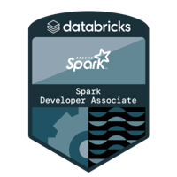
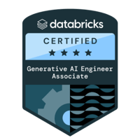
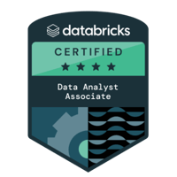
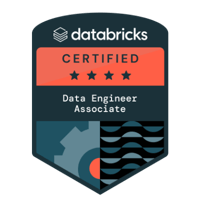
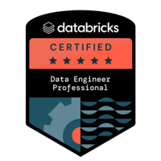
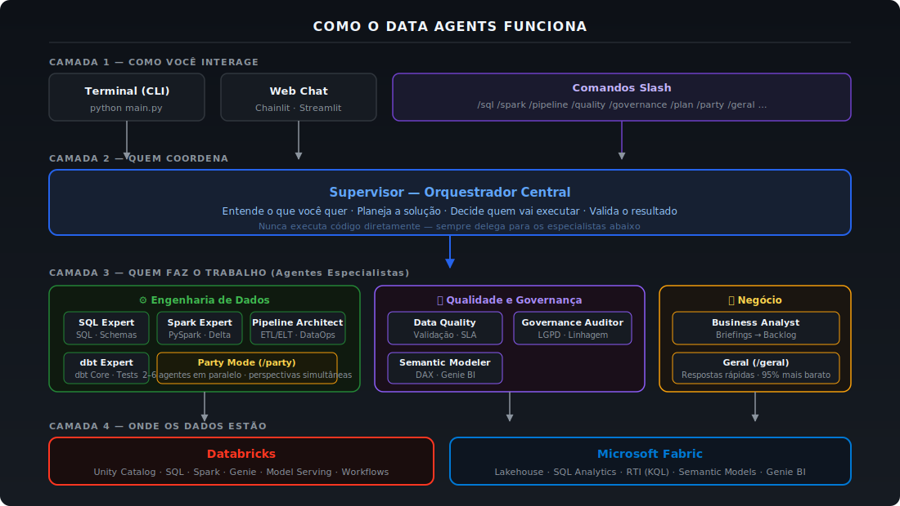

# Manual e Relatório Técnico: Projeto Data Agents v1.0

---

Repositório: [github.com/ThomazRossito/data-agents](https://github.com/ThomazRossito/data-agents)

---

## Autor

> ## **Thomaz Antonio Rossito Neto**
>
> Specialist Data & AI Solutions Architect | Center of Excellence CoE @CI&T

## Contatos

> **LinkedIn:** [thomaz-antonio-rossito-neto](https://www.linkedin.com/in/thomaz-antonio-rossito-neto/)

> **GitHub:** [ThomazRossito](https://github.com/ThomazRossito/)

### Certificações Databricks

    

### Certificações Microsoft

<a href="https://www.credly.com/badges/052e5133-0c67-4ab7-bb3a-c99efa7b4406/public_url" target="_blank"></a> <a href="https://learn.microsoft.com/pt-br/users/thomazantoniorossitoneto/credentials/certification/fabric-data-engineer-associate" target="_blank"></a>

---

## Sumário

- [Prefácio](#prefacio)
- [1. O que é este projeto?](#1-o-que-e-este-projeto)
- [2. Conceitos Fundamentais (Glossário)](#2-conceitos-fundamentais-glossario)
- [3. Arquitetura Geral do Sistema](#3-arquitetura-geral-do-sistema)
- [4. Os Agentes: A Equipe Virtual](#4-os-agentes-a-equipe-virtual)
- [5. O Método DOMA, KB-First e Constituição](#5-o-metodo-doma-kb-first-e-constituicao)
- [6. Party Mode — Múltiplos Agentes em Paralelo](#6-party-mode--multiplos-agentes-em-paralelo)
- [7. Estrutura de Arquivos e Pastas](#7-estrutura-de-arquivos-e-pastas)
- [8. Análise Detalhada de Cada Componente](#8-analise-detalhada-de-cada-componente)
- [9. Segurança e Controle de Custos (Hooks)](#9-seguranca-e-controle-de-custos-hooks)
- [10. O Hub de Conhecimento (KBs, Skills e Constituição)](#10-o-hub-de-conhecimento-kbs-skills-e-constituicao)
- [11. Workflows Colaborativos e Spec-First](#11-workflows-colaborativos-e-spec-first)
- [12. Conexões com a Nuvem (MCP Servers)](#12-conexoes-com-a-nuvem-mcp-servers)
- [13. Sistema de Memória Persistente](#13-sistema-de-memoria-persistente)
- [14. Ciclo de Vida da Sessão e Config Snapshot](#14-ciclo-de-vida-da-sessao-e-config-snapshot)
- [15. O Comando /geral — Bypass Inteligente](#15-o-comando-geral--bypass-inteligente)
- [16. Comandos Disponíveis (Slash Commands)](#16-comandos-disponiveis-slash-commands)
- [17. Configuração e Credenciais](#17-configuracao-e-credenciais)
- [18. Checkpoint de Sessão (Recuperação Automática)](#18-checkpoint-de-sessao-recuperacao-automatica)
- [19. Deploy com MLflow (Model Serving)](#19-deploy-com-mlflow-model-serving)
- [20. Qualidade de Código e Testes](#20-qualidade-de-codigo-e-testes)
- [21. Deploy e CI/CD (Publicação Automática)](#21-deploy-e-cicd-publicacao-automatica)
- [22. Interfaces do Usuário (Terminal e Web UI)](#22-interfaces-do-usuario-terminal-e-web-ui)
- [23. Dashboard de Monitoramento](#23-dashboard-de-monitoramento)
- [24. Por Que Esta Arquitetura? (Decisões de Design)](#24-por-que-esta-arquitetura-decisoes-de-design)
- [25. Como Começar a Usar](#25-como-comecar-a-usar)
- [26. Histórico de Melhorias](#26-historico-de-melhorias)
- [27. Métricas do Projeto](#27-metricas-do-projeto)
- [28. Conclusão](#28-conclusao)

---

## Prefácio

Este documento não é apenas um manual técnico. É o registro completo de uma jornada de engenharia — da ideia inicial de "e se eu pudesse ter uma equipe de IA especializada no meu ambiente de dados?" até um sistema de produção com onze agentes autônomos, nove camadas de segurança, memória persistente entre sessões e integração direta com Databricks e Microsoft Fabric.

O projeto Data Agents nasceu de uma frustração real: ferramentas de IA generativas são excelentes para responder perguntas, mas sua utilidade cai drasticamente quando precisamos que elas ajam — que executem um pipeline, criem uma tabela Delta, auditorizem um lakehouse, ou gerem um modelo semântico DAX. A distância entre "escrever o código" e "executar o código no lugar certo" era o problema a resolver.

A solução foi construir um sistema que não apenas conversa, mas age: uma plataforma de múltiplos agentes especializados, cada um com o conjunto certo de ferramentas, o conhecimento correto (via Knowledge Bases e Skills), e um conjunto de restrições invioláveis (a Constituição) que garante que o comportamento seja sempre seguro, auditável e alinhado com as melhores práticas de engenharia de dados.

Esta é a versão 1.0 — a primeira release pública do projeto. Ela consolida um ecossistema com 11 agentes especialistas, 13 MCP servers, Party Mode para consultas paralelas, sistema de refresh automático de Skills, 7 tipos de memória com decay configurável, e o protocolo DOMA completo para orquestração disciplinada de tarefas complexas.

Este manual foi escrito pensando em quatro perfis de leitores simultaneamente:

- **O iniciante** que nunca ouviu falar em agentes de IA e quer entender o que é isso e por que importa.
- **O técnico** que quer entender cada arquivo, cada classe, cada decisão de implementação.
- **O executivo** que quer saber o valor de negócio, o que o sistema faz de concreto e quanto custa operar.
- **O arquiteto** que quer entender por que as decisões foram tomadas, quais alternativas foram consideradas e como o sistema pode ser estendido.

Cada seção foi escrita para que todos os quatro perfis encontrem o que precisam. Textos introdutórios com analogias do mundo real preparam o terreno para os detalhes técnicos que vêm logo em seguida. Decisões de design são explicadas com o contexto de por que aquela foi a melhor opção, não apenas o que foi escolhido.

Se você está lendo este documento pela primeira vez, recomendo começar do início e seguir o fluxo natural. Se você é um colaborador ou está depurando um componente específico, o sumário detalhado permite ir diretamente ao que precisa.

Bom aprendizado.

---

## 1. O que é este projeto?

### 1.1 A Ideia Central

Imagine que você tem uma equipe completa de especialistas de dados disponíveis 24 horas por dia, 7 dias por semana. Há um DBA que escreve e otimiza qualquer consulta SQL. Há um engenheiro de Big Data que produz pipelines PySpark robustos. Há um arquiteto cloud que cria e gerencia jobs no Databricks. Há um auditor que verifica conformidade com LGPD. Há um especialista de BI que constrói modelos semânticos DAX para Power BI. Há um gerente que coordena tudo isso, garante que o trabalho siga os padrões da empresa, e valida cada entrega antes de liberar.

Agora imagine que toda essa equipe tem acesso direto ao seu ambiente de dados na nuvem — pode criar tabelas, executar queries, lançar pipelines, configurar alertas em tempo real — sem que você precise sair do seu terminal ou do seu navegador.

Isso é o **Data Agents**.

O projeto é um sistema avançado de múltiplos agentes de Inteligência Artificial projetado para atuar como uma equipe completa e autônoma nas áreas de Engenharia de Dados, Qualidade de Dados, Governança e Análise Corporativa. Ele se conecta diretamente ao Databricks e ao Microsoft Fabric, executa tarefas reais no seu ambiente, e faz isso de acordo com as regras de arquitetura e segurança definidas pela sua organização.

### 1.2 O Diferencial: Governança Antes da Ação

A maioria das ferramentas de IA funciona assim: você pede algo, a IA tenta fazer. Se der errado, você corrige. Isso funciona para tarefas simples. Mas em ambientes corporativos de dados, um erro pode significar um pipeline quebrado, dados corrompidos, ou uma violação de LGPD.

O Data Agents foi projetado com uma filosofia diferente: **a IA nunca adivinha, ela lê o manual antes de agir**.

Antes de escrever uma única linha de código ou executar uma única query, o sistema é forçado a:

1. Ler a **Constituição** — um documento com aproximadamente 50 regras invioláveis que definem o que é permitido e o que é proibido.
2. Ler as **Knowledge Bases** relevantes — documentos com os padrões arquiteturais da sua empresa (Medallion, Star Schema, regras de qualidade).
3. Ler as **Skills** técnicas — manuais operacionais que ensinam como usar corretamente cada tecnologia.
4. Validar a clareza do pedido via **Clarity Checkpoint** antes de começar a planejar.

Somente após esse processo de contextualização o sistema começa a trabalhar. O resultado é código não apenas funcional, mas seguro, auditável e alinhado com a arquitetura corporativa.

### 1.3 O que o Sistema Faz de Concreto

Para tornar o conceito tangível, aqui estão exemplos reais de tarefas que o Data Agents pode executar do início ao fim:

**Engenharia de Dados:**
- Criar um pipeline Bronze → Silver → Gold no Databricks com Delta Live Tables, incluindo testes de qualidade em cada camada, a partir de uma descrição em linguagem natural.
- Escrever e otimizar queries SQL complexas no Unity Catalog, com análise de plano de execução e sugestões de indexação.
- Migrar um pipeline de Databricks para Microsoft Fabric, mapeando os dialetos SQL e adaptando a lógica de orquestração.

**Qualidade e Governança:**
- Executar um data profiling completo em uma tabela Silver, identificando anomalias, valores nulos acima do threshold e distribuições suspeitas.
- Varrer um lakehouse inteiro procurando colunas com dados PII (CPFs, e-mails, telefones) e gerar um relatório de exposição de risco.
- Configurar alertas em tempo real no Fabric Activator para monitorar métricas críticas de qualidade.

**Análise e BI:**
- Criar um Genie Space no Databricks para uma tabela Gold específica, configurado para responder perguntas de negócio em linguagem natural.
- Construir um modelo semântico DAX no Microsoft Fabric Direct Lake, com hierarquias, medidas calculadas e otimizações de performance.
- Publicar um AI/BI Dashboard no Databricks com visualizações automaticamente configuradas.

**Planejamento e Documentação:**
- Receber um transcript de reunião e transformar automaticamente em um backlog P0/P1/P2 estruturado, com cada item mapeado ao agente responsável.
- Gerar um PRD (Product Requirements Document) completo para um novo pipeline antes de começar o desenvolvimento.

### 1.4 O Valor de Negócio

Para gestores e executivos, o Data Agents representa uma mudança fundamental na relação entre equipes de dados e suas ferramentas. O tempo que engenheiros gastam em tarefas repetitivas — escrever DDLs de tabelas Delta, configurar jobs básicos, fazer data profiling inicial, documentar pipelines — pode ser delegado ao sistema. Isso libera a equipe para o que realmente agrega valor: decisões de arquitetura, análise de negócio, resolução de problemas complexos.

A camada de governança embutida (Constituição + Hooks de segurança) significa que a autonomia dos agentes nunca compromete a segurança. O sistema nunca executa um `DROP TABLE` sem permissão explícita, nunca faz um `SELECT *` sem `WHERE` que poderia varrer terabytes de dados desnecessariamente, e nunca escreve credenciais em código. Essa proteção é automática — não depende de revisão humana em cada passo.

O modelo de custo é controlado: cada sessão tem um limite de budget em dólares (padrão: $5.00) e um limite de turns (padrão: 50). Quando o limite é atingido, o sistema salva um checkpoint e para graciosamente. O custo de cada operação é rastreado e visível em tempo real no Dashboard de Monitoramento.

### 1.5 O que está incluído na v1.0

Esta é a primeira release pública do Data Agents. O ecossistema entrega, de forma integrada:

**11 Agentes Especialistas** com tiers diferenciados (Opus para planejamento e intake, Sonnet para execução técnica), triggers precisos de roteamento e `output_budget` declarativo no frontmatter para controle de verbosidade.

**Protocolo DOMA** (Data Orchestration Method for Agents) com 7 passos — KB-First, Clarity Checkpoint, Spec-First, Planejamento, Aprovação, Delegação e Validação Constitucional. Três modos de velocidade: Full (`/plan`), Express (comandos diretos) e Internal (diagnóstico do sistema).

**Party Mode (`/party`)** — múltiplos agentes especialistas respondem em paralelo via `asyncio.gather`. Quatro grupos temáticos pré-definidos (default, quality, arch, full) e suporte a seleção explícita de agentes.

**Knowledge Bases modulares** em 8 domínios, com separação `concepts/` (teoria) e `patterns/` (implementação com código). Biblioteca centralizada de anti-padrões com 29 entradas catalogadas por severidade.

**13 MCP Servers** — incluindo servidores customizados para Fabric SQL Analytics, Fabric RTI, Genie Conversations, Fabric Semantic Models e Migration Source (SQL Server/PostgreSQL), que resolvem limitações dos servidores oficiais.

**Memória persistente em dois layers** — episódica com 7 tipos e decay configurável, e knowledge graph via `memory_mcp` para entidades e relações permanentes.

**Workflow Context Cache** (Regra W8) — antes do primeiro agente de qualquer workflow WF-01 a WF-04, o Supervisor compila um arquivo de contexto unificado, eliminando releituras redundantes de spec e KBs.

**9 Hooks de segurança e controle** — 33 padrões destrutivos cobertos, auditoria JSONL completa, compressão de outputs, rastreamento de custo e ciclo de vida de sessão.

---

## 2. Conceitos Fundamentais (Glossário)

Para garantir que este manual seja compreensível mesmo para quem não é especialista em Inteligência Artificial ou Engenharia de Dados, esta seção apresenta os termos essenciais. Cada definição é acompanhada de uma analogia do mundo real para facilitar o entendimento.

### 2.1 Conceitos de Inteligência Artificial

**Agente de IA**

Um agente de IA é um programa inteligente que não apenas conversa, mas toma decisões, planeja passos, usa ferramentas e executa tarefas de forma autônoma. A diferença entre um chatbot comum e um agente é que o chatbot responde perguntas — o agente age no mundo.

*Analogia:* Um chatbot é como um assistente que responde e-mails. Um agente de IA é como um assistente que, além de responder e-mails, também agenda reuniões, reserva salas, atualiza documentos no Google Drive e envia notificações — tudo autonomamente, seguindo as instruções que você definiu.

**LLM (Large Language Model)**

O cérebro por trás de cada agente. É o modelo de linguagem que entende e gera texto, raciocina sobre problemas e decide qual ação tomar. Neste projeto, utilizamos a família de modelos Claude (da Anthropic), conhecida por excelência em raciocínio lógico, programação e seguimento preciso de instruções complexas.

Os modelos Claude usados neste projeto são o `claude-opus-4-6` (o mais avançado, para tarefas de planejamento e raciocínio complexo) e o `claude-sonnet-4-6` (balanço ideal entre capacidade e custo, para tarefas de engenharia).

**MCP (Model Context Protocol)**

Protocolo de código aberto criado pela Anthropic que permite que agentes de IA se conectem de forma segura a sistemas externos — bancos de dados, APIs, plataformas de nuvem — para realizar ações reais. Funciona como uma tomada universal: qualquer sistema que implemente o protocolo MCP pode ser "plugado" a qualquer agente que suporte MCP.

*Analogia:* O MCP é como o padrão USB. Você não precisa saber como o pendrive funciona por dentro — basta que o fabricante implemente o padrão USB e ele vai funcionar no seu computador. Da mesma forma, o Databricks e o Microsoft Fabric implementaram servidores MCP que os agentes podem usar sem precisar de integração customizada.

**Thinking Avançado**

Capacidade do modelo Claude de "pensar em voz alta" antes de responder — executar uma cadeia de raciocínio interna mais profunda antes de chegar à conclusão. É habilitado apenas no modo DOMA Full (comando `/plan` e `/brief`) porque aumenta o custo e o tempo de resposta, mas produz planos de arquitetura significativamente melhores para tarefas complexas.

### 2.2 Conceitos de Engenharia de Dados

**Databricks**

Plataforma de dados em nuvem especializada em processar volumes massivos de informações usando Apache Spark. É o ambiente principal de engenharia de dados do projeto, com suporte a Unity Catalog (governança centralizada de dados), Delta Live Tables (pipelines declarativos), Genie (análise em linguagem natural), Model Serving (deploy de modelos ML) e muito mais.

**Microsoft Fabric**

Plataforma de dados unificada da Microsoft que junta em um único ambiente: armazenamento (OneLake), engenharia de dados (Data Factory, Synapse), análise em tempo real (Real-Time Intelligence com Eventhouse e KQL), e visualização (Power BI Direct Lake). O Data Agents se integra a todas essas camadas via MCP.

**Apache Spark / PySpark**

Tecnologia para processamento de Big Data que distribui o trabalho entre dezenas ou centenas de computadores em paralelo. PySpark é a interface Python para Spark. É a linguagem principal dos pipelines ETL/ELT construídos pelo Spark Expert.

**Arquitetura Medallion**

Padrão da indústria para organizar dados em três camadas progressivas de qualidade:
- **Bronze:** Dados brutos, exatamente como chegaram da fonte. Imutáveis. Podem conter erros.
- **Silver:** Dados limpos e validados. Erros corrigidos, formatos padronizados, deduplicados.
- **Gold:** Dados prontos para consumo — modelados em Star Schema ou agregados para dashboards e análises.

*Analogia:* Bronze é o minério de ferro bruto. Silver é o aço refinado. Gold é a peça mecânica pronta para uso.

**Delta Lake**

Formato de armazenamento que adiciona funcionalidades de banco de dados ao armazenamento em nuvem. Com Delta Lake, você tem transações ACID (garantia de consistência mesmo se algo falhar no meio), viagem no tempo (consegue ver dados como eram ontem), e streaming + batch unificado. É o formato padrão de todas as tabelas gerenciadas por este projeto.

**Star Schema**

Modelo de dados para analytics que organiza informações em uma tabela de fatos central (com as métricas — vendas, receita, quantidade) rodeada de tabelas de dimensão (quem comprou, onde, quando, qual produto). Otimizado para queries analíticas rápidas e modelos de BI.

**Knowledge Base (KB)**

Arquivos Markdown que contêm as regras de negócio e padrões arquiteturais da empresa. A IA lê esses documentos antes de começar a trabalhar para saber o que deve ser feito e como. O projeto possui 9 domínios de KB: sql-patterns, spark-patterns, pipeline-design, data-quality, governance, semantic-modeling, databricks, fabric e migration.

**Skills**

Manuais operacionais detalhados que ensinam como usar uma tecnologia específica. Enquanto a KB diz "toda tabela Gold deve ter particionamento por data", a Skill ensina como criar esse particionamento em Delta Lake com a sintaxe correta do PySpark. O projeto possui 27 Skills para Databricks e 10 para Fabric.

**Constituição**

Documento de autoridade máxima do sistema (kb/constitution.md). Contém aproximadamente 50 regras invioláveis divididas em 8 seções que cobrem princípios fundamentais, regras do Supervisor, Clarity Checkpoint, arquitetura, plataformas, segurança, qualidade e modelagem semântica. Se houver conflito entre uma instrução do usuário e a Constituição, a Constituição prevalece sempre.

**Clarity Checkpoint**

Etapa de validação que ocorre antes de qualquer planejamento. O Supervisor avalia a clareza do pedido em 5 dimensões — objetivo, escopo, plataforma, criticidade e dependências — e pontua de 0 a 5. Se a pontuação for menor que 3, o Supervisor pede esclarecimentos em vez de continuar com um plano baseado em suposições incorretas.

**Workflow Colaborativo**

Cadeia automática de agentes que trabalham em sequência, onde a saída de um é a entrada do próximo. Por exemplo: o SQL Expert escreve o schema → o Spark Expert cria o pipeline → o Data Quality Steward adiciona validações → o Governance Auditor verifica conformidade. Cada etapa recebe o contexto completo da anterior via formato de handoff padronizado.

**PRD (Product Requirements Document)**

Documento de arquitetura criado pelo Supervisor antes de começar a delegar. Detalha exatamente o que será construído, quais agentes serão acionados, em qual ordem, e o que cada um deve produzir. Equivale ao briefing técnico de um projeto de software — o plano antes da execução.

**Checkpoint de Sessão**

Mecanismo de resiliência que salva o estado atual da sessão (último prompt, custo acumulado, arquivos gerados) sempre que há uma interrupção — budget estourado, idle timeout ou reset manual. Permite retomar exatamente de onde parou na próxima sessão.

**DOMA (Data Orchestration Method for Agents)**

Método estruturado de orquestração desenvolvido para este projeto que define os 7 passos do Supervisor: KB-First (ler Knowledge Bases) → Clarity Checkpoint → Spec-First (selecionar template) → Planejamento (PRD) → Aprovação → Delegação → Síntese e Validação. É o protocolo que garante que toda tarefa complexa siga um processo disciplinado antes da execução. O método inclui três modos de velocidade: **DOMA Full** (planejamento completo com thinking, para `/plan`), **DOMA Express** (delegação direta, para comandos como `/sql`, `/spark`) e **DOMA Internal** (comandos do sistema como `/health`, `/status`).

**MLflow**

Plataforma open-source para gerenciamento do ciclo de vida de modelos de Machine Learning. Usado neste projeto para fazer deploy do Data Agents como endpoint de Model Serving no Databricks, tornando-o consumível como uma API REST por outras aplicações.

**Memória Persistente**

Sistema que permite ao agente lembrar informações relevantes entre sessões diferentes. Implementado em `memory/` com quatro tipos: Episódica (eventos específicos), Semântica (padrões aprendidos), Procedimental (preferências de execução) e Arquitetural (decisões de design do ambiente). Cada memória é armazenada como arquivo Markdown com frontmatter YAML e tem nível de confiança (0.0 a 1.0).

| **Termo**                       | **O que significa**                                                    | **Analogia rápida**                                           |
| --------------------------------| ---------------------------------------------------------------------- | ------------------------------------------------------------- |
| Agente de IA                    | Programa que age, não apenas responde                                  | Assistente que executa tarefas, não só conversa               |
| LLM                             | O cérebro — o modelo de linguagem (Claude)                             | O motor de um carro                                           |
| MCP                             | Protocolo de conexão com sistemas externos                             | Padrão USB para sistemas                                      |
| Databricks                      | Plataforma cloud de Big Data com Apache Spark                          | A fábrica de processamento de dados                           |
| Microsoft Fabric                | Plataforma unificada Microsoft (dados + BI + streaming)                | O shopping center da Microsoft para dados                     |
| Arquitetura Medallion           | Bronze (bruto) → Silver (limpo) → Gold (pronto)                        | Minério → Aço → Peça pronta                                   |
| Delta Lake                      | Formato de dados com ACID, time travel e streaming                     | Banco de dados + arquivo cloud ao mesmo tempo                 |
| Constituição                    | Regras invioláveis do sistema                                          | A constituição de um país — prevalece sobre tudo              |
| Knowledge Base (KB)             | Regras de negócio e arquitetura da empresa                             | O manual de políticas da empresa                              |
| Skill                           | Manual técnico operacional                                             | O manual do aparelho                                          |
| Clarity Checkpoint              | Validação de clareza antes do planejamento                             | O checklist pré-voo de um piloto                              |
| Workflow Colaborativo           | Cadeia sequencial de agentes                                           | Linha de montagem especializada                               |
| PRD                             | Documento de arquitetura pré-execução                                  | O briefing técnico antes do projeto                           |
| Checkpoint de Sessão            | Save state automático para recuperação                                 | O save point de um jogo                                       |
| DOMA                            | Protocolo de orquestração em 7 passos                                  | A metodologia ágil do sistema                                 |
| Memória Persistente             | Aprendizado que sobrevive entre sessões                                | A memória de longo prazo do sistema                           |

---

## 3. Arquitetura Geral do Sistema

<p align="center">
  
</p>

### 3.1 A Visão Geral: Uma Empresa em Miniatura

A melhor forma de entender a arquitetura do Data Agents é pensar nela como uma empresa em miniatura especializada em engenharia de dados. Toda empresa bem estruturada tem uma hierarquia clara, uma divisão de responsabilidades, um conjunto de normas invioláveis, ferramentas de trabalho especializadas, e mecanismos de controle e auditoria.

O Data Agents tem exatamente isso. A **Constituição** é o estatuto da empresa. O **Supervisor** é o gerente geral. Os **agentes especialistas** são os técnicos de cada área. Os **MCP Servers** são as ferramentas conectadas ao ambiente de produção. Os **Hooks** são a auditoria interna. As **Knowledge Bases** e **Skills** são os manuais de procedimentos. O **Sistema de Memória** é a memória institucional — o conhecimento acumulado que a empresa não perde quando o funcionário vai embora.

Nesta empresa, quando um cliente (você) chega com um pedido, o gerente não simplesmente terceiriza sem verificar. Ele primeiro vê se o pedido está claro o suficiente, cria um plano formal, pede aprovação, e só então aciona os especialistas certos. E ao final, valida se o que foi entregue está de acordo com os padrões da empresa. Esse é o protocolo DOMA.

### 3.2 O Fluxo de Trabalho Detalhado

Vamos acompanhar o percurso de um pedido típico — por exemplo, `/plan Crie um pipeline de ingestão de dados de vendas no Databricks, Bronze a Gold, com validações de qualidade` — para entender como cada parte do sistema é ativada:

**Passo 1: A Entrada (main.py ou Web UI)**

O pedido chega ao sistema pela interface escolhida pelo usuário: o terminal via `python main.py`, a Web UI Streamlit na porta 8502, ou uma chamada API via endpoint MLflow. O arquivo `main.py` (ou a UI) identifica o slash command (`/plan`) e encaminha para o `commands/parser.py`.

**Passo 2: O Roteamento (commands/parser.py)**

O parser identifica que `/plan` corresponde ao modo DOMA Full com o Supervisor. Ele monta o contexto da sessão (incluindo memórias relevantes recuperadas do sistema de memória persistente) e inicializa o agente Supervisor via `agents/supervisor.py`.

**Passo 3: O Gerente Entra em Ação (supervisor.py + supervisor_prompt.py)**

O Supervisor é instanciado com seu system prompt completo (223 linhas), que inclui: identidade, equipe disponível, protocolo DOMA detalhado, regras invioláveis (S1-S7), tabela de roteamento de KB, suporte a workflows colaborativos (WF-01 a WF-04), validação Star Schema e formato de resposta.

Com o **thinking avançado** habilitado em modo Full, o Supervisor começa seu processo interno:

- **Passo 0 (KB-First):** Lê as Knowledge Bases relevantes ao tipo de tarefa. Para um pipeline de ingestão, ele lê `kb/pipeline-design/`, `kb/databricks/` e `kb/data-quality/`.
- **Passo 0.5 (Clarity Checkpoint):** Avalia as 5 dimensões de clareza. Objetivo: claro. Escopo: definido (vendas, Databricks, Bronze-Gold). Plataforma: Databricks. Criticidade: não especificada — pede esclarecimento.
- **Passo 0.9 (Spec-First):** Seleciona o template `templates/pipeline-spec.md` para esta tarefa.
- **Passo 1 (Planejamento):** Cria o PRD em `output/prd/prd_pipeline_vendas.md`, descrevendo cada camada, os agentes a acionar e a ordem de execução.
- **Passo 2 (Aprovação):** Apresenta o resumo ao usuário e aguarda confirmação.
- **Passo 3 (Delegação):** Aciona os agentes em sequência — Spark Expert para o pipeline PySpark, Data Quality Steward para as validações, Governance Auditor para compliance.
- **Passo 4 (Síntese):** Valida os artefatos gerados contra a Constituição.

**Passo 4: Os Especialistas Trabalham**

Cada agente especialista recebe a tarefa com contexto completo. O Spark Expert lê a Skill `skills/databricks/spark-development.md` antes de escrever o código PySpark. O Data Quality Steward lê `skills/databricks/data-quality.md`. Cada agente usa seus MCP servers para interagir com o Databricks — criar notebooks, executar queries, configurar pipelines.

**Passo 5: Os Guardiões Observam (Hooks)**

Silenciosamente, durante todo o processo, os 9 Hooks de segurança estão ativos. O `security_hook.py` bloqueia qualquer comando Bash destrutivo. O `check_sql_cost` bloqueia `SELECT *` sem `WHERE`. O `audit_hook.py` registra cada tool call em `logs/audit.jsonl`. O `cost_guard_hook.py` monitora o custo em tempo real. O `output_compressor_hook.py` trunca outputs gigantes antes de chegarem ao modelo. O `memory_hook.py` captura insights importantes para persistir na memória.

**Passo 6: Memória e Aprendizado**

Ao final da sessão, o `memory_hook.py` e o `session_lifecycle_hook.py` trabalham juntos para persistir o conhecimento adquirido: as tabelas criadas, as preferências demonstradas, as decisões de arquitetura tomadas. Na próxima sessão, esse contexto será automaticamente injetado — o sistema lembrará do que foi feito.

### 3.3 Os Quatro Modos de Operação

O sistema oferece quatro modos de velocidade para diferentes necessidades, equilibrando profundidade de raciocínio com custo e tempo de resposta:

**DOMA Full (/plan, /brief)**

O modo mais completo. Ativa o thinking avançado do modelo, executa todos os 7 passos do protocolo DOMA, gera PRD e SPEC, aguarda aprovação antes de delegar. Ideal para pipelines novos, refatorações de arquitetura ou qualquer tarefa que envolva 3 ou mais agentes. Mais lento e mais caro, mas produz os resultados mais seguros e bem documentados.

**DOMA Express (/sql, /spark, /pipeline, /fabric, /quality, /governance, /semantic)**

Modo de velocidade. Pula o planejamento e vai direto ao especialista correto. Sem thinking avançado. Sem PRD. Sem aprovação. Ideal para tarefas pontuais e bem definidas — "escreva esta query", "crie este job", "faça profiling desta tabela". Muito mais rápido e econômico que o modo Full.

**Bypass Direto (/geral)**

O modo mais novo, introduzido na v5.0. Bypassa completamente o Supervisor e os agentes especialistas e vai direto ao modelo base. Sem acesso a MCP, sem Knowledge Bases, sem Constituição. Ideal para conversas rápidas, revisões de código, perguntas conceituais, brainstorming — qualquer coisa que não precise de execução real na nuvem. Extremamente rápido e barato.

**Internal (/health, /status, /review)**

Comandos de diagnóstico e controle do próprio sistema. Não delegam para agentes. Verificam conectividade MCP, listam artefatos gerados, permitem revisar PRDs e SPECs anteriores.

### 3.4 Componentes Principais — Visão de Alto Nível

| **Componente**       | **Arquivo(s)**                     | **Responsabilidade**                                       |
| -------------------- | ---------------------------------- | ---------------------------------------------------------- |
| Entrada Principal    | main.py                            | Banner, loop interativo, sessão, idle timeout, checkpoint  |
| Supervisor           | agents/supervisor.py + prompts/    | Orquestração, PRD, delegação, Clarity Checkpoint           |
| Motor de Agentes     | agents/loader.py                   | Carrega agentes de Markdown, KB injection, model routing   |
| Comandos             | commands/parser.py                 | Roteamento de slash commands para modos DOMA               |
| Configuração         | config/settings.py                 | Pydantic BaseSettings com validação de credenciais         |
| Hooks (9 total)      | hooks/                             | Auditoria, segurança, custo, compressão, workflows, mem    |
| MCP Servers (6)      | mcp_servers/                       | Conexões com Databricks, Fabric e Fabric RTI               |
| Knowledge Base       | kb/                                | Constituição, regras de negócio, padrões arquiteturais     |
| Skills (32 total)    | skills/                            | Manuais operacionais Databricks + Fabric                   |
| Memória Persistente  | memory/                            | store.py, types.py, pruner.py, retriever.py                |
| Monitoramento        | monitoring/app.py                  | Dashboard Streamlit com 9 páginas (porta 8501)             |
| Testes               | tests/                             | 11 módulos de teste, cobertura 80%                         |
| MLflow               | agents/mlflow_wrapper.py           | Deploy como Databricks Model Serving                       |

---

## 4. Os Agentes: A Equipe Virtual

O projeto conta com **11 agentes especialistas** divididos em três níveis de atuação (Tiers), mais o Supervisor. Todos os agentes — com exceção do Supervisor — são definidos em arquivos Markdown na pasta `agents/registry/`. Isso é uma decisão de design deliberada: para criar um novo agente, você não precisa escrever Python. Basta criar um arquivo `.md` com o frontmatter YAML correto e o prompt em Markdown.

Essa abordagem declarativa tem três vantagens cruciais. Primeiro, a barreira de entrada é baixa — qualquer pessoa que entenda o negócio pode contribuir com um novo agente sem conhecimento de programação. Segundo, o código Python do `loader.py` permanece inalterado quando novos agentes são adicionados. Terceiro, o frontmatter YAML serve como configuração versionada — você pode ver exatamente quais tools, KBs e MCP servers cada agente tem, em um formato legível por humanos.

### 4.1 O Supervisor (Data Orchestrator)

O Supervisor é o gerente central do sistema. Ele é o único agente que não vive em um arquivo Markdown — sua lógica está em `agents/supervisor.py` e seu system prompt em `agents/prompts/supervisor_prompt.py` porque sua complexidade justifica implementação dedicada.

**Modelo:** `claude-opus-4-6` — o modelo mais avançado da Anthropic, com capacidade superior de raciocínio complexo e planejamento de longo prazo.

**O que o Supervisor faz e o que não faz:**

O Supervisor tem uma regra inviolável definida na Constituição: **ele nunca escreve código**. Se você pediu um pipeline PySpark ao Supervisor, ele vai planejar, detalhar a arquitetura em um PRD, e delegar para o Spark Expert — mas ele próprio nunca vai produzir uma linha de PySpark. Essa separação de responsabilidades é crucial: ela garante que todo código produzido veio de um especialista com o contexto técnico correto, não do gerente tentando fazer trabalho de técnico.

O que o Supervisor faz:
- Executar o Clarity Checkpoint e pedir esclarecimentos quando necessário
- Ler as Knowledge Bases relevantes e carregar o contexto de negócio
- Criar o PRD em `output/prd/` com a arquitetura completa da solução
- Selecionar o template de Spec correto e preenchê-lo
- Decidir se a tarefa requer um Workflow Colaborativo (WF-01 a WF-04) ou delegação simples
- Fazer a Validação Constitucional no Passo 4 para garantir que os artefatos estão conformes
- Injetar as memórias persistentes relevantes ao início de cada sessão

**Recursos exclusivos do Supervisor:**
- Thinking avançado habilitado no modo Full (mais profundidade de raciocínio)
- Acesso ao sistema de memória persistente para leitura e escrita
- Conhecimento de toda a equipe disponível e suas capacidades
- Suporte a workflows colaborativos (WF-01 a WF-04) com handoff automático

### 4.2 Tier 3 — Pré-Planejamento e Intake de Requisitos

O Tier 3 foi projetado para o problema de "garbage in, garbage out". Se o input for um documento não estruturado — uma transcrição de reunião, um e-mail com requisitos fragmentados, notas de brainstorming — passar diretamente para o `/plan` vai produzir um PRD ruim ou forçar o usuário a estruturar o input manualmente. O Tier 3 resolve isso.

#### Business Analyst (/brief)

**Modelo:** `claude-opus-4-6`

**Analogia:** O Analista de Negócios que transforma reuniões caóticas em backlogs acionáveis.

O Business Analyst é especializado em um tipo específico de transformação: recebe texto não estruturado de qualquer formato (transcript de reunião, briefing executivo, e-mail de stakeholder, notas rabiscadas) e produz um backlog estruturado em formato P0/P1/P2, com cada item mapeado ao domínio técnico correto e ao agente responsável pela execução.

**O protocolo interno do Business Analyst é rigoroso em 7 etapas:**

1. Receber o documento (caminho de arquivo ou texto direto)
2. Ler o template `templates/backlog.md` para garantir o formato correto de saída
3. Extrair contexto de negócio, stakeholders identificados, decisões tomadas e restrições declaradas
4. Mapear cada requisito identificado ao domínio técnico correspondente (Databricks? Fabric? SQL? Pipeline? BI?)
5. Identificar o agente responsável pela execução de cada item
6. Priorizar usando critérios estritos: P0 = bloqueadores (máximo 3), P1 = importantes para o sprint, P2 = desejáveis mas não urgentes
7. Salvar o backlog em `output/backlog/backlog_<nome>.md` e apresentar resumo com instruções para o próximo passo via `/plan`

O Business Analyst não tem acesso a MCP servers. Ele trabalha exclusivamente com documentos locais — Read, Write, Grep, Glob. Essa restrição é intencional: o Tier 3 é sobre entender o negócio e estruturar o trabalho, não sobre executar na nuvem.

**Exemplo de uso típico:**

```
Você: /brief inputs/reuniao_sprint_14.txt
Sistema: [Business Analyst lê o transcript]
         [Identifica 12 requisitos brutos]
         [Mapeia: 3 P0 (pipeline crítico), 4 P1 (melhorias importantes), 5 P2]
         [Salva output/backlog/backlog_sprint_14.md]
         "Backlog gerado. Próximos passos: /plan output/backlog/backlog_sprint_14.md"
```

### 4.3 Tier 1 — Engenharia de Dados (O Core)

Os três agentes do Tier 1 são os executores primários de engenharia de dados. Cada um é especializado em uma dimensão diferente do trabalho técnico: dados relacionais (SQL Expert), processamento distribuído (Spark Expert) e orquestração de infraestrutura (Pipeline Architect).

#### SQL Expert (/sql)

**Modelo:** `claude-sonnet-4-6`

**Analogia:** O DBA e Analista de Dados — a pessoa que conhece cada tabela do catálogo de cor, sabe como escrever a query mais eficiente e entende os planos de execução.

O SQL Expert domina SQL em todos os sabores relevantes para o ecossistema de dados moderno: Spark SQL (Databricks e Delta Lake), T-SQL (Microsoft Fabric SQL Analytics Endpoint), KQL (Kusto Query Language para o Eventhouse do Fabric). Ele é capaz de escrever queries complexas, otimizá-las com base no plano de execução, descobrir a estrutura de tabelas que nunca viu antes, e traduzir entre dialetos.

**Capacidades técnicas:**
- Escrita e otimização de Spark SQL, T-SQL e KQL
- Análise de catálogo via Unity Catalog — descoberta de schemas, tabelas, colunas e tipos
- Uso de `execute_sql_multi` para executar múltiplas queries em paralelo e comparar resultados
- Uso de `get_table_stats_and_schema` para combinar schema e estatísticas em uma única chamada, economizando turns
- Acesso ao Genie via `genie_ask` para perguntas em linguagem natural sobre Genie Spaces configurados
- Escrita de arquivos `.sql` em disco para versionamento

**Restrições de segurança:** O SQL Expert tem acesso de leitura e escrita na nuvem. O Hook `check_sql_cost` bloqueia automaticamente qualquer `SELECT *` sem `WHERE` ou `LIMIT` — uma proteção essencial para evitar full table scans acidentais em tabelas de terabytes.

#### Spark Expert (/spark)

**Modelo:** `claude-sonnet-4-6`

**Analogia:** O Engenheiro de Back-End de Big Data — a pessoa que sabe escrever PySpark eficiente, entende particionamento, sabe otimizar shuffles e construir pipelines robustos com Delta Lake.

O Spark Expert é o principal produtor de código do sistema. Ele escreve pipelines PySpark completos, desde a leitura na Bronze até a escrita na Gold, com as transformações corretas em cada camada. Ele conhece os padrões da KB `spark-patterns` — uso correto de `MERGE INTO`, estratégias de particionamento, configuração de DLT (Delta Live Tables), leitura de streams com Auto Loader.

**Capacidades técnicas:**
- Escrita de pipelines PySpark completos (ingestão, transformação, escrita)
- Implementação de Slowly Changing Dimensions (SCD Type 1 e 2) com `MERGE INTO`
- Configuração de Delta Live Tables com quality expectations embutidas
- Implementação de streaming com Auto Loader (`cloudFiles`)
- Acesso ao filesystem local (Read, Write, Edit, Bash, Glob, Grep) — o único agente Tier 1 com acesso total ao sistema de arquivos, necessário para criar notebooks e salvar scripts

**Restrições de segurança:** O security_hook bloqueia comandos Bash destrutivos (`rm -rf`, `DROP TABLE`) mesmo que o agente tente executá-los indiretamente.

#### Pipeline Architect (/pipeline, /fabric)

**Modelo:** `claude-sonnet-4-6`

**Analogia:** O Engenheiro Cloud e DevOps de dados — a pessoa que cria e gerencia a infraestrutura de execução: jobs, pipelines, clusters, warehouses.

O Pipeline Architect é o agente com as permissões mais amplas do sistema, e por isso é o mais fortemente monitorado pelos Hooks. Ele pode criar e gerenciar Jobs no Databricks, montar Pipelines no Data Factory do Fabric, mover arquivos entre plataformas, gerenciar clusters e SQL warehouses, executar código Python/Scala em clusters serverless, e criar Knowledge Assistants (KA) e Mosaic AI Supervisor Agents (MAS).

**Capacidades exclusivas:**
- `execute_code` — executa Python ou Scala em clusters serverless do Databricks
- `manage_cluster` — cria, inicia, para e redimensiona clusters
- `manage_sql_warehouse` — gerencia SQL warehouses (start, stop, resize)
- `wait_for_run` — aguarda conclusão de Jobs e Pipelines com polling inteligente
- `manage_ka` / `manage_mas` — cria e configura Knowledge Assistants e Mosaic AI Supervisor Agents

**Roteamento inteligente do /fabric:** O comando `/fabric` tem lógica de roteamento interno. Se o prompt mencionar "semantic model", "DAX", "Power BI", "Direct Lake" ou "Metric Views", o comando redireciona automaticamente para o Semantic Modeler em vez do Pipeline Architect. Isso garante que tarefas de modelagem semântica sempre cheguem ao especialista correto, mesmo que o usuário use o comando genérico `/fabric`.

**output_budget:** Todos os agentes declaram no frontmatter YAML um campo `output_budget` que expressa o orçamento de linhas de resposta esperado. Exemplos: `"150-400 linhas"` (T1), `"80-250 linhas"` (T2), `"30-100 linhas"` (T3). O agente usa isso como orientação interna para calibrar verbosidade — respostas longas para tarefas técnicas complexas, curtas para perguntas conceituais.

### 4.4 Tier 2 — Qualidade, Governança e Análise

O Tier 2 cobre as camadas que transformam dados tecnicamente corretos em dados confiáveis, governados e analíticos.

#### Data Quality Steward (/quality)

**Modelo:** `claude-sonnet-4-6`

**Analogia:** O Engenheiro de QA especializado em dados — a pessoa que cria os testes automatizados que garantem que os dados estão corretos antes de chegarem ao usuário final.

O Data Quality Steward realiza data profiling (análise estatística de distribuições, nulos, outliers, duplicatas), escreve Data Quality Expectations (regras de validação que são executadas automaticamente a cada carga), configura alertas em tempo real no Fabric Activator para métricas críticas, e define SLAs de qualidade para cada camada da Medallion.

#### Governance Auditor (/governance)

**Modelo:** `claude-sonnet-4-6`

**Analogia:** O Auditor de Compliance e Segurança — a pessoa que verifica se os dados estão sendo tratados corretamente do ponto de vista legal e de governança corporativa.

O Governance Auditor rastreia linhagem de dados (como um dado chegou onde chegou), audita logs de acesso, varre bancos de dados procurando informações sensíveis como CPFs, e-mails e telefones que não devem estar expostos, e garante conformidade com LGPD e GDPR. Ele trabalha com as ferramentas de Unity Catalog do Databricks e com as APIs de governança do Fabric.

#### Semantic Modeler (/semantic)

**Modelo:** `claude-sonnet-4-6`

**Analogia:** O Especialista de BI — a pessoa que transforma tabelas Gold em modelos analíticos que o Power BI consegue usar eficientemente.

O Semantic Modeler é o agente mais "voltado para o negócio" do Tier 2. Ele constrói modelos semânticos DAX para Power BI com hierarquias e medidas calculadas corretas, otimiza tabelas Gold para Direct Lake (eliminando importação de dados), configura Metric Views no Databricks, cria Genie Spaces para análise em linguagem natural, e publica AI/BI Dashboards com visualizações automaticamente configuradas.

**O Semantic Modeler foi o agente mais expandido na v4.0:** Agora tem acesso a `create_or_update_genie` para criar Genie Spaces diretamente, `create_or_update_dashboard` para publicar AI/BI Dashboards, e `query_serving_endpoint` para consultar endpoints de Model Serving e incluir resultados de ML em modelos semânticos.

#### dbt Expert (/dbt)

**Modelo:** `claude-sonnet-4-6`

**Analogia:** O especialista em transformação declarativa — a pessoa que usa dbt (data build tool) para transformar dados brutos em modelos analíticos versionados, testados e documentados.

O dbt Expert cobre o ciclo completo de desenvolvimento dbt: escreve `models/` em SQL ou Python, configura `tests/` (not_null, unique, relationships), cria `snapshots/` para Slowly Changing Dimensions, seeds para dados de referência, gera documentação via `dbt docs generate`, e suporta os adapters `dbt-databricks` e `dbt-fabric`. Acessa as Skills de dbt via `skill_domains: [root]` para garantir uso de padrões atuais.

#### Skill Updater (sem slash command dedicado)

**Modelo:** `claude-sonnet-4-6`

**Analogia:** O responsável pela manutenção do acervo técnico — a pessoa que periodicamente revisa e atualiza os manuais operacionais para refletir as versões mais recentes das ferramentas.

O Skill Updater é o único agente sem exposição direta ao usuário via slash command. Ele é invocado pelo sistema de refresh automático (`make refresh-skills`) ou pelo Supervisor quando uma Skill precisa ser atualizada. Busca documentação atualizada via context7, tavily e firecrawl, lê o arquivo `SKILL.md` atual, atualiza o conteúdo e o frontmatter (`updated_at`), e salva o arquivo. Suporta `--force`, `--dry-run` e execução paralela de até 2 skills simultaneamente.

**Configuração via `.env`:**
- `SKILL_REFRESH_ENABLED=true` — habilita o refresh automático
- `SKILL_REFRESH_INTERVAL_DAYS=3` — pula skills atualizadas há menos de N dias
- `SKILL_REFRESH_DOMAINS=databricks,fabric` — domínios a atualizar

#### Migration Expert (/migrate)

**Modelo:** `claude-sonnet-4-6`

**Analogia:** O Especialista em Migração de Dados — a pessoa que conhece tanto o banco legado de origem quanto as plataformas de destino (Databricks e Fabric), e garante que cada tabela, view, procedure e função chegue ao destino com tipos corretos, arquitetura Medallion e zero perda de semântica de negócio.

O Migration Expert é o único agente do sistema com acesso ao MCP `migration_source` — um servidor MCP customizado que se conecta diretamente ao banco relacional de origem (SQL Server ou PostgreSQL) via pyodbc/psycopg2, usando um registry de fontes configurado em JSON no `.env`. Esse MCP é read-only por design: nunca modifica o banco de origem.

**O ciclo de trabalho em 5 fases:**

1. **ASSESS** — Conecta à fonte via `migration_source_list_sources` e `migration_source_get_schema_summary`. Inventaria schemas, tabelas, views, procedures e functions. Produz um relatório de complexidade por objeto (Simples/Médio/Complexo/Bloqueado).

2. **ANALYZE** — Classifica incompatibilidades de tipo (ex: `MONEY` → `DECIMAL(19,4)`, `NVARCHAR(MAX)` → `STRING`), identifica features proprietárias sem equivalência direta (ex: sequences, triggers, computed columns) e anti-padrões conhecidos documentados em `kb/migration/index.md`.

3. **DESIGN** — Propõe estrutura Medallion no destino (Bronze para ingestão raw, Silver para tipos canônicos, Gold para Star Schema), com estratégia de particionamento, convenções de naming e mapeamento schema-a-schema. Nunca mistura Databricks e Fabric no mesmo plano sem confirmação explícita.

4. **TRANSPILE** — Gera DDL alvo no dialeto correto (Spark SQL para Databricks, T-SQL para Fabric SQL Analytics), produce jobs PySpark para carga Bronze incremental ou full-load, e documenta cada decisão de transpilação com justificativa.

5. **RECONCILE** — Após a carga, valida contagens linha-a-linha, amostras (`migration_source_sample_table`), e integridade referencial. Produz relatório de desvios.

**Regra de isolamento de plataforma:** O Migration Expert nunca usa tools Databricks e Fabric simultaneamente sem confirmar o destino com o usuário. Se o destino não for especificado na primeira mensagem, ele pergunta antes de começar o DESIGN.

**Colaboração:** Para objetos complexos (procedures com lógica de negócio crítica), delega revisão ao `sql-expert`. Para jobs de ingestão PySpark de alta escala, colabora com `spark-expert`. Para reconciliação e validação pós-migração, aciona `data-quality-steward`.

### 4.5 Tabela Comparativa dos 11 Agentes

| **Agente**           | **Tier** | **Modelo**   | **MCP Servers**                | **Acesso Principal**                            |
| -------------------- | -------- | ------------ | ------------------------------ | ----------------------------------------------- |
| Supervisor           | —        | opus-4-6     | Todos (via delegação)          | Leitura KB + memória + orquestração             |
| Business Analyst     | T3       | opus-4-6     | tavily, firecrawl              | Read/Write local + pesquisa web                 |
| SQL Expert           | T1       | sonnet-4-6   | Databricks, Fabric, RTI        | Read-only na nuvem, write em .sql               |
| Spark Expert         | T1       | sonnet-4-6   | context7                       | Read/Write + filesystem local completo          |
| Pipeline Architect   | T1       | sonnet-4-6   | Databricks, Fabric, github     | Execução completa + compute/KA/MAS              |
| Migration Expert     | T1       | sonnet-4-6   | migration_source, Databricks, Fabric | DDL extraction + Medallion design + transpilação |
| Data Quality Steward | T2       | sonnet-4-6   | Databricks, Fabric             | Read/Write completo                             |
| Governance Auditor   | T2       | sonnet-4-6   | Databricks, Fabric, memory_mcp | Read/Write completo + knowledge graph           |
| Semantic Modeler     | T2       | sonnet-4-6   | Databricks, Fabric             | Read-only + Genie + AI/BI Dashboard + Serving   |
| dbt Expert           | T2       | sonnet-4-6   | context7, postgres             | Read/Write local + documentação atualizada      |
| Skill Updater        | T2       | sonnet-4-6   | context7, tavily, firecrawl    | Write em SKILL.md + busca de documentação       |

---

## 5. O Método DOMA, KB-First e Constituição

### 5.1 Por Que um Método?

A primeira versão do projeto era simples: o usuário digitava um pedido, o modelo respondia com código. Funcionava para tarefas triviais. Mas quando as tarefas ficavam complexas — pipelines com múltiplas camadas, integração entre plataformas, decisões que afetavam arquitetura — o comportamento sem estrutura produzia resultados inconsistentes e, às vezes, perigosos.

O método DOMA nasceu da necessidade de impor disciplina sem eliminar flexibilidade. A ideia central é: **toda tarefa complexa de engenharia de dados segue o mesmo processo lógico**, independentemente dos detalhes específicos. Primeiro você entende o problema. Depois você define o que será construído. Depois você pede aprovação. Depois você executa. Depois você valida.

O método DOMA codifica esse processo natural de engenharia em 7 passos executados automaticamente pelo Supervisor toda vez que você usa o comando `/plan`.

### 5.2 A Constituição — A Lei Suprema do Sistema

O arquivo `kb/constitution.md` é o documento mais importante do projeto. Contém aproximadamente 50 regras invioláveis, divididas em 8 seções, que definem o comportamento esperado do sistema em qualquer situação.

A Constituição não é uma lista de sugestões — é um conjunto de regras hard-coded no prompt do Supervisor como limites absolutos. Se o usuário pedir algo que viola a Constituição, o Supervisor recusa e explica por que, da mesma forma que um advogado não assina um documento que viola a lei mesmo que o cliente peça.

**Seção 1 — Princípios Fundamentais (P1-P5):**
O mais importante é o princípio P1: **KB-First é obrigatório**. Nenhum agente pode começar a trabalhar sem antes ler as Knowledge Bases relevantes ao seu domínio. Isso garante que o código gerado sempre respeite as regras de negócio da empresa.

O princípio P2 estabelece o **Spec-First** para tarefas complexas: sempre que uma tarefa envolver 3 ou mais agentes ou 2 ou mais plataformas, um template de Spec deve ser preenchido antes da delegação. Isso garante documentação automática de todas as grandes mudanças.

O princípio P3 estabelece **delegação especializada**: o Supervisor nunca escreve código. Sempre delega para o especialista correto. Isso parece redundante, mas é necessário porque os modelos de linguagem têm tendência a tentar resolver o problema diretamente em vez de seguir o processo definido.

**Seção 2 — Regras do Supervisor (S1-S7):**
- S1: Nunca gerar código diretamente.
- S2: Sempre consultar KB antes de planejar.
- S3: Sempre executar Clarity Checkpoint antes de começar.
- S4: Sempre criar PRD antes de delegar.
- S5: Sempre aguardar aprovação antes de iniciar execução.
- S6: Sempre validar artefatos finais contra a Constituição.
- S7: Injetar memórias relevantes no início de cada sessão.

**Seção 3 — Clarity Checkpoint:**
Define as 5 dimensões de avaliação e os critérios para cada nota. Pontuação mínima de 3/5 para continuar.

**Seções 4 e 5 — Arquitetura e Plataformas:**
Definem o que os agentes devem sempre fazer ao trabalhar com Databricks e Fabric:
- Toda tabela gerenciada usa formato Delta Lake.
- Toda arquitetura de dados segue Medallion (Bronze/Silver/Gold).
- Toda modelagem analítica Gold segue Star Schema (fato + dimensões).
- No Databricks, sempre usar Unity Catalog para governança.
- No Fabric, sempre usar Direct Lake para tabelas Gold em Power BI.

**Seções 6 a 8 — Segurança, Qualidade e Modelagem:**
- Nunca escrever credenciais em código.
- Nunca processar PII sem mascaramento ou encriptação.
- Sempre executar data profiling antes de promover dados para Silver.
- Sempre adicionar expectations de qualidade em pipelines DLT.
- Modelos semânticos DAX devem seguir o padrão de hierarquias definido em SM1-SM6.

**Por que a Constituição é um documento Markdown em vez de código?**

Essa é uma decisão de design deliberada com três benefícios. Primeiro, qualquer membro do time pode ler, entender e propor mudanças na Constituição sem saber Python. Segundo, a Constituição pode ser versionada com Git e o histórico de mudanças é legível por humanos. Terceiro, o próprio modelo de IA pode referenciar e raciocinar sobre a Constituição durante o planejamento — "esta tarefa viola a regra SEC-3 porque..." — o que não seria possível se as regras fossem lógica Python.

### 5.3 A Filosofia KB-First e o Protocolo v2

O princípio KB-First é simples: **nenhum agente age sem primeiro consultar suas Knowledge Bases**. Nesta versão, o protocolo evolui para o **KB-First v2** com Agreement Matrix e pontuação explícita de confiança.

A regra de ouro permanece: a IA nunca adivinha, ela lê o manual. Antes de começar a trabalhar, cada agente é forçado a ler as Knowledge Bases de seus domínios declarados. O campo `kb_domains` no frontmatter YAML de cada agente define quais KBs ele precisa. O `loader.py` carrega automaticamente apenas as KBs relevantes — lazy loading para não sobrecarregar o contexto do modelo.

O propósito é garantir que o código gerado reflete as decisões de arquitetura da sua empresa, não apenas as melhores práticas genéricas do modelo pré-treinado. Se sua empresa definiu na KB que toda tabela Silver deve ter uma coluna `_audit_created_at` do tipo `TIMESTAMP`, o agente vai incluir essa coluna em todo código que gerar, porque lê essa regra na KB antes de começar.

Quando `INJECT_KB_INDEX=true` (padrão), o `loader.py` vai além: injeta automaticamente o conteúdo completo dos arquivos `index.md` de cada KB declarada no prompt do agente. Isso significa que o agente não precisa fazer chamadas adicionais para ler a KB — o resumo dos padrões já está no seu contexto desde o início.

**As 4 etapas do Protocolo KB-First v2:**

1. **Consultar KB** — Ler `kb/{dominio}/index.md` -> identificar arquivos relevantes -> ler os arquivos de concepts/ e/ou patterns/
2. **Consultar MCP** (quando disponível) — verificar estado atual na plataforma
3. **Calcular confiança** via Agreement Matrix:

| KB tem padrão | MCP confirma | Confiança |
|---------------|--------------|-----------|
| Sim | Sim | ALTA — 0.95 |
| Sim | Silencioso | MÉDIA — 0.75 |
| Não | Sim | 0.85 |

Modificadores: +0.20 match exato na KB, +0.15 MCP confirma, -0.15 versão desatualizada, -0.10 informação obsoleta.

Limiares de decisão: CRÍTICO >= 0.95 | IMPORTANTE >= 0.90 | PADRÃO >= 0.85 | ADVISORY >= 0.75

4. **Incluir proveniência** ao final de respostas técnicas:
```
KB: kb/{dominio}/concepts/{arquivo}.md | Confiança: ALTA (0.92) | MCP: confirmado
```

### 5.4 O Clarity Checkpoint em Detalhe

O Clarity Checkpoint é o passo 0.5 do protocolo DOMA — acontece antes do planejamento, depois da leitura das KBs.

O Supervisor avalia a requisição em 5 dimensões e atribui uma nota de 0 a 1 para cada:

| **Dimensão** | **Pergunta de avaliação**                                               | **Exemplo de nota baixa**              |
| ------------ | ----------------------------------------------------------------------- | -------------------------------------- |
| Objetivo     | O resultado esperado está claro e mensurável?                           | "Melhore os dados" (muito vago)        |
| Escopo       | Tabelas, schemas, plataformas e volume estão identificados?             | "Em algum lugar no Databricks"         |
| Plataforma   | É Databricks, Fabric, on-premise ou híbrido?                            | Não mencionado                         |
| Criticidade  | É exploração, desenvolvimento, homologação ou produção?                 | Não mencionado                         |
| Dependências | Upstream (de onde vêm os dados) e downstream (quem consome) definidos? | Sem menção de fontes ou consumidores   |

**Pontuação mínima: 3/5.** Se a soma for 3 ou mais, o Supervisor continua. Se for menor que 3, ele para, explica quais dimensões estão ausentes, e faz perguntas específicas para resolver cada lacuna.

Isso parece uma fricção adicional no fluxo, mas na prática poupa tempo. Executar um plano baseado em suposições erradas — "achei que era a tabela X no schema Y" — é muito mais caro do que fazer uma pergunta de esclarecimento antes de começar.

### 5.5 Os 7 Passos do Protocolo DOMA

| **Passo** | **Nome**             | **O que acontece**                                                      | **Artefato gerado**         |
| --------- | -------------------- | ----------------------------------------------------------------------- | --------------------------- |
| 0         | KB-First             | Lê Knowledge Bases relevantes ao tipo de tarefa solicitada              | —                           |
| 0.5       | Clarity Checkpoint   | Avalia 5 dimensões de clareza (mínimo 3/5 para continuar)              | —                           |
| 0.9       | Spec-First           | Seleciona template de spec (para tarefas com 3+ agentes ou 2+ plat.)  | —                           |
| 1         | Planejamento         | Cria PRD completo com arquitetura, agentes, sequência e critérios      | `output/prd/prd_<nome>.md`  |
| 2         | Aprovação            | Apresenta resumo do PRD e aguarda "sim" do usuário                     | —                           |
| 3         | Delegação            | Aciona agentes em sequência (simples ou via Workflows Colaborativos)   | Artefatos por agente        |
| 4         | Síntese e Validação  | Verifica aderência de todos os artefatos a kb/constitution.md          | —                           |

O protocolo completo é executado apenas no modo DOMA Full (`/plan`). No modo Express (comandos diretos como `/sql`, `/spark`), o agente é acionado diretamente a partir do Passo 3, sem planejamento.


---

## 6. Party Mode — Múltiplos Agentes em Paralelo

### 6.1 O Problema que o Party Mode Resolve

O protocolo DOMA Express é eficiente para tarefas single-domain: você quer um SQL, vai para o SQL Expert; quer um pipeline, vai para o Spark Expert. Mas há uma classe de perguntas que se beneficia de múltiplas perspectivas simultâneas — *"Como devo modelar esta tabela de eventos?"* tem respostas diferentes e complementares para um SQL Expert, um Spark Expert e um Pipeline Architect. Com delegação sequencial, você teria que fazer a pergunta três vezes. Com Party Mode, você faz uma vez.

### 6.2 Como Funciona

O comando `/party` usa `asyncio.gather` para invocar múltiplos agentes especialistas **em paralelo real** — não é um único LLM roleplaying personagens diferentes, são chamadas independentes ao SDK, cada uma com seu próprio system prompt (persona) e sem acesso ao que os outros agentes estão respondendo.

```
/party <query>                         → grupo padrão: sql-expert + spark-expert + pipeline-architect
/party --quality <query>               → data-quality-steward + governance-auditor + semantic-modeler
/party --arch <query>                  → pipeline-architect + spark-expert + sql-expert
/party --full <query>                  → todos os 6 agentes especialistas
/party sql-expert spark-expert <query> → agentes explícitos (qualquer combinação)
```

### 6.3 Grupos Disponíveis

| Grupo | Flag | Agentes | Quando usar |
|-------|------|---------|-------------|
| **default** | *(sem flag)* | sql-expert, spark-expert, pipeline-architect | Design técnico, arquitetura de dados, comparações de tecnologia |
| **quality** | `--quality` | data-quality-steward, governance-auditor, semantic-modeler | Qualidade, compliance, modelagem analítica |
| **arch** | `--arch` | pipeline-architect, spark-expert, sql-expert | Arquitetura de pipelines, decisões de design |
| **full** | `--full` | Todos os 6 acima | Análise completa, revisão de arquitetura end-to-end |

### 6.4 Implementação

**`commands/party.py`** — módulo central com:
- `PARTY_GROUPS` — dicionário de grupos temáticos
- `AGENT_PERSONAS` — system prompts especializados por agente (em português, diretos e técnicos)
- `parse_party_args()` — extrai grupo/agentes explícitos e query limpa do input
- `run_party_query()` — spawna todas as chamadas com `asyncio.gather`, retorna lista de `(agente, resposta, custo)`

Cada agente no Party Mode roda com:
- `allowed_tools=[]` — sem acesso a MCP (resposta conceitual, sem execução real)
- `max_turns=1` — uma única resposta por agente
- `permission_mode="bypassPermissions"` — sem prompts de aprovação

### 6.5 Quando Usar vs. Quando Não Usar

| Use `/party` quando... | Use DOMA Express quando... |
|------------------------|---------------------------|
| Precisa de perspectivas independentes sobre uma decisão de design | Tem uma tarefa específica para executar em uma plataforma |
| Quer comparar abordagens entre domínios | A tarefa requer acesso ao MCP (criar tabelas, executar SQL) |
| Está explorando uma nova tecnologia ou padrão | O agente correto é óbvio e único |
| Quer revisar uma arquitetura sob múltiplos ângulos | Precisa de uma resposta mais profunda com KB injection |

---

## 7. Estrutura de Arquivos e Pastas

O projeto segue uma organização modular e declarativa. Cada pasta tem uma responsabilidade única e bem definida. A estrutura foi projetada para que qualquer pessoa que entenda o domínio (engenharia de dados) consiga navegar e encontrar o que precisa sem precisar ler código Python.

### 6.1 Visão Geral da Estrutura

```
data-agents/
├── agents/
│   ├── registry/              # Agentes definidos em Markdown (11 agentes + template)
│   │   ├── _template.md       # Template para criar novos agentes
│   │   ├── business-analyst.md
│   │   ├── sql-expert.md
│   │   ├── spark-expert.md
│   │   ├── pipeline-architect.md
│   │   ├── data-quality-steward.md
│   │   ├── governance-auditor.md
│   │   └── semantic-modeler.md
│   ├── loader.py              # Motor que transforma .md em agentes vivos
│   ├── supervisor.py          # Factory do ClaudeAgentOptions para o Supervisor
│   ├── prompts/
│   │   └── supervisor_prompt.py  # System prompt completo (223 linhas)
│   └── mlflow_wrapper.py      # Wrapper PyFunc para Databricks Model Serving
│
├── commands/
│   └── parser.py              # Slash commands com roteamento DOMA
│
├── config/
│   ├── settings.py            # Pydantic BaseSettings com validação de credenciais
│   ├── exceptions.py          # Hierarquia de exceções personalizadas
│   ├── logging_config.py      # Logging estruturado JSONL + console Rich
│   └── mcp_servers.py         # Registry central de conexões MCP
│
├── hooks/
│   ├── audit_hook.py          # Log JSONL com categorização de erros (6 categorias)
│   ├── checkpoint.py          # Checkpoint de sessão (save/load/resume)
│   ├── cost_guard_hook.py     # Classificação HIGH/MEDIUM/LOW de custos
│   ├── memory_hook.py         # NOVO v5.0: Captura insights para memória persistente
│   ├── output_compressor_hook.py  # Trunca outputs MCP (economia de tokens)
│   ├── security_hook.py       # Bloqueia comandos destrutivos e SQL custoso
│   ├── session_lifecycle_hook.py  # NOVO v5.0: Gerencia eventos do ciclo de sessão
│   ├── session_logger.py      # Métricas de custo/turnos/duração por sessão
│   └── workflow_tracker.py    # Rastreia delegações, workflows e Clarity Checkpoint
│
├── kb/
│   ├── constitution.md        # Documento de autoridade máxima (~50 regras)
│   ├── collaboration-workflows.md  # Workflows Colaborativos (WF-01 a WF-04)
│   ├── data-quality/          # Expectations, profiling, drift detection, SLAs
│   ├── databricks/            # Unity Catalog, compute, bundles, AI/ML, jobs
│   ├── fabric/                # RTI, Eventhouse, Data Factory, Direct Lake
│   ├── governance/            # Auditoria, linhagem, PII, compliance
│   ├── pipeline-design/       # Medallion, orquestração, cross-platform, Star Schema
│   ├── semantic-modeling/     # DAX, Direct Lake, Metric Views, reporting
│   ├── spark-patterns/        # Delta Lake, SDP/LakeFlow, streaming, performance
│   └── sql-patterns/          # DDL, otimização, conversão de dialetos, Star Schema
│
├── memory/                    # NOVO v5.0: Sistema de Memória Persistente
│   ├── __init__.py
│   ├── types.py               # MemoryType, MemoryEntry, to_frontmatter()
│   ├── store.py               # MemoryStore: save, load, list
│   ├── retriever.py           # MemoryRetriever: busca por relevância
│   └── pruner.py              # MemoryPruner: poda de memórias obsoletas
│
├── memory_storage/            # Arquivos .md de memórias persistidas (gitignored)
│   ├── episodic/
│   ├── semantic/
│   ├── procedural/
│   └── architectural/
│
├── mcp_servers/
│   ├── databricks/            # 65+ tools: UC, SQL, Jobs, LakeFlow, Compute, AI/BI
│   ├── databricks_genie/      # MCP customizado: 9 tools para Genie Conversation API
│   ├── fabric/                # 28 tools Community + servidor oficial
│   ├── fabric_sql/            # MCP customizado: 8 tools SQL Analytics via TDS
│   └── fabric_rti/            # Tools para KQL, Eventstreams, Activator
│
├── monitoring/
│   └── app.py                 # Dashboard Streamlit (9 páginas, porta 8501)
│
├── output/
│   ├── prd/                   # PRDs gerados pelo /plan
│   ├── specs/                 # SPECs geradas após aprovação
│   └── backlog/               # Backlogs P0/P1/P2 do /brief
│
├── skills/
│   ├── databricks/            # 27 módulos operacionais Databricks
│   └── fabric/                # 5 módulos operacionais Fabric
│
├── templates/
│   ├── backlog.md             # Template P0/P1/P2 para Business Analyst
│   ├── cross-platform-spec.md # Template para migrações Fabric <-> Databricks
│   ├── pipeline-spec.md       # Template para pipelines ETL/ELT Bronze-Gold
│   └── star-schema-spec.md    # Template para Star Schema com SS1-SS5
│
├── tests/                     # 11 módulos de teste (cobertura 80%)
│
├── ui/
│   ├── __init__.py
│   └── chat.py                # Chat UI Streamlit com ClaudeSDKClient persistente
│
├── logs/                      # Arquivos JSONL de log (gitignored)
│   ├── audit.jsonl
│   ├── app.jsonl
│   ├── sessions.jsonl
│   ├── workflows.jsonl
│   └── compression.jsonl
│
├── main.py                    # Entrada principal com loop interativo
├── start.sh                   # Script para subir Web UI + Monitoring
├── pyproject.toml             # Dependências, metadata, configuração de ferramentas
├── Makefile                   # 18 targets de automação
├── .env.example               # Modelo de credenciais (nunca commitar o .env real)
└── .github/
    └── workflows/
        ├── ci.yml             # Integração Contínua: lint, test, security
        └── cd.yml             # Deploy Contínuo: Databricks Asset Bundles
```

### 6.2 Pasta agents/registry/ — O Coração Declarativo

Esta é a pasta mais importante para quem quer estender o sistema. Cada arquivo `.md` aqui define um agente completo. Vejamos a estrutura de um arquivo de agente para entender o que cada campo faz:

```yaml
---
name: sql-expert
description: "Especialista em SQL para Databricks e Fabric"
model: claude-sonnet-4-6
tier: T1
kb_domains:
  - sql-patterns
  - databricks
  - fabric
mcp_servers:
  - databricks
  - fabric_community
  - fabric_rti
  - databricks_genie
tools:
  - databricks_readonly
  - fabric_sql_all
  - databricks_genie_all
  - Write  # pode salvar .sql
permissions:
  cloud_write: false  # read-only na nuvem
  local_write: true   # pode salvar arquivos
---

## Identidade

Você é o SQL Expert do Data Agents...

## Suas Responsabilidades

...
```

O campo `kb_domains` é o que o loader usa para lazy-loading: apenas as KBs desses domínios são injetadas no prompt do agente. O campo `tools` define quais subsets de tools MCP o agente pode usar — aliases como `databricks_readonly` são expandidos para a lista completa de tools de leitura no `loader.py`.

### 6.3 Pasta memory/ — O Novo Sistema da v5.0

A pasta `memory/` é completamente nova na versão 5.0. Ela implementa o sistema de memória persistente do projeto. É composta por quatro módulos:

- **types.py:** Define os tipos de dados. `MemoryType` é um enum com quatro valores (`EPISODIC`, `SEMANTIC`, `PROCEDURAL`, `ARCHITECTURAL`). `MemoryEntry` é o dataclass que representa uma memória individual, com campos como `id`, `type`, `summary`, `tags`, `confidence`, `created_at`, `updated_at`, `source_session`, `related_ids` e `superseded_by`. O método `to_frontmatter()` serializa a memória em formato Markdown com YAML frontmatter.

- **store.py:** `MemoryStore` gerencia persistência em disco. Cada memória é salva como um arquivo `.md` individual na pasta `memory_storage/<tipo>/`. Usa um formato padronizado que é legível por humanos e por código.

- **retriever.py:** `MemoryRetriever` implementa busca por relevância. Dado um prompt ou contexto de tarefa, retorna as memórias mais relevantes usando correspondência de tags e similaridade de texto.

- **pruner.py:** `MemoryPruner` implementa poda automática. Remove memórias que foram substituídas por versões mais recentes (campo `superseded_by` preenchido), que perderam confiança abaixo do threshold, ou que são mais antigas que o limite de retenção por tipo.

### 6.4 Pasta output/ — Os Artefatos do Trabalho

A pasta `output/` foi reorganizada na v4.0 e mantida na v5.0 com três subpastas especializadas:

- `output/prd/` — PRDs gerados pelo Supervisor via `/plan`. Formato: `prd_<nome>.md`.
- `output/specs/` — SPECs técnicas geradas após aprovação do PRD. Formato: `spec_<nome>.md`.
- `output/backlog/` — Backlogs P0/P1/P2 gerados pelo Business Analyst via `/brief`. Formato: `backlog_<nome>.md`.

Essa organização por subpasta torna fácil para o usuário e para o sistema encontrar artefatos específicos. O comando `/status` lista os arquivos em cada subpasta. O comando `/review` lê o PRD mais recente e permite continuar, modificar ou recriar.

---

## 7. Análise Detalhada de Cada Componente

Esta seção mergulha fundo em cada componente do sistema. Para cada um, explicamos o que faz, como funciona internamente, por que foi projetado desta forma, e o que mudar se você precisar customizá-lo.

### 7.1 main.py — A Entrada Principal

Quando você digita `python main.py`, este arquivo é o primeiro a rodar. Ele é responsável por exibir o banner ASCII com Rich, verificar que as credenciais mínimas estão configuradas, inicializar o sistema de logging, verificar se existe um checkpoint de sessão anterior e oferecer a opção de retomar, e entrar no loop interativo principal.

**O loop interativo** é implementado como uma função assíncrona `run_interactive()` que roda indefinidamente até receber o comando `sair`. A cada iteração, lê o input do usuário, identifica se é um slash command ou texto livre, determina qual agente deve processar, e delega para `commands/parser.py`.

O estado da sessão é mantido em um dicionário `_session_state` com três campos:
- `last_prompt`: O último prompt enviado (limitado a 500 caracteres para economia de espaço)
- `accumulated_cost`: Custo acumulado em USD desde o início da sessão
- `turns`: Número de turns executados

Esse estado é injetado no checkpoint quando ocorre uma interrupção, permitindo que a próxima sessão entenda o que estava acontecendo.

**O sistema de feedback em tempo real** usa Rich para exibir um spinner animado com o label da ferramenta sendo executada. O mapa de labels cobre mais de 40 nomes de tools com descrições amigáveis em português — por exemplo, `execute_notebook` se torna "Executando notebook...", `list_tables` se torna "Listando tabelas...", `create_pipeline` se torna "Criando pipeline...". Isso dá ao usuário visibilidade sobre o que está acontecendo sem expor os nomes técnicos das ferramentas.

**O idle timeout** é implementado com `asyncio.wait_for()`. Se o usuário não interagir por mais de `IDLE_TIMEOUT_MINUTES` (padrão: 30 minutos), a sessão é automaticamente salva em checkpoint e resetada. Isso previne que sessões caras fiquem abertas indefinidamente após o usuário esquecer de encerrar.

**Single-query mode:** O main.py aceita argumentos de linha de comando para executar uma única query e sair:
```bash
python main.py "/sql SELECT COUNT(*) FROM vendas.silver.pedidos"
```
Útil para integração em scripts de automação e testes.

### 7.2 loader.py — O Motor de Agentes

O `loader.py` é um dos arquivos mais sofisticados do projeto. Ele transforma um arquivo Markdown em um agente vivo com todas as suas configurações. Vejamos o processo passo a passo:

**Passo 1: Parsing do YAML frontmatter**

O loader lê o arquivo `.md`, separa o bloco `---` do início e extrai o YAML. Cada campo é validado: se `model` não for um dos modelos suportados, levanta `ConfigurationError`. Se `kb_domains` estiver vazio, o agente não recebe contexto de KB.

**Passo 2: Lazy-loading de KBs**

Para cada domínio declarado em `kb_domains`, o loader procura o arquivo `kb/<dominio>/index.md`. Se `INJECT_KB_INDEX=true`, o conteúdo desse arquivo é concatenado ao prompt base do agente. Isso significa que o agente recebe um resumo atualizado das regras do seu domínio toda vez que é instanciado — sem precisar fazer chamadas MCP adicionais para ler KBs.

**Passo 3: Model Routing por Tier**

Se `TIER_MODEL_MAP` estiver configurado no `.env` (exemplo: `TIER_MODEL_MAP={"T1": "claude-opus-4-6"}`), o loader substitui globalmente o modelo de todos os agentes daquele Tier. Isso é útil para experimentos — você pode testar o sistema com modelos mais potentes ou mais econômicos sem editar cada arquivo de agente individualmente.

**Passo 4: Filtragem de MCP servers**

O loader consulta `mcp_servers.py` para descobrir quais servidores têm credenciais válidas. Se o agente declarou `databricks` nos `mcp_servers` mas `DATABRICKS_HOST` não está no `.env`, o servidor Databricks é removido silenciosamente. Isso garante que agentes não tentem usar servidores indisponíveis e falhem com erros crípticos — eles simplesmente operam sem esses servidores.

**Passo 5: Resolução de aliases de tools**

O campo `tools` nos agentes pode usar aliases como `databricks_readonly`, `databricks_all`, `fabric_sql_all`. O loader expande esses aliases para as listas completas de tools usando o dicionário `MCP_TOOL_SETS` em `loader.py`. Os aliases disponíveis são:

| **Alias**           | **Tools incluídas**                                         |
| ------------------- | ----------------------------------------------------------- |
| `databricks_all`    | Todas as tools do servidor Databricks (base + aibi + serving + compute) |
| `databricks_readonly` | Apenas tools de leitura (list, get, describe, query)     |
| `databricks_aibi`   | create_or_update_genie, create_or_update_dashboard, manage_ka, manage_mas |
| `databricks_serving` | list/get_serving_endpoints, query_serving_endpoint        |
| `databricks_compute` | manage_cluster, manage_sql_warehouse, execute_code, wait_for_run |
| `databricks_genie_all` | Todas as 9 tools do MCP Genie customizado               |
| `fabric_all`        | Todas as tools do MCP Fabric Community                      |
| `fabric_sql_all`    | Todas as 8 tools do MCP Fabric SQL customizado              |

**Passo 6: Montagem do ClaudeAgentOptions**

Com todas as configurações resolvidas, o loader monta o objeto `ClaudeAgentOptions` do Claude Agent SDK com o system prompt final (prompt base + KBs injetadas), o modelo resolvido, a lista de MCP servers ativos, as tools filtradas e as permissões.

**Como criar um novo agente (guia prático):**

```bash
# 1. Copie o template
cp agents/registry/_template.md agents/registry/meu-agente.md

# 2. Edite o YAML frontmatter
# - Defina name, description, model (opus ou sonnet), tier (T1/T2/T3)
# - Declare kb_domains relevantes
# - Declare mcp_servers necessários
# - Declare tools (use aliases quando possível)

# 3. Escreva o prompt em Markdown abaixo do frontmatter
# - Identidade: quem é o agente e o que faz
# - Responsabilidades: lista detalhada de capacidades
# - Protocolo: como o agente deve abordar tarefas
# - Restrições: o que o agente NUNCA deve fazer

# 4. Adicione o comando ao parser (opcional)
# - Edite commands/parser.py para adicionar /meu-comando

# 5. Teste
python -c "from agents.loader import load_agents; agents = load_agents(); print([a.name for a in agents])"
```

### 7.3 supervisor.py e supervisor_prompt.py

O `supervisor.py` é uma factory function — `build_supervisor_options()` — que monta o `ClaudeAgentOptions` do Supervisor dinamicamente a cada vez que é chamada. A dinamicidade é necessária porque:

1. A lista de agentes disponíveis pode mudar entre sessões (se novos agentes foram adicionados ou removidos)
2. Os MCP servers ativos dependem das credenciais do `.env` atual
3. As memórias a injetar dependem do contexto da sessão atual

A função recebe o histórico de memórias relevantes como parâmetro e os injeta no system prompt do Supervisor antes de instanciar o agente.

O `supervisor_prompt.py` contém o system prompt mais longo do projeto (223 linhas). Ele é dividido em seções bem delimitadas:

- **Identidade e missão:** Quem é o Supervisor e qual é sua responsabilidade central
- **Equipe disponível:** Lista dinâmica dos agentes carregados, com capacidades de cada um
- **Protocolo DOMA (7 passos):** Descrição detalhada de cada passo, incluindo critérios de decisão
- **Regras invioláveis (S1-S7):** As restrições absolutas que o Supervisor nunca pode violar
- **Tabela de roteamento de KB:** Mapa de qual agente deve receber qual KB para qual tipo de tarefa
- **Suporte a Workflows Colaborativos:** Descrição dos 4 workflows pré-definidos e quando acioná-los
- **Validação Star Schema (SS1-SS5):** Critérios para verificar conformidade de modelos dimensionais
- **Formato de resposta:** Como o Supervisor deve estruturar suas saídas (PRDs, aprovações, delegações)

O **thinking avançado** do Claude é habilitado no Supervisor via `thinking={"type": "enabled", "budget_tokens": 10000}`. Isso significa que o modelo tem permissão para "pensar" até 10.000 tokens antes de produzir sua resposta. Esse raciocínio interno não é visível ao usuário, mas melhora significativamente a qualidade dos PRDs e da análise de Clarity Checkpoint.

### 7.4 settings.py — O Painel de Controle Central

O `settings.py` usa `pydantic-settings` para carregar todas as variáveis de configuração do arquivo `.env`. Pydantic é escolhido aqui por três razões: validação automática de tipos (uma string que deveria ser um número causa erro imediato), valores default documentados no código, e documentação de schema automática.

As variáveis mais importantes:

| **Variável**              | **Padrão**        | **Descrição detalhada**                                      |
| ------------------------- | ----------------- | ------------------------------------------------------------ |
| `ANTHROPIC_API_KEY`       | obrigatória       | Chave da API Anthropic. Validada: deve começar com `sk-ant-` |
| `DEFAULT_MODEL`           | claude-opus-4-6   | Modelo padrão para o Supervisor                              |
| `MAX_BUDGET_USD`          | 5.00              | Limite de custo por sessão. Range válido: 0.01 a 100.00      |
| `MAX_TURNS`               | 50                | Limite de turns. Range válido: 1 a 500                       |
| `CONSOLE_LOG_LEVEL`       | WARNING           | Nível de log no terminal. WARNING esconde logs operacionais  |
| `LOG_LEVEL`               | INFO              | Nível de log para os arquivos JSONL em logs/                 |
| `TIER_MODEL_MAP`          | {}                | JSON com override de modelo por Tier. Ex: `{"T1": "opus-4-6"}` |
| `INJECT_KB_INDEX`         | true              | Injeta index.md das KBs declaradas nos prompts dos agentes   |
| `IDLE_TIMEOUT_MINUTES`    | 30                | Minutos de inatividade antes do reset automático. 0 desabilita |
| `MEMORY_RETENTION_DAYS`   | 90                | NOVO v5.0: Dias de retenção para memórias episódicas         |
| `MEMORY_MIN_CONFIDENCE`   | 0.3               | NOVO v5.0: Confiança mínima para uma memória não ser podada  |

O `settings.py` também inclui dois métodos de detecção automática de plataformas:
- `validate_platform_credentials()`: Verifica quais plataformas têm todas as credenciais necessárias
- `get_available_platforms()`: Retorna lista de plataformas disponíveis para exibição no banner

### 7.5 commands/parser.py — O Sistema de Roteamento DOMA

O `parser.py` é o ponto central de decisão de roteamento. Para cada slash command recebido, ele determina: qual agente acionar, qual modo DOMA usar, e como montar o contexto inicial.

A implementação usa um dicionário de roteamento que mapeia cada comando para uma tupla `(agent_name, bmad_mode, thinking_enabled)`:

```python
COMMAND_ROUTES = {
    "/brief":      ("business-analyst",     "full",     True),
    "/plan":       ("supervisor",           "full",     True),
    "/geral":      (None,                   "bypass",   False),  # Novo v5.0
    "/sql":        ("sql-expert",           "express",  False),
    "/spark":      ("spark-expert",         "express",  False),
    "/pipeline":   ("pipeline-architect",   "express",  False),
    "/fabric":     ("auto",                 "express",  False),  # Roteamento inteligente
    "/quality":    ("data-quality-steward", "express",  False),
    "/governance": ("governance-auditor",   "express",  False),
    "/semantic":   ("semantic-modeler",     "express",  False),
    "/health":     (None,                   "internal", False),
    "/status":     (None,                   "internal", False),
    "/review":     (None,                   "internal", False),
    "/help":       (None,                   "internal", False),
}
```

**O roteamento inteligente do /fabric** merece atenção especial. Quando o agente é `"auto"`, o parser analisa o prompt com uma lista de keywords semânticas:

```python
SEMANTIC_KEYWORDS = [
    "semantic model", "semantico", "dax", "power bi",
    "direct lake", "metric view", "measure", "medida"
]

if any(kw in prompt.lower() for kw in SEMANTIC_KEYWORDS):
    agent_name = "semantic-modeler"
else:
    agent_name = "pipeline-architect"
```

Isso significa que `/fabric crie um modelo DAX para a tabela gold.vendas` vai para o Semantic Modeler, enquanto `/fabric crie um pipeline de ingestão de dados de IoT` vai para o Pipeline Architect — automaticamente, sem que o usuário precise conhecer a diferença.

**O comando /review** tem lógica especial: ele lê o PRD mais recente em `output/prd/` (ordenado por data de modificação), lê a SPEC correspondente em `output/specs/` se existir, e exibe um painel de revisão perguntando ao usuário se quer continuar, modificar ou recriar. É uma forma rápida de retomar trabalho anterior sem precisar reescrever o contexto.

**Comandos de controle de sessão** não são slash commands — são palavras reservadas detectadas pelo loop principal:
- `continuar`: Retoma do checkpoint salvo
- `limpar`: Reseta a sessão atual (salva checkpoint antes)
- `sair`: Encerra o Data Agents

### 7.6 exceptions.py — Hierarquia de Exceções

Uma hierarquia de exceções bem projetada é o que diferencia um sistema robusto de um que lança `Exception("algo deu errado")`. O projeto define exceções específicas para cada categoria de falha:

```
DataAgentsError (base)
├── MCPConnectionError        # Não conseguiu conectar ao servidor MCP
├── MCPToolExecutionError     # A tool foi chamada mas retornou erro
├── AuthenticationError       # Credenciais inválidas ou expiradas
├── BudgetExceededError       # MAX_BUDGET_USD atingido
├── MaxTurnsExceededError     # MAX_TURNS atingido
├── SecurityViolationError    # Hook de segurança bloqueou a operação
├── SkillNotFoundError        # Skill referenciada não existe em skills/
├── ConfigurationError        # Configuração inválida no .env ou no agente
└── CheckpointError           # Falha ao salvar ou carregar checkpoint
```

Cada exceção carrega informações contextuais específicas. `MCPToolExecutionError` inclui o nome da tool, os inputs enviados, e o erro retornado. `BudgetExceededError` inclui o custo atual e o limite configurado. `SecurityViolationError` inclui o comando que foi bloqueado e a regra de segurança violada.

Essa granularidade permite que o `audit_hook.py` categorize automaticamente cada erro em uma das 6 categorias de auditoria: `auth`, `timeout`, `rate_limit`, `mcp_connection`, `not_found` e `validation`.

### 7.7 logging_config.py — Logging Dual: Console + JSONL

O sistema de logging tem dois destinos com configurações independentes:

**Console (terminal):** Usa `Rich` para formatação colorida quando disponível, ou texto simples (`logging.StreamHandler`) no modo não-interativo. O nível padrão é `WARNING`, o que significa que logs operacionais (DEBUG, INFO) não poluem o terminal do usuário durante o uso normal.

**Arquivo JSONL:** Um `RotatingFileHandler` que cria arquivos `.jsonl` com máximo de 10MB cada, mantendo até 5 backups. O formato JSONL (uma linha JSON por log event) é escolhido em vez de plain text porque facilita o consumo pelo Dashboard de Monitoramento — cada linha pode ser parseada independentemente.

O `JSONLFormatter` personalizado adiciona campos estruturados a cada log entry: `timestamp` (ISO8601 com timezone), `level`, `logger`, `message`, e quaisquer campos extra passados via `extra={}`. O Dashboard usa esses campos estruturados para filtrar, agregar e visualizar.

**Loggers ruidosos são silenciados automaticamente:**
```python
NOISY_LOGGERS = ["httpx", "httpcore", "asyncio", "urllib3", "anthropic"]
for logger_name in NOISY_LOGGERS:
    logging.getLogger(logger_name).setLevel(logging.WARNING)
```

Isso previne que requisições HTTP internas do SDK Anthropic encham os logs com detalhes de baixo nível que não são úteis para o usuário.

---

## 8. Segurança e Controle de Custos (Hooks)

Os Hooks são o sistema de controle e auditoria do Data Agents. São funções que o Claude Agent SDK chama automaticamente em momentos específicos da execução — antes de uma ferramenta ser chamada (PreToolUse), depois que uma ferramenta retornou (PostToolUse), no início da sessão (SessionStart), e no fim da sessão (SessionEnd).

O Data Agents v7.0 possui **9 Hooks** especializados, organizados em três categorias: Segurança (prevenção), Auditoria (registro e rastreamento), e Controle (custo, compressão e ciclo de vida).

### 8.1 Por Que Hooks? Uma Decisão de Arquitetura

A alternativa aos hooks seria incluir instruções de segurança diretamente no system prompt de cada agente: "nunca execute DROP TABLE", "nunca faça SELECT sem WHERE". Isso funciona parcialmente — os modelos geralmente seguem instruções — mas não é confiável. Um modelo pode "esquecer" uma instrução em um contexto longo, ou pode ser convencido por um prompt particularmente persuasivo a violar uma regra.

Os hooks são código Python puro que roda independentemente do modelo. Quando o `security_hook.py` bloqueia um `DROP TABLE`, não importa o que o modelo pensou — o bloqueio acontece antes que a ferramenta seja chamada. O modelo pode ter gerado o comando `DROP TABLE` com a melhor das intenções, mas o hook impede que ele chegue ao servidor MCP.

Essa separação entre "o que a IA quer fazer" e "o que o sistema permite" é o princípio de menor privilégio aplicado a agentes de IA.

### 8.2 Hooks PreToolUse — Guardiões Antes da Ação

#### security_hook.py — Parte 1: block_destructive_commands

Este hook é registrado como PreToolUse especificamente para ferramentas Bash. Antes de qualquer comando Bash ser executado, o hook analisa o comando contra duas listas de padrões:

**22 padrões destrutivos diretos** (bloqueados imediatamente — inclui 5 padrões git adicionados na v7.0):
```python
DESTRUCTIVE_PATTERNS = [
    r'\bDROP\s+TABLE\b',
    r'\bDELETE\s+FROM\b',
    r'\bTRUNCATE\s+TABLE\b',
    r'\bDROP\s+DATABASE\b',
    r'\bDROP\s+SCHEMA\b',
    r'rm\s+-rf?\b',
    r'rm\s+--force\b',
    r'chmod\s+777\b',
    r'chown\s+root\b',
    r'\bformat\s+[A-Z]:\b',  # Windows
    r'mkfs\.',
    r'dd\s+if=',
    r'>\s*/dev/s[da]',  # Sobrescrita de disco
    r'shred\b',
    r'wipefs\b',
    r'blkdiscard\b',
    r'mv\s+.+\s+/dev/null\b',
    # Padroes git destrutivos (adicionados v7.0):
    r'\bgit\s+push\s+.*--force\b',     # force push (sobrescreve historico remoto)
    r'\bgit\s+push\s+.*-f\b',          # force push forma curta
    r'\bgit\s+reset\s+--hard\b',       # descarta commits e mudancas locais
    r'\bgit\s+clean\s+-[a-zA-Z]*f',    # remove arquivos nao rastreados (-f)
    r'\bgit\s+branch\s+-[a-zA-Z]*D\b', # deleta branch com forca (case-sensitive: D != d)
]
```

> **Nota de segurança:** O padrão `git branch -D` não usa `re.IGNORECASE` deliberadamente — `-D` (força) é distinto de `-d` (seguro, só deleta se merged). Case-sensitivity aqui é intencional.

**11 padrões de evasão** (tentativas de burlar o bloqueio):
```python
EVASION_PATTERNS = [
    r'base64\s+-d',                    # Decode base64 para esconder comando
    r'\$\([^)]*\)',                    # Substituição de comando em shell
    r'eval\s+',                        # eval de string
    r'exec\s+',                        # exec em Python
    r'os\.system\(',                   # os.system em Python
    r'subprocess\.call\(["\']rm\b',    # subprocess com rm
    r'__import__\(',                   # import dinâmico
    r'chr\(\d+\)',                     # chr() para construir strings
    r'\\x[0-9a-f]{2}',                # Escape hexadecimal
    r'[A-Za-z]{1}=.*DROP.*;\$\{.*\}', # Variável de shell disfarçada
    r'python[23]?\s+-c\s+["\'].*DROP', # Python inline com DROP
]
```

Se qualquer padrão for encontrado, o hook retorna um `ToolResult` com `is_error=True` e uma mensagem explicando o motivo do bloqueio, sem executar o comando.

#### security_hook.py — Parte 2: check_sql_cost

Este hook é registrado como PreToolUse para **todas** as ferramentas (não apenas Bash). Ele intercepta qualquer chamada que contenha SQL e verifica se há um `SELECT *` sem cláusulas `WHERE`, `LIMIT`, ou `TOP` que reduzam o volume de dados processado.

O problema que ele resolve: em datasets de produção, um `SELECT * FROM pedidos` pode varrer terabytes de dados, consumir todo o limite de crédito do SQL Warehouse, e custar dezenas de dólares. O hook previne isso automaticamente.

Casos detectados:
- `SELECT * FROM tabela` — direto, sem qualquer filtro
- `SELECT * FROM tabela INNER JOIN ...` — join sem WHERE
- SQL embutido em comandos Bash: `spark-sql -e "SELECT * FROM..."`, `beeline -e "SELECT * FROM..."`, `databricks query --statement "SELECT * FROM..."`

### 8.3 Hooks PostToolUse — Auditoria e Controle

#### audit_hook.py — O Gravador Completo

O `audit_hook.py` é o mais robusto dos hooks de registro. Cada tool call — seja de sucesso, seja de falha — gera uma entrada em `logs/audit.jsonl` com o seguinte formato:

```json
{
  "timestamp": "2025-06-15T14:32:07.431+00:00",
  "session_id": "sess_abc123",
  "tool_name": "execute_sql",
  "classification": "read",
  "platform": "databricks",
  "input_keys": ["statement", "warehouse_id"],
  "success": true,
  "duration_ms": 1247,
  "error_category": null,
  "agent_name": "sql-expert"
}
```

**Classificação automática de operações:**
- `read` — ferramentas de leitura (list_*, get_*, describe_*, query_*)
- `write` — ferramentas de escrita (create_*, update_*, delete_* limitados)
- `execute` — ferramentas de execução (execute_*, run_*, start_*)

**Categorização automática de erros** em 6 categorias via análise do texto do erro:
- `auth` — "unauthorized", "forbidden", "invalid token"
- `timeout` — "timeout", "deadline exceeded", "took too long"
- `rate_limit` — "rate limit", "too many requests", "quota exceeded"
- `mcp_connection` — "connection refused", "cannot connect", "unreachable"
- `not_found` — "not found", "does not exist", "no such"
- `validation` — "invalid", "malformed", "schema mismatch"

Essa categorização automática alimenta o Dashboard — a página "Agentes" mostra um gráfico de erros por categoria, permitindo identificar rapidamente se os problemas são de autenticação, rede ou lógica.

#### workflow_tracker.py — O Rastreador de Delegações

O `workflow_tracker.py` registra eventos de alto nível da orquestração em `logs/workflows.jsonl`. Ele detecta esses eventos analisando o texto das respostas dos agentes via expressões regulares — por exemplo, se a resposta contém "Delegando para sql-expert" ou "Iniciando WF-01", o hook registra um evento de delegação ou workflow.

Eventos rastreados:
- **Delegações de agente:** Qual agente delegou para qual, com contexto da tarefa
- **Workflows colaborativos:** Qual workflow foi iniciado (WF-01 a WF-04), qual etapa está em execução
- **Clarity Checkpoint:** Score obtido (0-5), resultado (pass/fail), dimensões que faltaram
- **Specs geradas:** Qual template foi usado, nome do arquivo criado

Esses dados alimentam a página "Workflows" do Dashboard com KPIs de pass rate do Clarity Checkpoint, frequência de uso de cada workflow, e distribuição de delegações por agente.

**Cascade Tracking PRD→SPEC:** Além de rastrear delegações, o workflow_tracker agora detecta modificações em PRDs. Quando um arquivo correspondendo ao padrão `output/*/prd/*.md` é modificado, o hook emite automaticamente eventos `prd_modified` e `spec_needs_review` para todos os SPECs do mesmo contexto (`output/*/specs/*.md`). Isso garante que nenhuma modificação de PRD passe despercebida — o `get_workflow_summary()` retorna listas `prd_modifications`, `specs_needing_review` e `cascade_events`.

#### cost_guard_hook.py — O Vigilante de Custos

O `cost_guard_hook.py` classifica cada ferramenta em três níveis de custo (LOW, MEDIUM, HIGH) baseado no tipo de operação e plataforma. Ferramentas de execução em clusters grandes são HIGH. Ferramentas de leitura simples são LOW.

Se a sessão acumular mais de 5 operações HIGH, um alerta é exibido no terminal:
```
⚠️  ALERTA: 5 operações de alto custo nesta sessão. Revise o que está sendo executado.
   Custo acumulado: $2.47 / $5.00
```

Os contadores de operações HIGH são resetados quando o usuário digita `limpar` ou quando ocorre um idle timeout — garantindo que o alerta se refere apenas à sessão atual.

#### output_compressor_hook.py — A Economia de Tokens

Este é o hook mais engenhoso em termos de eficiência. Quando uma ferramenta MCP retorna um resultado muito grande — por exemplo, uma query SQL que retornou 10.000 linhas — o output completo seria injetado no contexto do modelo, consumindo tokens caros e, ironicamente, reduzindo a qualidade das respostas (modelos performam pior com contextos excessivamente longos).

O compressor intercepta o output antes que chegue ao modelo e aplica limites por tipo:

| **Tipo de ferramenta**        | **Limite** | **O que é preservado**                    |
| ----------------------------- | ---------- | ----------------------------------------- |
| SQL/KQL (resultados de query) | 50 linhas  | Header de colunas + 50 primeiras linhas   |
| Listagens (list_tables, etc.) | 30 itens   | Primeiros 30 itens                        |
| Leitura de arquivos/notebooks | 80 linhas  | Primeiras 80 linhas                       |
| Saída de Bash                 | 60 linhas  | Primeiras 60 linhas                       |
| Qualquer outro                | 8.000 chars| Primeiros 8.000 caracteres                |

O hook é registrado como o **último** PostToolUse da lista para garantir que `audit_hook` e `cost_guard_hook` vejam o output original antes da compressão — caso contrário, o audit perderia informações sobre os resultados reais.

Cada compressão é registrada em `logs/compression.jsonl` com o tamanho original, tamanho pós-compressão, e percentual de redução. O Dashboard mostra esses dados na página "Custo & Tokens", permitindo ver o quanto o compressor economizou ao longo do tempo.

#### session_logger.py — O Diário de Sessões

O `session_logger.py` é o hook mais simples — ele registra um único evento por sessão no arquivo `logs/sessions.jsonl`: o resultado final. Isso inclui preview do prompt inicial (primeiros 100 caracteres), tipo da sessão (full/express/internal), custo total, número de turns, duração total em segundos, e se a sessão foi concluída normalmente, interrompida por budget, ou por idle timeout.

Esses dados alimentam os KPIs de alto nível no Dashboard: custo médio por sessão, duração média, distribuição de tipos de sessão.

#### memory_hook.py — NOVO v5.0

O `memory_hook.py` é um dos dois novos hooks da v5.0. Ele monitora as respostas dos agentes em busca de informações que merecem ser persistidas na memória.

O hook analisa cada resposta buscando padrões que indicam informação de alto valor:
- Decisões de arquitetura: "Vou usar o warehouse `wh_production`", "A tabela Gold usa particionamento por `data_pedido`"
- Preferências demonstradas: "Como solicitado, usando Delta Lake ao invés de Parquet"
- Fatos sobre o ambiente: "O workspace tem 3 clusters ativos: ..."
- Erros recorrentes: "O token do Service Principal expirou — requer renovacao mensal"

Quando detecta algo relevante, o hook cria uma `MemoryEntry` com o tipo correto (`EPISODIC`, `SEMANTIC`, `PROCEDURAL` ou `ARCHITECTURAL`) e a persiste via `memory/store.py`.

O hook também verifica se uma nova memória contradiz ou atualiza uma memória existente. Se sim, a memória antiga tem o campo `superseded_by` preenchido com o ID da nova — garantindo que o sistema não acumule informações contraditórias.

#### session_lifecycle_hook.py — NOVO v5.0

O `session_lifecycle_hook.py` gerencia o ciclo de vida completo da sessão. Ele é acionado em três momentos:

- **SessionStart:** Carrega memórias relevantes ao contexto da sessão atual e as injeta no prompt do Supervisor. Também verifica se existe um config snapshot da última sessão e registra se houve mudanças de configuração.

- **SessionEnd (normal):** Persiste o config snapshot da sessão (modelo usado, budget, configurações do .env) em `logs/config_snapshots.jsonl`. Isso permite auditoria retroativa: "qual configuração estava ativa quando aquela sessão ocorreu?"

- **SessionEnd (forced — budget/idle):** Além do config snapshot, registra o motivo da interrupção e o estado do checkpoint salvo.

O config snapshot é um recurso importante para debugging: quando um comportamento mudou entre uma sessão e outra, você pode comparar os snapshots e identificar qual mudança de configuração foi responsável.

### 8.4 Resumo Completo dos 9 Hooks

| **Hook**                  | **Tipo**         | **Proteção / Função**                                |
| ------------------------- | ---------------- | ---------------------------------------------------- |
| block_destructive_commands | PreToolUse (Bash) | Bloqueia 17 padrões destrutivos + 11 de evasão       |
| check_sql_cost            | PreToolUse (All)  | Bloqueia SELECT * sem WHERE/LIMIT em qualquer tool   |
| audit_hook                | PostToolUse       | Log JSONL com classificação e 6 categorias de erro   |
| workflow_tracker          | PostToolUse       | Delegações, workflows, Clarity Checkpoint score      |
| cost_guard_hook           | PostToolUse       | Custo HIGH/MEDIUM/LOW com alerta após 5 HIGH         |
| output_compressor_hook    | PostToolUse       | Trunca outputs por tipo, registra economia em JSONL  |
| session_logger            | PostToolUse       | Métricas finais de custo/turns/duração por sessão    |
| memory_hook               | PostToolUse       | Captura insights para persistir na memória           |
| session_lifecycle_hook    | SessionStart/End  | Config snapshot, injeção de memórias, auditoria      |

---

## 9. O Hub de Conhecimento (KBs, Skills e Constituição)

O conhecimento do sistema é organizado em três camadas hierárquicas, onde cada camada tem um escopo e uma autoridade diferente. Entender essa hierarquia é fundamental para saber como customizar o sistema para as necessidades da sua organização.

### 9.1 A Lógica das Três Camadas

**Por que três camadas em vez de um único documento?**

A separação existe por um motivo prático: sobrecarga de contexto. Um modelo de linguagem tem um limite de tokens que pode processar de uma vez. Se você colocasse todas as regras (Constituição + KBs + Skills) no prompt de cada agente, consumiria a maior parte do contexto disponível antes mesmo de começar a tarefa.

A solução é carregar apenas o que é necessário para cada agente em cada momento:
- A **Constituição** é curta (~50 regras) e universal — todo agente complexo a recebe.
- As **KBs** são modulares — cada agente recebe apenas as KBs dos seus domínios.
- As **Skills** são carregadas por demanda — o agente as lê quando precisa de instruções específicas.

### 9.2 Camada 1: A Constituição

A Constituição está documentada em detalhe na Seção 5.2. Resumindo: é o documento de autoridade máxima com aproximadamente 50 regras invioláveis em 8 seções. O Supervisor a carrega integralmente no início de sessões complexas. Em modo Express, os agentes especialistas recebem um resumo das regras mais relevantes para seu domínio.

Uma característica importante: a Constituição é **extensível**. Se a sua organização precisar adicionar uma nova regra — por exemplo, "toda tabela que contém dados financeiros deve ter o sufixo `_fin`" — basta adicionar ao `kb/constitution.md`. O sistema vai automaticamente seguir essa regra a partir da próxima sessão.

### 9.3 Camada 2: Knowledge Bases (8 Domínios)

As KBs contêm as regras de negócio e os padrões arquiteturais da organização. Cada domínio é uma subpasta em `kb/` com um arquivo `index.md` (resumo) e arquivos de detalhe:

**sql-patterns/**
Cobre DDL padronizado para criação de tabelas nas três camadas Medallion, otimização de queries (uso correto de índices, particionamento, clustering), conversão de dialetos entre Spark SQL, T-SQL e KQL, e os 5 critérios de validação do Star Schema (SS1-SS5). Agentes que recebem esta KB: SQL Expert, Spark Expert.

**spark-patterns/**
Cobre os padrões de desenvolvimento PySpark da organização: estrutura de pipelines, uso correto de Delta Lake (`MERGE INTO` para SCD, `ZORDER BY` para otimização), configuração de DLT (Delta Live Tables) com quality expectations, streaming com Auto Loader, e performance (particionamento, caching, shuffle optimization). Agentes que recebem esta KB: Spark Expert.

**pipeline-design/**
Cobre a arquitetura Medallion em detalhe (o que pertence a cada camada, regras de transformação entre camadas), orquestração de jobs, design de pipelines cross-platform (Databricks + Fabric), e os critérios do Star Schema para a camada Gold. Agentes que recebem esta KB: Pipeline Architect, Supervisor.

**data-quality/**
Cobre os tipos de expectations suportados (not_null, unique, in_range, custom SQL), como configurar profiling automático antes de promover dados, como definir SLAs de qualidade por camada, e como configurar alertas no Fabric Activator. Agentes que recebem esta KB: Data Quality Steward, Governance Auditor.

**governance/**
Cobre auditoria de acesso (quem acessou o que, quando), rastreamento de linhagem (como o dado chegou aqui), detecção e mascaramento de PII, controle de acesso no Unity Catalog (grupos, permissões granulares), e os requisitos de conformidade LGPD/GDPR relevantes. Agentes que recebem esta KB: Governance Auditor.

**semantic-modeling/**
Cobre os padrões DAX da organização (como escrever medidas, hierarquias, dimensões calculadas), otimização de modelos para Direct Lake, configuração de Metric Views no Databricks, e os critérios para publicação de AI/BI Dashboards. Agentes que recebem esta KB: Semantic Modeler.

**databricks/**
Cobre as convenções específicas do workspace Databricks da organização: naming conventions para catalogs, schemas e tabelas no Unity Catalog, configurações padrão de cluster (sizing, Spark configs), convenções de Jobs e DLT pipelines, e como usar as ferramentas de AI/BI (Genie, Model Serving, Knowledge Assistants). Agentes que recebem esta KB: todos os agentes Databricks.

**fabric/**
Cobre as convenções específicas do workspace Fabric: nomenclatura de Lakehouses, estrutura de Workspaces, configurações de Data Factory pipelines, uso do RTI (Eventhouse, Eventstreams, Activator), e as convenções de Direct Lake. Agentes que recebem esta KB: todos os agentes Fabric.

#### 9.3.1 Estrutura Interna: concepts/ + patterns/

Cada domínio de KB é organizado internamente em dois subdiretórios: Os arquivos monolíticos foram substituídos por dois subdiretórios:

```
kb/{dominio}/
  index.md          <- índice injetado automaticamente nos agentes
  concepts/         <- definições, teoria, regras conceituais (<=150 linhas)
    *.md
  patterns/         <- padrões de implementação com código (<=200 linhas)
    *.md
```

**Por que essa separação?** Um agente executando uma query SQL precisa de "como otimizar JOINs" (patterns/), não de "o que é um índice" (concepts/). A separação reduz o contexto injetado e aumenta a precisão da resposta.

**Resolução de Duplicações:** Três tópicos existiam em múltiplos domínios com definições conflitantes:
- **Star Schema**: canônico em `kb/sql-patterns/concepts/star-schema-source-of-truth.md`; cross-reference em `kb/pipeline-design/patterns/star-schema-cross-reference.md`
- **Direct Lake**: canônico em `kb/semantic-modeling/concepts/direct-lake-canonical.md` (absorve o antigo `kb/fabric/direct-lake-rules.md`)
- **Orchestration**: dividido em `kb/pipeline-design/patterns/orchestration-databricks.md`, `orchestration-fabric.md`, e `orchestration-cross-platform.md`

#### 9.3.2 Biblioteca de Anti-Padrões Centralizada

`kb/shared/anti-patterns.md` é um novo arquivo transversal — não pertence a nenhum domínio específico, mas é referenciável por todos os agentes.

| Severidade | Exemplos |
|-----------|----------|
| **CRÍTICO** | SELECT * sem WHERE/LIMIT em prod, DROP sem backup, PII sem mascaramento, secrets em código, TRUNCATE sem checkpoint, escrita direta em prod |
| **ALTA** | Cross join implícito, full table scan em tabela particionada, pipeline sem testes, Python UDFs em PySpark, DAX volátil sem cache no Direct Lake |
| **MÉDIA** | Naming inconsistente, schema sem comentários, snapshot dbt sem `unique_key`, MERGE sem WHEN NOT MATCHED BY SOURCE |

Cada anti-padrão é referenciado cruzado com as KBs originais e as regras da Constituição.

### 9.4 Camada 3: Skills Operacionais

As Skills são manuais técnicos detalhados que ensinam os agentes a usar ferramentas específicas. A diferença entre uma KB e uma Skill: a KB diz *o que* deve ser feito, a Skill ensina *como* fazer com a sintaxe correta de uma tecnologia.

**Injeção automática via `skill_domains`:** Cada agente declara no frontmatter quais domínios de Skills deve receber. O loader injeta automaticamente o índice das SKILL.md relevantes antes de qualquer tarefa — o agente lê a SKILL.md correta antes de gerar código. Exemplo:

```yaml
skill_domains: [databricks, fabric]  # injeta índice com 27 + 9 Skills
```

**Por que Skills em vez de incluir tudo na KB?**

As Skills são muitas vezes baseadas na documentação oficial das tecnologias e podem ser volumosas. Incluir todos os módulos em todos os prompts seria impraticável. Com Skills, cada agente lê o manual técnico específico que precisa no momento em que precisa — minimizando o uso de contexto.

**Skills Databricks** cobrem: Unity Catalog, Delta Lake, Delta Live Tables, Auto Loader, SQL Warehouses, Clusters, Jobs, LakeFlow Pipelines, Genie API, AI/BI Dashboards, Model Serving, Knowledge Assistants, Mosaic AI, MLflow, Streaming, Schema Evolution, Time Travel, Liquid Clustering, Row-level Security, Column-level Security, Volumes, External Locations, Service Credentials, Bundles (CI/CD), Notebooks, Repos, e Debugging.

**Skills Fabric** cobrem: Lakehouse e OneLake, Data Factory Pipelines, Real-Time Intelligence (KQL + Eventstreams + Activator), Direct Lake e Power BI, SQL Analytics Endpoint, Workspace Manager, Git Integration, Deployment Pipelines, Notebook Manager, e Monitoring DMV.

### 9.5 Sistema de Refresh Automático de Skills (v7.0)

Skills desatualizadas geram código desatualizado. APIs mudam, padrões evoluem, novos recursos são lançados. O sistema de refresh automático resolve esse problema.

**Como funciona:**

1. `make refresh-skills` (ou `python scripts/refresh_skills.py`) invoca o agente `skill-updater`
2. O agente lê o arquivo `SKILL.md` atual e identifica a biblioteca/ferramenta
3. Busca documentação atualizada via context7, tavily ou firecrawl
4. Atualiza o conteúdo e o frontmatter (`updated_at: YYYY-MM-DD`)
5. Salva o arquivo e gera relatório

**Intervalo configurável:** Skills atualizadas há menos de `SKILL_REFRESH_INTERVAL_DAYS` dias (padrão: 3) são automaticamente puladas — sem desperdiçar chamadas de API.

**Comandos disponíveis:**

```bash
make refresh-skills        # atualiza Skills desatualizadas (respeita intervalo)
make refresh-skills-dry    # lista o que seria atualizado sem modificar
make refresh-skills-force  # força atualização de todas independente do intervalo
make skill-stats           # relatório de uso de Skills (últimos 7 dias)
make skill-stats-full      # relatório completo + skills nunca acessadas (30 dias)
```

**Monitoramento de uso:** `make skill-stats` lê o `logs/audit.jsonl` e mostra quais Skills foram acessadas, quantas vezes, e por qual agente — permitindo identificar Skills nunca utilizadas que podem ser removidas ou consolidadas.

---

## 10. Workflows Colaborativos e Spec-First

### 10.1 O Problema da Coordenação Multi-Agente

Quando uma tarefa envolve múltiplos agentes, o maior desafio não é técnico — é a coordenação. Como garantir que o SQL Expert e o Spark Expert estejam trabalhando com o mesmo schema? Como garantir que o Data Quality Steward adicione validações adequadas ao pipeline que o Spark Expert criou? Como garantir que o Governance Auditor vê os dados corretos ao fazer a auditoria?

Sem um sistema de handoff, cada delegação perderia contexto. O Spark Expert receberia uma tarefa sem saber o schema que o SQL Expert definiu. O resultado seria inconsistências, retrabalho, e muito mais turns desperdiçados para comunicar contexto que deveria ser automático.

Os Workflows Colaborativos resolvem esse problema com um protocolo de handoff padronizado: ao final da sua execução, cada agente produz um bloco de contexto estruturado que é automaticamente passado como input para o próximo agente na cadeia.

### 10.2 Os 4 Workflows Pré-Definidos

O arquivo `kb/collaboration-workflows.md` define quatro workflows que cobrem os casos de uso mais comuns em ambientes de dados corporativos:

**WF-01: Pipeline End-to-End**

Sequência: `spark-expert → data-quality-steward → semantic-modeler → governance-auditor`

Quando usar: Construção de um pipeline completo Bronze → Silver → Gold com validações de qualidade, modelo semântico para consumo em BI, e auditoria de conformidade.

O Spark Expert cria o pipeline PySpark com as três camadas. O Data Quality Steward adiciona DQX expectations em cada camada. O Semantic Modeler cria o modelo DAX baseado na tabela Gold produzida. O Governance Auditor verifica linhagem e conformidade PII.

Handoff entre etapas: O Spark Expert documenta o schema de cada camada, a lógica de particionamento, e os campos de auditoria. O Data Quality Steward recebe esse schema e cria expectations específicas para cada campo crítico. E assim por diante.

**WF-02: Star Schema**

Sequência: `sql-expert → spark-expert → data-quality-steward → semantic-modeler`

Quando usar: Modelagem dimensional completa — do schema relacional ao modelo semântico pronto para Power BI.

O SQL Expert explora as tabelas de origem e define o modelo dimensional (fato + dimensões). O Spark Expert implementa as transformações PySpark para materializar o Star Schema em Delta Lake. O Data Quality Steward valida integridade referencial entre fato e dimensões. O Semantic Modeler cria o modelo DAX Direct Lake.

**WF-03: Cross-Platform**

Sequência: `pipeline-architect → sql-expert → spark-expert → data-quality-steward + governance-auditor`

Quando usar: Migração ou integração entre Databricks e Microsoft Fabric, incluindo mapeamento de dialetos SQL e adaptação de lógica de orquestração.

O Pipeline Architect planeja a integração de infraestrutura. O SQL Expert mapeia os dialetos (Spark SQL → T-SQL). O Spark Expert adapta os pipelines PySpark para o ambiente de destino. O Data Quality Steward e o Governance Auditor trabalham em paralelo para validar qualidade e conformidade nos dois ambientes.

**WF-04: Governance Audit**

Sequência: `governance-auditor → data-quality-steward → relatório`

Quando usar: Auditoria completa de um lakehouse ou de um domínio específico, cobrindo linhagem, PII, qualidade e conformidade.

O Governance Auditor varre o ambiente, rastreia linhagem e identifica riscos de PII. O Data Quality Steward avalia a qualidade dos dados nos schemas auditados. Ao final, um relatório consolidado é gerado em `output/` com findings e recomendações.

### 10.3 Como o Sistema Decide Usar um Workflow

O Supervisor usa três critérios para decidir se aciona um workflow colaborativo:

1. **Número de agentes envolvidos:** Se a tarefa requer 3 ou mais especialistas diferentes, um workflow é acionado.
2. **Número de plataformas:** Se a tarefa envolve Databricks E Fabric, WF-03 é considerado.
3. **Tipo de tarefa:** Palavras-chave no prompt mapeiam para workflows específicos — "pipeline completo" → WF-01, "star schema" → WF-02, "migração" → WF-03, "auditoria" → WF-04.

Quando nenhum workflow pré-definido se encaixa, o Supervisor cria uma cadeia customizada baseada na tarefa específica, seguindo o mesmo protocolo de handoff.

### 10.4 Templates Spec-First

Para tarefas que acionam workflows colaborativos (3+ agentes ou 2+ plataformas), o Supervisor executa o Passo 0.9 — seleção e preenchimento de um template de Spec. O template garante que toda a informação necessária para todos os agentes esteja documentada antes de começar a execução.

**pipeline-spec.md** (WF-01, WF-03): Campos para fonte de dados, destino, schema de cada camada Medallion, regras de transformação por camada, expectations de qualidade obrigatórias, configurações de scheduling, e checklist de validação constitucional.

**star-schema-spec.md** (WF-02): Campos para tabela fato, lista de dimensões, joins, métricas calculadas, validação SS1-SS5, configurações Direct Lake, e medidas DAX padrão.

**cross-platform-spec.md** (WF-03): Campos para plataforma de origem, plataforma de destino, mapeamento de dialetos SQL, adaptações de lógica de orquestração, e configurações de autenticação cross-platform.

O template preenchido é salvo em `output/specs/spec_<nome>.md` e serve como contrato de trabalho para todos os agentes envolvidos. Se houver dúvida durante a execução sobre qual deveria ser o comportamento em uma determinada etapa, o agente pode consultar a spec.


---

## 11. Conexões com a Nuvem (MCP Servers)

O MCP (Model Context Protocol) é o que transforma o Data Agents de um chatbot sofisticado em um sistema capaz de agir no mundo real. Sem MCP, os agentes poderiam apenas escrever código e sugerir ações. Com MCP, eles executam essas ações diretamente.

O projeto possui 13 conexões MCP ativas, cobrindo dois ecossistemas de dados diferentes — Databricks e Microsoft Fabric — além de MCP servers externos para busca web, documentação, repositórios de código, grafos de conhecimento e conexão direta a bancos relacionais de origem para migração, com profundidade e integração genuína em cada um.

### 11.1 Como o MCP Funciona na Prática

Quando um agente quer executar uma query SQL no Databricks, ele não faz uma chamada HTTP diretamente. Em vez disso, ele usa a tool `execute_sql` do servidor MCP Databricks. O servidor MCP é um processo separado que roda localmente, recebe as chamadas do agente via protocolo MCP, as traduz em chamadas HTTP para a API do Databricks, e retorna os resultados.

Essa arquitetura tem três vantagens: 1) O agente não precisa conhecer os detalhes da API do Databricks — ele usa uma interface padronizada. 2) As credenciais ficam no servidor MCP (e no `.env`) e nunca aparecem no contexto do modelo. 3) O servidor MCP pode adicionar lógica intermediária — rate limiting, cache, retry — sem que o agente precise saber.

O arquivo `config/mcp_servers.py` centraliza as configurações de todos os servidores. Ele detecta automaticamente quais plataformas têm credenciais válidas no `.env` e inicializa apenas os servidores disponíveis. Se `DATABRICKS_HOST` não estiver configurado, o servidor Databricks simplesmente não é iniciado — sem erros crípticos para o usuário.

### 11.2 Servidor Databricks (Oficial)

O servidor principal usa o pacote `databricks-mcp-server` (parte do AI Developer Kit) e expoe mais de 65 ferramentas organizadas em subsets especializados.

**Conjunto Base (sempre disponível):**
- Unity Catalog: `list_catalogs`, `list_schemas`, `list_tables`, `get_table`, `describe_table`
- SQL Execution: `execute_sql`, `execute_sql_multi` (paralelo), `get_table_stats_and_schema`
- SQL Warehouses: `list_sql_warehouses`, `get_best_warehouse`
- Jobs: `list_jobs`, `create_job`, `run_job`, `get_job_run`, `cancel_job_run`
- LakeFlow Pipelines: `list_pipelines`, `create_pipeline`, `update_pipeline`, `start_pipeline`
- Clusters: `list_clusters`, `get_cluster`
- Volumes: `list_volumes`, `upload_file_to_volume`, `download_file_from_volume`
- External Locations: `list_external_locations`, `validate_external_location`

**Subset AI/BI (`databricks_aibi`):**
As 4 ferramentas deste subset representam a integração com as capacidades de IA generativa do Databricks:
- `create_or_update_genie`: Cria ou atualiza um Genie Space — a interface de linguagem natural para SQL do Databricks
- `create_or_update_dashboard`: Publica um AI/BI Dashboard com visualizações automaticamente configuradas
- `manage_ka`: Gerencia Knowledge Assistants — assistentes de IA treinados com dados específicos do workspace
- `manage_mas`: Gerencia Mosaic AI Supervisor Agents — agentes de IA compostos por múltiplos modelos

**Subset Serving (`databricks_serving`):**
- `list_serving_endpoints`: Lista todos os endpoints de Model Serving ativos
- `get_serving_endpoint_status`: Verifica status e métricas de um endpoint
- `query_serving_endpoint`: Envia uma requisição para um endpoint (usado pelo Semantic Modeler para incluir resultados de ML em modelos semânticos)

**Subset Compute (`databricks_compute`):**
- `manage_cluster`: Cria, inicia, para, redimensiona e exclui clusters
- `manage_sql_warehouse`: Gerencia SQL warehouses (start, stop, resize, get_status)
- `list_compute`: Lista todos os recursos de compute disponíveis
- `execute_code`: Executa Python ou Scala em um cluster serverless (a tool mais poderosa do conjunto)
- `upload_to_workspace`: Faz upload de arquivos para o workspace Databricks (notebooks, scripts)
- `wait_for_run`: Aguarda conclusão de um job ou pipeline com polling inteligente

**Ferramentas de alta utilidade introduzidas na v4.0:**

`execute_sql_multi` é talvez a ferramenta mais subestimada do conjunto. Ela aceita uma lista de queries SQL e as executa em paralelo, retornando todos os resultados de uma vez. Antes desta ferramenta, o SQL Expert precisava de 5 turns para executar 5 queries de análise comparativa. Com `execute_sql_multi`, faz em 1 turn — economizando tokens e tempo.

`get_table_stats_and_schema` combina duas operações que antes eram separadas — `describe_table` e uma query de estatísticas — em uma única chamada. O SQL Expert agora usa esta ferramenta automaticamente antes de qualquer análise, garantindo que entende a estrutura e o volume dos dados antes de escrever queries.

`get_best_warehouse` consulta todos os SQL Warehouses do workspace e retorna o que tem menor latência atual. Elimina a necessidade de hardcode de warehouse_id no `.env` e garante que queries sempre usem o warehouse mais eficiente disponível no momento.

### 11.3 Servidor Databricks Genie (Customizado)

O servidor `databricks-genie-mcp` foi desenvolvido internamente para resolver uma limitação crítica do servidor oficial: ele não expõe a Genie Conversation API, tornando impossível para os agentes interagir com Genie Spaces via linguagem natural.

**O problema resolvido em detalhe:**

O Genie Space é uma das funcionalidades mais poderosas do Databricks para usuários de negócio. Você configura um Space apontando para uma ou mais tabelas Gold, adiciona instruções sobre o domínio de negócio, e usuários não-técnicos podem fazer perguntas em português e receber respostas baseadas em SQL gerado automaticamente.

Mas sem o MCP de Genie, quando um usuário pedia ao Data Agents "qual o total de vendas do mês passado?", o agente tentava usar `execute_sql` com um SQL Warehouse — que muitas vezes estava parado e levava minutos para iniciar. O Genie Space, configurado especificamente para responder esse tipo de pergunta, era completamente ignorado.

Com o MCP customizado, o fluxo fica natural:

```
Usuario: /sql qual o total de vendas por regiao no trimestre atual?
    ↓
SQL Expert: genie_ask("total de vendas por regiao no trimestre atual", space="retail-sales")
    ↓
databricks-genie-mcp → Databricks REST API → Genie Space configurado
    ↓
Genie gera SQL otimizado → executa no warehouse pre-configurado → retorna dados
    ↓
SQL Expert apresenta os dados formatados ao usuario
```

**As 9 tools do servidor Genie:**

| **Tool**              | **Descrição**                                                          |
| --------------------- | ---------------------------------------------------------------------- |
| `genie_diagnostics`   | Verifica conectividade com a API Genie e lista spaces do registry      |
| `genie_list_spaces`   | Lista todos os Genie Spaces do workspace com status e configuração     |
| `genie_ask`           | Faz uma pergunta em linguagem natural — inicia nova conversa           |
| `genie_followup`      | Envia mensagem de follow-up mantendo o contexto da conversa anterior   |
| `genie_get`           | Retorna detalhes completos de um Space específico                      |
| `genie_create_or_update` | Cria ou atualiza um Genie Space com instruções e tabelas definidas  |
| `genie_delete`        | Exclui um Genie Space                                                  |
| `genie_export`        | Exporta configuração completa para arquivo JSON (backup/migração)      |
| `genie_import`        | Importa/clona um Space a partir de arquivo JSON                        |

**Implementação minimalista:** O servidor usa apenas `urllib` da biblioteca padrão Python — sem dependências adicionais. Reutiliza as credenciais `DATABRICKS_HOST` e `DATABRICKS_TOKEN` que já existem no `.env`. Isso o torna leve, auditável e sem riscos de supply chain.

### 11.4 Servidor Fabric SQL Analytics Endpoint (Customizado)

O servidor `fabric-sql-mcp` resolve uma limitação diferente, mas igualmente crítica: a REST API do Microsoft Fabric, usada pelo servidor oficial, só consegue enxergar o schema `dbo`. Em uma arquitetura Medallion correta, os dados de negócio estão nos schemas `bronze`, `silver` e `gold` — todos inacessíveis via REST API.

**Por que a REST API tem essa limitação?**

O Microsoft Fabric expõe seus dados de duas formas: via REST API (para operações de gerenciamento do workspace) e via SQL Analytics Endpoint (para consultas SQL diretas ao Lakehouse). A REST API usa a camada de metadados do OneLake, que internamente só expõe o schema `dbo`. O SQL Analytics Endpoint usa uma conexão TDS direta (o mesmo protocolo do SQL Server) e vê todos os schemas.

O `fabric-sql-mcp` conecta via TDS (pyodbc + Azure AD Bearer Token na porta 1433) ao SQL Analytics Endpoint, superando esta limitação. O resultado é que o SQL Expert e o Spark Expert podem consultar as tabelas `silver.pedidos`, `gold.vendas_diarias`, `bronze.logs_raw` exatamente como fariam em um SQL Server convencional.

**Pré-requisito:** ODBC Driver 18 for SQL Server deve estar instalado no sistema. Instruções de instalação na Seção 16.

**As 8 tools do servidor Fabric SQL:**

| **Tool**                | **Descrição**                                          |
| ----------------------- | ------------------------------------------------------ |
| `fabric_sql_list_lakehouses` | Lista todos os Lakehouses do workspace           |
| `fabric_sql_list_schemas`    | Lista schemas de um Lakehouse (bronze/silver/gold) |
| `fabric_sql_list_tables`     | Lista tabelas de um schema específico           |
| `fabric_sql_describe_table`  | Retorna schema completo de uma tabela          |
| `fabric_sql_execute`         | Executa uma query T-SQL no SQL Analytics Endpoint |
| `fabric_sql_get_row_count`   | Retorna contagem de linhas de uma tabela       |
| `fabric_sql_get_table_stats` | Retorna estatísticas básicas da tabela         |
| `fabric_sql_diagnostics`     | Verifica conectividade TDS e lista lakehouses  |

### 11.5 Fabric Community e Fabric RTI

O **servidor Fabric Community** (`microsoft-fabric-mcp`) é o servidor primário para operações de gerenciamento do workspace Fabric. Suas 28 tools cobrem gerenciamento de Lakehouses (criar, listar, get), gerenciamento de Jobs do Data Factory (criar, executar, monitorar), rastreamento de linhagem de dados, gerenciamento de compute e shortcuts do OneLake.

O **servidor Fabric RTI** cobre Real-Time Intelligence: tools para KQL (consultas no Eventhouse), Eventstreams (criar e gerenciar streams de eventos), e Activator (configurar alertas baseados em regras sobre métricas em tempo real). É o servidor mais especializado do conjunto — usado principalmente pelo Data Quality Steward para configurar alertas de qualidade em tempo real.

### 11.6 Servidor Migration Source (Customizado)

O servidor `migration-source-mcp` resolve um problema que nenhum dos servidores oficiais cobre: conexão read-only a bancos relacionais **legados** que servem como **origem** em projetos de migração para Databricks ou Microsoft Fabric.

**Por que um MCP dedicado para migração?**

Projetos de migração envolvem dois ambientes simultaneamente: o banco de origem (SQL Server, PostgreSQL on-premise ou em nuvem) e o destino (Databricks ou Fabric). Sem um MCP de origem, o agente teria que pedir ao usuário para extrair DDLs manualmente, cole-los no chat, e só então prosseguir — um processo manual, propenso a erros e que não escala para schemas com centenas de tabelas.

O `migration-source-mcp` automatiza completamente a fase de discovery: o agente conecta diretamente ao banco de origem, extrai o inventário completo (DDLs, procedures, views, functions, estatísticas de tamanho) e raciocina sobre cada objeto antes de propor a estrutura de destino.

**Configuração via registry JSON:**

Segue o mesmo padrão do `fabric-sql-mcp`: um registry JSON no `.env` com nomes simbólicos para cada fonte.

```bash
MIGRATION_SOURCES={"ERP_PROD": {"type": "sqlserver", "host": "10.0.0.1", "port": 1433, "database": "ERP", "user": "sa", "password": "..."}, "ANALYTICS": {"type": "postgresql", "host": "10.0.0.2", "port": 5432, "database": "analytics", "user": "postgres", "password": "..."}}
MIGRATION_DEFAULT_SOURCE=ERP_PROD
```

**Segurança por design:** O servidor é estritamente read-only. Não há nenhuma tool de escrita, INSERT, UPDATE ou DDL de criação. O agente pode ver tudo, mas não pode modificar o banco de origem.

**As 15 tools do servidor Migration Source:**

| **Tool** | **Descrição** |
|----------|---------------|
| `migration_source_list_sources` | Lista todas as fontes do registry com tipo e status |
| `migration_source_diagnostics` | Verifica conectividade com todas as fontes configuradas |
| `migration_source_list_schemas` | Lista schemas de uma fonte |
| `migration_source_list_tables` | Lista tabelas de um schema |
| `migration_source_describe_table` | Schema completo: colunas, tipos, PKs, FKs, indexes |
| `migration_source_get_table_ddl` | Gera DDL CREATE TABLE reconstruído via INFORMATION_SCHEMA |
| `migration_source_count_tables_by_schema` | Contagem de tabelas por schema (visão de complexidade) |
| `migration_source_list_views` | Lista views de um schema |
| `migration_source_get_view_definition` | Retorna o corpo SELECT de uma view |
| `migration_source_list_procedures` | Lista stored procedures de um schema |
| `migration_source_get_procedure_definition` | Retorna o corpo T-SQL ou PL/pgSQL de uma procedure |
| `migration_source_list_functions` | Lista funções de um schema |
| `migration_source_get_function_definition` | Retorna o corpo de uma função |
| `migration_source_get_schema_summary` | Estatísticas agregadas: linhas, tamanho, PKs, FKs por tabela |
| `migration_source_sample_table` | Retorna amostra de N linhas (padrão: 10) — read-only |

**Implementação técnica:** SQL Server usa `pyodbc` (ODBC Driver 17 ou 18, autodetectado). PostgreSQL usa `psycopg2-binary`. A abstração de placeholders paramétricos (`?` para SQL Server, `%s` para PostgreSQL) é tratada internamente pelo helper `_fetchall()`, tornando os tools independentes de dialeto.

### 11.7 Tabela Resumo de todos os Servidores MCP

| **Servidor**          | **Plataforma**   | **Tools** | **Tipo**    | **Capacidades Principais**                        |
| --------------------- | ---------------- | --------- | ----------- | ------------------------------------------------- |
| Databricks            | Databricks       | 65+       | Oficial     | UC, SQL, Jobs, LakeFlow, Compute, AI/BI, Serving  |
| Databricks Genie ⭐   | Databricks       | 9         | Customizado | Conversation API, Space Management, Export/Import |
| Fabric Community      | Microsoft Fabric | 28        | Oficial     | Lakehouses, Jobs, Linhagem, Compute, Shortcuts    |
| Fabric SQL ⭐         | Microsoft Fabric | 8         | Customizado | SQL Analytics via TDS (bronze/silver/gold)        |
| Fabric Official       | Microsoft Fabric | Variável  | Oficial     | OneLake, operações de arquivo (complementar)      |
| Fabric RTI            | Eventhouse/Kusto | 15+       | Oficial     | KQL, Eventstreams, Activator, triggers            |
| Migration Source ⭐   | SQL Server / PostgreSQL | 15  | Customizado | DDL, views, procedures, functions, stats, samples |

> ⭐ = MCP customizado desenvolvido neste projeto para resolver limitações dos servidores oficiais.

---

## 12. Sistema de Memória Persistente

### 12.1 O Problema que a Memória Resolve

Todo sistema de agentes de IA enfrenta o mesmo problema fundamental: perda de contexto entre sessões. Você trabalha durante uma hora no Databricks, define a arquitetura de um pipeline, escolhe o warehouse correto, descobre como estão organizadas as tabelas — e no dia seguinte, quando abre uma nova sessão, o sistema não sabe nada disso. Você precisa reexplicar tudo.

Isso não é apenas ineficiente — é um problema de qualidade. Um assistente que esquece tudo toda vez não pode aprender com os seus erros. Não pode adaptar seu estilo ao usuário. Não pode lembrar que você prefere DLT a notebooks de ETL, ou que o ambiente de produção usa um naming convention diferente do de desenvolvimento.

O Sistema de Memória Persistente (introduzido na v5.0 e expandido na v7.0) resolve esse problema. Ele permite que o Data Agents acumule conhecimento sobre o seu ambiente, suas preferências e suas decisões de arquitetura ao longo de múltiplas sessões, com 7 tipos de memória e decay configurável por tipo.

### 12.2 Os Sete Tipos de Memória (v7.0)

A partir da v7.0, a memória é categorizada em **7 tipos** com decay individuais configurados via `.env`. Os 4 tipos originais foram mantidos e 3 novos tipos de domínio de dados foram adicionados:

| Tipo | Decay Padrão | Configurável via | Propósito |
|------|-------------|-----------------|-----------|
| `USER` | Nunca | — | Preferências, papel e expertise do usuário |
| `FEEDBACK` | 90 dias | `MEMORY_DECAY_FEEDBACK_DAYS` | Correções e orientações ao sistema |
| `ARCHITECTURE` | Nunca | — | Decisões arquiteturais e padrões descobertos |
| `PROGRESS` | 7 dias | `MEMORY_DECAY_PROGRESS_DAYS` | Estado atual de tarefas e workflows |
| `DATA_ASSET` | Nunca | — | Tabelas, schemas, datasets e suas características |
| `PLATFORM_DECISION` | Nunca | — | Decisões sobre tecnologias e integrações de plataforma |
| `PIPELINE_STATUS` | 14 dias | `MEMORY_DECAY_PIPELINE_STATUS_DAYS` | Estado de execução de pipelines e jobs |

**USER** — Informações sobre o usuário que tornam as respostas mais personalizadas:
- "O usuário é Specialist Data Architect com 10 anos de experiência em Databricks"
- "O usuário prefere respostas técnicas diretas, sem explicações básicas"

**FEEDBACK** — Correções e orientações dadas pelo usuário ao sistema. Envelhece em 90 dias pois preferências podem mudar:
- "Usar DLT com expectations ao invés de notebooks PySpark para pipelines de produção"
- "Nunca usar tabelas não-gerenciadas no Unity Catalog deste ambiente"

**ARCHITECTURE** — Decisões de design do ambiente — o mapa do território. Nunca expira pois representa o estado do ambiente:
- "O workspace Databricks tem 3 catálogos: prod, dev, sandbox"
- "A arquitetura Medallion usa os schemas bronze, silver, gold dentro do catalog prod"

**PROGRESS** — Estado efêmero de tarefas em andamento. Expira em 7 dias pois o status muda rapidamente:
- "Pipeline Bronze concluído, aguardando aprovação para iniciar Silver"
- "Checkpoint de sessão 2026-04-14: PRD gerado, delegação para Spark Expert pendente"

**DATA_ASSET** *(novo v7.0)* — Ativos de dados com suas características estruturais. Nunca expira pois schemas são estáveis:
- "Tabela `silver.vendas_limpos`: schema com 42 colunas, partição por `data_pedido`, 3 colunas PII identificadas"
- "Lakehouse TARN_LH_DEV: contém dados de monitoramento de máquinas com frequência 5 min"

**PLATFORM_DECISION** *(novo v7.0)* — Decisões sobre tecnologias que moldam o desenvolvimento futuro. Nunca expira pois são escolhas estratégicas:
- "Decidido usar Fabric SQL Analytics Endpoint em vez de API REST para queries no Fabric"
- "DAX via Semantic Model bloqueado por restrição de tenant — usar Metric Views no Databricks"

**PIPELINE_STATUS** *(novo v7.0)* — Estado operacional de pipelines. Expira em 14 dias pois status muda com frequência:
- "Pipeline Bronze concluído em 2026-04-14, Silver em andamento até dia 20"
- "Job de sync Fabric falhando há 2 dias — aguardando credencial renovada"

### 12.3 Estrutura de uma Memória — O Formato em Disco

Cada memória é armazenada como um arquivo Markdown individual com frontmatter YAML. O arquivo é legível por humanos — você pode abrir qualquer arquivo em `memory_storage/` e entender o que o sistema lembrou.

```markdown
---
id: "a3f2b1c4d5e6"
type: semantic
summary: "O usuário prefere DLT com expectations a notebooks PySpark tradicionais para pipelines de produção"
tags: [preferences, spark, dlt, pipeline]
confidence: 0.87
created_at: 2025-06-10T14:32:07+00:00
updated_at: 2025-06-15T09:11:44+00:00
source_session: "sess_xyz789"
related_ids: ["b2c3d4e5f6a7", "c3d4e5f6a7b8"]
---

O usuário demonstrou preferência por Delta Live Tables (DLT) em pelo menos 3 sessões diferentes.
Quando oferecida a opção entre notebook PySpark e DLT pipeline, escolheu DLT. Também mencionou
explicitamente que "DLT é mais declarativo e mais fácil de manter". Pipelines de produção
criados pelo sistema devem usar DLT por padrão.
```

**Campos do frontmatter e seus propósitos:**

- `id`: Identificador único hexadecimal. É sempre armazenado entre aspas duplas no YAML para prevenir coerção de tipo (IDs hexadecimais que parecem números inteiros seriam convertidos incorretamente sem as aspas).
- `type`: Um dos quatro tipos (`episodic`, `semantic`, `procedural`, `architectural`)
- `summary`: Descrição concisa em uma linha — é o que aparece nos logs e no Dashboard
- `tags`: Lista de tags para categorizar e facilitar busca por relevância
- `confidence`: Float de 0.0 a 1.0. Memórias com confiança abaixo de `MEMORY_MIN_CONFIDENCE` (padrão: 0.3) são candidatas a poda
- `created_at` / `updated_at`: Timestamps ISO8601 para rastreamento temporal
- `source_session`: ID da sessão que criou esta memória
- `related_ids`: Lista de IDs de memórias relacionadas (usada para navegação e contexto)
- `superseded_by`: Se preenchido, indica que esta memória foi substituída por uma versão mais recente — candidata imediata a poda

### 12.4 O Módulo types.py — Serialização Correta

O `memory/types.py` define o `MemoryEntry` dataclass e o método `to_frontmatter()`. Uma decisão técnica importante aqui é o tratamento do campo `id`.

**O bug que poderia ter existido:** IDs hexadecimais como `a3f2b1c4d5e6` contêm apenas dígitos 0-9 e letras a-f. Um ID como `115377280481` — composto inteiramente de dígitos 0-9 — parece um número inteiro para parsers YAML ingênuos. Se `to_frontmatter()` escrevesse `id: 115377280481` sem aspas, o parser ao ler o arquivo interpretaria isso como `int(115377280481)`. Depois, a comparação `m.id == stored_id` falharia porque `int(115377280481) != str("115377280481")`.

**A solução implementada:** Todos os campos que são strings mas podem parecer números (`id`, `source_session`, `superseded_by`) são escritos com aspas duplas explícitas:

```python
def to_frontmatter(self) -> str:
    lines = [
        "---",
        f'id: "{self.id}"',                       # aspas duplas obrigatorias
        f"type: {self.type.value}",
        f'summary: "{self.summary}"',
        f"tags: [{', '.join(self.tags)}]",
        f"confidence: {self.confidence:.3f}",
        f"created_at: {self.created_at.isoformat()}",
        f"updated_at: {self.updated_at.isoformat()}",
        f'source_session: "{self.source_session}"', # aspas duplas obrigatorias
    ]
    if self.related_ids:
        lines.append(f"related_ids: [{', '.join(self.related_ids)}]")
    if self.superseded_by:
        lines.append(f'superseded_by: "{self.superseded_by}"')  # aspas duplas obrigatorias
    lines.append("---")
    return "\n".join(lines)
```

O parser YAML do `store.py` já tratava strings entre aspas duplas corretamente via a branch `if raw_value.startswith('"') and raw_value.endswith('"')`. Com as aspas adicionadas no `to_frontmatter()`, o roundtrip de serialização/desserialização é completamente type-safe.

### 12.5 O Módulo store.py — Persistência em Disco

O `MemoryStore` é responsável por salvar e carregar memórias do disco. Cada memória é um arquivo separado, organizado em subpastas por tipo:

```
memory_storage/
├── episodic/
│   ├── sess_20250610_pipeline.md
│   └── sess_20250612_schema_error.md
├── semantic/
│   ├── pref_dlt_over_notebooks.md
│   └── env_warehouse_mapping.md
├── procedural/
│   └── proc_create_tables.md
└── architectural/
    └── arch_catalog_structure.md
```

O `store.py` implementa três operações principais:

- `save(entry: MemoryEntry)`: Serializa a entrada como frontmatter + corpo Markdown e salva no arquivo correto. Se uma memória com o mesmo ID já existe, atualiza o arquivo.
- `load(memory_id: str)`: Lê o arquivo correspondente, parseia frontmatter e corpo, e retorna um `MemoryEntry` reconstruído.
- `list_all(type_filter=None)`: Itera sobre todos os arquivos `.md` na pasta de memória (ou em uma subpasta específica), parseia cada um, e retorna a lista de `MemoryEntry`.

A pasta `memory_storage/` é adicionada ao `.gitignore` porque contém dados específicos do ambiente do usuário — não devem ser versionados junto com o código. Cada instalação do sistema tem suas próprias memórias.

### 12.6 O Módulo retriever.py — Busca por Relevância

Quando uma nova sessão começa, o `MemoryRetriever` é invocado para encontrar as memórias mais relevantes ao contexto atual. O retriever implementa um algoritmo simples mas eficaz:

1. Extrai tokens importantes do prompt inicial (removendo stopwords em português e inglês)
2. Para cada memória em disco, calcula um score de relevância baseado em:
   - Correspondência de tags (peso alto)
   - Palavras em comum no summary (peso médio)
   - Tipo da memória e recência (peso baixo — memórias arquiteturais sempre têm prioridade)
3. Retorna as N memórias com maior score (N configurável, padrão: 10)

As memórias retornadas são formatadas como um bloco de contexto e injetadas no prompt do Supervisor pelo `session_lifecycle_hook.py`:

```
## Contexto de Sessoes Anteriores

### Decisoes de Arquitetura
- O workspace tem 3 catalogos: prod, dev, sandbox
- Tabelas Gold seguem o naming: <dominio>_<entidade>_<granularidade>

### Preferencias do Usuario
- Prefere DLT a notebooks PySpark para pipelines de producao
- Warehouse de producao: wh_production_m (medium)

### Eventos Recentes
- 2025-06-15: Pipeline de vendas criado com sucesso (Bronze -> Gold, 3 camadas)
- 2025-06-12: Erro de schema mismatch em data_pedido — verifique ao trabalhar com esta tabela
```

### 12.7 O Módulo pruner.py — Manutenção Automática

O `MemoryPruner` roda automaticamente ao início de cada sessão para manter a base de memórias saudável. Ele remove três categorias de memórias:

1. **Memórias supersedidas:** Qualquer memória com `superseded_by` preenchido é removida (a nova versão já existe).
2. **Memórias expiradas:** Memórias cujo tipo tem um período de retenção e cuja `updated_at` é mais antiga que esse período.
3. **Memórias de baixa confiança:** Memórias com `confidence` abaixo de `MEMORY_MIN_CONFIDENCE` que não foram atualizadas há mais de 30 dias — presumivelmente incorretas ou irrelevantes.

Memórias arquiteturais nunca expiram por data, mas podem ser removidas se um agente criar uma nova memória arquitetural com `superseded_by` apontando para a antiga — indicando que a arquitetura mudou.

O pruner registra cada operação de poda em `logs/app.jsonl` com o motivo da remoção, para auditoria.

---

## 13. Ciclo de Vida da Sessão e Config Snapshot

### 13.1 O Que é o Ciclo de Vida de uma Sessão

Uma sessão do Data Agents começa quando o usuário digita o primeiro comando e termina quando o usuário digita `sair`, quando o budget estoura, ou quando o idle timeout é atingido. Durante esse período, o sistema mantém estado — custo acumulado, turns executados, checkpoint — e ao final persiste informações relevantes para sessões futuras.

O `session_lifecycle_hook.py` coordena esses eventos. É o único hook que roda em dois momentos distintos do ciclo: no início (SessionStart) e no fim (SessionEnd).

### 13.2 SessionStart — O que Acontece ao Abrir uma Sessão

Quando uma sessão é iniciada, o hook executa em sequência:

**1. Poda de memórias:** Chama `MemoryPruner.prune()` para remover memórias expiradas, supersedidas ou de baixa confiança antes de usá-las. Isso garante que as memórias injetadas são sempre atuais e relevantes.

**2. Recuperação de memórias:** Chama `MemoryRetriever.get_relevant()` com o contexto inicial da sessão (prompt do usuário, comandos recentes). Retorna as N memórias mais relevantes.

**3. Injeção de contexto:** Formata as memórias recuperadas como bloco de contexto estruturado e injeta no prompt inicial do Supervisor. O Supervisor recebe esse contexto antes de qualquer interação do usuário.

**4. Verificação de config snapshot:** Compara a configuração atual do `.env` com o último config snapshot salvo. Se houver mudanças relevantes (modelo diferente, budget diferente, novos servidores MCP), registra a diferença em `logs/app.jsonl`. Útil para debugging: "por que o comportamento mudou entre ontem e hoje?"

### 13.3 SessionEnd — O que Acontece ao Encerrar uma Sessão

Quando uma sessão encerra (normalmente ou por interrupção), o hook executa:

**1. Config snapshot:** Serializa o estado atual da configuração — modelo usado, budget configurado, max_turns, servidores MCP ativos, versão do sistema — e salva em `logs/config_snapshots.jsonl`. Cada entrada tem um timestamp e o session_id correspondente.

**2. Registro do tipo de encerramento:** Registra como a sessão terminou — `normal` (usuário digitou `sair`), `budget_exceeded` (MAX_BUDGET_USD atingido), `max_turns` (MAX_TURNS atingido), `idle_timeout` (inatividade), `error` (exceção não tratada).

**3. Disparo do memory_hook:** Notifica o `memory_hook.py` de que a sessão terminou, dando-lhe a oportunidade de revisar toda a sessão e criar memórias baseadas nos padrões observados ao longo da interação completa — não apenas nos eventos individuais.

### 13.4 O Config Snapshot em Detalhe

O config snapshot é um registro imutável do estado da configuração em um momento específico. O formato é:

```json
{
  "timestamp": "2025-06-15T14:32:07+00:00",
  "session_id": "sess_abc123",
  "model": "claude-opus-4-6",
  "max_budget_usd": 5.0,
  "max_turns": 50,
  "inject_kb_index": true,
  "idle_timeout_minutes": 30,
  "active_mcp_servers": ["databricks", "databricks_genie", "fabric_community", "fabric_sql"],
  "memory_retention_days": 90,
  "memory_min_confidence": 0.3,
  "system_version": "5.0.0",
  "termination_reason": "normal"
}
```

**Caso de uso de debugging:** Imagine que na segunda-feira o sistema criou pipelines corretos com Delta Live Tables. Na terça-feira, passou a criar notebooks PySpark comuns. Consultando os config snapshots, você descobre que na terça-feira alguém editou o `.env` e mudou `TIER_MODEL_MAP` de `{}` para `{"T1": "claude-haiku-4-5"}` — e o modelo mais econômico do Haiku tem dificuldades com a complexidade do DLT. O snapshot permite identificar essa mudança em minutos, sem precisar vasculhar históricos de git.

---

## 14. O Comando /geral — Bypass Inteligente

### 14.1 Por Que um Bypass do Supervisor?

O protocolo DOMA é poderoso, mas tem um custo: tempo e tokens. Um fluxo completo com `/plan` — KB-First, Clarity Checkpoint, Spec-First, PRD, aprovação — pode consumir vários minutos e alguns dólares antes mesmo de começar a executar a tarefa real. Isso é completamente justificado para construir um pipeline de produção que vai rodar por anos.

Mas e se você só quer uma resposta rápida? "Explique o que é Delta Lake em termos simples." "Revise este código Python e diga se tem algum problema." "Me dê ideias para modelar estes dados em Star Schema." "Qual a diferença entre `MERGE INTO` e `INSERT OVERWRITE`?"

Nenhuma dessas tarefas precisa de KB, MCP, Supervisor, Clarity Checkpoint, ou qualquer outro mecanismo do sistema. São conversas rápidas com um modelo de linguagem poderoso. O comando `/geral` existe para essas situações.

### 14.2 Como Funciona o /geral

Quando você usa `/geral`, o `commands/parser.py` detecta o modo `bypass` e em vez de instanciar o Supervisor ou qualquer agente especialista, faz uma chamada direta ao modelo Claude com apenas duas coisas: o system prompt mínimo ("Você é um assistente de engenharia de dados especializado. Responda de forma clara e técnica.") e o prompt do usuário.

Sem MCP. Sem KBs. Sem Constituição. Sem hooks de segurança (exceto o audit_hook que registra tudo). Sem thinking avançado. Resposta direta e rápida.

**O modelo usado em /geral** é `claude-sonnet-4-6` — mais rápido e econômico que o opus-4-6 do Supervisor. Isso mantém o custo de interações simples baixo enquanto preserva alta qualidade técnica.

### 14.3 Casos de Uso Ideais para /geral

**Perguntas conceituais:**
```
/geral Qual a diferença entre uma tabela External e uma tabela Managed no Databricks Unity Catalog?
```
Resposta instantânea, sem orquestração.

**Revisão de código:**
```
/geral Revise este código PySpark e identifique possíveis problemas de performance:
[código colado aqui]
```
O modelo analisa o código e responde sem precisar acessar nada na nuvem.

**Brainstorming de arquitetura:**
```
/geral Preciso modelar dados de IoT com alta frequência de atualização. Quais abordagens de design devo considerar no Fabric RTI vs Databricks Structured Streaming?
```
Discussão técnica sem execução real.

**Explicações para stakeholders:**
```
/geral Me ajude a explicar o que é a arquitetura Medallion para um executivo não-técnico em 3 parágrafos simples.
```
Produção de conteúdo comunicativo.

**Análise de documentos:**
```
/geral Leia este documento e me diga os principais pontos que precisam ser transformados em requisitos técnicos:
[conteúdo do documento]
```
Análise de texto sem acesso a sistemas externos.

### 14.4 Comparação: /geral vs /plan vs Comandos Express

| **Característica**      | **/geral**    | **/sql, /spark, etc.** | **/plan**         |
| ----------------------- | ------------- | ---------------------- | ----------------- |
| Supervisor              | Não           | Não                    | Sim               |
| Knowledge Bases         | Não           | Sim (por domínio)      | Sim (todos)       |
| MCP / Acesso à nuvem    | Não           | Sim                    | Sim               |
| Thinking avançado       | Não           | Não                    | Sim               |
| Gera PRD/SPEC           | Não           | Não                    | Sim               |
| Aguarda aprovação       | Não           | Não                    | Sim               |
| Velocidade              | ⚡ Muito alta | ⚡ Alta                | 🐢 Moderada       |
| Custo por interação     | $ Mínimo      | $$ Baixo-médio         | $$$ Médio-alto    |
| Melhor para             | Conversas rápidas | Execuções pontuais  | Tarefas complexas |

### 14.5 Limitações do /geral

Porque bypassa os sistemas de governança, o `/geral` tem algumas limitações importantes que o usuário deve conhecer:

**Sem acesso a dados:** O `/geral` não pode consultar tabelas, executar queries, ou acessar qualquer plataforma cloud. Se você precisa de dados reais, use um comando especializado.

**Sem garantia de conformidade:** Como não carrega a Constituição nem as KBs, o `/geral` pode sugerir abordagens que violam os padrões arquiteturais da sua empresa. Use para ideias e conceitos, não como autoridade definitiva sobre implementação.

**Sem memória de sessão:** O `/geral` não tem acesso ao histórico da sessão atual (a menos que você inclua o contexto relevante no próprio prompt). Cada uso é independente.

**Sem Clarity Checkpoint:** Requisições vagas não são clarificadas — o modelo tenta responder com o que tem.


---

## 15. Comandos Disponíveis (Slash Commands)

O Data Agents oferece 15 slash commands divididos em quatro categorias: Pré-planejamento (intake), Planejamento completo, Execução especializada e Controle do sistema.

### 15.1 Tabela Completa de Comandos

| **Comando**   | **O que faz**                                       | **Modo**  | **Agente**                          | **Output gerado**          |
| ------------- | --------------------------------------------------- | --------- | ----------------------------------- | -------------------------- |
| `/brief`      | Processa transcript/briefing → backlog P0/P1/P2     | Full      | Business Analyst                    | `output/backlog/`          |
| `/plan`       | Fluxo completo: KB → Clarity → Spec → PRD → delega | Full      | Supervisor + Equipe                 | `output/prd/` + `specs/`   |
| `/geral`      | Resposta rápida, sem MCP, sem KB, sem Supervisor    | Bypass    | Modelo direto (sonnet-4-6)          | —                          |
| `/sql`        | Tarefa SQL direto ao especialista                   | Express   | SQL Expert                          | Arquivos .sql (opcional)   |
| `/spark`      | Código PySpark/Delta Lake                           | Express   | Spark Expert                        | Arquivos .py (opcional)    |
| `/pipeline`   | Pipelines e infraestrutura (Jobs, DLT, Clusters)    | Express   | Pipeline Architect                  | —                          |
| `/fabric`     | Foco em Fabric (auto-roteado por contexto)          | Express   | Pipeline Architect ou Sem. Modeler  | —                          |
| `/quality`    | Profiling, expectations, alertas de qualidade       | Express   | Data Quality Steward                | —                          |
| `/governance` | Auditoria, linhagem, PII, compliance LGPD           | Express   | Governance Auditor                  | —                          |
| `/semantic`   | DAX, Direct Lake, Genie, AI/BI Dashboard            | Express   | Semantic Modeler                    | —                          |
| `/migrate`    | Assessment e migração de banco relacional → nuvem   | Express   | Migration Expert                    | Relatório + DDL transpilado |
| `/health`     | Verifica conectividade de todos os MCP servers      | Internal  | Sistema                             | —                          |
| `/status`     | Lista PRDs, SPECs e Backlogs em output/             | Internal  | Sistema                             | —                          |
| `/review`     | Lê PRD + SPEC mais recentes, permite continuar      | Internal  | Sistema                             | —                          |
| `/help`       | Exibe lista de comandos com descrições              | Internal  | Sistema                             | —                          |

### 15.2 Guia de Uso por Situação

**"Tenho uma reunião transcrita e preciso transformar em tarefas"**
```
/brief inputs/transcript_reuniao_dados.txt
```
O Business Analyst lê o arquivo, extrai requisitos, prioriza em P0/P1/P2, e gera `output/backlog/backlog_reuniao_dados.md` com cada item mapeado ao agente responsável.

**"Preciso construir um pipeline completo do zero"**
```
/plan Crie um pipeline de ingestão de dados do sistema ERP para o Databricks, Bronze a Gold, com validações de qualidade e modelo semântico para Power BI
```
O Supervisor executa o protocolo DOMA completo: valida a clareza, cria o PRD, aguarda sua aprovação, e delega para Spark Expert → Data Quality Steward → Semantic Modeler.

**"Preciso de uma query específica rapidamente"**
```
/sql Liste o top 10 clientes por receita total no último trimestre, usando a tabela gold.vendas_diarias no catalog prod
```
Vai direto ao SQL Expert sem planejamento.

**"Quero entender um conceito ou revisar código"**
```
/geral Qual é a diferença prática entre liquid clustering e ZORDER BY no Delta Lake?
```
Resposta direta do modelo, sem overhead de orquestração.

**"Preciso verificar se o sistema está conectado"**
```
/health
```
Testa conectividade com todos os MCP servers configurados e retorna status de cada um.

**"Quero ver o que foi gerado nas últimas sessões"**
```
/status
```
Lista os arquivos mais recentes em `output/prd/`, `output/specs/` e `output/backlog/`.

### 15.3 O Fluxo DOMA Recomendado

Para projetos maiores, o fluxo de trabalho ótimo combina os comandos em sequência:

```
[Input não estruturado]      → /brief <arquivo>    → output/backlog/backlog_<nome>.md
                                                        ↓
[Backlog ou ideia clara]     → /plan <tarefa>       → output/prd/prd_<nome>.md (aguarda aprovação)
                                                        ↓ (após "sim")
[Aprovação dada]             → Delegação automática → output/specs/spec_<nome>.md + artefatos
                                                        ↓
[Tarefas pontuais adicionais] → /sql | /spark | ... → Execução direta pelo especialista
                                                        ↓
[Revisão do trabalho]        → /review              → Lê PRD + SPEC, permite continuar/modificar
```

### 15.4 Controle de Sessão (Terminal)

Além dos slash commands, o modo Terminal suporta comandos de texto especiais:

| **Comando** | **Função**                                              |
| ----------- | ------------------------------------------------------- |
| `continuar` | Retoma sessão anterior a partir do checkpoint salvo     |
| `limpar`    | Reseta sessão atual (salva checkpoint antes de limpar)  |
| `sair`      | Encerra o Data Agents graciosamente                     |

---

## 16. Configuração e Credenciais

O Data Agents usa um arquivo `.env` para todas as credenciais e configurações. Nunca envie o `.env` real para o GitHub — o `.gitignore` já protege contra isso automaticamente. O arquivo `.env.example` no repositório serve como template documentado.

### 16.1 Credenciais Obrigatórias

```bash
# ==================== OBRIGATÓRIO ====================
# Chave da API Anthropic — o sistema não inicia sem ela
ANTHROPIC_API_KEY=sk-ant-api03-...
```

Para obter: acesse [console.anthropic.com](https://console.anthropic.com) → API Keys → Create new key.

### 16.2 Databricks (Opcional)

```bash
# ==================== DATABRICKS (opcional) ====================
# URL do workspace — inclua o https://
DATABRICKS_HOST=https://adb-123456789.1.azuredatabricks.net

# Personal Access Token — gerado em User Settings > Access Tokens
DATABRICKS_TOKEN=dapi1234567890abcdef...

# ID do SQL Warehouse — em SQL Warehouses > clique no warehouse > copie o ID
# Se não configurado, o sistema usa get_best_warehouse para selecionar automaticamente
DATABRICKS_SQL_WAREHOUSE_ID=abc123def456...
```

**Como gerar o Personal Access Token:**
1. No workspace Databricks, clique no seu avatar (canto superior direito)
2. Settings → Developer → Access tokens → Generate new token
3. Defina um nome descritivo e um tempo de vida (ex: 90 dias)
4. Copie o token gerado — ele só aparece uma vez

### 16.3 Databricks Genie (Opcional)

Habilita o agente a conversar diretamente com Genie Spaces. Reutiliza as credenciais Databricks — sem configuração adicional de autenticação.

```bash
# Registry de Genie Spaces com nomes amigáveis
# Formato: JSON {"nome-amigavel": "space_id_real"}
DATABRICKS_GENIE_SPACES={"retail-sales": "01f117197b5319fb972e10a45735b28c", "hr-analytics": "01abc123def456789012345678901234"}

# Espaço padrão quando nenhum espaço é especificado na pergunta
DATABRICKS_GENIE_DEFAULT_SPACE=retail-sales
```

**Como encontrar o Space ID:**
1. No workspace Databricks, acesse AI/BI → Genie
2. Abra o Space desejado
3. Na URL do browser, copie o ID alfanumérico (ex: `01f117197b5319fb972e10a45735b28c`)

Com o registry configurado, o agente pode usar:
- `genie_ask("qual o total de vendas?")` → usa o espaço `retail-sales` (default)
- `genie_ask("headcount por departamento", space="hr-analytics")` → usa `hr-analytics` pelo nome amigável
- `genie_ask("...", space="01f117197b...")` → usa o space_id diretamente (sem registry)

### 16.4 Microsoft Fabric (Opcional)

```bash
# ==================== FABRIC (opcional) ====================
# ID do tenant Azure (encontrado no Azure Portal > Azure Active Directory > Overview)
AZURE_TENANT_ID=12345678-1234-1234-1234-123456789012

# ID do Workspace Fabric (encontrado na URL do Fabric: app.fabric.microsoft.com/groups/<ID>)
FABRIC_WORKSPACE_ID=12345678-1234-1234-1234-123456789012

# Service Principal para autenticação (criado no Azure Active Directory > App registrations)
AZURE_CLIENT_ID=12345678-1234-1234-1234-123456789012
AZURE_CLIENT_SECRET=abcDEF123~_abc123DEF456_123abc456

# Registry de Lakehouses com nomes amigáveis
# Formato: JSON {"nome-amigavel": "lakehouse_id_real"}
FABRIC_SQL_LAKEHOUSES={"vendas": "12345678-1234-1234-1234-123456789012", "rh": "87654321-4321-4321-4321-210987654321"}
```

**Como criar um Service Principal:**
1. Azure Portal → Azure Active Directory → App registrations → New registration
2. Defina um nome (ex: `data-agents-sp`)
3. Copie o Application (client) ID
4. Certificates & secrets → New client secret → copie o valor gerado

**Como conceder permissões ao Service Principal no Fabric:**
1. No workspace Fabric, Settings → Permissions
2. Adicione o Service Principal como Member (para leitura e escrita) ou Admin (para todas as operações)

### 16.5 Fabric RTI (Opcional)

```bash
# ==================== FABRIC RTI (opcional) ====================
# URL do Eventhouse (encontrado na UI do Fabric RTI > Eventhouse > Connection strings)
KUSTO_SERVICE_URI=https://meu-eventhouse.kusto.fabric.microsoft.com

# Database padrão para queries KQL
KUSTO_SERVICE_DEFAULT_DB=telemetria_producao
```

### 16.6 Configurações do Sistema

```bash
# ==================== CONFIGURAÇÕES DO SISTEMA ====================

# Limite de custo por sessão em USD (para controle de gastos)
MAX_BUDGET_USD=5.0

# Limite de turns por sessão (um turn = uma ida-e-volta com o modelo)
MAX_TURNS=50

# Nível de log para os arquivos JSONL em logs/ (DEBUG, INFO, WARNING, ERROR)
LOG_LEVEL=INFO

# Nível de log para o terminal (WARNING esconde logs operacionais, mantém apenas alertas)
CONSOLE_LOG_LEVEL=WARNING

# Override de modelo por Tier — {} = usa o modelo padrão de cada agente
# Exemplo para usar opus em todos os agentes Tier 1: {"T1": "claude-opus-4-6"}
TIER_MODEL_MAP={}

# Injeta o conteúdo dos index.md das KBs declaradas no prompt dos agentes
INJECT_KB_INDEX=true

# Minutos de inatividade antes do reset automático (0 desabilita)
IDLE_TIMEOUT_MINUTES=30

# ==================== CONFIGURAÇÕES DE MEMÓRIA (NOVO v5.0) ====================

# Dias de retenção para memórias episódicas (eventos específicos)
MEMORY_RETENTION_DAYS=90

# Confiança mínima para uma memória não ser podada automaticamente
MEMORY_MIN_CONFIDENCE=0.3

# Número máximo de memórias a injetar no contexto de cada sessão
MEMORY_MAX_INJECT=10

# URL opcional para proxy LLM (LiteLLM Proxy ou similar)
# Deixe vazio para usar api.anthropic.com diretamente
ANTHROPIC_BASE_URL=
```

### 16.7 Instalação do ODBC Driver (Fabric SQL)

O servidor MCP Fabric SQL requer o ODBC Driver 18 for SQL Server:

**Ubuntu/Debian:**
```bash
curl https://packages.microsoft.com/keys/microsoft.asc | sudo gpg --dearmor -o /usr/share/keyrings/microsoft.gpg
echo "deb [arch=amd64 signed-by=/usr/share/keyrings/microsoft.gpg] https://packages.microsoft.com/ubuntu/22.04/prod jammy main" | sudo tee /etc/apt/sources.list.d/mssql-release.list
sudo apt-get update && ACCEPT_EULA=Y sudo apt-get install -y msodbcsql18
```

**macOS:**
```bash
brew install microsoft/mssql-release/msodbcsql18
```

---

## 17. Checkpoint de Sessão (Recuperação Automática)

### 17.1 O Problema do Budget Estourado no Meio de Tarefas Longas

Considere este cenário: você está executando um `/plan` para um pipeline complexo com 5 agentes. O Supervisor criou o PRD, você aprovou, e os primeiros 3 agentes já executaram com sucesso. No quarto agente, o budget de $5.00 estoura. Sem o sistema de checkpoint, você perderia todo o progresso e teria que começar do zero — repagando o custo dos 3 primeiros agentes.

O sistema de Checkpoint resolve isso com um mecanismo de save state que funciona como o save point de um jogo: quando algo interrompe a sessão, o estado é salvo automaticamente. Na próxima sessão, você pode retomar exatamente de onde parou.

### 17.2 O Que é Salvo no Checkpoint

O checkpoint é um arquivo JSON em `logs/checkpoint.json` com o seguinte conteúdo:

```json
{
  "version": "5.0",
  "saved_at": "2025-06-15T14:32:07+00:00",
  "termination_reason": "budget_exceeded",
  "last_prompt": "/plan Crie um pipeline de ingestao de dados de vendas...",
  "accumulated_cost_usd": 4.87,
  "turns_count": 23,
  "session_id": "sess_abc123",
  "generated_files": [
    "output/prd/prd_pipeline_vendas.md",
    "output/specs/spec_pipeline_vendas.md",
    "output/specs/spark_pipeline_bronze_silver.py"
  ],
  "workflow_state": {
    "active_workflow": "WF-01",
    "completed_agents": ["spark-expert", "data-quality-steward"],
    "pending_agents": ["semantic-modeler", "governance-auditor"]
  }
}
```

### 17.3 Quando o Checkpoint é Salvo

O checkpoint é criado automaticamente em três situações:

**Budget excedido (`BudgetExceededError`):** O sistema detecta que o custo acumulado ultrapassou `MAX_BUDGET_USD`. Antes de exibir o erro ao usuário, salva o checkpoint com `termination_reason: "budget_exceeded"` e exibe a mensagem:
```
⚠️  Budget de sessão atingido ($5.00).
    Checkpoint salvo. Progresso preservado.
    Na próxima sessão, digite 'continuar' para retomar.
```

**Reset manual (`limpar`):** O usuário decide resetar a sessão. O checkpoint é salvo com `termination_reason: "user_reset"` antes de limpar o estado.

**Idle timeout:** O sistema detectou inatividade por mais de `IDLE_TIMEOUT_MINUTES` minutos. Checkpoint salvo com `termination_reason: "idle_timeout"`.

### 17.4 Como Retomar uma Sessão Interrompida

Na próxima sessão (`python main.py` ou nova sessão na Web UI), o sistema detecta o arquivo `logs/checkpoint.json` e exibe:

```
╔══════════════════════════════════════════════════════════╗
║           SESSÃO ANTERIOR DISPONÍVEL                     ║
╠══════════════════════════════════════════════════════════╣
║  Salvo em: 15/06/2025 14:32                              ║
║  Motivo:   Budget excedido                               ║
║  Custo:    $4.87 / $5.00                                 ║
║  Turns:    23                                            ║
║  Último prompt: /plan Crie um pipeline de ingestão...    ║
║                                                          ║
║  Arquivos gerados:                                       ║
║  ✓ output/prd/prd_pipeline_vendas.md                     ║
║  ✓ output/specs/spec_pipeline_vendas.md                  ║
║  ✓ output/specs/spark_pipeline_bronze_silver.py          ║
║                                                          ║
║  Digite 'continuar' para retomar ou qualquer coisa para  ║
║  começar uma nova sessão (checkpoint será descartado).   ║
╚══════════════════════════════════════════════════════════╝
```

Ao digitar `continuar`, o sistema:
1. Lê o checkpoint e identifica o estado (agentes completados, pendentes, arquivos gerados)
2. Monta um prompt de retomada para o Supervisor: "Sessão anterior interrompida. Os seguintes agentes completaram: [lista]. Pendentes: [lista]. Arquivos em output/: [lista]. Continue a partir do próximo agente pendente."
3. Inicia a nova sessão com um budget zerado para a retomada
4. O Supervisor lê os arquivos gerados, verifica o que foi feito, e continua a delegação

Se o usuário digitar qualquer outra coisa (ou simplesmente apertar Enter), o checkpoint é descartado e uma nova sessão limpa é iniciada.

---

## 18. Deploy com MLflow (Model Serving)

### 18.1 Por Que Deploy como Endpoint?

O uso padrão do Data Agents é interativo — você abre o terminal ou a Web UI e conversa. Mas em alguns cenários corporativos, você quer consumir o sistema como uma API REST: integrar com uma aplicação web, acionar via webhook, ou incluir em um pipeline de automação maior.

O arquivo `agents/mlflow_wrapper.py` permite exatamente isso: empacotar o Data Agents como um modelo MLflow e fazer deploy no Databricks Model Serving, criando um endpoint HTTP que qualquer sistema pode chamar.

### 18.2 O Wrapper PyFunc

O MLflow usa o conceito de "flavor" — uma forma padronizada de empacotar diferentes tipos de modelos. Para modelos customizados que não se encaixam nos flavors padrão (sklearn, tensorflow, etc.), o MLflow oferece o flavor `pyfunc`, que aceita qualquer classe Python que implemente os métodos `load_context()` e `predict()`.

O `DataAgentsWrapper` implementa esses métodos:

```python
class DataAgentsWrapper(mlflow.pyfunc.PythonModel):

    def load_context(self, context):
        """Inicializa o sistema de agentes ao carregar o modelo."""
        self.settings = get_settings()
        self.supervisor = build_supervisor_options(self.settings)
        # Inicializa conexões MCP, carrega KBs, etc.

    def predict(self, context, model_input: pd.DataFrame) -> pd.DataFrame:
        """Recebe mensagens, retorna respostas."""
        # model_input esperado: DataFrame com coluna "messages"
        # Formato: lista de {"role": "user", "content": "..."} (OpenAI Messages API)
        messages = model_input["messages"].iloc[0]

        # Executa via asyncio.run() (compatível com Python 3.12+)
        response = asyncio.run(self._run_query(messages))

        # Loga métricas no MLflow
        mlflow.log_metric("agent_cost_usd", response.cost)
        mlflow.log_metric("agent_turns", response.turns)
        mlflow.log_metric("agent_duration_seconds", response.duration)

        return pd.DataFrame({"response": [response.text]})
```

### 18.3 Compatibilidade com AI Gateway

O formato de entrada do wrapper é compatível com a OpenAI Messages API — o formato padrão esperado pelo Databricks AI Gateway. Isso significa que qualquer aplicação que já usa a OpenAI API pode ser redirecionada para o endpoint do Data Agents sem modificações de código.

**Exemplo de chamada ao endpoint:**
```python
import requests

response = requests.post(
    "https://adb-123456.azuredatabricks.net/serving-endpoints/data-agents/invocations",
    headers={"Authorization": f"Bearer {databricks_token}"},
    json={
        "messages": [
            {"role": "user", "content": "/sql qual o total de pedidos hoje na tabela gold.pedidos_diario?"}
        ]
    }
)
print(response.json()["response"])
```

### 18.4 Métricas Logadas no MLflow

Cada execução via endpoint loga automaticamente três métricas no MLflow Tracking:
- `agent_cost_usd`: Custo total da execução em dólares
- `agent_turns`: Número de turns executados
- `agent_duration_seconds`: Duração total da execução

Essas métricas são visíveis no MLflow UI do Databricks, permitindo monitorar o comportamento do endpoint ao longo do tempo e identificar queries que consomem mais recursos.

---

## 19. Qualidade de Código e Testes

### 19.1 A Filosofia de Qualidade do Projeto

Um projeto que vai ser utilizado para gerar e executar código em produção precisa, ele próprio, ter código de alta qualidade. O Data Agents mantém uma bateria de testes automatizados com cobertura mínima de **80%** e um conjunto de ferramentas de análise estática que rodam automaticamente em cada commit.

A escolha de 80% como threshold não é arbitrária. Cobrir 100% dos caminhos de código é geralmente um desperdício de esforço — os últimos 20% frequentemente são tratamento de erros raros que são difíceis de testar deterministicamente. 80% garante que todo o código de caminho feliz e a maioria dos caminhos de erro está coberto.

### 19.2 Ferramentas de Qualidade

**ruff** — Linter e formatador Python, escrito em Rust (extremamente rápido). Substitui flake8, isort, e black em um único comando. Configurado em `pyproject.toml` com regras para: comprimento de linha, imports não usados, variáveis não usadas, formatação de strings, complexidade ciclomática.

**mypy** — Verificador de tipos estáticos. Analisa as anotações de tipo do código e detecta erros de tipo antes de rodar. Por exemplo, se uma função está declarada como retornando `str` mas pode retornar `None`, mypy detecta isso em tempo de análise, não em produção.

**bandit** — Scanner de vulnerabilidades de segurança para Python. Detecta padrões conhecidos como: uso de funções inseguras (`eval`, `exec`), hardcode de senhas, conexões SSL sem verificação de certificado, uso de algoritmos de hash fracos.

**pytest** com **pytest-cov** — Framework de testes com cobertura de código. Gera relatório HTML e XML mostrando quais linhas foram executadas pelos testes.

### 19.3 Como Rodar

```bash
# Verificar estilo e formatação (não modifica arquivos)
make lint

# Aplicar correções de formatação automaticamente
make format

# Executar testes com relatório de cobertura
make test

# Verificação de tipos estática
make type-check

# Scanner de segurança
make security

# Rodar tudo em sequência (o que o CI faz)
make all-checks
```

### 19.4 Os 11 Módulos de Teste

| **Módulo**                | **O que testa**                                                             |
| ------------------------- | --------------------------------------------------------------------------- |
| `test_agents.py`          | Parser YAML do loader, resolução de aliases de tools, model routing por Tier, injeção de KBs |
| `test_hooks.py`           | Bloqueio de comandos destrutivos (17 padrões), check_sql_cost, cost_guard    |
| `test_output_compressor.py` | Truncamento correto por tipo de ferramenta (SQL 50 linhas, listagens 30 itens, etc.) |
| `test_commands.py`        | Roteamento de slash commands para agentes e modos DOMA corretos              |
| `test_mlflow_wrapper.py`  | Serialização/desserialização de mensagens, logging de métricas               |
| `test_logging_config.py`  | JSONLFormatter, setup_logging, rotating handler, silenciamento de loggers    |
| `test_supervisor.py`      | build_supervisor_options, hooks configurados, thinking avançado habilitado   |
| `test_settings.py`        | Validação de credenciais, defaults corretos, erros em valores inválidos      |
| `test_mcp_configs.py`     | Configurações de Databricks e Fabric, detecção de plataformas                |
| `test_exceptions.py`      | Hierarquia de exceções, campos corretos em cada exceção                      |
| `test_memory_types.py`    | to_frontmatter() com aspas, parse de IDs numéricos, ciclo completo save/load |

**O módulo `test_memory_types.py` é particularmente importante** porque testa o bug de coerção de tipo descrito na Seção 12.4 — IDs hexadecimais que parecem números inteiros devem ser preservados como strings em todo o ciclo de serialização/desserialização.

```python
def test_numeric_hex_id_preserved_as_string(self):
    """IDs hexadecimais compostos só de dígitos 0-9 devem sobreviver ao roundtrip."""
    entry = MemoryEntry(
        id="115377280481",  # 12 hex chars, todos numéricos — o caso crítico
        type=MemoryType.ARCHITECTURAL,
        summary="Decisão de arquitetura de teste",
        tags=["test"],
        confidence=0.9,
    )
    fm = entry.to_frontmatter()
    assert 'id: "115377280481"' in fm  # aspas duplas obrigatórias

    # Parse de volta deve preservar como string
    loaded = MemoryEntry.from_frontmatter(fm)
    assert isinstance(loaded.id, str)
    assert loaded.id == "115377280481"
    assert loaded.id == entry.id  # roundtrip perfeito
```

### 19.5 Pre-commit Hooks Locais

O projeto usa `pre-commit` para rodar verificações automaticamente antes de cada `git commit`. Se alguma verificação falhar, o commit é bloqueado e o arquivo corrigido automaticamente (quando possível).

Os hooks configurados em `.pre-commit-config.yaml`:

```yaml
repos:
  - repo: https://github.com/astral-sh/ruff-pre-commit
    hooks:
      - id: ruff         # Linting
      - id: ruff-format  # Formatação
  - repo: https://github.com/pre-commit/pre-commit-hooks
    hooks:
      - id: trailing-whitespace    # Remove espaços no fim das linhas
      - id: end-of-file-fixer      # Garante newline no fim dos arquivos
      - id: check-yaml             # Valida sintaxe YAML
      - id: check-toml             # Valida sintaxe TOML
      - id: check-json             # Valida sintaxe JSON
      - id: check-added-large-files  # Bloqueia arquivos > 500KB
  - repo: https://github.com/PyCQA/bandit
    hooks:
      - id: bandit       # Scanner de segurança
```

**Fluxo em caso de falha:** Você tenta `git commit`. O hook ruff encontra uma linha de 120 caracteres (limite é 88). O commit é bloqueado. O ruff corrige o arquivo automaticamente. Você faz `git add` no arquivo corrigido e tenta commitar novamente. Desta vez passa.

---

## 20. Deploy e CI/CD (Publicação Automática)

### 20.1 O que é CI/CD e Por Que Importa Aqui

CI/CD (Continuous Integration / Continuous Delivery) é a prática de automatizar o processo de verificar e publicar código. Sem CI/CD, cada alteração requer que o desenvolvedor lembre de rodar os testes, verificar a qualidade, e fazer o deploy manualmente — passos que são fáceis de esquecer, especialmente quando há pressão de prazo.

Com CI/CD, o processo é automático: toda vez que código é enviado ao repositório (push), a pipeline de CI roda os testes e verificações. Se algo falhar, você é notificado imediatamente. Se tudo passar, a pipeline de CD pode fazer o deploy automaticamente para staging ou produção.

Para o Data Agents, o CI/CD é especialmente importante porque o sistema executa código em produção. Garantir que toda mudança passa por verificações automáticas antes de ser publicada é a última linha de defesa contra erros que poderiam comprometer pipelines de dados em produção.

### 20.2 Pipeline de CI (.github/workflows/ci.yml)

O CI dispara em dois eventos: push para qualquer branch e abertura de Pull Requests para as branches `main` e `develop`. Roda três jobs em paralelo para maior velocidade:

**Job 1: Code Quality**

```yaml
- name: Run ruff check
  run: ruff check .

- name: Run ruff format check
  run: ruff format --check .

- name: Run mypy type check
  run: mypy . --ignore-missing-imports
```

Se qualquer um falhar, o PR não pode ser merged.

**Job 2: Tests**

```yaml
- name: Run pytest with coverage
  run: pytest tests/ --cov=. --cov-report=xml --cov-fail-under=80

- name: Upload coverage report
  uses: codecov/codecov-action@v3
```

O `--cov-fail-under=80` garante que a cobertura não caia abaixo de 80% — se cair, o job falha e o PR é bloqueado.

**Job 3: Security**

```yaml
- name: Run bandit security scan
  run: bandit -r . -ll  # -ll = reporta apenas severidade MEDIUM e HIGH
```

### 20.3 Pipeline de CD (.github/workflows/cd.yml)

O CD dispara em criação de tags Git com padrões específicos:
- `v*` (ex: `v5.0.0`, `v5.1.2`) → Deploy para **produção**
- `*-rc` (ex: `v5.0.0-rc1`, `v5.1.0-rc2`) → Deploy para **staging**

O CD usa **Databricks Asset Bundles** (DAB) via Databricks CLI v2 (versão Go) para fazer o deploy. O DAB é a forma moderna de gerenciar recursos Databricks como código — Jobs, Pipelines DLT, Clusters, e Serving Endpoints são definidos em YAML e sincronizados para o workspace via CLI.

**O que o CD faz:**
1. Autentica na Databricks CLI usando tokens armazenados em GitHub Secrets
2. Roda `databricks bundle validate` — verifica se os recursos estão definidos corretamente
3. Roda `databricks bundle deploy --target <staging|production>` — sincroniza recursos para o workspace
4. Sincroniza os arquivos de Skills para o workspace Databricks (para que o MLflow endpoint tenha acesso)
5. Se for release (não RC), adiciona o log de deploy ao arquivo `CHANGELOG.md` automaticamente

**GitHub Secrets necessários para CD:**
- `DATABRICKS_HOST` — URL do workspace de produção
- `DATABRICKS_TOKEN` — Token de serviço com permissões de deploy
- `DATABRICKS_STAGING_HOST` — URL do workspace de staging
- `DATABRICKS_STAGING_TOKEN` — Token para staging


---

## 21. Interfaces do Usuário (Terminal e Web UI)

O Data Agents oferece três interfaces de uso complementares, projetadas para perfis de usuário diferentes. O Terminal é para usuários técnicos que preferem o controle direto do shell. A Web UI Streamlit é para usuários que preferem uma interface visual clássica. A Web UI Chainlit é a interface mais rica, com exibição em tempo real de tool calls e suporte a dois modos de operação.

### 21.1 Interface Web Chainlit (Recomendada — v6.0+)

```bash
./start_chainlit.sh
# chainlit run ui/chainlit_app.py --port 8503
```

O Chainlit é a interface mais rica do sistema. Ao iniciar, apresenta dois botões de seleção de modo:

**Modo Data Agents** — Supervisor completo com os 11 agentes especialistas, todos os slash commands e MCPs de plataforma. Para cada tool call e delegação, exibe um `cl.Step()` expansível em tempo real.

**Modo Dev Assistant** — Claude direto (sem Supervisor), ferramentas `Read`, `Write`, `Bash`, `Grep`, `Glob`. Mantém histórico de conversa para follow-ups. Usa `settings.default_model` (Bedrock) — custo zero pelo acordo corporativo. Ideal para desenvolvimento e debugging do próprio projeto.

#### Exibição de Tool Calls

Um dos diferenciais visuais do Chainlit é a exibição expansível dos resultados de tool calls. Ao clicar em "Used lendo arquivo ^", por exemplo, o conteúdo real retornado pela ferramenta é exibido — não apenas "Concluído em X.Xs".

**Como funciona tecnicamente:** O SDK emite `UserMessage` com `ToolResultBlock` contendo o output real de cada tool. O `_StepManager` estaciona o step com `park(tool_use_id)` ao detectar `content_block_stop`, e fecha com o conteúdo real quando o `UserMessage` correspondente chega (`receive_result(tool_use_id, content)`). O conteúdo é truncado em 3.000 chars para não sobrecarregar a UI.

#### Cache de Supervisor

O `ClaudeSDKClient` do Supervisor é mantido em cache de módulo (`_supervisor_cache`). Isso significa que os MCP servers (~3-5s de cold start na primeira vez) são reutilizados entre sessões do browser — reload da página não recria as conexões.

Troque de modo a qualquer momento com `/modo`.

### 21.2 Interface Web (ui/chat.py)

A Web UI é uma aplicação Streamlit que roda localmente na **porta 8502** e oferece uma experiência de chat com o mesmo conjunto de agentes e MCP servers do modo terminal.

**A decisão de arquitetura mais importante da Web UI: session persistência.**

O desafio técnico da Web UI era manter o histórico de conversa entre mensagens dentro da mesma sessão. O Streamlit reexecuta o script Python inteiro a cada interação do usuário — o que normalmente destruiria qualquer estado acumulado.

A solução foi usar um `ClaudeSDKClient` persistente armazenado no `st.session_state` do Streamlit, rodando em uma thread separada com seu próprio `asyncio` event loop:

```
┌────────────────────────────────────────────────────────┐
│  Thread Principal (Streamlit UI)                       │
│  ├── Renderiza historico de chat                       │
│  ├── Recebe input do usuario                           │
│  ├── Chama client.query(prompt)                        │
│  └── Recebe stream de resposta e exibe               │
│                                                        │
│  Thread Background (asyncio event loop)                │
│  ├── loop.run_forever()                                │
│  ├── Mantem conexao SSE com o SDK Anthropic            │
│  └── Processa eventos de streaming                     │
└────────────────────────────────────────────────────────┘
```

O `ClaudeSDKClient` é idêntico ao usado em `run_interactive()` do `main.py`. Isso garante que **todas as funcionalidades do terminal estão disponíveis na Web UI** — incluindo aprovações de PRD (o usuário digita "sim" no campo de chat e a delegação continua), comandos de controle de sessão (`limpar`, `continuar`) e feedback em tempo real.

**Funcionalidades da interface:**

**Sidebar — Comandos Rápidos:** Botões organizados em grupos por função, permitindo acionar qualquer comando sem digitar manualmente.

| **Grupo**   | **Botões**                           |
| ----------- | ------------------------------------ |
| Intake      | /brief, /plan, /geral                |
| Databricks  | /sql, /spark, /pipeline              |
| Fabric      | /fabric, /semantic                   |
| Qualidade   | /quality, /governance                |
| Sistema     | /health, /status, /review            |

**Sidebar — Outputs:** Lista os últimos 5 arquivos de cada tipo em `output/prd/`, `output/specs/` e `output/backlog/`, com link direto para download.

**Sidebar — Monitoring:** Botão "Abrir Dashboard" que abre `http://localhost:8501` em nova aba.

**Área de Chat:** Histórico completo com mensagens do usuário (direita, azul), respostas do agente (esquerda, cinza), e tool calls expansíveis (inline, collapsible) mostrando qual ferramenta foi chamada e o resultado. Ao final de cada resposta: custo da mensagem, turns executados, duração.

**Área de Composição:** Campo de texto simples para prompts curtos + `text_area` expansível para comandos com argumentos longos (como colar um transcript de reunião para o `/brief`).

**Nova Conversa:** Botão que desconecta o `ClaudeSDKClient` atual, limpa o histórico e reconecta. Equivale ao comando `limpar` do terminal. O estado de checkpoint é preservado.

### 21.3 Interface Terminal (main.py)

O modo terminal é o modo original do projeto, ideal para usuários técnicos que preferem o controle completo do shell. Oferece todas as funcionalidades do sistema sem overhead de interface gráfica.

**O banner de inicialização** é exibido com Rich ao abrir o sistema, mostrando:
- Logo ASCII do projeto
- Versão atual (v1.0.0)
- Plataformas conectadas detectadas automaticamente (Databricks ✓, Fabric ✓, RTI ✓)
- Budget configurado e modelo padrão
- Lista de comandos disponíveis

**Feedback em tempo real:** Um spinner animado exibe o label amigável da ferramenta sendo executada. Mais de 40 labels cobrem desde "Consultando Unity Catalog..." até "Analisando qualidade dos dados..." — o usuário sempre sabe o que está acontecendo, sem precisar interpretar nomes técnicos de ferramentas.

**Single-query mode:** Útil para automação e scripts:
```bash
# Executar uma query e sair imediatamente
python main.py "/sql SELECT COUNT(*) FROM prod.gold.pedidos WHERE data_pedido = current_date()"

# Usar em scripts shell
RESULT=$(python main.py "/sql ..." 2>/dev/null)
```

### 21.4 Iniciando o Sistema: start.sh

O script `start.sh` é a forma recomendada de iniciar o sistema para uso regular. Ele sobe a Web UI e o Dashboard de Monitoramento simultaneamente com um único comando.

```bash
./start.sh                # Web UI (8502) + Monitoring (8501)
./start.sh --chat-only    # Somente Web UI
./start.sh --monitor-only # Somente Monitoring
```

**O que o start.sh faz internamente:**

1. **Parser seguro do .env:** Carrega as variáveis de ambiente sem executar valores que contêm caracteres especiais. Um `.env` com `DATABRICKS_TOKEN=dapi$(whoami)abc` seria perigoso se carregado com `source .env` — o `start.sh` parseia linha por linha de forma segura.

2. **Detecção e ativação do virtualenv:** Procura por `.venv/bin/activate` e `venv/bin/activate` e ativa automaticamente se encontrar. Você não precisa ativar o virtualenv manualmente antes de rodar.

3. **Início em background:** Ambos os processos (streamlit para chat, streamlit para monitoring) são iniciados em background com `nohup`, com logs redirecionados para `logs/chat.log` e `logs/monitor.log`.

4. **Abertura automática do browser:** No macOS usa `open`, no Linux usa `xdg-open`. Abre as duas URLs automaticamente.

5. **Monitor de saúde:** Verifica a cada 30 segundos se ambos os processos ainda estão rodando. Se um morrer inesperadamente, exibe um aviso.

6. **Shutdown limpo:** `Ctrl+C` envia SIGTERM para ambos os processos Streamlit e aguarda encerramento gracioso. Nenhum processo fica rodando em background após `Ctrl+C`.

**Targets Makefile para as interfaces:**

```bash
make ui          # ./start.sh (Web UI + Monitoring)
make ui-chat     # ./start.sh --chat-only
make ui-monitor  # ./start.sh --monitor-only
make stop        # Para todos os processos de interface
```

---

## 22. Dashboard de Monitoramento

### 22.1 Por Que um Dashboard?

Um sistema de agentes que executa ações reais em produção precisa de observabilidade. Você precisa saber: quais agentes estão sendo mais usados? Qual é o custo por sessão? Quantos erros de autenticação ocorreram? Os workflows colaborativos estão funcionando? O Output Compressor está economizando tokens de forma significativa?

O Dashboard de Monitoramento responde todas essas perguntas em 9 páginas especializadas, alimentadas pelos 5 arquivos JSONL de log.

### 22.2 Instalação e Início

```bash
# Instala dependências de monitoramento (se ainda não instaladas)
pip install -e ".[monitoring]"

# Inicia somente o dashboard
streamlit run monitoring/app.py   # porta 8501
# OU via start.sh:
./start.sh --monitor-only
# OU via Makefile:
make ui-monitor
```

### 22.3 As 9 Páginas em Detalhe

**Página 1: Overview**

A página inicial com os KPIs mais importantes de um único olhar:
- Total de sessões no período selecionado
- Custo acumulado total
- Número de tool calls executados
- Taxa de sucesso das tool calls
- Gráfico de atividade por data (barras)
- Top 10 ferramentas mais usadas (barras horizontais)
- Distribuição de custo por tipo de sessão (pizza)

**Página 2: Agentes**

Detalhe de performance por agente:
- Cards individuais para cada um dos 11 agentes com: número de delegações recebidas, taxa de erro, custo médio por uso
- Gráfico de delegações por agente ao longo do tempo
- Tabela de erros por categoria (auth, timeout, rate_limit, etc.) por agente
- Histograma de duração de execução por agente

**Pagina 3: Workflows**

Monitoramento do sistema de orquestração:
- Distribuição de delegações diretas vs workflows colaborativos
- Frequência de uso de cada workflow (WF-01 a WF-04) ao longo do tempo
- **Clarity Checkpoint Analytics:** Pass rate ao longo do tempo, score médio, distribuição de scores, dimensões que mais falham (Objetivo, Escopo, Plataforma, Criticidade, Dependências)
- Número de SPECs geradas por tipo (pipeline, star-schema, cross-platform)

**Página 4: Execuções**

Detalhe de tool calls:
- Volume de chamadas por ferramenta (top 20)
- Chamadas por plataforma MCP (Databricks vs Fabric vs RTI)
- Histórico temporal de chamadas (linha com zoom interativo)
- Tabela de chamadas recentes com timestamp, ferramenta, agente, duração e status

**Página 5: MCP Servers**

Status real dos servidores baseado em dados dos logs:
- Para cada servidor MCP configurado: total de chamadas, taxa de sucesso, último erro registrado, tempo médio de resposta
- Gráfico de taxa de erro ao longo do tempo por servidor
- Alertas visuais para servidores com taxa de erro acima de 10%

**Página 6: Logs**

Viewer ao vivo de logs:
- Dois painéis: `app.jsonl` (eventos internos) e `audit.jsonl` (tool calls)
- Filtros por nível (DEBUG, INFO, WARNING, ERROR), por logger, e por texto livre
- Atualização automática a cada N segundos (configurável)
- Botão para limpar logs exibidos (não apaga o arquivo — apenas o display)

**Página 7: Configurações**

Estado atual do sistema:
- Versão instalada, modelo configurado, budget, max_turns
- Plataformas conectadas e suas configurações
- Mapa visual dos arquivos do projeto (árvore de diretórios com tamanhos)
- Histórico de config snapshots (comparação entre sessões)

**Página 8: Custo & Tokens**

Análise financeira do uso:
- Custo por sessão ao longo do tempo (linha com média móvel)
- Distribuição de custo por agente (pizza)
- Distribuição de custo por tipo de sessão (Full vs Express vs Bypass)
- **Output Compressor Analytics:** Total de tokens economizados, percentual de redução médio, economia acumulada em dólares, gráfico de redução por tipo de ferramenta
- Projeção de custo mensal baseada na média dos últimos 7 dias

**Página 9: Sobre**

Informações do projeto:
- Versão atual e histórico de versões
- Informações do autor
- Licença
- Link para o repositório GitHub
- Diagrama de arquitetura (a imagem `architecture_v1.svg`)

### 22.4 Funcionalidades Transversais

**Filtro Global de Datas:** Um seletor de intervalo de datas na sidebar filtra os dados exibidos em **todas as páginas simultaneamente**. Se você selecionar "Esta semana", todos os gráficos e métricas de todas as 9 páginas mostram apenas dados da semana atual.

**Auto-refresh:** Seletor na sidebar com opções de 5, 10, 30 ou 60 segundos. Quando ativo, o dashboard lê os logs e recarrega todos os gráficos no intervalo selecionado. Útil para monitoramento de sessões longas em execução.

**Fuso Horário:** Todos os timestamps dos arquivos JSONL (que estão em UTC) são convertidos automaticamente para o fuso de São Paulo (UTC-3) antes de exibir. Isso evita confusão ao comparar logs com atividade real.

**Cache de 5 segundos:** A leitura dos arquivos de log usa `@st.cache_data(ttl=5)`. Isso previne que o Streamlit re-leia os arquivos JSONL (que podem ser grandes) em cada interação do usuário. O cache expira em 5 segundos, balanceando performance e frescor dos dados.

---

## 23. Por Que Esta Arquitetura? (Decisões de Design)

Esta seção é para arquitetos e técnicos que querem entender não apenas o que o sistema faz, mas por que foi projetado desta forma. Para cada decisão de design importante, explicamos as alternativas consideradas e por que a abordagem escolhida foi superior.

### 23.1 Por Que Agentes Declarativos em Markdown?

**Alternativa considerada:** Definir cada agente como uma classe Python com herança, como em `class SQLExpert(BaseAgent)`.

**Por que Markdown foi escolhido:** A grande maioria do que diferencia um agente do outro é texto — o system prompt. Se a lógica específica do agente é textual (instruções, regras, formato de saída), faz mais sentido que o "arquivo de definição" do agente seja um arquivo de texto do que um arquivo de código.

Com classes Python, adicionar um novo agente exige: criar o arquivo Python, importá-lo no registro, garantir que a herança está correta, e muito provavelmente cometer erros que só aparecem em runtime. Com Markdown, você copia um template, edita o YAML e o texto, e o novo agente está funcionando. Zero risco de erros de sintaxe Python.

Outra vantagem: o arquivo Markdown é também a documentação do agente. Você pode publicar `agents/registry/` no GitHub e qualquer pessoa pode ler e entender cada agente sem executar uma linha de código.

### 23.2 Por Que a Constituição como Documento (Não como Código)?

**Alternativa considerada:** Implementar as regras como validadores Python que são chamados antes de cada ação.

**Por que Markdown foi escolhido:** O problema com validadores Python é que eles precisam ser escritos por um programador, não podem ser facilmente compreendidos ou modificados por pessoas não-técnicas, e o próprio modelo de IA não pode raciocinar sobre eles durante o planejamento.

Com a Constituição em Markdown, o modelo pode ler e interpretar as regras como parte do seu raciocínio: "O usuário pediu para dropar a tabela de auditoria. Verificando a Constituição... regra SEC-3 diz que operações destrutivas requerem confirmação explícita e documentação de motivo. Vou solicitar confirmação antes de prosseguir." Isso não seria possível se as regras fossem lógica Python opaca.

A Constituição também é versionada com Git e todo o histórico de mudanças é legível por humanos — você pode ver exatamente quando uma regra foi adicionada ou modificada e por quem.

### 23.3 Por Que MCP em Vez de Chamadas Diretas à API?

**Alternativa considerada:** Implementar funções Python que chamam as APIs do Databricks e Fabric diretamente e passá-las como tools para o SDK da Anthropic.

**Por que MCP foi escolhido:** MCP oferece três vantagens críticas sobre funções Python customizadas. Primeiro, o ecossistema: servidores MCP já existem para Databricks, Fabric, GitHub, Slack, e dezenas de outras plataformas — você não precisa implementar do zero. Segundo, o isolamento: o servidor MCP roda em um processo separado, com suas próprias credenciais e seu próprio contexto. Uma falha no servidor MCP não derruba o agente. Terceiro, a padronização: qualquer agente que suporte MCP pode usar qualquer servidor MCP — a interface é universal.

A única situação onde preferimos implementação customizada (os MCPs Genie e Fabric SQL) foi quando os servidores oficiais tinham limitações específicas que não podiam ser contornadas. E mesmo nesses casos, mantivemos o formato MCP para ter uma interface consistente com os outros servidores.

### 23.4 Por Que Logging JSONL em Vez de Banco de Dados?

**Alternativa considerada:** Armazenar todos os eventos em um banco de dados SQLite ou PostgreSQL.

**Por que JSONL foi escolhido:** JSONL tem três vantagens para este caso de uso. Primeiro, é append-only — escrever um novo evento é apenas adicionar uma linha ao arquivo, sem locks de banco, sem transações, sem risco de corrupção. Segundo, é legível por humanos — você pode abrir qualquer arquivo de log com um editor de texto e ler os eventos diretamente. Terceiro, é portável — os arquivos JSONL são arquivos simples que você pode copiar, arquivar, ou analisar com qualquer ferramenta que processe JSON (jq, pandas, DuckDB).

Para o Dashboard de Monitoramento, ler arquivos JSONL com pandas é tão performático quanto queries simples em SQLite, desde que os arquivos não sejam excessivamente grandes. O rotating file handler garante que os arquivos não crescam indefinidamente.

### 23.5 Por Que Memória como Arquivos Markdown em Vez de Banco de Dados Vetorial?

**Alternativa considerada:** Usar um banco de dados vetorial (Pinecone, Chroma, pgvector) para armazenar e buscar memórias por similaridade semântica.

**Por que Markdown foi escolhido para v5.0:** Bancos de dados vetoriais oferecem busca por similaridade semântica superior, especialmente para grandes volumes de memória. Mas eles adicionam uma dependência de infra significativa — requerem uma instância rodando, configuração de embeddings, e conhecimento especializado para operar.

A abordagem com arquivos Markdown foi escolhida por ser zero-dependência (apenas o filesystem), completamente auditável (você pode ler cada memória como um arquivo), e suficientemente boa para o volume de memórias que um usuário típico acumula (centenas, não milhões).

Se um usuário acumular um volume de memórias que torna a busca por tags e texto insuficiente, a arquitetura está projetada para permitir a substituição do `MemoryRetriever` por uma implementação baseada em banco de dados vetorial sem mudar o resto do sistema — o `store.py` e o `pruner.py` continuam iguais.

### 23.6 Por Que Budget por Sessão em Vez de por Mês?

**Alternativa considerada:** Configurar um limite de budget mensal que se reinicia todo mês.

**Por que budget por sessão foi escolhido:** Budget por mês é difícil de entender em tempo real — você não sabe se pode fazer mais uma query cara sem verificar quanto do mês já foi gasto. Budget por sessão é imediato e previsível: cada vez que você abre o sistema, você tem $5.00 para usar. Se a sessão estoura, o custo máximo que você pode ter foi $5.00.

Para organizações que precisam de controle de custo mensal, a solução correta é usar o Dashboard de Monitoramento para monitorar gastos e ajustar o `MAX_BUDGET_USD` baseado na política de uso — não mudar a lógica fundamental de sessão.

---

## 24. Como Começar a Usar

### 24.1 Pré-requisitos

Antes de instalar, verifique:
- Python 3.11 ou superior (`python --version`)
- Git (`git --version`)
- Conta Anthropic com uma API Key ativa
- (Opcional) Acesso a um workspace Databricks
- (Opcional) Acesso a um workspace Microsoft Fabric
- (Opcional) ODBC Driver 18 for SQL Server (apenas para o MCP Fabric SQL)

### 24.2 Instalação Passo a Passo

**Passo 1: Clone o repositório**

```bash
git clone https://github.com/ThomazRossito/data-agents.git
cd data-agents
```

**Passo 2: Crie um ambiente virtual (recomendado)**

```bash
python -m venv .venv
source .venv/bin/activate  # macOS/Linux
# .venv\Scripts\activate   # Windows
```

**Passo 3: Instale as dependências**

```bash
# Instalação completa (core + dev + UI + monitoring)
pip install -e ".[dev,ui,monitoring]"

# Somente para uso sem desenvolvimento
pip install -e ".[ui,monitoring]"

# Somente o core (sem UI e monitoring)
pip install -e .
```

**Passo 4: Configure as credenciais**

```bash
cp .env.example .env
```

Abra o `.env` em um editor e preencha no mínimo:
```bash
ANTHROPIC_API_KEY=sk-ant-api03-...
```

Para usar Databricks, adicione também:
```bash
DATABRICKS_HOST=https://adb-....azuredatabricks.net
DATABRICKS_TOKEN=dapi...
```

**Passo 5: Instale os pre-commit hooks (opcional, mas recomendado para desenvolvimento)**

```bash
pre-commit install
```

**Passo 6: Inicie o sistema**

**Opção A — Web UI + Dashboard (recomendado):**
```bash
./start.sh
# Abre automaticamente:
# http://localhost:8502 (Chat com os agentes)
# http://localhost:8501 (Dashboard de monitoramento)
```

**Opção B — Terminal:**
```bash
python main.py
```

### 24.3 Primeiros Passos Práticos

**Verificar conectividade:**
```
/health
```
O sistema lista todos os MCP servers configurados e verifica se estão acessíveis. Ideal para diagnosticar problemas de configuração antes de começar a trabalhar.

**Primeira tarefa simples (sem cloud necessária):**
```
/geral Explique o que é a arquitetura Medallion e quais são os benefícios de cada camada
```
Resposta rápida do modelo sobre o conceito, sem precisar de credenciais de nuvem.

**Primeira tarefa SQL (requer Databricks):**
```
/sql Liste os 5 schemas com mais tabelas no catalog padrão do Databricks
```
O SQL Expert usa `list_schemas` e `list_tables` para responder.

**Primeiro pipeline completo (requer Databricks):**
```
/plan Preciso de um pipeline básico para ingerir um arquivo CSV do Volume do Databricks para uma tabela Delta Bronze
```
Inicia o protocolo DOMA completo. O Supervisor vai validar clareza, criar o PRD, aguardar sua aprovação, e delegar para o Spark Expert.

**Processar um documento:**
```
/brief [cole aqui o texto de uma reunião ou requisito]
```
O Business Analyst transforma o texto em backlog P0/P1/P2.

### 24.4 Dicas de Uso Eficiente

**Use /geral para aquecimento:** Antes de começar uma tarefa complexa com `/plan`, use `/geral` para explorar e refinar sua ideia. Brainstorm, comparação de abordagens, revisão de conceitos — tudo sem custo de orquestração.

**Seja específico nos /plan:** O Clarity Checkpoint pontuará mais alto (menos perguntas de esclarecimento) se você incluir: nome das tabelas, schema, plataforma (Databricks ou Fabric), e se é desenvolvimento ou produção.

**Use /brief para documentos longos:** Não cole um transcript de 50 páginas no `/plan`. Use `/brief` primeiro — o Business Analyst é otimizado para processar documentos brutos e produzir um backlog limpo que o Supervisor consegue usar eficientemente.

**Monitore o custo em tempo real:** O Dashboard (porta 8501) mostra o custo acumulado ao vivo. Para sessões longas com `/plan`, acompanhe para garantir que está dentro do budget esperado.

**Retome sessões interrompidas:** Se o budget estoura no meio de uma tarefa, não recomece do zero. A próxima sessão detecta o checkpoint automaticamente. Digite `continuar` e a orquestração retoma de onde parou.

---

## 25. Histórico de Melhorias

### 25.1 Melhorias da v3.0

A versão 3.0 estabeleceu as fundações de governança e eficiência do sistema.

| **Melhoria**                     | **Descrição**                                                           |
| -------------------------------- | ----------------------------------------------------------------------- |
| Output Compressor Hook           | Trunca outputs MCP por tipo, economizando tokens significativamente     |
| Model Routing por Tier           | TIER_MODEL_MAP permite override global de modelos por Tier              |
| Lazy-loading de KB/Skills        | Agentes recebem apenas KBs dos domínios declarados (eficiência)         |
| check_sql_cost ativo             | Bloqueia SELECT * sem WHERE/LIMIT em todas as tools MCP                 |
| Reset automático por idle        | asyncio.wait_for com timeout configurável (padrão: 30 min)              |
| reset_session_counters           | Contadores de custo resetados em idle timeout e limpar                  |

### 25.2 Melhorias da v3.1

A versão 3.1 introduziu o protocolo DOMA completo e a Constituição.

| **Melhoria**              | **Descrição**                                                           |
| ------------------------- | ----------------------------------------------------------------------- |
| Constituição centralizada | kb/constitution.md com ~50 regras invioláveis em 8 seções              |
| Clarity Checkpoint        | Passo 0.5 com scoring de 5 dimensões (mínimo 3/5 para continuar)       |
| Spec-First Templates      | 3 templates em templates/ com regras constitucionais embutidas          |
| Workflows Colaborativos   | 4 workflows pré-definidos (WF-01 a WF-04) com handoff automático       |
| Checkpoint de Sessão      | Save/resume automático em budget exceeded, limpar e idle timeout        |
| Workflow Tracker Hook     | Rastreia delegações, workflows e Clarity Checkpoint em JSONL           |
| Categorização de Erros    | 6 categorias automáticas no audit_hook                                  |
| Dashboard Workflows       | Nova página com KPIs de delegações e clarity pass rate                  |
| Dashboard Custo & Tokens  | Página dedicada com economia do output compressor                       |
| Filtro Global de Datas    | Seletor de período na sidebar do dashboard filtra todas as páginas      |
| Console Log Level         | Separação de nível de log entre console (terminal) e arquivo JSONL     |
| MLflow Integration        | Wrapper PyFunc para Databricks Model Serving                            |
| SQL Expert com Write      | Agora pode gravar arquivos .sql diretamente no disco                    |
| Fabric auto-routing       | Comando /fabric redireciona inteligentemente para semantic-modeler      |

### 25.3 Melhorias da v3.2

A versão 3.2 foi focada em eliminar limitações dos servidores MCP oficiais.

| **Melhoria**                   | **Descrição**                                                           |
| ------------------------------ | ----------------------------------------------------------------------- |
| MCP Databricks Genie           | Novo servidor customizado: 9 tools para Conversation API + Space Mgmt  |
| MCP Fabric SQL                 | Novo servidor customizado: SQL Analytics via TDS (vê bronze/silver/gold)|
| Registry de Genie Spaces       | JSON com nomes amigáveis para space_ids (DATABRICKS_GENIE_SPACES)      |
| Registry de Fabric Lakehouses  | JSON multi-lakehouse (FABRIC_SQL_LAKEHOUSES) sem hardcode              |
| Isolamento de plataforma       | Nunca retorna dados Databricks quando solicitado Fabric e vice-versa   |
| Aliases MCP expandidos         | fabric_sql_all, databricks_genie_all e variantes readonly              |
| Agentes atualizados            | sql-expert, semantic-modeler e pipeline-architect integrados com Genie  |

### 25.4 Melhorias da v4.0

A versão 4.0 completou o ecossistema com Web UI, Business Analyst e expansão Databricks.

| **Melhoria**                       | **Descrição**                                                        |
| ---------------------------------- | -------------------------------------------------------------------- |
| Agente Business Analyst (Tier 3)   | Processa transcripts/briefings, gera backlog P0/P1/P2 estruturado   |
| Comando /brief                     | Slash command para o Business Analyst (modo Full com thinking)       |
| Template backlog.md                | Template P0/P1/P2 com mapa de domínios e checklist de qualidade      |
| Web UI local (ui/chat.py)          | Streamlit na porta 8502 com ClaudeSDKClient persistente              |
| start.sh                           | Script para subir Web UI + Monitoring com parser seguro de .env      |
| ClaudeSDKClient persistente na UI  | Aprovações e multi-turn funcionam corretamente na Web UI             |
| 16 novas tools Databricks          | execute_sql_multi, get_table_stats_and_schema, get_best_warehouse... |
| Subsets Databricks AI/BI           | create_or_update_genie, create_or_update_dashboard, manage_ka/mas    |
| Subsets Databricks Serving         | list/get_serving_endpoints, query_serving_endpoint                   |
| Aliases loader.py expandidos       | databricks_aibi, databricks_serving, databricks_compute              |
| Semantic Modeler expandido         | Cria Genie Spaces, AI/BI Dashboards e consulta Model Serving         |
| Pipeline Architect expandido       | Gerencia clusters, warehouses, executa código serverless, cria KA/MAS|
| SQL Expert expandido               | execute_sql_multi para queries paralelas, get_table_stats_and_schema |
| Estrutura output/ organizada       | Subpastas prd/, specs/, backlog/ para cada tipo de artefato          |
| /status e /review atualizados      | Listam e leem as subpastas corretas de output/                       |
| make ui / ui-chat / ui-monitor     | 3 novos targets Makefile para as interfaces                          |

### 25.5 Melhorias da v5.0

A versão 5.0 é a versão da maturidade — o sistema aprende, lembra e se adapta.

| **Melhoria**                       | **Descrição**                                                        |
| ---------------------------------- | -------------------------------------------------------------------- |
| Sistema de Memória Persistente     | 4 tipos de memória (episódica, semântica, procedimental, arquitetural) armazenados como Markdown |
| memory/types.py                    | MemoryEntry dataclass com to_frontmatter() type-safe (IDs entre aspas) |
| memory/store.py                    | Persistência em disco com estrutura de pastas por tipo               |
| memory/retriever.py                | Busca por relevância com correspondência de tags e texto             |
| memory/pruner.py                   | Poda automática de memórias expiradas, supersedidas e de baixa confiança |
| memory_hook.py                     | Hook PostToolUse que captura insights de sessões para memória        |
| session_lifecycle_hook.py          | Hook SessionStart/End com injeção de memórias e config snapshot      |
| Config Snapshot                    | Registro imutável do estado de configuração ao fim de cada sessão    |
| Comando /geral                     | Bypass direto do Supervisor para conversas rápidas sem MCP           |
| Bug fix: coerção de tipo YAML      | IDs hexadecimais numéricos agora preservados como strings (aspas duplas no frontmatter) |
| architecture_v6.svg                | Novo diagrama de arquitetura dark mode com seções coloridas e gradientes |
| banner.svg                         | Novo banner dark mode substituindo banner.png                        |
| Remoção de referências de empresa  | Referências removidas de README.md, Manual e .env.example           |
| 2 novos hooks                      | memory_hook e session_lifecycle_hook (total: 9 hooks)               |
| Métricas atualizadas               | 8 agentes, 9 hooks, 14 comandos, variáveis de memória no .env        |

### 25.6 Melhorias da v6.0

A versão 6.0 ampliou o ecossistema com novos MCP servers externos, o agente dbt-expert e a interface Chainlit.

| **Melhoria**                       | **Descrição**                                                        |
| ---------------------------------- | -------------------------------------------------------------------- |
| 6 novos MCP Servers externos       | context7, tavily, github, firecrawl, postgres, memory_mcp            |
| Agente dbt Expert (Tier T2)        | dbt Core: models, testes, snapshots, seeds, docs, dbt-databricks, dbt-fabric |
| Slash command /dbt                 | Acesso direto ao dbt Expert sem passar pelo Supervisor               |
| Interface Web UI Chainlit          | ui/chainlit_app.py na porta 8503, dois modos: Data Agents + Dev Assistant |
| cl.Step() em tempo real            | Feedback visual para cada delegação e tool call na Web UI Chainlit   |
| Modo Dev Assistant                 | Claude direto na Web UI com ferramentas de código (Bedrock, custo zero) |
| memory_mcp (Layer 2 de memória)    | Knowledge graph persistente de entidades e relações (memory.json)    |
| MCP Fabric Semantic                | Introspecção de Semantic Models no Fabric via API                    |
| start_chainlit.sh                  | Script para subir a interface Chainlit                               |
| Aliases MCP expandidos             | context7_all, tavily_all, github_all/readonly, firecrawl_all, postgres_all, memory_mcp_all/readonly |

### 25.7 Melhorias da v7.0

A versão 7.0 introduz manutenção automática de Skills, roteamento preciso de agentes, expansão dos tipos de memória e melhorias de segurança e UX.

| **Melhoria**                            | **Descrição**                                                                     |
| --------------------------------------- | --------------------------------------------------------------------------------- |
| Agente Skill Updater (Tier T2)          | Atualiza SKILL.md com documentação recente via context7, tavily, firecrawl        |
| Sistema de Refresh de Skills            | scripts/refresh_skills.py + 5 targets Makefile (refresh-skills, dry, force, stats) |
| Injeção automática via skill_domains    | Frontmatter skill_domains injeta índice de SKILL.md por agente automaticamente    |
| 3 novos tipos de memória de domínio     | data_asset, platform_decision, pipeline_status com decay configurável via .env    |
| Decay configurável por tipo             | MEMORY_DECAY_FEEDBACK_DAYS, PROGRESS_DAYS, PIPELINE_STATUS_DAYS no .env          |
| Triggers de roteamento precisos         | "Invoque quando:" em todos os 11 agentes — Supervisor roteia corretamente         |
| 5 novos padrões de segurança git        | Bloqueia force-push, reset --hard, branch -D (case-sensitive para -D vs -d)      |
| Checkpoint: retomada direta             | Instrução imperativa: lê arquivos, determina CONCLUÍDO vs INCOMPLETO, responde    |
| Budget reset em novo chat (Chainlit)    | on_chat_start sempre seta needs_reconnect=True para zerar custo acumulado         |
| Indicador visual de processamento       | "⏳ Supervisor analisando resultado..." removido automaticamente no primeiro token  |
| MemoryStore aceita str ou Path          | Corrige TypeError em testes com tmpdir (str) como data_dir                        |
| 702 testes unitários passando           | Cobertura abrangente com pytest                                                   |

### 25.8 Melhorias incluídas na v1.0

**A Grande Reestruturacao do Conhecimento**

| Mudanca | Impacto |
|---------|---------|
| KB Modular: monolítico → concepts/ + patterns/ (8 domínios, 69+ arquivos) | Precisão de contexto injetado nos agentes |
| Biblioteca de Anti-Padrões Centralizada (kb/shared/anti-patterns.md) | 29 padrões catalogados: C7 CRÍTICO, H12 ALTA, M10 MÉDIA |
| Protocolo KB-First v2 com Agreement Matrix | Confiança calibrada e proveniência obrigatória em respostas técnicas |
| Cascade Tracking PRD→SPEC no workflow_tracker | Rastreabilidade automática de dependências entre artefatos |
| `output_budget` no frontmatter dos 11 agentes | Controle declarativo de verbosidade sem modificar runtime |
| Resolução de 3 duplicações críticas (Star Schema, Direct Lake, Orchestration) | Fonte canônica única para cada tópico |
| Chainlit Tool Result Display: output real das tools nos steps expansíveis | Visibilidade completa da execução |
| Correção do modelo ativo: bedrock/anthropic.claude-4-6-sonnet via LiteLLM proxy | Todos os 11 agentes usando o modelo correto |
| Correção de bug: AssistantMessage intermediário fechava steps prematuramente | Ordem real do stream SDK respeitada |

### 25.9 O que chegou na v1.1 — Migration Expert + MCP migration_source

| Mudança | Impacto |
|---------|---------|
| **Agente Migration Expert (Tier T1)** | Novo especialista para assessment e migração de SQL Server/PostgreSQL para Databricks ou Fabric com arquitetura Medallion |
| **MCP customizado `migration_source`** | 15 tools read-only para discovery completo do banco de origem: DDL, views, procedures, functions, estatísticas, amostras |
| **Registry JSON de fontes (`MIGRATION_SOURCES`)** | Mesmo padrão do `fabric-sql-mcp` — suporte a múltiplas fontes nomeadas no `.env` |
| **Suporte a SQL Server e PostgreSQL** | pyodbc para SQL Server (ODBC Driver 17/18 autodetectado), psycopg2-binary para PostgreSQL |
| **KB `kb/migration/index.md`** | Novo domínio de KB com 4 tabelas de mapeamento de tipos (SQL Server→Spark SQL, SQL Server→Fabric, PostgreSQL→Spark SQL, PostgreSQL→Fabric) e 10 anti-padrões M01–M10 |
| **Skill `skills/migration/SKILL.md`** | Playbook operacional com exemplos de DDL transpilado para ambos os destinos |
| **Slash command `/migrate`** | Acesso direto ao Migration Expert sem passar pelo Supervisor |
| **Workflow WF-05** | Migração Relacional→Nuvem: Migration Expert → SQL → Spark → Quality + Governance |

### 26.9 O que chegou na v1.0 — DOMA + Party Mode + Workflow Context Cache

| Mudança | Impacto |
|---------|---------|
| **Renaming BMAD → DOMA** (Data Orchestration Method for Agents) | Identidade própria do protocolo de orquestração — sem dependência de nomenclatura externa |
| **Party Mode (`/party`)** — `commands/party.py` + handler em `main.py` | Múltiplos agentes especialistas em paralelo via `asyncio.gather` — perspectivas independentes e simultâneas |
| 4 grupos temáticos: default, quality, arch, full | Invocação por domínio sem necessidade de nomear agentes individualmente |
| Personas por agente em `AGENT_PERSONAS` | Cada agente responde com sua perspectiva de domínio específica, não como LLM genérico |
| **Workflow Context Cache** (Regra W8) | Supervisor compila `output/workflow-context/{wf_id}-context.md` antes do primeiro agente de qualquer WF-01 a WF-04 — elimina releituras redundantes de spec + KB |
| Bateria de testes funcionais (`tests/test_functional.py`) | 75 testes cobrindo renaming, parsing do Party Mode, integridade do registry, consistência de UI e tiers de agentes |

---

## 27. Métricas do Projeto

Um resumo numérico do ecossistema Data Agents v1.0:

| **Métrica**                      | **Valor**                                                                        |
| -------------------------------- | -------------------------------------------------------------------------------- |
| Versão atual                     | 1.0.0                                                                            |
| Agentes especialistas            | 11 (1 Supervisor + 1 Tier 3 + 4 Tier 1 + 5 Tier 2)                             |
| Slash commands                   | 17 (/brief, /plan, /geral, /sql, /spark, /pipeline, /dbt, /fabric, /quality, /governance, /semantic, /migrate, /party, /health, /status, /review, /memory) |
| Interfaces de usuário            | 3 (Terminal + Web UI Streamlit + Web UI Chainlit)                                |
| Hooks de segurança e controle    | 9 (audit, cost, security/SQL, compression, workflow, session, memory, lifecycle, checkpoint) |
| Padrões destrutivos no hook      | 22 diretos + 11 de evasão (total: 33 padrões)                                   |
| Tipos de log                     | 5 (audit, app, sessions, workflows, compression) + config_snapshots             |
| Tipos de memória                 | 7 (user, feedback, architecture, progress, data_asset, platform_decision, pipeline_status) |
| Domínios de Knowledge Base       | 9 domínios · 70+ arquivos (concepts/ + patterns/ + migration/)                  |
| Anti-padrões catalogados         | 29 (kb/shared/anti-patterns.md): 7 CRÍTICOS, 12 ALTA, 10 MÉDIA                 |
| Camadas de conhecimento          | 3 (Constituição > KBs > Skills)                                                 |
| Regras na Constituição           | Aproximadamente 50 em 8 seções                                                  |
| Tools MCP total                  | 65+ Databricks + 9 Genie + 28 Fabric Community + 8 Fabric SQL + 15+ RTI + 15 Migration Source |
| Servidores MCP                   | 13 (databricks, databricks_genie, fabric, fabric_community, fabric_sql, fabric_rti, fabric_semantic, context7, tavily, github, firecrawl, postgres, memory_mcp, migration_source) |
| Subsets MCP (aliases loader.py)  | 19+ (incluindo context7_all, tavily_all, github_all, firecrawl_all, postgres_all, memory_mcp_all, migration_source_all) |
| Skills Databricks                | 27 módulos                                                                       |
| Skills Fabric                    | 10 módulos (SKILL.md com deployment pipelines, git integration, monitoring DMV, notebook manager, workspace manager) |
| Skills root                      | 5 módulos (sql, spark, pipeline, data_quality, star_schema)                     |
| Refresh automático de Skills     | scripts/refresh_skills.py + 5 targets Makefile                                  |
| Templates Spec-First + Intake    | 4 (pipeline, star-schema, cross-platform, backlog)                              |
| Workflows colaborativos          | 4 pré-definidos (WF-01 a WF-04)                                                 |
| Testes unitários                 | 702 passando (pytest, cobertura mínima 80%)                                     |
| CI/CD workflows                  | 2 (ci.yml + cd.yml)                                                             |
| Pre-commit hooks                 | 7 (ruff, ruff-format, trailing-whitespace, end-of-file, yaml/toml/json, large-files, bandit) |
| Makefile targets                 | 23+ (incluindo 5 novos de skill refresh/stats)                                  |
| Variáveis de configuração (.env) | 30+ (incluindo variáveis de memória, skill refresh e decay por tipo)            |
| Páginas do Dashboard             | 9                                                                               |
| Modelos Claude utilizados        | 2 (opus-4-6 para Supervisor/Business Analyst, sonnet-4-6 para especialistas)    |
| Plataformas cloud suportadas     | 2 (Databricks e Microsoft Fabric)                                               |
| Arquitetura de dados suportada   | Medallion (Bronze/Silver/Gold) + Star Schema                                    |
| Formatos de tabela               | Delta Lake (padrão), Parquet, CSV (ingestão)                                    |
| Linguagens suportadas            | Python (PySpark, dbt-python), SQL (Spark SQL, T-SQL, KQL), DAX, Jinja2 (dbt)  |

---

## 28. Conclusão

O projeto **Data Agents v1.0** representa o resultado de uma jornada de engenharia que começou com uma pergunta simples: *é possível construir um sistema de IA que atue como uma equipe completa de engenharia de dados, respeitando as regras corporativas, conectado diretamente ao ambiente de produção, e que aprenda com cada interação?*

A resposta, depois de oito versões iterativas, é um sim definitivo — e cada versão adicionou uma camada de confiabilidade, profundidade técnica e identidade própria que a anterior não tinha.

### 28.1 O que Foi Construído

O ecossistema completo inclui **onze agentes especialistas**, cada um com o perfil técnico, ferramentas e base de conhecimento corretos para sua função. O Supervisor orquestra toda a equipe com o **protocolo DOMA** — sete passos que garantem planejamento antes de execução, validação antes de entrega, e conformidade com as regras da empresa em todo momento.

O **Party Mode** (`/party`) adiciona uma dimensão nova ao sistema: em vez de perspectivas sequenciais, agentes especialistas respondem em paralelo real via `asyncio.gather`, cada um com sua visão de domínio independente. Para decisões de arquitetura, comparações de tecnologia e revisões end-to-end, isso transforma o sistema de um oráculo serial em uma mesa redonda de especialistas.

O **Workflow Context Cache** (Regra W8) elimina a ineficiência de releituras redundantes em workflows multi-agente. Antes do primeiro agente de qualquer WF-01 a WF-04, o Supervisor compila tudo que a equipe precisa saber em um único arquivo de contexto. Cada agente lê uma vez — o contexto certo, no momento certo.

Treze servidores MCP — incluindo vários customizados desenvolvidos para resolver limitações dos servidores oficiais — conectam o sistema ao Databricks, ao Microsoft Fabric e agora também a bancos relacionais legados (SQL Server e PostgreSQL) como fontes de migração. O sistema não é um wrapper superficial: ele cria tabelas Delta, executa pipelines DLT, configura Genie Spaces, constrói modelos DAX e audita conformidade PII de verdade.

### 28.2 O Valor Real

Para **equipes de dados**, o benefício concreto é liberação de tempo para trabalho de maior valor. Tarefas que consumiam horas de engenheiros experientes — profiling de datasets, escrita de DDLs, configuração de jobs, criação de expectations de qualidade, atualização de documentação técnica — podem ser delegadas ao sistema. Isso não significa substituir engenheiros, mas amplificar o que eles conseguem fazer.

Para **organizações**, a camada de governança embutida significa que a velocidade não vem ao custo da segurança. O sistema nunca executa operações destrutivas sem confirmação, nunca processa PII sem mascaramento, nunca viola os padrões arquiteturais definidos pela empresa. A autonomia dos agentes é real, mas é uma autonomia com freios.

Para **arquitetos**, a extensibilidade do sistema é o benefício mais duradouro. A base está construída — declarativa, versionada e auditável. Adicionar um novo agente é criar um arquivo Markdown. Adicionar uma nova regra é editar a Constituição. Adicionar um novo servidor MCP é configurar o `mcp_servers.py`. Nenhuma mudança de arquitetura é necessária para crescer.

### 28.3 O Próximo Passo

A arquitetura atual abre caminho natural para:

- **Memória colaborativa entre agentes** — o Governance Auditor persiste achados de auditoria que o Data Quality Steward usa automaticamente para configurar alertas mais precisos
- **Integração bidirecional com sistemas externos** — notificações via Slack/Teams quando pipelines críticos completam ou falham, via endpoint MLflow em produção
- **Refresh automático de Skills via scheduler** — Skills sempre atualizadas sem intervenção manual, via `CronCreate` integrado ao sistema
- **Party Mode com MCP habilitado** — agentes do party com acesso seletivo a ferramentas para produzir análises que combinam perspectiva de domínio com dados reais das plataformas

A fundação já está construída. O que vem a seguir depende das necessidades que surgirem no uso real — e a arquitetura declarativa do projeto foi projetada exatamente para isso: crescer sem reescrever.

---

*Manual e Relatório Técnico — Data Agents v1.0*
*Thomaz Antonio Rossito Neto — Specialist Data & AI Solutions Architect*
*[github.com/ThomazRossito/data-agents](https://github.com/ThomazRossito/data-agents)*
