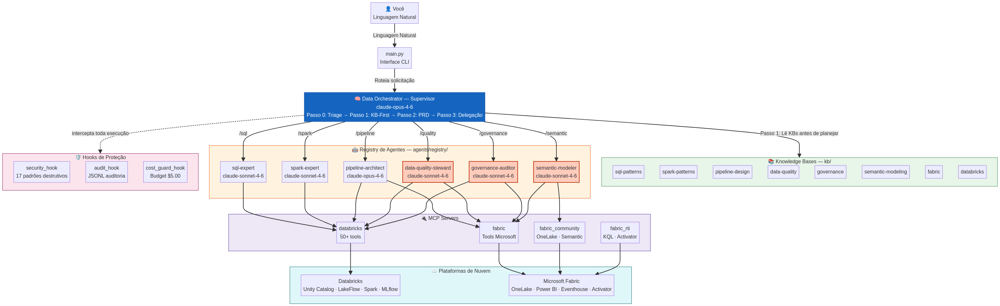

# Manual e Relatório Técnico: Projeto Data Agents v2.0

---

Repositório:  [github.com/ThomazRossito/data-agents](https://github.com/ThomazRossito/data-agents)

---

## 👤 Autor

> ## Thomaz Antonio Rossito Neto
>
> Specialist Data & AI Solutions Architect | Center of Excellence CoE @CI&T | Enterprise AI Agents, Microsoft Fabric & Databricks Expert

## Educação Acadêmica

> **MBA: Ciência de Dados com ênfase em Big Data**                           
> **MBA: Engenharia de Dados com ênfase em Big Data**

## Contatos

> **LinkedIn:** [https://www.linkedin.com/in/thomaz-antonio-rossito-neto/](https://www.linkedin.com/in/thomaz-antonio-rossito-neto/)                            
> **GitHub:** [https://github.com/ThomazRossito/](https://github.com/ThomazRossito/)

---

#### 🏆 Profissional Certificado Databricks

    

[Todas as certificações](https://credentials.databricks.com/profile/thomazantoniorossitoneto39867/wallet)

---

#### 🏆 Profissional Certificado Microsoft

<a href="https://www.credly.com/badges/052e5133-0c67-4ab7-bb3a-c99efa7b4406/public_url" target="_blank">
  
</a>
<a href="https://learn.microsoft.com/pt-br/users/thomazantoniorossitoneto/credentials/certification/fabric-data-engineer-associate" target="_blank">
  
</a>

[Todas as certificações](https://www.credly.com/users/thomaz-antonio-rossito-neto/badges#credly)

---

## Sumário

1. [O que é este projeto?](#1-o-que-é-este-projeto)
2. [Conceitos Fundamentais (Glossário para Iniciantes)](#2-conceitos-fundamentais-glossário-para-iniciantes)
3. [Arquitetura Geral do Sistema](#3-arquitetura-geral-do-sistema)
4. [Os Agentes: A Equipe Virtual](#4-os-agentes-a-equipe-virtual)
5. [O Método BMAD e KB-First](#5-o-método-bmad-e-kb-first)
6. [Estrutura de Arquivos e Pastas](#6-estrutura-de-arquivos-e-pastas)
7. [Análise Detalhada de Cada Componente](#7-análise-detalhada-de-cada-componente)
8. [Segurança e Controle de Custos (Hooks)](#8-segurança-e-controle-de-custos-hooks)
9. [O Hub de Conhecimento (KBs e Skills)](#9-o-hub-de-conhecimento-kbs-e-skills)
10. [Conexões com a Nuvem (MCP Servers)](#10-conexões-com-a-nuvem-mcp-servers)
11. [Comandos Disponíveis (Slash Commands)](#11-comandos-disponíveis-slash-commands)
12. [Configuração e Credenciais](#12-configuração-e-credenciais)
13. [Qualidade de Código e Testes](#13-qualidade-de-código-e-testes)
14. [Deploy e CI/CD (Publicação Automática)](#14-deploy-e-cicd-publicação-automática)
15. [Como Começar a Usar](#15-como-começar-a-usar)
16. [Conclusão](#16-conclusão)

---

## 1. O que é este projeto?

O **Data Agents** é um sistema avançado de **múltiplos agentes de Inteligência Artificial** projetado para atuar como uma equipe completa e autônoma nas áreas de Engenharia de Dados, Qualidade de Dados, Governança e Análise Corporativa. Se você já usou o ChatGPT ou o Claude para pedir ajuda com código, imagine dar um passo além: em vez de apenas responder perguntas, esta IA possui acesso direto ao seu ambiente na nuvem (Databricks e Microsoft Fabric) para executar as tarefas por você, de ponta a ponta.

A versão 2.0 deste projeto traz uma revolução na forma como a IA trabalha. Diferente de sistemas comuns que tentam adivinhar a melhor forma de escrever um código, o Data Agents opera sob uma **camada declarativa de governança e conhecimento**. Isso significa que a IA é rigorosamente obrigada a ler as regras de negócio da sua empresa (Knowledge Bases) e os manuais técnicos oficiais (Skills) *antes* de planejar ou executar qualquer ação. O resultado é um código não apenas funcional, mas seguro, auditável e perfeitamente alinhado com a arquitetura corporativa moderna.

---

## 2. Conceitos Fundamentais (Glossário para Iniciantes)

Para garantir que este manual seja compreensível mesmo para quem não é especialista em Inteligência Artificial ou Engenharia de Dados, preparamos este glossário com os termos essenciais utilizados ao longo do documento.

| Termo Técnico | O que significa na prática |
| --- | --- |
| **Agente de IA** | Um programa inteligente que não apenas conversa, mas toma decisões, planeja passos, usa ferramentas (como ler arquivos ou rodar scripts) e executa tarefas de forma autônoma. |
| **LLM (Large Language Model)** | O "cérebro" por trás da IA. Neste projeto, utilizamos a família de modelos **Claude** (da empresa Anthropic), conhecida por sua excelência em raciocínio lógico e programação. |
| **MCP (Model Context Protocol)** | Pense no MCP como uma "tomada universal". É um protocolo de código aberto que permite que a IA se conecte de forma segura a sistemas externos (como bancos de dados ou nuvens) para realizar ações reais. |
| **Databricks** | Uma das maiores plataformas de dados em nuvem do mundo, especializada em processar volumes massivos de informações usando a tecnologia Apache Spark. |
| **Microsoft Fabric** | A plataforma de dados unificada da Microsoft. Ela junta armazenamento (OneLake), engenharia (Data Factory), análise em tempo real (RTI) e visualização de negócios (Power BI) em um só lugar. |
| **Apache Spark / PySpark** | Uma tecnologia para processamento de "Big Data". Se você precisa analisar bilhões de linhas, o Excel trava; o Spark distribui esse trabalho entre dezenas de computadores ao mesmo tempo. PySpark é a versão dessa ferramenta usando a linguagem Python. |
| **Arquitetura Medalhão** | Um padrão da indústria para organizar dados em três camadas de qualidade: **Bronze** (dados brutos, como vieram da fonte), **Silver** (dados limpos e filtrados) e **Gold** (dados agregados e prontos para relatórios de negócios). |
| **Knowledge Base (KB)** | Arquivos de texto que contêm as **regras de negócio e padrões arquiteturais** da sua empresa. A IA lê isso para saber *o que* deve ser feito e *quais regras* seguir. |
| **Skills** | Manuais operacionais detalhados de ferramentas. Enquanto a KB diz *o que* fazer, a Skill ensina a IA *como* usar uma tecnologia específica (ex: como configurar um alerta no Fabric). |
| **Registry de Agentes** | Uma pasta (`agents/registry/`) onde os agentes são definidos usando arquivos de texto simples (Markdown). Na versão 2.0, você não precisa programar em Python para criar um novo agente; basta criar um arquivo de texto. |
| **Hook** | Um "gancho" de segurança. É um pedaço de código que fica monitorando tudo o que a IA tenta fazer. Se a IA tentar rodar um comando perigoso (como apagar um banco de dados), o Hook intercepta e bloqueia a ação na hora. |
| **PRD (Product Requirements Document)** | Um documento de arquitetura. Antes de sair escrevendo código, o Supervisor da IA escreve um PRD detalhando exatamente o que vai construir, como e por quê, pedindo a sua aprovação. |

---

## 3. Arquitetura Geral do Sistema

A arquitetura do Data Agents v2.0 foi desenhada para ser hierárquica, segura e altamente extensível. O fluxo de trabalho funciona de maneira muito semelhante a uma equipe humana em uma empresa.

### O Fluxo de Trabalho (Como as coisas acontecem)

1. **A Interface (O Terminal):** Você digita um pedido no terminal do seu computador (ex: `/plan Crie um pipeline de vendas no Databricks`). O arquivo `main.py` recebe esse pedido.
2. **O Gerente (Supervisor):** O pedido vai para o **Data Orchestrator** (Supervisor). Ele é a IA mais inteligente do grupo. Ele lê as regras da empresa (KBs), desenha o plano arquitetural (PRD) e decide qual especialista é o melhor para o trabalho.
3. **A Equipe (Especialistas):** O Supervisor acorda os agentes especialistas (ex: Arquiteto de Pipeline, Engenheiro de Qualidade). Eles recebem a tarefa, leem os manuais técnicos (Skills) e começam a trabalhar.
4. **A Ponte (MCP Servers):** Para fazer o trabalho real na nuvem, os especialistas enviam comandos através dos servidores MCP, que traduzem a intenção da IA em ações concretas no Databricks ou Microsoft Fabric.
5. **Os Guardiões (Hooks):** O tempo todo, os Hooks de segurança e auditoria observam silenciosamente. Eles registram cada ação em um log de auditoria e bloqueiam qualquer comando que viole as regras de segurança ou estoure o orçamento.

### Diagrama da Arquitetura

<p align="center">
  
</p>

---

## 4. Os Agentes: A Equipe Virtual

O projeto conta com **6 agentes especialistas** pré-configurados, divididos em dois níveis de atuação (Tiers). Graças ao novo Loader Dinâmico, todos esses agentes são definidos em arquivos de texto simples na pasta `agents/registry/`, tornando extremamente fácil adicionar novos membros à equipe no futuro.

### 👑 O Supervisor (Data Orchestrator)
- **Onde vive:** `agents/supervisor.py`
- **Modelo de IA:** `claude-opus-4-6` (O modelo mais avançado, focado em raciocínio complexo).
- **O que faz:** É o gerente do projeto. Ele é a única IA que conversa diretamente com você. Ele não escreve código; o trabalho dele é ler as regras de negócio (KBs), entender o seu problema, criar o documento de arquitetura (PRD) e delegar as tarefas para os especialistas corretos.

### 🛠️ Tier 1 — Engenharia de Dados (O Core)

Estes agentes são os construtores da fundação de dados.

#### 1. SQL Expert (`/sql`)
- **Arquivo:** `agents/registry/sql-expert.md`
- **Modelo:** `claude-sonnet-4-6` (Rápido e excelente em código).
- **Analogia:** O Analista de Dados e Administrador de Banco de Dados.
- **O que faz:** Especializado em escrever e otimizar consultas em SQL (incluindo as variantes T-SQL da Microsoft e Spark SQL do Databricks). Ele é usado para descobrir como as tabelas estão estruturadas e gerar código para criar novas tabelas.
- **Segurança:** Este agente tem permissão estrita de **apenas leitura**. Ele pode olhar os dados, mas não pode alterar ou apagar nada na nuvem.

#### 2. Spark Expert (`/spark`)
- **Arquivo:** `agents/registry/spark-expert.md`
- **Modelo:** `claude-sonnet-4-6`
- **Analogia:** O Desenvolvedor Back-end de Big Data.
- **O que faz:** É o mestre em Python e Apache Spark. Ele escreve o código complexo que transforma bilhões de linhas de dados (pipelines SDP, Delta Lake, MERGEs). 
- **Segurança:** Este agente **não tem acesso à nuvem** (não possui MCP). Ele vive isolado; o trabalho dele é receber um problema matemático/lógico e devolver um código Python perfeito, que será executado por outro agente.

#### 3. Pipeline Architect (`/pipeline` e `/fabric`)
- **Arquivo:** `agents/registry/pipeline-architect.md`
- **Modelo:** `claude-opus-4-6`
- **Analogia:** O Engenheiro Cloud e DevOps.
- **O que faz:** É o construtor da infraestrutura. Ele pega o código gerado pelo Spark Expert e orquestra a execução na nuvem. Ele cria os *Jobs* no Databricks, monta os *Pipelines* no Data Factory do Fabric e move arquivos de um lado para o outro.
- **Segurança:** É o único agente de engenharia com permissões de **execução e escrita**. Suas ações são fortemente monitoradas pelos Hooks de segurança.

### 🛡️ Tier 2 — Qualidade, Governança e Análise (Especializados)

Estes são os novos agentes introduzidos na v2.0, focados em garantir que os dados construídos pelo Tier 1 sejam confiáveis, seguros e úteis para o negócio.

#### 4. Data Quality Steward (`/quality`)
- **Arquivo:** `agents/registry/data-quality-steward.md`
- **Modelo:** `claude-sonnet-4-6`
- **Analogia:** O Engenheiro de Qualidade (QA).
- **O que faz:** É o guardião da saúde dos dados. Ele analisa tabelas para encontrar valores nulos ou anomalias estatísticas (*data profiling*), escreve regras que os dados não podem quebrar (*expectations*) e configura alertas em tempo real no Fabric Activator para avisar a equipe se um dado chegar corrompido.

#### 5. Governance Auditor (`/governance`)
- **Arquivo:** `agents/registry/governance-auditor.md`
- **Modelo:** `claude-sonnet-4-6`
- **Analogia:** O Auditor de Compliance e Segurança.
- **O que faz:** Garante que a empresa não seja processada. Ele rastreia de onde um dado veio e para onde foi (*linhagem de dados*), audita quem acessou o quê, e varre os bancos de dados procurando por informações sensíveis (como CPFs e e-mails) para garantir conformidade com a LGPD e GDPR.

#### 6. Semantic Modeler (`/semantic`)
- **Arquivo:** `agents/registry/semantic-modeler.md`
- **Modelo:** `claude-sonnet-4-6`
- **Analogia:** O Especialista de BI (Business Intelligence).
- **O que faz:** Traduz dados técnicos para a linguagem dos diretores. Ele constrói modelos semânticos usando a linguagem DAX (usada no Power BI), otimiza as tabelas da camada Gold para que os painéis carreguem mais rápido (Direct Lake) e configura assistentes de IA (Genie) para que os executivos possam fazer perguntas aos dados em português.

---

## 5. O Método BMAD e KB-First

A maior causa de falha em projetos de IA generativa é a alucinação: a IA tenta adivinhar a solução e gera um código que funciona na teoria, mas quebra as regras da empresa na prática. Para resolver isso, o Data Agents utiliza o **BMAD** (*Breakthrough Method for Agile AI-Driven Development*), agora aprimorado com a filosofia **KB-First**.

### A Filosofia KB-First (Knowledge Base First)
A regra de ouro da versão 2.0 é: **A IA nunca adivinha. Ela lê o manual.**
Antes de começar a trabalhar, a IA é forçada a ler as bases de conhecimento (`kb/`) da empresa. Se a sua empresa decidiu que todas as tabelas de data devem se chamar `dim_calendario` e usar um gerador sintético, a IA lerá essa regra e a aplicará rigorosamente.

### Os 5 Passos do Protocolo BMAD

Quando você usa o comando de planejamento (`/plan`), o sistema segue estes passos exatos:

1. **Passo 0 (Triagem e Contexto):** O Supervisor recebe o seu pedido. Ele olha para a biblioteca de KBs (`kb/`) e identifica quais regras de negócio se aplicam ao seu problema. Ele lê esses arquivos para se contextualizar.
2. **Passo 1 (Arquitetura):** Baseado nas regras que leu, o Supervisor desenha a arquitetura da solução. Ele decide quais camadas do Medalhão serão usadas e quais agentes serão necessários.
3. **Passo 2 (PRD e Aprovação):** O Supervisor escreve um documento detalhado (PRD - Product Requirements Document) e salva na pasta `output/`. O terminal pausa e **pede a sua aprovação**. Você pode ler o plano e dizer "Sim" ou pedir alterações.
4. **Passo 3 (Delegação e Skills):** Com a sua aprovação, o Supervisor acorda os especialistas. Cada especialista recebe sua parte da tarefa e, antes de escrever o código, lê as **Skills** operacionais (`skills/`) — que são manuais técnicos detalhados de como usar a ferramenta específica (ex: como escrever DAX no Fabric).
5. **Passo 4 (Síntese e Validação):** Os especialistas devolvem o trabalho pronto. O Supervisor revisa tudo para garantir que as regras iniciais não foram quebradas, consolida os resultados e apresenta a você o relatório final, incluindo o custo da operação.

### Modos de Velocidade: Full vs. Express

Nem toda tarefa precisa de um documento de arquitetura completo. Por isso, o sistema oferece dois modos de operação:

- **BMAD Full (Comando `/plan`):** Executa os 5 passos completos. É o modo "lento e seguro", ideal para construir pipelines inteiros do zero. O Supervisor usa o modo "Thinking" avançado do Claude (gastando mais tokens) para raciocinar profundamente.
- **BMAD Express (Comandos `/sql`, `/quality`, `/governance`, etc.):** Pula o planejamento e a aprovação. O pedido vai *direto* para o agente especialista. Ideal para tarefas rápidas, como "Liste os catálogos do Databricks" ou "Verifique se a tabela X tem dados nulos". É rápido, barato e direto ao ponto.
---

## 6. Estrutura de Arquivos e Pastas

O projeto Data Agents foi desenhado com uma arquitetura modular. Se você abrir a pasta do projeto no seu computador, verá algo assim:

```text
data-agents/
├── agents/
│   ├── registry/               # Aqui vivem os agentes (arquivos .md)
│   │   ├── _template.md        # Molde para criar novos agentes
│   │   ├── sql-expert.md       # Definição do Analista SQL
│   │   ├── spark-expert.md     # Definição do Engenheiro Spark
│   │   └── ...                 # Outros especialistas
│   ├── loader.py               # O motor que lê os arquivos .md e "dá vida" aos agentes
│   ├── prompts/                # Prompts avançados (como o do Supervisor)
│   └── supervisor.py           # O cérebro central (Data Orchestrator)
├── commands/
│   └── parser.py               # Define os comandos que você digita (ex: /plan, /sql)
├── config/
│   ├── exceptions.py           # Erros personalizados (ex: "Orçamento estourado")
│   ├── logging_config.py       # Configura como o sistema anota o que está fazendo
│   ├── mcp_servers.py          # O mapa de todas as conexões de nuvem disponíveis
│   └── settings.py             # Lê suas senhas e configura limites (orçamento, tentativas)
├── hooks/
│   ├── audit_hook.py           # O gravador silencioso de tudo o que a IA faz
│   ├── cost_guard_hook.py      # O vigilante do seu cartão de crédito
│   └── security_hook.py        # O segurança que bloqueia comandos perigosos
├── kb/                         # A base de conhecimento (Regras da Empresa)
│   ├── data-quality/           # Regras de qualidade (ex: % máximo de nulos aceitável)
│   ├── databricks/             # Padrões de arquitetura para Databricks
│   ├── fabric/                 # Padrões de arquitetura para Microsoft Fabric
│   └── ...                     # Outros domínios
├── mcp_servers/
│   ├── databricks/             # O "cabo" que liga a IA ao seu Databricks
│   ├── fabric/                 # O "cabo" que liga a IA ao seu Fabric
│   └── fabric_rti/             # O "cabo" para dados em tempo real no Fabric
├── skills/                     # Os Manuais de Instruções Operacionais
│   ├── databricks/             # Como criar tabelas, rodar jobs, etc.
│   ├── fabric/                 # Como usar o Data Factory, Eventhouse, etc.
│   └── ...                     # Outros manuais
├── tests/                      # Robôs que testam se a IA está funcionando bem
├── main.py                     # O arquivo que você roda para iniciar o programa
├── pyproject.toml              # Lista de dependências (o que o Python precisa baixar)
└── .env.example                # Molde para você colocar suas senhas com segurança
```

---

## 7. Análise Detalhada de Cada Componente

Vamos entender as peças mais importantes que fazem essa engrenagem rodar.

### O Arquivo Principal (`main.py`)
Pense nele como a porta de entrada da sua empresa. Quando você digita `python main.py` no terminal, este arquivo:
1. Pinta aquele banner bonito na tela com o nome do projeto.
2. Chama o `settings.py` para verificar se você configurou as senhas da nuvem.
3. Inicia o loop interativo (aquela tela preta esperando você digitar algo).
4. Pega o que você digitou e envia para o Supervisor.
5. Mostra o "spinner" (a rodinha girando) enquanto a IA pensa, para você não achar que travou.

### O Motor de Agentes (`loader.py` e `registry/`)
Na versão anterior do projeto, se você quisesse criar um novo agente (ex: um Especialista em Machine Learning), precisava programar em Python em quatro arquivos diferentes.
Na v2.0, o `loader.py` faz mágica. Ele vai na pasta `agents/registry/`, lê todos os arquivos de texto (`.md`) que encontrar lá e transforma cada arquivo em um agente vivo e pronto para trabalhar.
Isso significa que, para criar um agente novo, você só precisa copiar o `_template.md`, dar um nome, colar as instruções em português e salvar. O sistema faz o resto.

### O Configurar (`settings.py`)
Este arquivo é o painel de controle do projeto. Ele usa uma biblioteca chamada Pydantic para garantir que as configurações estão corretas antes de o sistema iniciar.
Ele define coisas como:
- **`default_model`**: Qual "cérebro" a IA vai usar (padrão: `claude-opus-4-6`).
- **`max_budget_usd`**: Quanto a IA pode gastar em dólares por sessão (padrão: `$5.00`). Se passar disso, o sistema para imediatamente.
- **`max_turns`**: Quantas vezes a IA pode tentar resolver um problema antes de desistir (padrão: 50).

---

## 8. Segurança e Controle de Custos (Hooks)

Dar acesso ao seu banco de dados na nuvem para uma IA pode parecer assustador. Por isso, o Data Agents possui **Hooks**. Hooks são como filtros invisíveis pelos quais todo comando da IA precisa passar antes de chegar à nuvem.

### O Segurança (`security_hook.py`)
Antes de a IA executar qualquer comando, o Segurança lê a intenção. Se a IA tentar rodar comandos como `DROP TABLE` (apagar tabela), `DELETE FROM` (apagar dados), `TRUNCATE` (limpar tabela) ou `rm -rf` (apagar arquivos), o Segurança bloqueia a ação, avisa a IA que ela quebrou as regras e a obriga a tentar outra abordagem.

### O Vigilante de Custos (`cost_guard_hook.py`)
Rodar códigos pesados na nuvem custa dinheiro. O Vigilante classifica cada ferramenta da IA em três níveis:
- **LOW (Baixo):** Consultas simples, listar tabelas. Custo quase zero.
- **MEDIUM (Médio):** Executar SQL pesado. Gasta um pouco de dinheiro.
- **HIGH (Alto):** Ligar um cluster de computadores (Databricks Cluster) ou iniciar um Pipeline inteiro. Custa caro.
Se a IA tentar fazer muitas operações HIGH na mesma sessão (mais de 5 vezes), o Vigilante dispara um alerta no seu terminal, avisando que a IA pode estar gastando dinheiro demais à toa.

### O Gravador (`audit_hook.py`)
Para que você nunca perca o controle do que aconteceu, o Gravador anota tudo. Cada comando que a IA tenta rodar, o horário, se funcionou ou se deu erro, tudo é salvo no arquivo `logs/audit.jsonl`. Se amanhã uma tabela sumir, você pode abrir esse arquivo e ver exatamente o que a IA fez.

---

## 9. O Hub de Conhecimento (KBs e Skills)

A maior evolução da v2.0 é a separação clara entre **Regras** e **Ferramentas**.

### As Knowledge Bases (`kb/`)
As KBs são o cérebro corporativo. Elas respondem **"Por que estamos fazendo isso e quais são as regras?"**.
- **Exemplo Prático:** Na pasta `kb/sql-patterns/`, há um arquivo que diz: *"Na nossa empresa, toda tabela da camada Silver deve ter uma coluna chamada `data_ingestao` com o horário atual"*.
- **Como a IA usa:** O Supervisor lê isso antes de planejar. Se você pedir "Crie a tabela Silver", ele já sabe que tem que colocar essa coluna, sem você precisar pedir.

### As Skills (`skills/`)
As Skills são os manuais de instruções. Elas respondem **"Como eu aperto os botões dessa ferramenta?"**.
- **Exemplo Prático:** Na pasta `skills/databricks/`, há um manual ensinando a sintaxe exata para criar um Job no Databricks usando a API deles.
- **Como a IA usa:** O Pipeline Architect lê isso na hora de escrever o código. Ele não precisa decorar a API do Databricks (que muda toda hora); ele lê o manual atualizado e gera o código perfeito.

Essa separação (KBs para o Gerente, Skills para os Operários) reduz a sobrecarga da IA e garante que o código final respeite a arquitetura da sua empresa e a sintaxe da ferramenta ao mesmo tempo.

---

## 10. Conexões com a Nuvem (MCP Servers)

O MCP (Model Context Protocol) é a tecnologia que permite que a IA "saia" do seu computador e interaja com o mundo real. O Data Agents possui três conexões prontas (na pasta `mcp_servers/`):

1. **Databricks MCP:** Permite que a IA liste catálogos (Unity Catalog), veja esquemas de tabelas, execute consultas SQL nos Warehouses e crie pipelines de dados (SDP).
2. **Fabric MCP:** Permite que a IA acesse a nuvem da Microsoft, liste os Workspaces, crie Lakehouses e envie arquivos para o OneLake (o "OneDrive" do Fabric).
3. **Fabric RTI MCP (Real-Time Intelligence):** Uma conexão especial para dados em tempo real. Permite que a IA consulte bancos de dados Kusto (KQL), configure Eventstreams e crie alertas no Activator.

**O Truque Inteligente:** O arquivo `mcp_servers.py` é inteligente. Quando você liga o sistema, ele olha as suas senhas. Se você só colocou a senha do Databricks, ele desliga as conexões do Fabric para não dar erro, e vice-versa.

---

## 11. Comandos Disponíveis (Slash Commands)

O arquivo `commands/parser.py` define os atalhos que você pode usar no terminal. Em vez de escrever textos longos, você usa esses comandos para direcionar a IA.

| Comando | O que faz | Modo BMAD | Quem executa |
| --- | --- | --- | --- |
| `/plan` | Inicia o fluxo completo. Lê as regras, cria o documento de arquitetura (PRD), pede sua aprovação e delega. | Full (Lento/Seguro) | Supervisor + Equipe |
| `/sql` | Pula o planejamento. Envia uma tarefa de banco de dados direto para o especialista. | Express (Rápido) | SQL Expert |
| `/spark` | Envia um problema matemático/lógico direto para o especialista em Python/Spark. | Express (Rápido) | Spark Expert |
| `/pipeline` | Envia uma tarefa de infraestrutura (ex: criar um Job) direto para o arquiteto. | Express (Rápido) | Pipeline Architect |
| `/fabric` | Igual ao `/pipeline`, mas avisa a IA para focar especificamente nas ferramentas da Microsoft. | Express (Rápido) | Pipeline Architect |
| `/quality` | Envia uma tarefa de validação de dados (ex: "ache os nulos") para o auditor de qualidade. | Express (Rápido) | Data Quality Steward |
| `/governance` | Envia uma tarefa de segurança (ex: "quem acessou essa tabela?") para o auditor. | Express (Rápido) | Governance Auditor |
| `/semantic` | Envia uma tarefa de BI (ex: "crie métricas DAX") para o especialista em negócios. | Express (Rápido) | Semantic Modeler |
| `/health` | Verifica se as senhas da nuvem estão funcionando e lista o que está conectado. | Internal | O próprio sistema |
| `/status` | Lista todos os planos de arquitetura (PRDs) que a IA já gerou na sua pasta `output/`. | Internal | O próprio sistema |
| `/review` | Pega um plano antigo e pergunta se você quer continuar de onde parou. | Internal | O próprio sistema |
| `/help` | Mostra esta lista no terminal. | Internal | O próprio sistema |
---

## 12. Configuração e Credenciais

Para que a IA possa trabalhar por você, ela precisa das "chaves" do seu escritório. Isso é feito criando um arquivo chamado `.env` (com um ponto no começo mesmo) na raiz do projeto. 

> **Aviso de Segurança:** Nunca envie o arquivo `.env` para o GitHub. Ele contém suas senhas. O projeto já vem com um arquivo `.gitignore` que impede que isso aconteça acidentalmente.

Aqui está a lista completa de variáveis que você pode configurar:

### O "Cérebro" da IA (Obrigatório)
- **`ANTHROPIC_API_KEY`**: A chave da API da Anthropic. Sem isso, a IA não funciona. O projeto exige a família Claude 3.5 (Opus e Sonnet).

### Databricks (Opcional)
Se você for usar o Databricks, preencha:
- **`DATABRICKS_HOST`**: A URL do seu Databricks (ex: `https://adb-123456.azuredatabricks.net`).
- **`DATABRICKS_TOKEN`**: O seu Personal Access Token (PAT) gerado no Databricks.
- **`DATABRICKS_SQL_WAREHOUSE_ID`**: O ID do computador que vai rodar as consultas SQL (você acha isso na aba SQL Warehouses).

### Microsoft Fabric (Opcional)
Se você for usar o Microsoft Fabric, preencha:
- **`AZURE_TENANT_ID`**: O ID da sua empresa na nuvem da Microsoft.
- **`FABRIC_WORKSPACE_ID`**: O ID da "pasta" (Workspace) onde a IA vai trabalhar.
- **`AZURE_CLIENT_ID`** e **`AZURE_CLIENT_SECRET`**: (Opcional) Se você quiser usar um "usuário robô" (Service Principal) em vez do seu próprio usuário.

### Fabric Real-Time Intelligence (Opcional)
Se você for trabalhar com dados em tempo real (Kusto/Eventhouse):
- **`KUSTO_SERVICE_URI`**: A URL do seu banco de dados em tempo real.
- **`KUSTO_SERVICE_DEFAULT_DB`**: O nome do banco de dados padrão.

### Configurações de Segurança do Projeto
Você pode mudar o comportamento da IA ajustando o arquivo `config/settings.py` ou adicionando estas variáveis no seu `.env`:
- **`MAX_BUDGET_USD`**: O limite de dinheiro que a IA pode gastar por sessão (padrão: `5.0`).
- **`MAX_TURNS`**: O limite de tentativas da IA (padrão: `50`).
- **`LOG_LEVEL`**: Se você quiser ver exatamente o que a IA está pensando por baixo dos panos, mude para `DEBUG`. Para um terminal mais limpo, deixe em `INFO`.

---

## 13. Qualidade de Código e Testes

Como saber se a IA não quebrou ao ser atualizada? O projeto Data Agents possui uma bateria de testes automatizados (na pasta `tests/`).

### Como rodar os testes

Abra o terminal e digite:
```bash
pytest
```

### O que os testes verificam?
1. **O Loader Dinâmico:** Ele tenta ler todos os arquivos Markdown na pasta `registry/`. Se você esqueceu de colocar o nome de um agente no arquivo, o teste falha e te avisa.
2. **A Segurança:** Ele tenta rodar comandos perigosos (como `DROP TABLE`) e verifica se o `security_hook.py` consegue bloquear todos eles.
3. **O Parser de Comandos:** Ele digita comandos como `/quality` e verifica se o sistema sabe que deve chamar o `data-quality-steward`.

Sempre rode `pytest` antes de enviar uma nova versão do projeto para o GitHub.

---

## 14. Deploy e CI/CD (Publicação Automática)

O projeto foi construído para rodar no seu computador (localmente) ou em um servidor na nuvem (como um contêiner Docker).

Se você olhar a pasta `.github/workflows/`, verá que o projeto já vem com **Integração Contínua (CI)**. Isso significa que toda vez que você envia uma alteração para o GitHub:
1. O GitHub cria um computador virtual temporário.
2. Ele instala o Python e todas as dependências.
3. Ele roda todos os testes (`pytest`) automaticamente.
4. Se algum teste falhar, ele bloqueia a alteração e avisa que o código está quebrado.

Isso garante que o seu time de dados sempre tenha uma versão funcional e segura do Data Agents.

---

## 15. Como Começar a Usar

Pronto para ver a IA trabalhar? Siga este passo a passo simples.

### Passo 1: Instale o Python
Você precisa ter o Python instalado no seu computador (versão 3.10 ou superior).

### Passo 2: Baixe o Projeto
Abra o terminal e clone o repositório:
```bash
git clone https://github.com/ThomazRossito/data-agents.git
cd data-agents
```

### Passo 3: Instale as Dependências
Isso vai baixar todas as bibliotecas que o projeto precisa para funcionar (como o SDK do Claude e as ferramentas da Microsoft):
```bash
pip install -e ".[dev]"
```

### Passo 4: Configure suas Senhas
Copie o arquivo de exemplo e coloque suas credenciais:
```bash
cp .env.example .env
```
Abra o arquivo `.env` no bloco de notas ou VS Code e preencha a sua `ANTHROPIC_API_KEY` e as chaves do Databricks/Fabric.

### Passo 5: Ligue o Sistema
```bash
python main.py
```

Você verá o banner do Data Agents e o prompt `Você:`. Digite `/help` para ver os comandos ou simplesmente escreva: *"Liste todos os catálogos do Databricks"*. A IA cuidará do resto.

---

## 16. Conclusão

O projeto **Data Agents v2.0** não é apenas um chatbot. É uma plataforma de automação corporativa. 

Ao separar as **Regras de Negócio (KBs)** dos **Manuais Técnicos (Skills)**, e ao permitir a criação de novos agentes simplesmente escrevendo arquivos de texto (Markdown), o projeto resolve o maior gargalo da Inteligência Artificial em empresas: a dificuldade de manter a IA atualizada e alinhada com a arquitetura da companhia.

Hoje, o sistema cobre Engenharia, Qualidade, Governança e Análise. Amanhã, se a sua empresa precisar de um "Especialista em Finanças" ou um "Auditor de LGPD", você só precisará criar um novo arquivo `.md` na pasta `registry/`. A fundação já está construída.

O futuro da engenharia de dados não é escrever código; é arquitetar sistemas e gerenciar agentes inteligentes que escrevem o código por você. Bem-vindo a esse futuro.
