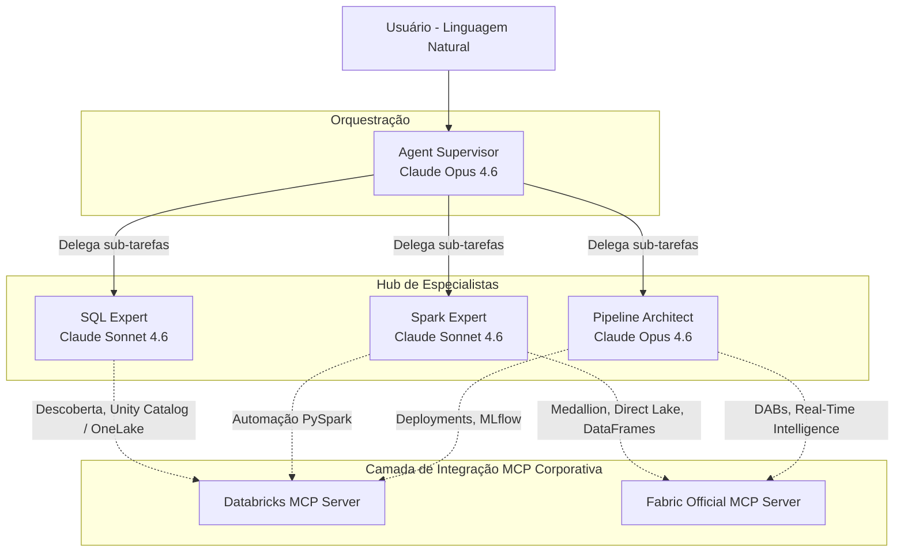

<p align="center">
  <h1 align="center">Data Agents</h1>
  <p align="center">
    <strong>Sistema Multi-Agentes para Engenharia de Dados, Análise e MLOps Corporativo</strong>
  </p>
  <p align="center">
    
    
    
    
  </p>
</p>

Construído sobre o **Claude Agent SDK** da Anthropic com integração nativa via **Model Context Protocol (MCP)** ao **Databricks** e **Microsoft Fabric**. Este ecossistema transforma o seu assistente de IA em um verdadeiro arquiteto e executor de engenharia de dados, operando recursos diretamente nas suas nuvens corporativas.

---

## 👤 Autor

- **Desenvolvido por:** Thomaz Antonio Rossito Neto
- **Professional:** Specialist Data & AI Solutions Architect | Center of Excellence CoE @CI&T | Enterprise AI Agents, Microsoft Fabric & Databricks Expert
- **LinkedIn:** [https://www.linkedin.com/in/thomaz-antonio-rossito-neto/](https://www.linkedin.com/in/thomaz-antonio-rossito-neto/)
- **GitHub:** [https://github.com/ThomazRossito/](https://github.com/ThomazRossito/)
- **Data criação:** 04/04/2026
- **Data atualização:** 04/04/2026
- **Versão:** 1.0.1

---

## 🏗️ Visão Geral e Arquitetura

O **Data Agents** é projetado para atuar como uma *squad* autônoma de dados. Através de um Supervisor de Agentes, a sua intenção em linguagem natural é orquestrada para especialistas capacitados em SQL, Spark e Pipelines de Dados.

O diferencial deste projeto é o seu **Hub de Conhecimento (Skills)**. Os agentes não apenas geram códigos genéricos, mas **nativamente leem documentações oficiais e guias de melhores práticas armazenados no repositório** para interagir corretamente com o Model Context Protocol (MCP) da Databricks e Fabric.



## 🤖 Nossos Agentes

| Agente | Modelo (Recomendado) | Papel e Responsabilidades |
|---|---|---|
| **Supervisor** | `Claude Opus 4.6` | Atua como líder técnico. Recebe a sua requisição, quebra o problema em subtarefas, avalia as *skills* da base e aciona o especialista correto para construir a solução. |
| **SQL Expert** | `Claude Sonnet 4.6` | Especialista em dados relacionais e modelagem (KQL, T-SQL, Spark SQL). Consulta metadados, analisa schemas de tabelas Fato/Dimensão e constrói analíticas diretas. |
| **Spark Expert** | `Claude Sonnet 4.6` | O ás da Engenharia Big Data. Estrutura código PySpark, manipula arquiteturas Delta Lake (Medallion) para OneLake e otimiza partições em tempo real. |
| **Pipeline Architect** | `Claude Opus 4.6` | Engenheiro focado em DataOps e SRE. Automatiza pipelines completos, gerencia Databricks Asset Bundles (DABs), Workflows e ambientes via `fabric_environment.yml`. |

---

## 📋 Pré-Requisitos e Credenciais

Sua máquina ou pipeline automatizado precisa atender os seguintes requisitos:

1. **Python 3.11+**: Recomenda-se instalação via `pyenv` ou uso de `virtualenvs`.
2. **Databricks**: 
   - CLI do Databricks instalado e configurado (`databricks configure`).
   - Ou forneça as Variáveis de Ambiente padrão: `DATABRICKS_HOST` e `DATABRICKS_TOKEN`.
3. **Microsoft Fabric**:
   - Azure CLI instalada e autenticada via `az login` (o módulo de Entra ID usará a sua identidade padrão).
   - Opcionalmente, configure as variáveis de um Service Principal (`AZURE_TENANT_ID`, `AZURE_CLIENT_ID`, `AZURE_CLIENT_SECRET`).

---

## 🚀 Configuração Rápida do Ambiente

Para não perder tempo e testar rapidamento no seu terminal:

1. **Clone do repositório:**
```bash
git clone git@github.com:ThomazRossito/data-agents.git
cd data-agents
```

2. **Inicialize o Virtual Environment:**
```bash
python3 -m venv .venv
source .venv/bin/activate  # Windows: .venv\Scripts\activate
```

3. **Instale os Módulos do Sistema:**
Certifique-se de estar na respectiva branch (ex: `dev`) e faça o *Editable Install*.
```bash
pip install -e "."
```

---

## 💡 Como USAR e Tirar o Máximo Proveito

A premissa principal do **Data Agents** é que ele é um parceiro corporativo e não um mero ChatGPT. Ele opera com base na documentação local e nas integrações diretas do MCP.

### Como Maximizar os Resultados
1. **Seja específico com Schemas e Regiões**: Em vez de *"analise as vendas"*, prefira *"Acesse o Unity Catalog no catalog `prd_bi` e veja os esquemas na tabela `gold_vendas`"*. O agente usará a ferramenta (Tool) nativa para puxar os metadados antes de gerar a resposta.
2. **Peça Explicações Arquitetônicas**: O agente conhece padrões Medalhão e arquiteturas Direct Lake. Você pode solicitar: *"Como refatorar esse código PySpark para suportar Fabric Direct Lake nativamente?"*
3. **Delegue o Troubleshooting**: O erro bateu no terminal? Forneça o erro exato ao Agente. Ele usará o Pipeline Architect para criar *fixes* de código automáticos baseados nas skills internas.

### Modos de Execução

**1. Modo Interativo / Chat Contínuo (Recomendado para Arquitetura e Code-Review)**
Inicie um loop onde o Supervisor debaterá os problemas passo-a-passo com você:
```bash
python main.py
```

**2. Modo Single-Query (Ideal para Automação CI/CD / Scripts)**
Direto ao ponto, execute, receba a resposta ou código e o processo se encerra:
```bash
python main.py "Inspecione o OneLake e sugira 3 otimizações de partição para a tabela silver_users seguindo as melhores práticas do guide lakehouse-medallion.md."
```

### ✅ Scripts de Health Check (Valide antes de viajar na nuvem!)
Sempre que configurar uma máquina nova, valide suas chaves de API:
- Para pingar a API do **Databricks**: 
  ```bash
  python tools/databricks_health_check.py
  ```
- Para validar seus tokens de Acesso do **M365/Microsoft Fabric** no Entra ID:
  ```bash
  python tools/fabric_health_check.py
  ```

---

## 💬 O que o usuário pode perguntar? (Exemplos Práticos)

Não pense neste sistema como um "Search Engine", mas como um colega sênior embutido no seu terminal com acesso as suas contas de nuvem.

**Integrações com Databricks:**
* *"Encontre a declaração do job diário de ingestão que cria a tabela externa `raw.transactions`. Consegue transcrever isso para Databricks Asset Bundles (DABs) e gerar o `databricks.yml`?"*
* *"O servidor databricks_mcp_server falhou de forma intermitente ontem. Você pode invocar o MCP para diagnosticar no Log de Eventos do cluster se foi falta de memória ou falha de preemptable nodes?"*
* *"Gere a classe Python PyFunc wrapper pro MLflow para servir a nossa biblioteca principal como um endpoint de REST usando o Model Serving."*

**Integrações com Microsoft Fabric:**
* *"Leia as nossas skills internas de Arquitetura KQL e otimize esta consulta gigantesca de Eventhouse para usar filtros temporais mais eficientes."*
* *"Como eu garanto que os dataframes PySpark que escrevi na Lakehouse do Fabric mantenham o V-Order ativo para alavancar a velocidade máxima no Direct Lake mode do Power BI?"*
* *"Meu modelo de classificação Semântica parou de atualizar. Use o semantic-link para diagnosticar dependências diretas de metadados das partições."*

**Tarefas de Dia a Dia:**
* *"Baseado no layout da camada Bronze, construa um DLT (Delta Live Tables) para tratar e jogar os dados para a camada Silver aplicando `dropDuplicates`."*
* *"Refatore o arquivo `main.py` respeitando princípios do SOLID e injetando Pydantic para validação de configurações de `.env`."*

---

## 🛠️ DataOps e Enterprise Readiness

Este projeto incorpora as maiores tendências do MLOps corporativo:

1. **Databricks Asset Bundles (DABs)**: Em conjunto com o arquivo `databricks.yml`, permite CI/CD da lógica analítica local diretamente para os ambientes Databricks (Test, Prod).
2. **Fabric Environment Export**: Usa `fabric_environment.yml` padronizando como criar bibliotecas para sessões computacionais Spark dentro das Workspaces corporativas.
3. **Serving e Model Registry**: A classe `agents/mlflow_wrapper.py` empacota toda a engine Multi-Agente deste repositório para que possa ser versionada e hospedada via Databricks Mosaic AI Model Serving com infra-serverless.

---

## 📂 Estrutura de Diretórios 

```text
data-agents/
├── main.py                          # Entry point principal da aplicação
├── databricks.yml                   # Empacotamento de CI/CD para o Databricks (DABs)
├── fabric_environment.yml           # Dependências para Fabric Notebooks / Spark Compute
├── pyproject.toml                   # Dependências PIP (azure-identity, databricks-sdk, etc)
├── .env.example                     # GDD de variáveis de ambiente
│
├── config/                          # Configurações do ecossistema e SDKs
│   └── mcp_servers.py               # Mapeamento do Databricks e Fabric MCP Servers
│
├── agents/                          # Cérebros e Personas
│   ├── supervisor.py                # Setup Principal de Routing de Intents
│   ├── mlflow_wrapper.py            # MLOps: Agrupador PyFunc para subir pro Databricks Serving
│   └── definitions/                 # Scripts do Spark Expert, SQL Expert, etc
│
├── mcp_servers/                     # Connectors Locais
│   ├── databricks/                  # Adaptador Server do Databricks AI-DEV-KIT
│   └── fabric/                      # Microsoft Fabric Integration
│
├── tools/                           # Ferramentas auxiliares Python
│   ├── databricks_health_check.py   # Ping de conexão Auth Databricks
│   └── fabric_health_check.py       # Ping de Auth Azure/Entra ID para Fabric
│
└── skills/                          # 📥 HUB DE CONHECIMENTO CIENTÍFICO E PADRÕES A SEREM LIDOS PELOS AGENTES
    ├── databricks/                  # Manuais oficiais e design patterns exportados
    └── fabric/                      
        ├── direct-lake-patterns.md
        ├── kql-rti-optimizations.md
        └── lakehouse-medallion.md
```

---

*“Um agente com acesso à nuvem é bom. Um hub de multi-agentes que conhece as melhores práticas corporativas lendo seus próprios manuais, é revolucionário.”*
