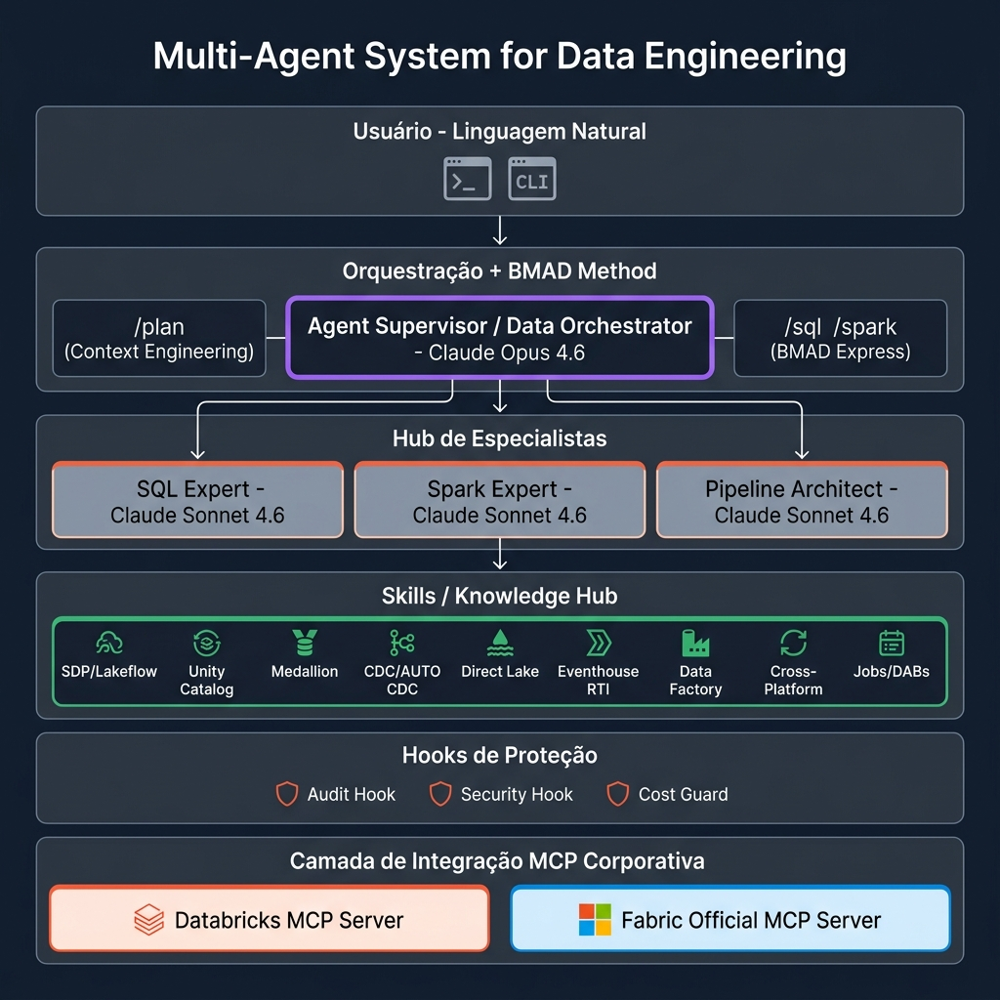
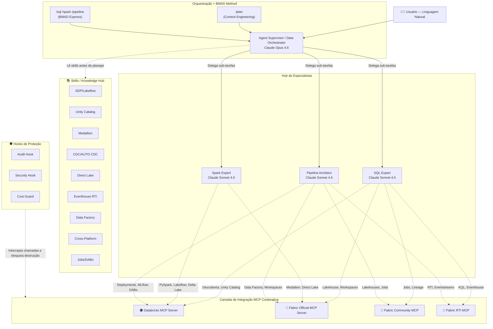

<p align="center">
  
</p>

<p align="center">
  <h1 align="center">Data Agents</h1>
  <p align="center">
    <strong>Sistema Multi-Agentes para Engenharia de Dados, Análise e MLOps Corporativo</strong>
  </p>
  <p align="center">
    
    
    
    
    
  </p>
</p>

Construído sobre o **Claude Agent SDK** da Anthropic com integração nativa via **Model Context Protocol (MCP)** ao **Databricks** e **Microsoft Fabric**. Este ecossistema transforma o seu assistente de IA em um verdadeiro arquiteto e executor de engenharia de dados, operando recursos diretamente nas suas nuvens corporativas.

---

## 👤 Autor

- **Desenvolvido por:** Thomaz Antonio Rossito Neto
- **Professional:** Specialist Data & AI Solutions Architect | Center of Excellence CoE @CI&T | Enterprise AI Agents, Microsoft Fabric & Databricks Expert
- **LinkedIn:** [https://www.linkedin.com/in/thomaz-antonio-rossito-neto/](https://www.linkedin.com/in/thomaz-antonio-rossito-neto/)
- **GitHub:** [https://github.com/ThomazRossito/](https://github.com/ThomazRossito/)
- **Versão:** 0.1.0

---

## 🏗️ Visão Geral e Arquitetura

O **Data Agents** é projetado para atuar como uma *squad* autônoma de dados. Através de um Supervisor de Agentes e o **Método BMAD** (Breakthrough Method for Agile AI-Driven Development), a sua intenção em linguagem natural é orquestrada para especialistas capacitados em SQL, Spark e Pipelines de Dados.

O diferencial deste projeto é o seu **Hub de Conhecimento (Skills)**. Os agentes não apenas geram códigos genéricos, mas **nativamente leem documentações oficiais e guias de melhores práticas armazenados no repositório** para interagir corretamente com o Model Context Protocol (MCP) da Databricks e Fabric. Antes de qualquer geração de código, o supervisor consulta os skills relevantes (**Context Engineering**) para garantir que o PRD e os artefatos sigam os padrões arquiteturais mais modernos.

<p align="center">
  
</p>



## 🤖 Nossos Agentes

| Agente | Modelo | Papel e Responsabilidades |
|---|---|---|
| **Supervisor** | `Claude Opus 4.6` | Atua como líder técnico. Recebe a sua requisição, quebra o problema em subtarefas, avalia as *skills* da base e aciona o especialista correto para construir a solução. |
| **SQL Expert** | `Claude Sonnet 4.6` | Especialista em dados relacionais e modelagem (KQL, T-SQL, Spark SQL). Consulta metadados de forma *read-only*, analisa schemas de tabelas Fato/Dimensão e constrói analíticas diretas. |
| **Spark Expert** | `Claude Sonnet 4.6` | O ás da Engenharia Big Data. **Focado exclusivamente em geração de código (sem acesso MCP direto)**. Estrutura código PySpark, manipula arquiteturas Delta Lake (Medallion) e otimiza partições. |
| **Pipeline Architect** | `Claude Sonnet 4.6` | Engenheiro focado em DataOps e SRE. O único com permissões amplas de execução. Automatiza pipelines completos, gerencia Databricks Asset Bundles (DABs), Workflows e integrações cross-platform. |

---

## 📋 Pré-Requisitos e Credenciais

Sua máquina ou pipeline automatizado precisa atender os seguintes requisitos:

1. **Python 3.11+**: Recomenda-se instalação via `pyenv` ou uso de `virtualenvs`.
2. **.NET SDK 8.0+**: Necessário para rodar o servidor MCP oficial do Microsoft Fabric.
3. **Anthropic API**:
   - Forneça a variável de ambiente `ANTHROPIC_API_KEY`.
4. **Databricks**:
   - CLI do Databricks instalado e configurado (`databricks configure`).
   - Variáveis de Ambiente: `DATABRICKS_HOST`, `DATABRICKS_TOKEN` e `DATABRICKS_SQL_WAREHOUSE_ID`.
5. **Microsoft Fabric**:
   - Azure CLI instalada e autenticada via `az login` (o módulo de Entra ID usará a sua identidade padrão).
   - Opcionalmente, configure as variáveis de um Service Principal (`AZURE_TENANT_ID`, `AZURE_CLIENT_ID`, `AZURE_CLIENT_SECRET`).
   - Variáveis de Ambiente adicionais: `FABRIC_WORKSPACE_ID` e `FABRIC_API_BASE_URL`.
6. **Fabric RTI (Real-Time Intelligence)**:
   - Variáveis de Ambiente: `KUSTO_SERVICE_URI` e `KUSTO_SERVICE_DEFAULT_DB`.

---

## 🚀 Configuração Rápida do Ambiente

Para não perder tempo e testar rapidamente no seu terminal:

1. **Clone do repositório:**
```bash
git clone git@github.com:ThomazRossito/data-agents.git
cd data-agents
```

2. **Inicialize o Virtual Environment:**
```bash
python3 -m venv .venv
source .venv/bin/activate  # Windows: .venv\Scripts\activate
```

3. **Instale os Módulos do Sistema:**
Certifique-se de estar na respectiva branch (ex: `dev`) e faça o *Editable Install*.
```bash
pip install -e "."
```

4. **Configure as Variáveis de Ambiente:**
```bash
cp .env.example .env
# Edite o arquivo .env com suas credenciais
```

---

## 💡 Como USAR e Tirar o Máximo Proveito

A premissa principal do **Data Agents** é que ele é um parceiro corporativo e não um mero ChatGPT. Ele opera com base na documentação local e nas integrações diretas do MCP.

### Modos de Execução

**1. Modo Interativo / Chat Contínuo (Recomendado para Arquitetura e Code-Review)**
Inicie um loop onde o Supervisor debaterá os problemas passo-a-passo com você:
```bash
data-agents
# ou
python main.py
```
*Dica: Durante o chat, digite `limpar` ou `clear` para resetar o histórico da sessão, ou `sair` para encerrar.*

**2. Modo Single-Query (Ideal para Automação CI/CD / Scripts)**
Direto ao ponto, execute, receba a resposta ou código e o processo se encerra:
```bash
data-agents "Inspecione o OneLake e sugira 3 otimizações de partição para a tabela silver_users seguindo as melhores práticas do guide lakehouse-medallion.md."
```

### ✅ Scripts de Health Check (Valide antes de viajar na nuvem!)
Sempre que configurar uma máquina nova, valide suas chaves de API:
- Para pingar a API do **Databricks**: 
  ```bash
  python tools/databricks_health_check.py
  ```
- Para validar seus tokens de Acesso do **M365/Microsoft Fabric** no Entra ID:
  ```bash
  python tools/fabric_health_check.py
  ```

---

## 💬 O que o usuário pode perguntar? (Exemplos Práticos)

Não pense neste sistema como um "Search Engine", mas como um colega sênior embutido no seu terminal com acesso as suas contas de nuvem.

**Integrações com Databricks:**
* *"Encontre a declaração do job diário de ingestão que cria a tabela externa `raw.transactions`. Consegue transcrever isso para Databricks Asset Bundles (DABs) e gerar o `databricks.yml`?"*
* *"O servidor databricks_mcp_server falhou de forma intermitente ontem. Você pode invocar o MCP para diagnosticar no Log de Eventos do cluster se foi falta de memória ou falha de preemptable nodes?"*
* *"Gere a classe Python PyFunc wrapper pro MLflow para servir a nossa biblioteca principal como um endpoint de REST usando o Model Serving."*

**Integrações com Microsoft Fabric:**
* *"Leia as nossas skills internas de Arquitetura KQL e otimize esta consulta gigantesca de Eventhouse para usar filtros temporais mais eficientes."*
* *"Como eu garanto que os dataframes PySpark que escrevi na Lakehouse do Fabric mantenham o V-Order ativo para alavancar a velocidade máxima no Direct Lake mode do Power BI?"*
* *"Meu modelo de classificação Semântica parou de atualizar. Use o semantic-link para diagnosticar dependências diretas de metadados das partições."*

**Tarefas de Dia a Dia:**
* *"Baseado no layout da camada Bronze, construa um pipeline Lakeflow (SDP) com STREAMING TABLEs e AUTO CDC INTO para tratar e promover os dados para a camada Silver com SCD Type 2."*
* *"Refatore o arquivo `main.py` respeitando princípios do SOLID e injetando Pydantic para validação de configurações de `.env`."*

---

## 🎯 Case de Uso: O Método BMAD na Prática

Siga esta "receita de bolo" quando executar o seu Orchestrator:

### Passo 1: Iniciar a Interface
Abra seu terminal e digite:
```bash
data-agents
```

### Passo 2: O Comando `/plan` (Context Engineering)
Em vez de pedir o código agora, você forçará o agente a agir como o seu Arquiteto de Soluções e Product Manager.

Copie e cole isto no terminal:
> `/plan Sou um engenheiro de dados e preciso desenvolver um pipeline utilizando Lakeflow Pipelines (SDP) Spark Declarative Pipelines. Utilizarei comandos SQL com AUTO CDC Tipo 2 e MATERIALIZED VIEWS (não deve utilizar APPLY CHANGES). O pipeline será voltado para e-commerce e seguirá uma arquitetura medalhão com um Star Schema na Gold, tabelas (Clientes, Produtos, Vendas, Data). Todos os códigos gerados para este pipeline deverão ir exclusivamente para o diretório "output/databricks/". Faça uma especificação passo a passo dos arquivos.`

**O que vai acontecer:**
1. Veremos um log `[BMAD Agile] Iniciando Context Engineering — lendo skills relevantes...`
2. O Supervisor **lerá os Skills relevantes** (ex: `SKILL.md` do Lakeflow), NÃO gerará código. Usará o Bash internamente para criar um PRD detalhado na pasta `output/` (ex: `output/prd_ecommerce_sdp.md`).
3. O agente devolverá um resumo dizendo que o documento foi feito e pedirá a sua aprovação da modelagem.

### Passo 3: O Comando `/sql` ou `/spark` (Modo BMAD Express)
Com o plano salvo fisicamente pela IA, chegou a hora do *bypass*.

Copie e cole isto na mesma tela:
> `/sql Leia o documento de arquitetura que você acabou de salvar na pasta output/ e implemente rigorosamente todos os algoritmos. Crie o .gitignore primeiro, e na sequência, solte os scripts .sql na pasta output/databricks/ conforme planejado.`

**O que vai acontecer:**
A interface detectará a sua flag ignorando as checagens e te mostrará o status: `[BMAD Express] Direcionando para: sql-expert...`

O agente **SQL Expert** entrará solando na execução. Como ele está lendo um PRD escrito por outro Agent-Arquiteto (passo anterior), não vai ter alucinação sobre onde ficarão os arquivos ou quais comandos utilizar.
A mágica acontecerá de olhos fechados: O diretório `output/databricks/` se encherá com seus arquivos, todos seguindo os padrões modernos de Lakeflow (Bronze com `cloud_files`, Silver com `AUTO CDC INTO`, Gold com `MATERIALIZED VIEW`).

> [!TIP]  
> **Resumo do Fluxo BMAD**  
> 1. Usar o `/plan` para forçar o Agent a virar PM e documentar a Arquitetura.  
> 2. Validar o artefato do PM e realizar os ajustes finais.  
> 3. Invocar via Comando Rápido (`/sql`, `/spark`, `/pipeline`) o Agente Desenvolvedor para escrever os códigos.

---

## 🛠️ DataOps e Enterprise Readiness

Este projeto incorpora as maiores tendências do MLOps corporativo:

1. **Databricks Asset Bundles (DABs)**: Em conjunto com o arquivo `databricks.yml`, permite CI/CD da lógica analítica local diretamente para os ambientes Databricks (Test, Prod).
2. **Fabric Environment Export**: Usa `fabric_environment.yml` padronizando como criar bibliotecas para sessões computacionais Spark dentro das Workspaces corporativas.
3. **Serving e Model Registry**: A classe `agents/mlflow_wrapper.py` empacota toda a engine Multi-Agente deste repositório para que possa ser versionada e hospedada via Databricks Mosaic AI Model Serving com infra-serverless.
4. **Proteção e Auditoria**: O projeto utiliza hooks nativos (`audit_hook.py`, `security_hook.py`, `cost_guard_hook.py`) que interceptam chamadas, bloqueiam comandos destrutivos (ex: `DROP TABLE`, `rm -rf`) e registram logs de auditoria de forma assíncrona.

---

## 📂 Estrutura de Diretórios 

```text
data-agents/
├── main.py                          # Entry point + Slash Commands (/plan, /sql, /spark, /pipeline)
├── databricks.yml                   # Empacotamento de CI/CD (Databricks Asset Bundles)
├── fabric_environment.yml           # Dependências para Fabric Notebooks / Spark Compute
├── pyproject.toml                   # Dependências PIP e metadados do pacote
├── .env.example                     # Variáveis de ambiente (DATABRICKS_HOST, ANTHROPIC_API_KEY, etc)
│
├── config/                          # Configurações do ecossistema e SDKs
│   ├── mcp_servers.py               # Registro de MCP Servers (Databricks + Fabric)
│   └── settings.py                  # Modelos, limites de custo, max_turns
│
├── mcp_servers/                     # 🔌 Configurações de Servidores MCP
│   ├── databricks/                  # Servidor Databricks (stdio)
│   ├── fabric/                      # Servidor Oficial Microsoft (dotnet) + Community (Python)
│   └── fabric_rti/                  # Servidor Eventhouse / Activator (Python)
│
├── agents/                          # Cérebros e Personas
│   ├── supervisor.py                # Orquestrador Principal (BMAD Method)
│   ├── mlflow_wrapper.py            # MLOps: PyFunc wrapper para Model Serving
│   ├── definitions/                 # Agentes especialistas (sql, spark, pipeline)
│   └── prompts/                     # System prompts com regras mandatórias
│       ├── supervisor_prompt.py     # Mapa de Skills + BMAD Protocol
│       ├── sql_expert_prompt.py     # Padrões SQL/KQL/T-SQL
│       ├── spark_expert_prompt.py   # Lakeflow/SDP + regras por camada
│       └── pipeline_architect_prompt.py  # Cross-platform + DABs
│
├── hooks/                           # 🛡️ Camada de Proteção
│   ├── audit_hook.py                # Log de todas as tool calls
│   ├── security_hook.py             # Bloqueio de comandos destrutivos
│   └── cost_guard_hook.py           # Alertas de custo em operações MCP
│
├── tools/                           # Ferramentas auxiliares Python
│   ├── databricks_health_check.py   # Ping de conexão Auth Databricks
│   └── fabric_health_check.py       # Ping de Auth Azure/Entra ID para Fabric
│
├── tests/                           # 🧪 Suíte de Testes (pytest)
│   ├── test_agents.py               # Validação das definições de agentes
│   ├── test_hooks.py                # Validação de bloqueios de segurança
│   └── test_mcp_configs.py          # Validação dos registros MCP
│
└── skills/                          # 📚 HUB DE CONHECIMENTO (lido pelos agentes via Read)
    ├── pipeline_design.md           # Medallion Architecture + regras por camada
    ├── spark_patterns.md            # PySpark + pyspark.pipelines (API moderna)
    ├── sql_generation.md            # SQL generation patterns
    ├── data_quality.md              # Expectations + reconciliação
    ├── databricks/                  # +20 Skills Databricks (Lakeflow, Unity Catalog, DABs, etc)
    └── fabric/                      # Skills Microsoft Fabric (Direct Lake, Eventhouse, etc)
```

---

## 🧪 Testes e Desenvolvimento

O projeto inclui uma suíte de testes assíncronos via `pytest` para validar agentes, hooks de segurança e configurações MCP.

Para executar os testes:
```bash
# Instale as dependências de desenvolvimento
pip install -e ".[dev]"

# Execute a suíte completa
pytest
```

## 🤝 Como Contribuir com Skills

O verdadeiro poder do **Data Agents** reside no seu Hub de Conhecimento. Para adicionar novas habilidades aos agentes:

1. Navegue até o diretório `skills/databricks/TEMPLATE/` ou `skills/fabric/TEMPLATE/`.
2. Copie a estrutura do template para criar uma nova skill (ex: `skills/databricks/nova-skill/`).
3. Preencha o arquivo `SKILL.md` com os padrões, quando usar e exemplos de código.
4. O Supervisor lerá automaticamente seu novo arquivo `SKILL.md` quando o contexto exigir.

---

*"Um agente com acesso à nuvem é bom. Um hub de multi-agentes que conhece as melhores práticas corporativas lendo seus próprios manuais, é revolucionário."*
