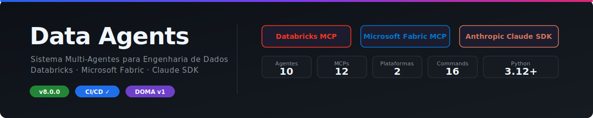

<p align="center">
  
</p>

<p align="center">
  
  
  
  
  
  
</p>

**Data Agents** é um sistema multi-agente construído sobre o **Claude Agent SDK** da Anthropic com integração nativa via **Model Context Protocol (MCP)** ao **Databricks** e **Microsoft Fabric**. Em vez de um único assistente genérico, o sistema orquestra **12 agentes especialistas** que operam diretamente nas suas plataformas de dados, cada um com seu domínio de conhecimento, ferramentas e regras corporativas declarativas.

---

## Autor

> **Thomaz Antonio Rossito Neto**
> Specialist Data & AI Solutions Architect | Center of Excellence CoE @CI&T

**LinkedIn:** [thomaz-antonio-rossito-neto](https://www.linkedin.com/in/thomaz-antonio-rossito-neto/)        **GitHub:** [ThomazRossito](https://github.com/ThomazRossito/)

### Certificações Databricks

    

### Certificações Microsoft

<a href="https://www.credly.com/badges/052e5133-0c67-4ab7-bb3a-c99efa7b4406/public_url"></a> <a href="https://learn.microsoft.com/pt-br/users/thomazantoniorossitoneto/credentials/certification/fabric-data-engineer-associate"></a>

---

## Como Funciona

<p align="center">
  
</p>

Você envia uma mensagem — seja pelo terminal, pela interface web ou com um comando slash. O **Supervisor** lê a solicitação, consulta as bases de conhecimento do projeto, planeja a solução e delega para os agentes especialistas certos. Cada agente usa as ferramentas MCP para operar diretamente no Databricks ou no Microsoft Fabric e devolve o resultado para o Supervisor consolidar.

**O Supervisor nunca escreve código ou acessa dados diretamente** — ele coordena. Os especialistas executam.

---

## Início Rápido

```bash
# 1. Clone e entre no diretório
git clone git@github.com:ThomazRossito/data-agents.git && cd data-agents

# 2. Crie o ambiente
conda create -n data-agents python=3.12 && conda activate data-agents

# 3. Instale dependências
pip install -e ".[dev,ui,monitoring]"

# 4. Configure credenciais
cp .env.example .env   # edite com suas chaves

# 5a. Web UI Chainlit (recomendada)
./start.sh --chainlit  # http://localhost:8503 (Chat) + http://localhost:8501 (Monitoring)

# 5b. Web UI Streamlit
./start.sh             # http://localhost:8502 (Chat) + http://localhost:8501 (Monitoring)

# 5c. Terminal
python main.py
```

### Credenciais no `.env`

| Variável | Obrigatória | Plataforma |
|----------|-------------|------------|
| `ANTHROPIC_API_KEY` | Sim | Claude API |
| `DATABRICKS_HOST`, `DATABRICKS_TOKEN` | Não | Databricks |
| `AZURE_TENANT_ID`, `FABRIC_WORKSPACE_ID` | Não | Microsoft Fabric |
| `DATABRICKS_GENIE_SPACES` | Não | Databricks Genie (Conversational BI) |
| `FABRIC_SQL_LAKEHOUSES` | Não | Fabric SQL Analytics Endpoint |
| `KUSTO_SERVICE_URI` | Não | Fabric Real-Time Intelligence (KQL) |
| `TAVILY_API_KEY` | Não | Busca web |
| `GITHUB_PERSONAL_ACCESS_TOKEN` | Não | GitHub MCP |
| `FIRECRAWL_API_KEY` | Não | Web scraping |
| `POSTGRES_URL` | Não | PostgreSQL MCP |
| `MIGRATION_SOURCES` | Não | Migration Source MCP (SQL Server/PostgreSQL de origem) |
| `TIER_MODEL_MAP` | Não | Override de modelo por tier (T1/T2/T3) |

> O sistema ativa automaticamente apenas as plataformas com credenciais configuradas. `context7` e `memory_mcp` são ativados sempre, sem credenciais.

---

## Agentes Especialistas

| Agente | Comando | Tier | O que faz |
|--------|---------|------|-----------|
| **Supervisor** | `/plan` | — | Coordena, planeja e valida tudo contra a Constituição |
| **Business Analyst** | `/brief` | T3 | Converte reuniões e briefings em backlog P0/P1/P2 |
| **SQL Expert** | `/sql` | T1 | SQL (Spark SQL, T-SQL, KQL), schemas, Unity Catalog |
| **Spark Expert** | `/spark` | T1 | PySpark, Delta Lake, pipelines Medallion |
| **Pipeline Architect** | `/pipeline` | T1 | ETL/ELT, orquestração, cross-platform Databricks ↔ Fabric |
| **dbt Expert** | `/dbt` | T2 | dbt Core: models, testes, snapshots, seeds, docs |
| **Data Quality Steward** | `/quality` | T2 | Validação de dados, profiling, alertas, SLAs |
| **Governance Auditor** | `/governance` | T2 | Auditoria de acessos, linhagem, PII, LGPD/GDPR |
| **Semantic Modeler** | `/semantic` | T2 | DAX, Direct Lake, Genie Spaces, AI/BI Dashboards |
| **Migration Expert** | `/migrate` | T1 | Assessment e migração de SQL Server/PostgreSQL para Databricks ou Fabric (Medallion) |
| **Python Expert** | `/python` | T1 | Python puro: pacotes, automação, APIs, CLIs, testes, pandas/polars |
| **Geral** | `/geral` | T3 | Respostas conceituais diretas — zero MCP, ~95% mais barato |

> Refresh de Skills é um script independente — `python scripts/refresh_skills.py` (não é mais um agente).

### Party Mode — Múltiplos Especialistas em Paralelo

O comando `/party` convoca 2 a 8 agentes simultaneamente para a mesma pergunta. Cada um responde de forma independente, com sua perspectiva de domínio.

```bash
/party qual a diferença entre Delta Lake e Iceberg?
# → sql-expert + spark-expert + pipeline-architect respondem em paralelo

/party --quality como garantir qualidade em dados incrementais?
# → data-quality-steward + governance-auditor + semantic-modeler

/party --engineering como processar um CSV de 10 GB com eficiência?
# → python-expert + spark-expert + pipeline-architect

/party --migration como avaliar complexidade de migração de SQL Server?
# → migration-expert + sql-expert + spark-expert

/party --full explique o Unity Catalog
# → todos os 8 agentes especialistas (T1 + principais T2)
```

---

## Comandos Disponíveis

| Comando | Descrição |
|---------|-----------|
| `/sql <query>` | SQL direto para o sql-expert |
| `/spark <tarefa>` | PySpark/DLT direto para o spark-expert |
| `/pipeline <tarefa>` | Pipeline ETL direto para o pipeline-architect |
| `/dbt <tarefa>` | dbt Core direto para o dbt-expert |
| `/quality <tarefa>` | Qualidade de dados direta |
| `/governance <tarefa>` | Auditoria e governança direta |
| `/semantic <tarefa>` | Modelagem semântica direta |
| `/migrate <fonte> para <destino>` | Assessment e migração de banco relacional para Databricks/Fabric |
| `/python <tarefa>` | Python puro direto para o python-expert |
| `/genie <tarefa>` | Criar/atualizar Genie Spaces no Databricks |
| `/dashboard <tarefa>` | Criar/publicar AI/BI Dashboards no Databricks |
| `/brief <texto>` | Converte transcript/briefing em backlog estruturado |
| `/plan <objetivo>` | Planejamento completo com thinking habilitado (8k tokens) |
| `/review <artefato>` | Review de código ou pipeline |
| `/party <query>` | Multi-agente paralelo (flags: `--quality`, `--arch`, `--engineering`, `--migration`, `--full`) |
| `/geral <pergunta>` | Resposta direta sem Supervisor — mais rápido e barato |
| `/health` | Status das plataformas configuradas |
| `/status` | Estado da sessão atual |
| `/memory <query>` | Consulta à memória persistente |
| `/export` | Exporta o histórico da sessão para HTML (abra no browser → Cmd+P para PDF) |

---

## Protocolo DOMA

O Supervisor segue o **Método DOMA** (Data Orchestration Method for Agents) — um protocolo de 7 passos que garante que qualquer tarefa complexa seja bem planejada antes de ser executada:

```
Passo 0    KB-First: consulta as bases de conhecimento antes de qualquer plano
Passo 0.5  Clarity Checkpoint: valida se a solicitação está clara o suficiente
Passo 0.9  Spec-First: seleciona o template adequado para a tarefa
Passo 1    Planejamento: cria um documento de requisitos (PRD) em output/prd/
Passo 2    Aprovação: aguarda confirmação antes de executar
Passo 3    Delegação: aciona os agentes especialistas na ordem certa
Passo 4    Validação: verifica se o resultado segue as regras da Constituição
```

Para perguntas simples e comandos diretos (`/sql`, `/spark`, etc.), o Supervisor usa **DOMA Express** — pula o planejamento e delega diretamente.

### Workflows Colaborativos

Para projetos end-to-end, o Supervisor encadeia agentes automaticamente:

| Workflow | Quando usar | Agentes envolvidos |
|----------|-------------|-------------------|
| **WF-01** Pipeline End-to-End | "Crie um pipeline Bronze→Gold completo" | Spark → Quality → Semantic → Governance |
| **WF-02** Star Schema | "Crie a camada Gold em Star Schema" | SQL → Spark → Quality → Semantic |
| **WF-03** Migração Cross-Platform | "Migre do Databricks para o Fabric" | Architect → SQL → Spark → Quality + Governance |
| **WF-04** Auditoria de Governança | "Gere um relatório de compliance" | Governance → Quality → Relatório |
| **WF-05** Migração Relacional→Nuvem | "Migre o SQL Server para Databricks" | Migration Expert → SQL → Spark → Quality + Governance |

---

## Plataformas e MCPs

O sistema conecta diretamente às plataformas via Model Context Protocol (MCP):

| MCP | Plataforma | Principais capacidades |
|-----|------------|----------------------|
| `databricks` | Databricks | SQL, listagem de tabelas, clusters, jobs, model serving |
| `databricks_genie` | Databricks Genie | Conversational BI, espaços Genie |
| `fabric` | Microsoft Fabric | REST API, workspaces, itens, pipelines |
| `fabric_sql` | Fabric SQL Analytics | Queries diretas ao Lakehouse via TDS (resolve limitação do schema `dbo` da REST API) |
| `fabric_rti` | Fabric RTI | KQL, Kusto, Real-Time Intelligence |
| `fabric_community` | Fabric | Linhagem de dados, dependências entre itens |
| `fabric_semantic` | Power BI / Fabric | Introspecção de Semantic Models: TMDL, DAX, RLS, relacionamentos |
| `context7` | Docs de bibliotecas | Documentação atualizada de qualquer lib — ativo automaticamente (sem credenciais) |
| `tavily` | Web | Busca web para LLMs |
| `github` | GitHub | Repos, issues, PRs |
| `firecrawl` | Web | Scraping estruturado de páginas |
| `postgres` | PostgreSQL | Queries readonly em bancos externos |
| `memory_mcp` | Local | Knowledge graph persistente de entidades — ativo automaticamente (sem credenciais) |
| `migration_source` | SQL Server / PostgreSQL | Conexão direta ao banco de origem — DDL, views, procedures, functions, stats |

---

## Camada de Proteção

Hooks automáticos protegem todas as operações:

| Hook | Proteção |
|------|----------|
| `security_hook` | Bloqueia 22 padrões destrutivos (DROP, rm -rf, git reset --hard, force push, etc.) |
| `check_sql_cost` | Bloqueia `SELECT *` sem `WHERE` ou `LIMIT` |
| `audit_hook` | Registra todas as chamadas de ferramentas em JSONL (6 categorias de erro) |
| `cost_guard_hook` | Classifica operações por custo (HIGH/MEDIUM/LOW) e alerta após 5 HIGH |
| `output_compressor` | Trunca outputs verbosos para não desperdiçar contexto |
| `context_budget_hook` | Alerta a 80% e 95% do limite de contexto por agente |
| `workflow_tracker` | Rastreia delegações, Clarity Checkpoint e cascade PRD→SPEC |
| `memory_hook` | Captura contexto da sessão para memória persistente |
| `session_logger` | Registra métricas finais de custo/turns/duração por sessão |
| `checkpoint` | Save/restore automático do estado da sessão |
| `session_lifecycle` | Injeção de memórias no início, config snapshot ao encerrar |

---

## Sistema de Memória

Memória persistente em dois níveis:

**Episódica (`memory/`):** Captura fatos da sessão automaticamente. Aplica decay temporal — memórias antigas perdem relevância gradualmente. Retrieval semântico antes de cada consulta ao Supervisor.

**Knowledge Graph (`memory_mcp/`):** Grafo de entidades nomeadas (tabelas, pipelines, decisões, times) e suas relações. Gerenciado pelos agentes. Não decai.

```bash
MEMORY_ENABLED=true
MEMORY_RETRIEVAL_ENABLED=true
MEMORY_CAPTURE_ENABLED=true
```

---

## Interfaces

### Web UI Chainlit (recomendada — porta 8503)
Interface com steps expandíveis em tempo real mostrando cada delegação e tool call. Dois modos: **Data Agents** (sistema completo) e **Dev Assistant** (Claude direto com ferramentas de código).

Use `/export` em qualquer momento para baixar o histórico completo da sessão como HTML formatado — abre no browser com Cmd+P (macOS) ou Ctrl+P (Windows/Linux) para salvar como PDF.

```bash
./start.sh --chainlit         # Chainlit (8503) + Monitoring (8501)
./start.sh --chainlit --monitor-only  # somente Chainlit
```

### Web UI Streamlit (porta 8502)
Chat com histórico persistente, suporte a todos os slash commands e visualização de artefatos gerados (PRDs, SPECs, Backlogs).

```bash
./start.sh                    # Streamlit (8502) + Monitoring (8501)
./start.sh --chat-only        # somente Streamlit
```

### Dashboard de Monitoramento (porta 8501)
9 páginas: Overview, Agentes, Workflows, Execuções, MCP Servers, Logs, Configurações, Custo e Tokens.
Novidades: tier badge nos cards de agentes, WF-05 nos workflows, download CSV, timezone configurável e indicador de freshness.

```bash
./start.sh --monitor-only
```

---

## Qualidade e CI/CD

```bash
make lint             # ruff check + format
make type-check       # mypy
make test             # pytest com cobertura mínima 80%
make health-databricks
make health-fabric
```

**CI** (push/PR): lint + format + mypy + pytest (cobertura 80%) + bandit security scan
**CD** (tags): deploy via Databricks Asset Bundles

---

## Configurações Avançadas

| Variável | Default | Descrição |
|----------|---------|-----------|
| `DEFAULT_MODEL` | `claude-opus-4-6` | Modelo do Supervisor |
| `MAX_BUDGET_USD` | 5.0 | Limite de custo por sessão (USD) |
| `MAX_TURNS` | 50 | Limite de turnos por sessão |
| `TIER_MODEL_MAP` | `{}` | Override de modelo por tier — ex: `{"T1": "claude-opus-4-6", "T2": "claude-sonnet-4-6", "T3": "claude-opus-4-6"}` |
| `TIER_TURNS_MAP` | T1=20, T2=12, T3=5 | Override de número máximo de turns por tier |
| `TIER_EFFORT_MAP` | high/medium/low | Nível de raciocínio por tier (high, medium, low) |
| `INJECT_KB_INDEX` | true | Injeção automática de KBs nos agentes |
| `IDLE_TIMEOUT_MINUTES` | 30 | Reset automático por inatividade |
| `MEMORY_ENABLED` | true | Sistema de memória persistente |
| `CONSOLE_LOG_LEVEL` | WARNING | Nível de log no terminal (WARNING oculta logs operacionais) |
| `SKILL_REFRESH_INTERVAL_DAYS` | 3 | Intervalo de refresh das Skills |
| `AGENT_PERMISSION_MODE` | `bypassPermissions` | `acceptEdits` para pedir confirmação antes de writes |

---

## Manual Técnico Completo

[Manual_Relatorio_Tecnico_Projeto_Data_Agents.md](Manual_Relatorio_Tecnico_Projeto_Data_Agents.md)

---

## Licença

[MIT License](LICENSE)
