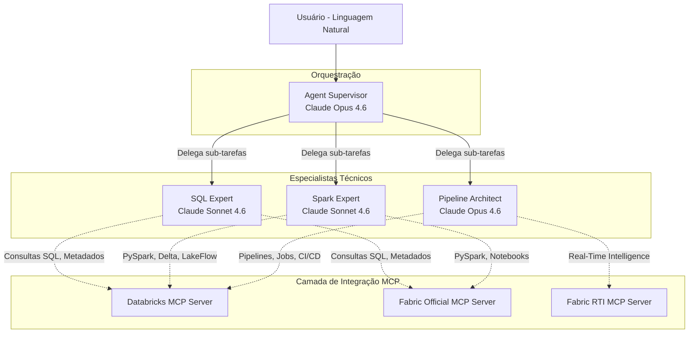

<p align="center">
  <h1 align="center">Data Agents</h1>
  <p align="center">
    <strong>Sistema Multi-Agentes para Engenharia e Análise de Dados</strong>
  </p>
  <p align="center">
    
    
    
    
  </p>
</p>

Construído sobre o **Claude Agent SDK** da Anthropic com integração nativa via **Model Context Protocol (MCP)** ao **Databricks** e **Microsoft Fabric**.

---

## 👤 Autor

- **Desenvolvido por:** Thomaz Antonio Rossito Neto
- **Professional:** Specialist Data & AI Solutions Architect | Center of Excellence CoE @CI&T | Enterprise AI Agents, Microsoft Fabric & Databricks Expert
- **LinkedIn:** [https://www.linkedin.com/in/thomaz-antonio-rossito-neto/](https://www.linkedin.com/in/thomaz-antonio-rossito-neto/)
- **GitHub:** [https://github.com/ThomazRossito/](https://github.com/ThomazRossito/)
- **Data criação:** 04/04/2026
- **Data atualização:** 04/04/2026
- **Versão:** 1.0.0

---

## 🏗️ Visão Geral e Arquitetura

O **Data Agents** é um ecossistema projetado para atuar como um engenheiro/analista de dados autônomo. Através do Agent Supervisor, ele capta intenções em linguagem natural, aciona especialistas (SQL, Spark, Pipeline) e interage nativamente com recursos na nuvem via sub-protocolos MCP.



## 🤖 Nossos Agentes

| Agente | Modelo (Recomendado) | Papel e Responsabilidades |
|---|---|---|
| **Supervisor** | `Claude Opus 4.6` | Atua como líder técnico e orquestrador principal. Recebe o prompt do usuário, divide o problema em tarefas, decide qual Especialista chamar e consolida a resposta final. |
| **SQL Expert** | `Claude Sonnet 4.6` | Especialista em análise de dados relacionais e em metadados. Realiza descobertas no Unity Catalog / OneLake, gera e otimiza queries (SQL, KQL). |
| **Spark Expert** | `Claude Sonnet 4.6` | Focado em engenharia de dados em grande escala. Cria código PySpark, manipula DataFrames e gerencia arquitetura Delta Lake (Medallion). |
| **Pipeline Architect** | `Claude Opus 4.6` | Engenheiro focado em orquestração e deploy. Estrutura workflows, Delta Live Tables (DLT) e processos ELT/ETL automatizados ponta-a-ponta. |

---

## 📋 Pré-Requisitos

1. **Python 3.11+**: Recomenda-se instalação via `pyenv` ou uso de virtualenvs.
2. **Databricks**: 
   - CLI do Databricks configurado (`databricks configure`) ou Variáveis `DATABRICKS_HOST` e `DATABRICKS_TOKEN`.
   - `databricks-mcp-server`, `databricks-sdk` e `mlflow` instalados no ambiente Python.
3. **Microsoft Fabric**:
   - Azure CLI autenticado (`az login`) para integração oficial.
   - dotnet SDK 8.0+ para o Fabric MCP Server da Microsoft.
   - `microsoft-fabric-rti-mcp` (instalação recomendada via `uvx` ou no ambiente Python).

---

## 🚀 Passo a Passo de Configuração

### 1. Clonar o Repositório

```bash
git clone git@github.com:ThomazRossito/data-agents.git
cd data-agents
```

### 2. Configurar o Ambiente Virtual

```bash
python3 -m venv .venv
source .venv/bin/activate  # No Windows: .venv\Scripts\activate
```

### 3. Instalar as Dependências

Garanta que sua branch esteja atualizada (`git checkout dev`) e instale o pacote estrutural em modo de desenvolvimento:

```bash
pip install -e ".[dev]"
```

### 4. Configuração das Variáveis de Ambiente

Para a execução correta dos MCPs, o sistema utiliza um arquivo `.env`.

```bash
cp .env.example .env
```
Abra o arquivo `.env` e preencha as variáveis como listado no arquivo (ex. suas configurações do Databricks e chaves de APIs).

### 5. Configurar Diretórios Locais

Alguns comandos salvam artefatos ou registros localmente:

```bash
mkdir -p logs
mkdir -p output
```

---

## 💻 Como Usar

Existem duas maneiras prontas de invocar o sistema dependendo do seu contexto.

### Modo Interativo (Chat)

Este é o modo padrão de conversar via linha de comando (terminal). Ideal para sessões contínuas e exploratórias em tempo real.

```bash
python main.py
```

### Modo Single-Query (Scripts e CI/CD)

Ideal para passar um comando direto via shell script sem retenção no loop.

```bash
python main.py "Verifique a saúde e qualidade da tabela 'vendas_silver' no Unity Catalog (Databricks) e gere um sumário analítico detalhado."
```

### Validação do Ambiente Databricks

Para validar se suas credenciais locais configuram um *Workspace* e um *SQL Warehouse* válido, utilize nosso script de verificação via SDK oficial antes de interagir com o agente:

```bash
python tools/databricks_health_check.py
```

### 💡 Casos de Uso Comuns

- **Databricks:** *"Analise todos os logs de erro da minha última Job Run e proponha a correção do código Python."*
- **Fabric:** *"Execute uma consulta KQL para verificar o volume de logs das últimas 2 horas no dashboard do Fabric RTI."*
- **Cross-Platform:** *"Identifique as discrepâncias de esquema entre a tabela `clientes` do OneLake (Fabric) e o Unity Catalog (Databricks)."*

---

## 🛠️ Databricks Enterprise DataOps (DABs e MLflow)

Este repositório foi construído já seguindo as diretrizes focadas em DataOps para escala na nuvem:

1. **Databricks Asset Bundles (DABs):**  
   Configure o `databricks.yml` presente na raiz para integrar e automatizar deploys (CI/CD) em formato de Workflows nativos (Jobs e Pipelines).
   
2. **Model Serving via MLflow (Mosaic AI Agent Framework):**  
   Para exportar sua customização de Agente em vez de apenas utilizá-la via terminal do MAC, estenda as funcionalidades registradas no `agents/mlflow_wrapper.py`. Este wrapper de modelo em PyFunc adequa automaticamente o paradigma do `claude-agent-sdk` para os endpoints REST corporativos de chat (*OpenAI Compatible*) do Model Serving da Databricks.

---

## 📂 Estrutura de Diretórios e Componentes

Organização robusta pensada para fácil escalabilidade:

```text
data-agents/
├── main.py                          # Entry point principal
├── databricks.yml                   # Topologia e configuração do Databricks Asset Bundles (DABs)
├── pyproject.toml                   # Dependências do projeto e empacotamento
├── .env.example                     # Template limpo de credenciais
│
├── config/                          # Configurações sensíveis e de arquitetura
│   ├── settings.py                  # Integração via Pydantic & DotEnv
│   └── mcp_servers.py               # Mapeamento / Registro dos MCPs disponíveis
│
├── agents/                          # Arquitetura dos Especialistas AI
│   ├── supervisor.py                # Setup, Delegation & Routing (Claude Options)
│   ├── mlflow_wrapper.py            # Wrapper PyFunc para Deploy do Agente usando Databricks Model Serving
│   ├── definitions/                 # Declaração em Python para os Especialistas
│   └── prompts/                     # System Prompts de persona de cada agente
│
├── mcp_servers/                     # Módulos customizados de conexão (Tools provider)
│   ├── databricks/                  # Adaptador e config local para Databricks
│   ├── fabric/                      # Oficial Microsoft Fabric 
│   ├── fabric_rti/                  # Mapeamento do KQL / RTI Microsoft
│   └── _template/                   # Molde para novos conectores (e.g. Snowflake)
│
├── tools/                           # Ferramentas e validadores auxiliares
│   └── databricks_health_check.py   # Diagnóstico de autenticação com Databricks SDK via Python
├── hooks/                           # Checkers, filtros de segurança (Pydantic / Guardails)
├── skills/                          # Prompts longos e Documentação referencial (Ex: Manuais do Claude)
│   └── databricks/                  # 📥 Hub de Skills Oficiais importadas do Databricks AI-DEV-KIT
├── tests/                           # BDD, TDD automatizados
├── logs/                            # Pastas isoladas de logs por execução [!] (gerado)
└── output/                          # Relatórios, Artefatos, ou CSvs exportados [!] (gerado)
```

---

## 🤝 Fluxo de Contribuição e Expansão

A expansão do sistema se dá criando novas capabilities baseadas em MCPs.

1. **Novo MCP:** Para adicionar um conector, por exemplo o `Snowflake`, duplique o  `mcp_servers/_template` como modelo base para injetar a conexão STDIN/STDOUT padrão do protocolo. Re-registre em `config/mcp_servers.py`.
2. **Criar Especialista:** Vá em `agents/definitions/` crie `snowflake_expert.py` e registre-o com sua ferramenta MCP recém criada.
3. **Notificar o Supervisor:** Declare o seu novo Agente disponível para roteamento em `agents/supervisor.py`.

```bash
# Rode a suite de testes automatizada para validar os hooks
pytest tests/ -v
```
