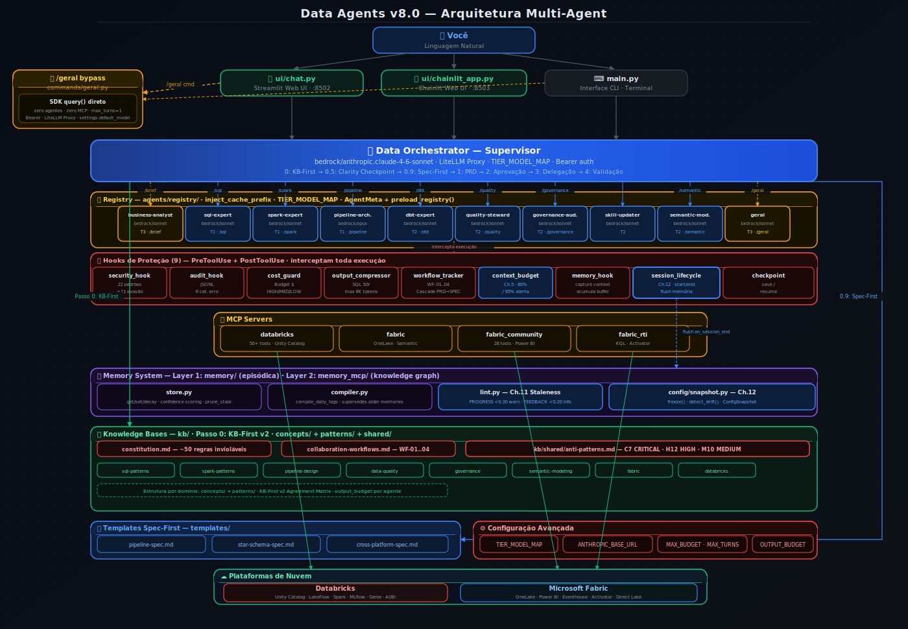

<p align="center">
  
</p>

<p align="center">
  <h1 align="center">Data Agents</h1>
  <p align="center">
    <strong>Sistema Multi-Agentes para Engenharia de Dados, Qualidade, Governanca e Analise Corporativa</strong>
  </p>
  <p align="center">
    
    
    
    
    
    
  </p>
</p>

Sistema multi-agente construido sobre o **Claude Agent SDK** da Anthropic com integracao nativa via **Model Context Protocol (MCP)** ao **Databricks** e **Microsoft Fabric**. Transforma um assistente de IA em uma equipe autonoma de dados que opera diretamente nas suas plataformas de nuvem, seguindo regras corporativas declarativas.

A versao 7.0 adiciona o **agente skill-updater** (Tier T2) para manutencao automatica das Skills via `make refresh-skills`, **3 novos tipos de memoria de dominio** (data_asset, platform_decision, pipeline_status) com decay configuravel via `.env`, **5 novos padroes de seguranca git** no hook (force-push, reset --hard, branch -D), **roteamento preciso** com triggers "Invoque quando" em todos os 10 agentes, e **melhorias de UX** na Web UI (reset de budget em novo chat, indicador visual de processamento).

---

## Autor

> ## **Thomaz Antonio Rossito Neto**
>
> Specialist Data & AI Solutions Architect | Center of Excellence CoE @CI&T

## Contatos

> **LinkedIn:** [thomaz-antonio-rossito-neto](https://www.linkedin.com/in/thomaz-antonio-rossito-neto/)

> **GitHub:** [ThomazRossito](https://github.com/ThomazRossito/)

### Certificações Databricks

    

### Certificações Microsoft

<a href="https://www.credly.com/badges/052e5133-0c67-4ab7-bb3a-c99efa7b4406/public_url" target="_blank"></a> <a href="https://learn.microsoft.com/pt-br/users/thomazantoniorossitoneto/credentials/certification/fabric-data-engineer-associate" target="_blank"></a>

---

## Arquitetura

<p align="center">
  
</p>

O sistema opera com tres pontos de entrada — **Web UI Chainlit** (`ui/chainlit_app.py`), **Web UI Streamlit** (`ui/chat.py`) e **CLI** (`main.py`) — que compartilham a mesma logica via modulos centralizados. Para perguntas simples, o comando `/geral` aciona `commands/geral.py` diretamente (zero agentes, zero MCP, ~95% mais barato). Para tarefas de engenharia, o **Supervisor** (Opus via Claude API) orquestra **10 agentes especialistas** definidos declarativamente em Markdown com frontmatter YAML. Cada agente declara seus dominios de conhecimento (`kb_domains`), skills operacionais (`skill_domains`), ferramentas, tier e modelo. O Supervisor segue o **Protocolo KB-First + BMAD** com validacao constitucional e triggers precisos de roteamento ("Invoque quando").

### Fluxo Completo do Supervisor

```
[Input bruto]  → /brief → Business Analyst → output/backlog/
[Backlog/ideia] → /plan:
  Passo 0   - KB-First: le Knowledge Bases relevantes
  Passo 0.5 - Clarity Checkpoint: valida clareza (5 dimensoes, minimo 3/5)
  Passo 0.9 - Spec-First: seleciona template para tarefas complexas
  Passo 1   - Planejamento: cria PRD em output/prd/
  Passo 2   - Aprovacao: aguarda confirmacao e cria SPEC em output/specs/
  Passo 3   - Delegacao: aciona agentes (Workflows Colaborativos WF-01 a WF-04)
  Passo 4   - Validacao Constitucional: verifica aderencia a kb/constitution.md

[Pergunta simples] → /geral → commands/geral.py → SDK query() direto → resposta
```

---

## Agentes Especialistas

| Agente                           | Comando         | Tier | Papel                                                                         |
| -------------------------------- | --------------- | ---- | ----------------------------------------------------------------------------- |
| **Supervisor**             | `/plan`       | -    | Orquestra, planeja e valida contra a Constituicao                             |
| **Business Analyst**       | `/brief`      | T3   | Processa transcripts/briefings → backlog P0/P1/P2                             |
| **SQL Expert**             | `/sql`        | T1   | SQL (Spark SQL, T-SQL, KQL), queries paralelas, Unity Catalog                 |
| **Spark Expert**           | `/spark`      | T1   | PySpark, Delta Lake, pipelines SDP/LakeFlow                                   |
| **Pipeline Architect**     | `/pipeline`   | T1   | ETL/ELT, DABs, DataOps, serverless, KA/MAS                                    |
| **Data Quality Steward**   | `/quality`    | T2   | Profiling, expectations, alertas, SLAs                                        |
| **Governance Auditor**     | `/governance` | T2   | Auditoria, linhagem, PII, LGPD/GDPR                                           |
| **Semantic Modeler**       | `/semantic`   | T2   | DAX, Direct Lake, Genie Spaces, AI/BI Dashboards, Model Serving               |
| **dbt Expert**             | `/dbt`        | T2   | dbt Core: models, testes, snapshots, seeds, docs, dbt-databricks, dbt-fabric  |
| **Skill Updater** *(novo)* | —             | T2   | Atualiza SKILL.md com documentacao recente via context7, tavily, firecrawl    |

---

## Inicio Rapido

```bash
# 1. Clone e entre no diretorio
git clone git@github.com:ThomazRossito/data-agents.git && cd data-agents

# 2. Crie o ambiente
conda create -n data-agents python=3.11 && conda activate data-agents

# 3. Instale dependencias (inclui Web UI e Monitoring)
pip install -e ".[dev,ui,monitoring]"

# 4. Configure credenciais
cp .env.example .env   # edite com suas chaves

# 5a. Inicie com Web UI Chainlit (recomendado — mais rica)
./start_chainlit.sh    # abre http://localhost:8503 (Chainlit: Data Agents + Dev Assistant)

# 5b. OU Web UI Streamlit
./start.sh             # abre http://localhost:8502 (Chat) + http://localhost:8501 (Monitoring)

# 5c. OU inicie pelo terminal
python main.py
```

### Credenciais no `.env`

| Variavel                                               | Obrigatoria | Plataforma           |
| ------------------------------------------------------ | ----------- | -------------------- |
| `ANTHROPIC_API_KEY`                                  | Sim         | Claude API           |
| `ANTHROPIC_BASE_URL`                                 | Nao         | LiteLLM Proxy        |
| `DATABRICKS_HOST`, `DATABRICKS_TOKEN`              | Nao         | Databricks           |
| `DATABRICKS_GENIE_SPACES`, `DATABRICKS_GENIE_DEFAULT_SPACE` | Nao | Databricks Genie     |
| `AZURE_TENANT_ID`, `FABRIC_WORKSPACE_ID`           | Nao         | Fabric               |
| `FABRIC_SQL_LAKEHOUSES`, `FABRIC_SQL_DEFAULT_LAKEHOUSE` | Nao    | Fabric SQL Analytics |
| `KUSTO_SERVICE_URI`, `KUSTO_SERVICE_DEFAULT_DB`    | Nao         | Fabric RTI           |
| `TAVILY_API_KEY`                                     | Nao         | Tavily (busca web)   |
| `GITHUB_PERSONAL_ACCESS_TOKEN`                       | Nao         | GitHub MCP           |
| `FIRECRAWL_API_KEY`                                  | Nao         | Firecrawl (scraping) |
| `POSTGRES_URL`                                       | Nao         | PostgreSQL MCP       |

O sistema ativa automaticamente apenas as plataformas com credenciais validas.
`context7` e `memory_mcp` sao ativados automaticamente (sem credenciais).

---

## Camada de Protecao (Hooks)

| Hook                      | Tipo              | Protecao                                                                              |
| ------------------------- | ----------------- | ------------------------------------------------------------------------------------- |
| `security_hook`         | PreToolUse        | 22 padroes destrutivos + 11 padroes de evasao (inclui git force-push, reset --hard, branch -D) |
| `check_sql_cost`        | PreToolUse        | Bloqueia `SELECT *` sem `WHERE`/`LIMIT`                                         |
| `audit_hook`            | PostToolUse       | Log JSONL com categorizacao de erros (6 categorias)                                   |
| `workflow_tracker`      | PostToolUse       | Rastreia delegacoes, workflows e Clarity Checkpoint                                   |
| `cost_guard_hook`       | PostToolUse       | Classificacao HIGH/MEDIUM/LOW com alertas                                             |
| `output_compressor`     | PostToolUse       | Trunca outputs (SQL 50 rows, listas 30, max 8K)                                       |
| `context_budget_hook`   | PostToolUse       | Ch.5: alerta a 80% e 95% do context window por tier                                   |
| `memory_hook`           | PostToolUse       | Captura contexto da sessao para memoria persistente                                   |
| `session_lifecycle`     | Start/End         | Ch.12: on_session_start (reset) + on_session_end (flush)                              |
| `checkpoint`            | Budget/Reset      | Salva estado e instrui retomada direta (CONCLUIDO vs INCOMPLETO)                      |

---

## Memory System (Ch.11 + Ch.12)

Sistema de memoria persistente que captura contexto entre sessoes e detecta informacoes desatualizadas.

`memory/store.py` — armazena memorias com `confidence` decrescente ao longo do tempo. **7 tipos de memoria:**

| Tipo | Decay | Uso |
|------|-------|-----|
| `USER` | Nunca | Preferencias, papel, expertise do usuario |
| `FEEDBACK` | 90 dias | Correcoes e orientacoes ao sistema |
| `ARCHITECTURE` | Nunca | Decisoes arquiteturais e padroes |
| `PROGRESS` | 7 dias | Estado de tarefas e progresso de workflows |
| `DATA_ASSET` | Nunca | Tabelas, schemas, datasets e suas caracteristicas |
| `PLATFORM_DECISION` | Nunca | Decisoes sobre tecnologias e integracoes de plataforma |
| `PIPELINE_STATUS` | 14 dias | Estado de execucao de pipelines e jobs |

Decays configurados individualmente via `.env`: `MEMORY_DECAY_FEEDBACK_DAYS`, `MEMORY_DECAY_PROGRESS_DAYS`, `MEMORY_DECAY_PIPELINE_STATUS_DAYS`.

`memory/lint.py` — **Ch.11 Staleness Warning**: emite avisos automaticos quando `PROGRESS < 0.30` (warning) ou `FEEDBACK < 0.20` (info). Tipos `USER`, `ARCHITECTURE`, `DATA_ASSET` e `PLATFORM_DECISION` sao imunes ao decay.

`memory/compiler.py` — compila logs diarios de captura em memorias consolidadas, aplicando supersessao automatica de versoes antigas.

`hooks/session_lifecycle.py` — **Ch.12**: `on_session_start()` reseta contadores de contexto; `on_session_end()` dispara flush automatico de memoria. Conectado em `main.py` (CLI) e `ui/chat.py` (Web UI).

`config/snapshot.py` — **Ch.12**: `ConfigSnapshot` imutavel (frozen dataclass), `freeze()` captura estado atual, `detect_drift()` detecta alteracoes de configuracao em runtime (protecao contra injection attacks).

---

## Checkpoint de Sessao

Quando o budget estoura ou voce digita `limpar`, o sistema salva automaticamente um checkpoint com o ultimo prompt, custo acumulado e arquivos gerados. Na proxima sessao, digite **`continuar`** para retomar de onde parou.

---

## Knowledge Bases, Skills e Workflows

O conhecimento e organizado em 3 camadas:

- **Constituicao** (`kb/constitution.md`): documento de autoridade maxima com ~50 regras inviolaveis (Medallion, Star Schema, Seguranca, Qualidade, Plataforma)
- **Knowledge Bases** (`kb/`): 8 dominios de regras de negocio (sql-patterns, spark-patterns, pipeline-design, data-quality, governance, semantic-modeling, databricks, fabric)
- **Skills** (`skills/`): manuais operacionais detalhados injetados automaticamente via `skill_domains` no frontmatter de cada agente

**Injecao Automatica de Skills:** cada agente declara `skill_domains` no frontmatter e recebe automaticamente o indice das SKILL.md relevantes antes de qualquer tarefa. O agente le a SKILL.md correta antes de gerar codigo — garantindo que use as APIs e padroes mais recentes.

**Skill Refresh System:** as Skills sao mantidas atualizadas pelo agente `skill-updater` acionado via `make refresh-skills`. O sistema respeita o intervalo configurado (`SKILL_REFRESH_INTERVAL_DAYS`, padrao: 3 dias) e suporta `--force`, `--dry-run` e `--concurrent`.

**Workflows Colaborativos** (`kb/collaboration-workflows.md`): 4 workflows pre-definidos com handoff automatico entre agentes (WF-01 Pipeline End-to-End, WF-02 Star Schema, WF-03 Cross-Platform, WF-04 Governance Audit).

**Spec-First Templates** (`templates/`): 4 templates para pipeline, star-schema, cross-platform e backlog (Business Analyst), com regras constitucionais embutidas.

---

## Interfaces do Usuario

### Web UI Chainlit (nova — recomendada)

```bash
./start_chainlit.sh
# chainlit run ui/chainlit_app.py --port 8503
```

Interface Chainlit com dois modos de operacao selecionaveis ao iniciar:

- **Data Agents** — Supervisor completo com 10 agentes especialistas, todos os slash commands e MCPs de plataforma. Exibe `cl.Step()` em tempo real para cada delegacao e tool call, mostrando qual agente esta ativo e qual ferramenta esta sendo chamada.
- **Dev Assistant** — Claude direto (sem Supervisor), ferramentas `Read`, `Write`, `Bash`, `Grep`, `Glob` habilitadas, historico de conversa para follow-ups. Usa `settings.default_model` (Bedrock) — custo zero pelo acordo da empresa.

**Melhorias de UX v7.0:** cada novo chat (botao "New Chat") reseta automaticamente o budget acumulado. Apos um sub-agente completar, exibe indicador "⏳ Supervisor analisando resultado..." enquanto o Supervisor processa — eliminando a aparencia de congelamento na UI.

Troque de modo a qualquer momento com `/modo`.

### Web UI Streamlit (Chat)

```bash
./start.sh             # abre http://localhost:8502 (Chat) + http://localhost:8501 (Monitoring)
./start.sh --chat-only # apenas o Chat
```

Interface de chat Streamlit com historico de conversa persistente (usa `ClaudeSDKClient` com sessao de longa duracao), suporte a todos os slash commands, exibicao de artefatos gerados (PRDs, SPECs, Backlogs) e botao "Nova conversa" para reset de sessao com flush automatico de memoria.

### Comando `/geral` (bypass do Supervisor)

Para perguntas tecnicas simples que nao exigem delegacao a agentes especialistas, use `/geral`:

```
/geral o que e Delta Lake?
/geral explica Medallion Architecture
```

Chama `commands/geral.py` → `SDK query()` direto com modelo padrao, zero agentes, zero MCP, `max_turns=1`. Custo tipico: ~$0.002–0.01 por pergunta (vs ~$0.30–0.40 com o Supervisor completo). Funciona tanto no CLI quanto na Web UI via modulo compartilhado.

### Dashboard de Monitoramento

```bash
./start.sh --monitor-only                   # via start.sh
python -m streamlit run monitoring/app.py   # manual
```

9 paginas: Overview, Agentes (com metricas de performance, 8 agentes), Workflows (delegacoes, Clarity Checkpoint, specs), Execucoes, MCP Servers, Logs, Configuracoes, Custo & Tokens (economia do compressor), Sobre. Inclui filtro global de datas e auto-refresh.

---

## CI/CD

- **CI** (push/PR): ruff lint + ruff format + mypy + pytest (cobertura minima 80%) + bandit security scan
- **CD** (tags): deploy via Databricks Asset Bundles

```bash
make lint                  # ruff check + format
make test                  # pytest com cobertura
make run                   # python main.py
make ui                    # ./start.sh (Chat + Monitoring)
make ui-chat               # apenas Web UI Chat (porta 8502)
make ui-monitor            # apenas Dashboard (porta 8501)
make refresh-skills        # atualiza Skills desatualizadas (respeita intervalo)
make refresh-skills-dry    # lista o que seria atualizado sem modificar
make refresh-skills-force  # forca atualizacao de todas as Skills
make skill-stats           # relatorio de uso de Skills (ultimos 7 dias)
make skill-stats-full      # relatorio completo + skills nunca acessadas (30 dias)
```

---

## Configuracoes Avancadas

| Variavel                               | Default | Descricao                                                               |
| -------------------------------------- | ------- | ----------------------------------------------------------------------- |
| `MAX_BUDGET_USD`                     | 5.0     | Limite de custo por sessao                                              |
| `MAX_TURNS`                          | 50      | Limite de turns por sessao                                              |
| `CONSOLE_LOG_LEVEL`                  | WARNING | Nivel de log no terminal (WARNING esconde logs operacionais)            |
| `ANTHROPIC_BASE_URL`                 | ""      | URL do proxy LiteLLM. Vazio = api.anthropic.com                         |
| `TIER_MODEL_MAP`                     | {}      | Override de modelo por tier: `'{"T1": "bedrock/claude-sonnet-4-6"}'`   |
| `INJECT_KB_INDEX`                    | true    | Injecao automatica de KBs nos agentes                                   |
| `IDLE_TIMEOUT_MINUTES`               | 30      | Reset automatico por inatividade (0 = desabilitar)                      |
| `MEMORY_ENABLED`                     | true    | Habilita sistema de memoria persistente                                 |
| `SKILL_REFRESH_ENABLED`              | true    | Habilita o sistema de refresh automatico de Skills                      |
| `SKILL_REFRESH_INTERVAL_DAYS`        | 3       | Pula Skills atualizadas ha menos de N dias                              |
| `SKILL_REFRESH_DOMAINS`              | databricks,fabric | Dominios de Skills a atualizar no refresh                     |
| `MEMORY_DECAY_FEEDBACK_DAYS`         | 90      | Dias para feedback chegar a confianca 0.1                               |
| `MEMORY_DECAY_PROGRESS_DAYS`         | 7       | Dias para progress chegar a confianca 0.1                               |
| `MEMORY_DECAY_PIPELINE_STATUS_DAYS`  | 14      | Dias para pipeline_status chegar a confianca 0.1                        |

---

## Manual completo

[Manual completo](Manual_Relatorio_Tecnico_Projeto_Data_Agents.md)

---

## Licenca

[MIT License](LICENSE)
